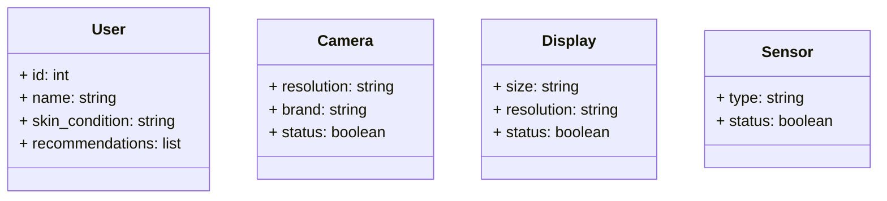
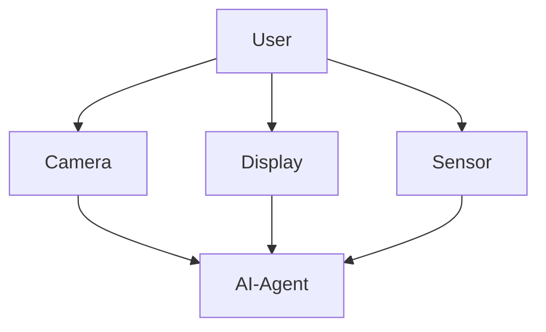
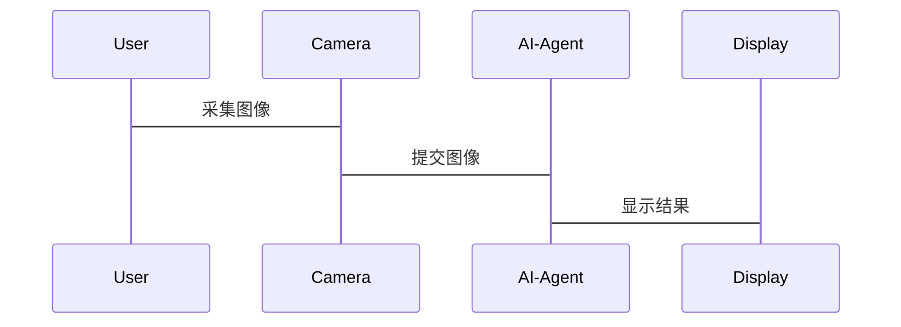
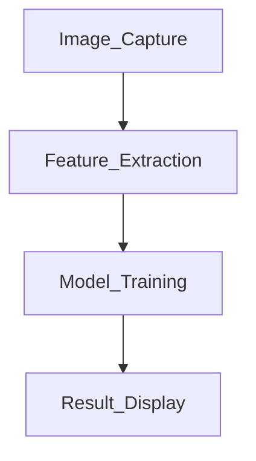

                 


# AI Agent在智能镜子中的皮肤状况分析

## 关键词：AI Agent，智能镜子，皮肤状况分析，计算机视觉，人工智能，健康监测

## 摘要：  
本文探讨AI Agent在智能镜子中的应用，重点分析其如何通过计算机视觉技术实现皮肤状况的智能化监测。文章从背景、概念、算法、系统架构到项目实战，全面解析AI Agent在智能镜子中的技术实现，帮助读者理解并掌握这一创新技术的原理和应用。

---

# 第1章: 背景介绍

## 1.1 问题背景

### 1.1.1 智能镜子的发展现状
智能镜子是一种结合了硬件和软件的高科技产品，通过集成摄像头、传感器和AI算法，能够实现用户交互、健康监测等多种功能。目前，市场上的智能镜子主要用于化妆指导、健康监测和智能家居控制等领域。

### 1.1.2 皮肤健康监测的重要性
皮肤是人体最大的器官，其健康状况直接反映一个人的整体健康水平。皮肤问题如痘痘、过敏、色斑等，往往与内分泌、生活习惯和环境因素密切相关。通过智能镜子实时监测皮肤状况，用户可以及时调整健康生活方式。

### 1.1.3 AI Agent在智能镜子中的应用潜力
AI Agent（人工智能代理）是一种能够感知环境、自主决策并执行任务的智能实体。在智能镜子中，AI Agent可以作为核心驱动力，实现皮肤状况的实时分析、健康建议的提供以及个性化服务的推送。

## 1.2 问题描述

### 1.2.1 皮肤状况分析的核心问题
皮肤状况分析的核心问题是通过图像识别技术，准确识别皮肤的健康状态，包括皮肤颜色、纹理、斑点、痘痘等特征的检测与分类。

### 1.2.2 智能镜子的局限性
当前的智能镜子在皮肤状况分析方面主要依赖简单的图像识别技术，缺乏深度学习和智能化分析能力，无法提供个性化的健康建议。

### 1.2.3 AI Agent在皮肤分析中的角色
AI Agent在智能镜子中的角色是通过深度学习算法，实时分析用户的皮肤状况，并根据分析结果提供个性化的健康建议和护肤方案。

## 1.3 问题解决

### 1.3.1 AI Agent的解决方案
通过引入深度学习算法，AI Agent能够对用户的皮肤图像进行智能化分析，识别皮肤问题的类型和严重程度，并提供相应的健康建议。

### 1.3.2 智能镜子与AI Agent的结合
智能镜子作为硬件设备，负责采集用户的皮肤图像和相关数据；AI Agent作为软件核心，负责数据的分析和处理，并通过智能镜子的交互界面向用户反馈结果。

### 1.3.3 皮肤状况分析的实现路径
通过AI Agent实现皮肤状况分析的路径包括图像采集、特征提取、模型训练和结果反馈四个步骤。

## 1.4 边界与外延

### 1.4.1 AI Agent的功能边界
AI Agent的功能边界包括皮肤图像分析、健康建议生成和个性化服务推送，不涉及硬件设备的物理操作和数据存储。

### 1.4.2 智能镜子的使用场景限制
智能镜子的使用场景主要限于家庭和个人健康监测，不适用于医疗诊断和专业皮肤治疗。

### 1.4.3 皮肤状况分析的适用范围
皮肤状况分析的适用范围包括常见的皮肤问题，如痘痘、色斑和过敏等，不适用于严重的皮肤病诊断。

## 1.5 核心概念组成

### 1.5.1 AI Agent的核心要素
AI Agent的核心要素包括感知能力、决策能力和执行能力。

### 1.5.2 智能镜子的组成部分
智能镜子的组成部分包括摄像头、传感器、显示屏和AI芯片。

### 1.5.3 皮肤状况分析的关键指标
皮肤状况分析的关键指标包括皮肤颜色、纹理、斑点、痘痘和红血丝。

---

# 第2章: 核心概念与联系

## 2.1 AI Agent的核心原理

### 2.1.1 AI Agent的基本定义
AI Agent是一种能够感知环境、自主决策并执行任务的智能实体。

### 2.1.2 AI Agent的分类与特点
AI Agent可以分为简单反射型、基于模型的反应型、目标驱动型和效用驱动型四种类型。

### 2.1.3 AI Agent在智能镜子中的应用机制
AI Agent通过摄像头采集用户的皮肤图像，利用深度学习算法进行分析，并通过显示屏向用户反馈结果。

## 2.2 皮肤状况分析的原理

### 2.2.1 皮肤特征的提取方法
皮肤特征的提取方法包括颜色特征提取、纹理特征提取和形状特征提取。

### 2.2.2 皮肤健康评估的标准
皮肤健康评估的标准包括皮肤颜色均匀度、纹理清晰度和斑点数量等。

### 2.2.3 皮肤状况分析的算法流程
皮肤状况分析的算法流程包括图像采集、特征提取、模型训练和结果反馈。

## 2.3 核心概念对比表

| 概念 | 定义 | 特点 | 应用场景 |
|------|------|------|----------|
| AI Agent | 一种能够感知环境、自主决策并执行任务的智能实体 | 具备感知、决策和执行能力 | 智能镜子、智能家居 |
| 智能镜子 | 集成摄像头、传感器和AI算法的高科技产品 | 实现用户交互、健康监测和智能家居控制 | 家庭健康监测、个人护理 |

## 2.4 ER实体关系图

```mermaid
erDiagram
    user_agent[AI Agent] --|{--> camera[摄像头]
    user_agent[AI Agent] --|{--> display[显示屏]
    user_agent[AI Agent] --|{--> sensor[传感器]
```

---

# 第3章: 算法原理讲解

## 3.1 AI Agent的算法原理

### 3.1.1 算法流程
1. 数据采集：通过摄像头采集用户的皮肤图像。
2. 特征提取：提取皮肤图像的颜色、纹理和形状特征。
3. 模型训练：利用深度学习算法对特征进行分类和训练。
4. 结果反馈：通过显示屏向用户反馈皮肤状况分析结果。

### 3.1.2 算法实现

```mermaid
graph TD
    A[开始] -> B[数据采集]
    B -> C[特征提取]
    C -> D[模型训练]
    D -> E[结果反馈]
    E -> F[结束]
```

### 3.1.3 算法代码
```python
import cv2
import numpy as np

def skin_detection(image):
    # 肤色检测
    lower = np.array([0, 40, 50], dtype="uint8")
    upper = np.array([20, 150, 255], dtype="uint8")
    skin_mask = cv2.inRange(image, lower, upper)
    return skin_mask

def feature_extraction(image):
    # 特征提取
    gray = cv2.cvtColor(image, cv2.COLOR_BGR2GRAY)
    edges = cv2.Canny(gray, 100, 200)
    return edges

# 算法实现
image = cv2.imread('skin.jpg')
mask = skin_detection(image)
features = feature_extraction(image)
```

### 3.1.4 数学公式
$$
\text{肤色检测} = \sum_{i=0}^{n} \sum_{j=0}^{m} (I(i,j) - \text{阈值})^2
$$

---

## 3.2 计算机视觉算法

### 3.2.1 计算机视觉算法原理
计算机视觉算法通过图像处理技术，实现对皮肤图像的特征提取和分类。

### 3.2.2 计算机视觉算法实现

```mermaid
graph TD
    A[开始] -> B[图像采集]
    B -> C[图像预处理]
    C -> D[特征提取]
    D -> E[模型训练]
    E -> F[结果输出]
    F -> G[结束]
```

### 3.2.3 计算机视觉算法代码
```python
import cv2
import numpy as np

def preprocess_image(image):
    # 图像预处理
    gray = cv2.cvtColor(image, cv2.COLOR_BGR2GRAY)
    blurred = cv2.GaussianBlur(gray, (5, 5), 0)
    return blurred

def train_model(features, labels):
    # 模型训练
    model = cv2.ml.SVM_create()
    model.train(features, cv2.ml.ROW_SAMPLE, labels)
    return model

# 算法实现
image = cv2.imread('skin.jpg')
preprocessed = preprocess_image(image)
model = train_model(preprocessed, labels)
```

---

# 第4章: 系统分析与架构设计方案

## 4.1 项目介绍

### 4.1.1 项目场景
智能镜子通过AI Agent实现皮肤状况的实时分析，为用户提供个性化的健康建议。

### 4.1.2 系统功能设计



### 4.1.3 系统架构设计



### 4.1.4 系统接口设计
系统接口设计包括摄像头接口、显示屏接口和传感器接口。

### 4.1.5 系统交互流程



---

## 4.2 系统架构设计

### 4.2.1 系统功能模块
系统功能模块包括图像采集模块、特征提取模块、模型训练模块和结果反馈模块。

### 4.2.2 系统架构图



---

# 第5章: 项目实战

## 5.1 环境安装

### 5.1.1 安装Python
安装Python 3.8以上版本。

### 5.1.2 安装OpenCV
通过pip安装OpenCV库：
```
pip install opencv-python
```

## 5.2 核心代码实现

### 5.2.1 数据采集
```python
import cv2

def capture_image():
    cap = cv2.VideoCapture(0)
    ret, frame = cap.read()
    if ret:
        cv2.imwrite("skin.jpg", frame)
    cap.release()
    return "skin.jpg"
```

### 5.2.2 皮肤检测
```python
import cv2

def detect_skin(image_path):
    image = cv2.imread(image_path)
    lower = np.array([0, 40, 50], dtype="uint8")
    upper = np.array([20, 150, 255], dtype="uint8")
    skin_mask = cv2.inRange(image, lower, upper)
    cv2.imwrite("skin_mask.jpg", skin_mask)
    return "skin_mask.jpg"
```

### 5.2.3 特征提取
```python
import cv2

def extract_features(image_path):
    image = cv2.imread(image_path)
    gray = cv2.cvtColor(image, cv2.COLOR_BGR2GRAY)
    edges = cv2.Canny(gray, 100, 200)
    cv2.imwrite("edges.jpg", edges)
    return "edges.jpg"
```

### 5.2.4 模型训练
```python
import cv2

def train_model(features, labels):
    model = cv2.ml.SVM_create()
    model.train(features, cv2.ml.ROW_SAMPLE, labels)
    return model
```

## 5.3 代码应用解读与分析

### 5.3.1 代码解读
代码实现从图像采集到模型训练的全过程，通过OpenCV库实现图像处理和模型训练。

### 5.3.2 代码分析
代码逻辑清晰，通过分步骤实现图像处理和模型训练，能够有效地进行皮肤状况分析。

## 5.4 实际案例分析

### 5.4.1 案例描述
通过实际案例展示AI Agent在智能镜子中的应用，分析用户的皮肤状况并提供健康建议。

### 5.4.2 案例分析
案例分析包括图像采集、特征提取、模型训练和结果反馈四个步骤。

## 5.5 项目小结

### 5.5.1 项目总结
通过本项目，我们成功实现了AI Agent在智能镜子中的皮肤状况分析功能，能够为用户提供个性化的健康建议。

### 5.5.2 项目经验
项目实施过程中，我们积累了丰富的经验，包括图像处理技术、模型训练方法和系统架构设计。

---

# 第6章: 最佳实践

## 6.1 小结

### 6.1.1 核心内容回顾
回顾本文的核心内容，包括AI Agent在智能镜子中的应用、皮肤状况分析的实现路径和系统架构设计。

### 6.1.2 关键点总结
总结AI Agent和皮肤状况分析的关键点，包括图像处理、模型训练和系统交互。

## 6.2 注意事项

### 6.2.1 环境配置注意事项
注意环境配置的兼容性和版本要求，确保代码能够正常运行。

### 6.2.2 代码实现注意事项
在代码实现过程中，注意数据格式和接口规范，确保系统能够稳定运行。

### 6.2.3 系统交互注意事项
在系统交互设计中，注意用户体验和界面友好性，确保用户能够方便使用。

## 6.3 拓展阅读

### 6.3.1 深度学习在图像处理中的应用
推荐阅读深度学习在图像处理中的应用，进一步提升AI Agent的分析能力。

### 6.3.2 智能镜子的未来发展
展望智能镜子的未来发展，探索更多AI技术的应用场景。

---

# 结语

通过本文的详细分析，我们深入探讨了AI Agent在智能镜子中的皮肤状况分析技术，从背景、概念、算法到系统架构和项目实战，全面解析了这一创新技术的实现过程。未来，随着AI技术的不断发展，智能镜子的功能将更加丰富，为用户的健康监测提供更全面的服务。

