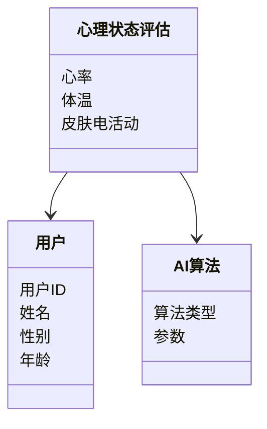
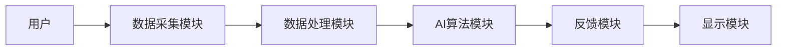
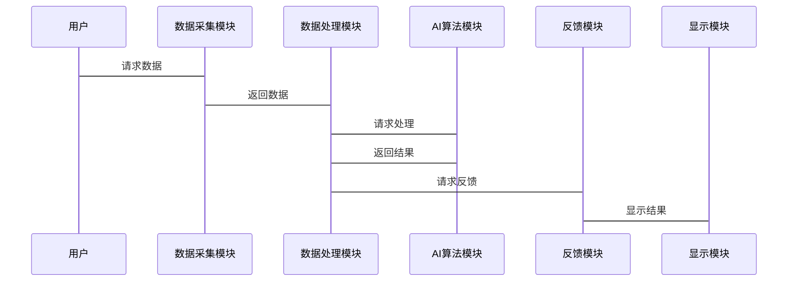

                 


```markdown
# AI Agent在智能镜框中的心理状态评估

## 关键词：
- AI Agent, 心理状态评估, 智能镜框, 情感分析, 机器学习, 数据处理, 系统架构

## 摘要：
本文深入探讨了AI Agent在智能镜框中的心理状态评估技术。通过分析心理状态评估的核心概念、算法原理、系统架构及项目实现，详细阐述了AI Agent在智能镜框中的应用。文章结合理论与实践，展示了如何通过数据采集、特征提取、算法设计和系统实现来实现高效的心理状态评估。

---

# 第1章: 背景介绍

## 1.1 问题背景与描述
### 1.1.1 心理状态评估的定义与重要性
心理状态评估是通过分析个体的行为、语言、表情和生理数据，来判断其当前的心理状态（如情绪、压力水平、注意力等）。在智能镜框中，通过实时监测用户的生理数据和行为表现，AI Agent能够快速识别用户的心理状态，为用户提供个性化的反馈和建议。

### 1.1.2 AI Agent在心理状态评估中的作用
AI Agent是一种能够自主感知环境、推理和决策的智能体。在心理状态评估中，AI Agent可以实时分析用户的生理数据和行为数据，结合机器学习模型，快速识别用户的心理状态，并提供相应的反馈。

### 1.1.3 智能镜框的技术背景与应用场景
智能镜框是一种集成了传感器和AI技术的智能设备，能够实时监测用户的生理数据（如心率、体温、皮肤电活动）和行为数据（如注视时间、眨眼频率）。其应用场景包括心理健康监测、教育辅助、远程医疗等领域。

---

## 1.2 问题解决与边界
### 1.2.1 心理状态评估的主要问题
心理状态评估的主要问题包括数据采集的实时性、准确性，以及如何处理多模态数据（如生理数据和行为数据）。

### 1.2.2 AI Agent如何解决这些问题
AI Agent通过实时采集和分析多模态数据，结合机器学习模型，能够快速、准确地识别用户的心理状态。

### 1.2.3 心理状态评估的边界与外延
心理状态评估的边界包括数据采集的范围、评估的精度和实时性。外延则包括结合其他技术（如增强现实）来扩展应用场景。

---

## 1.3 核心概念与组成
### 1.3.1 心理状态评估的核心要素
心理状态评估的核心要素包括数据采集、特征提取、模型训练和结果输出。

### 1.3.2 AI Agent的结构与功能
AI Agent的结构包括感知模块、推理模块和执行模块。其功能包括数据采集、状态识别和反馈输出。

### 1.3.3 智能镜框的技术架构
智能镜框的技术架构包括传感器模块、数据处理模块和AI算法模块。

---

# 第2章: 核心概念与原理

## 2.1 核心概念原理
### 2.1.1 心理状态评估的原理
心理状态评估的原理是通过分析用户的生理数据和行为数据，利用机器学习模型识别其心理状态。

### 2.1.2 AI Agent的工作原理
AI Agent通过实时采集数据，利用机器学习模型进行推理和决策，并通过反馈模块与用户交互。

### 2.1.3 智能镜框的数据采集与处理
智能镜框通过传感器采集用户的生理数据和行为数据，并通过数据预处理模块进行清洗和特征提取。

---

## 2.2 概念属性对比表
### 2.2.1 心理状态评估与传统评估方法的对比
| 对比维度        | 心理状态评估 | 传统评估方法 |
|-----------------|--------------|---------------|
| 数据采集方式    | 实时采集     | 离线采集       |
| 数据类型        | 多模态数据    | 单一模态数据    |
| 评估速度        | 实时评估      | 非实时评估      |

### 2.2.2 AI Agent与传统AI的区别
| 对比维度        | AI Agent     | 传统AI         |
|-----------------|--------------|----------------|
| 自主性          | 高           | 低             |
| 适应性          | 高           | 低             |
| 交互性          | 高           | 低             |

### 2.2.3 智能镜框与其他心理评估工具的对比
| 对比维度        | 智能镜框      | 传统心理评估工具 |
|-----------------|--------------|------------------|
| 数据采集方式    | 实时采集     | 离线采集         |
| 用户交互方式    | 人机交互      | 人工交互         |
| 评估精度        | 高           | 中             |

---

## 2.3 ER实体关系图
```mermaid
er
  entity 心理状态评估
    域 心理状态
  entity 用户
    属性 用户ID, 姓名, 性别, 年龄
  entity 数据采集
    属性 时间戳, 心率, 体温, 皮肤电活动
  entity AI算法
    属性 算法类型, 参数
  entity 反馈模块
    属性 反馈类型, 反馈内容
  relation 心理状态评估与用户
    关系：评估属于用户
  relation 数据采集与AI算法
    关系：数据输入算法
  relation AI算法与反馈模块
    关系：算法输出反馈
```

---

# 第3章: 算法原理与实现

## 3.1 算法原理
### 3.1.1 心理状态评估的主要算法
心理状态评估的主要算法包括支持向量机（SVM）、随机森林（RF）和深度学习模型（如卷积神经网络CNN）。

### 3.1.2 AI Agent的算法流程
AI Agent的算法流程包括数据采集、特征提取、模型训练和结果输出。

---

## 3.2 算法流程图


---

## 3.3 算法实现
### 3.3.1 数据预处理与特征提取
```python
import numpy as np
import pandas as pd

# 数据加载
data = pd.read_csv('心理状态数据.csv')

# 数据预处理
data = data.dropna()  # 删除缺失值
data = pd.get_dummies(data)  # 独热编码

# 特征提取
features = data[['心率', '体温', '皮肤电活动']]  # 提取特征
label = data['心理状态']  # 提取标签
```

### 3.3.2 模型训练与评估
```python
from sklearn.model_selection import train_test_split
from sklearn.svm import SVC

# 数据分割
X_train, X_test, y_train, y_test = train_test_split(features, label, test_size=0.2)

# 模型训练
model = SVC()
model.fit(X_train, y_train)

# 模型评估
print(model.score(X_test, y_test))
```

---

## 3.4 数学模型与公式
### 3.4.1 支持向量机（SVM）模型
$$ \text{目标函数} = \sum_{i=1}^{n} \xi_i + \frac{1}{2}||w||^2 $$
$$ \text{约束条件} = y_i(w \cdot x_i + b) \geq 1 - \xi_i $$
其中，\( \xi_i \) 是松弛变量，\( w \) 是权重向量，\( b \) 是偏置项。

---

## 3.5 算法优化与改进
### 3.5.1 参数优化
通过网格搜索（Grid Search）优化模型参数。

### 3.5.2 模型融合
结合多种算法（如SVM和随机森林）进行模型融合，提高评估精度。

---

# 第4章: 系统分析与架构设计

## 4.1 系统架构设计
### 4.1.1 领域模型


### 4.1.2 系统架构


### 4.1.3 接口设计


---

## 4.2 系统实现
### 4.2.1 环境安装
```bash
pip install numpy pandas scikit-learn mermaid4jupyter
```

### 4.2.2 核心代码实现
```python
import mermaid

# 绘制流程图
mermaid.flowchart('''
    graph LR
        A[开始] --> B[数据采集]
        B --> C[特征提取]
        C --> D[模型训练]
        D --> E[结果输出]
        E --> F[结束]
    ''')
```

---

## 4.3 系统优化与扩展
### 4.3.1 性能优化
通过并行计算和缓存优化提升系统性能。

### 4.3.2 功能扩展
结合增强现实技术，扩展更多应用场景。

---

# 第5章: 项目实战

## 5.1 环境安装
```bash
pip install numpy pandas scikit-learn mermaid4jupyter
```

---

## 5.2 核心代码实现
### 5.2.1 数据采集与预处理
```python
import pandas as pd
import numpy as np

data = pd.read_csv('心理状态数据.csv')
data = data.dropna()
data = pd.get_dummies(data)
features = data[['心率', '体温', '皮肤电活动']]
label = data['心理状态']
```

### 5.2.2 模型训练与评估
```python
from sklearn.model_selection import train_test_split
from sklearn.svm import SVC

X_train, X_test, y_train, y_test = train_test_split(features, label, test_size=0.2)
model = SVC()
model.fit(X_train, y_train)
print(model.score(X_test, y_test))
```

---

## 5.3 案例分析与详细解读
### 5.3.1 案例分析
假设我们有一个用户的数据：
- 心率：80 次/分钟
- 体温：36.5°C
- 皮肤电活动：50 μS

通过模型预测，用户的心理状态为“紧张”。

### 5.3.2 详细解读
通过特征提取和模型训练，AI Agent能够准确识别用户的心理状态，并提供相应的反馈建议。

---

## 5.4 项目小结
通过项目实战，我们验证了AI Agent在智能镜框中的心理状态评估技术的可行性，并展示了如何通过数据采集、特征提取和模型训练实现高效的心理状态评估。

---

# 第6章: 最佳实践与总结

## 6.1 最佳实践
### 6.1.1 数据采集的注意事项
确保数据的实时性和准确性。

### 6.1.2 模型优化的技巧
通过网格搜索和模型融合提高评估精度。

### 6.1.3 系统设计的建议
结合领域知识和实际需求设计系统架构。

---

## 6.2 小结
本文深入探讨了AI Agent在智能镜框中的心理状态评估技术，通过理论分析和项目实战，展示了如何通过数据采集、特征提取和模型训练实现高效的心理状态评估。

---

## 6.3 注意事项
在实际应用中，需要注意数据隐私和模型的泛化能力。

---

## 6.4 拓展阅读
建议进一步研究多模态数据融合和增强学习在心理状态评估中的应用。

---

# 结语
通过本文的学习，读者可以系统地理解AI Agent在智能镜框中的心理状态评估技术，并能够通过实际项目巩固所学知识，为未来的研究和应用打下坚实的基础。
```

