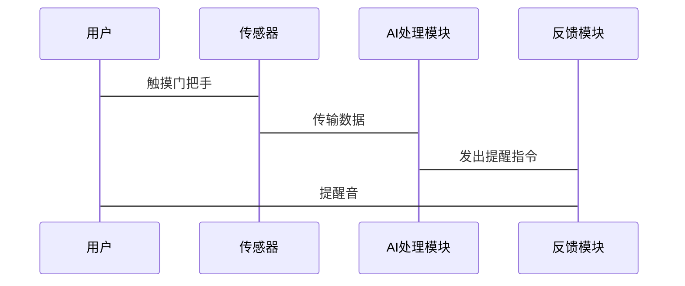

                 


# AI Agent在智能门把手中的手部卫生提醒

> 关键词：AI Agent，智能门把手，手部卫生提醒，传感器，机器学习

> 摘要：本文探讨了AI Agent在智能门把手中用于手部卫生提醒的应用，分析了其工作原理、系统架构、算法实现以及实际案例。通过传感器数据采集和机器学习模型，AI Agent能够智能判断并提醒用户进行手部清洁，从而提升公共卫生水平。

---

## 第一部分: 问题背景与解决方案

### 第1章: 手部卫生的重要性

#### 1.1 手部卫生的基本概念
手部卫生是预防疾病传播的关键措施。通过正确洗手，可以有效减少细菌和病毒的传播，降低感染风险。

#### 1.2 手部卫生在公共环境中的意义
在公共场所，如办公楼、学校和医院，门把手是高频率接触点，容易成为病菌传播的媒介。保持手部卫生对公共健康至关重要。

#### 1.3 疫情背景下的手部卫生需求
近年来，新冠疫情凸显了手部卫生的重要性。智能门把手结合AI技术，能够提供及时、有效的卫生提醒，帮助切断病毒传播途径。

### 第2章: 智能门把手的功能与局限性

#### 2.1 智能门把手的基本功能
智能门把手通常具备触控识别、身份验证和远程控制等功能，但传统产品在卫生管理方面存在不足。

#### 2.2 传统门把手的卫生问题
传统门把手缺乏互动性和数据记录功能，难以有效提醒用户进行手部清洁。

#### 2.3 智能门把手在卫生管理中的潜力
通过集成传感器和AI技术，智能门把手可以实时监测用户行为，提供智能化的卫生管理解决方案。

### 第3章: AI Agent在智能门把手中的应用前景

#### 3.1 AI Agent的基本概念
AI Agent是能够感知环境、自主决策并执行任务的智能实体，广泛应用于多个领域。

#### 3.2 AI Agent在智能门把手中的作用
AI Agent负责处理传感器数据，分析用户行为，并触发相应的提醒机制，提升门把手的智能化水平。

#### 3.3 手部卫生提醒的智能化趋势
通过AI Agent，手部卫生提醒将更加智能化和个性化，能够根据用户习惯优化提醒策略，提升用户体验。

---

## 第二部分: AI Agent的核心概念与原理

### 第4章: AI Agent的核心概念

#### 4.1 AI Agent的定义与分类
AI Agent根据智能水平可分为简单反应式、基于模型的反应式和完全自主式代理。在智能门把手中，通常采用基于传感器的数据驱动型AI Agent。

#### 4.2 AI Agent在手部卫生提醒中的功能
AI Agent负责数据采集、状态识别、决策逻辑和反馈机制，确保系统能够实时响应用户行为。

#### 4.3 AI Agent与传统自动化的区别
传统自动化依赖预设规则，而AI Agent具备学习和适应能力，能够根据环境变化优化操作。

### 第5章: 手部卫生提醒系统的架构

#### 5.1 系统的整体架构
系统包括传感器模块、AI处理模块和反馈模块，各模块协同工作实现手部卫生提醒。

#### 5.2 系统的核心模块
- **传感器模块**：负责采集用户触摸数据。
- **AI处理模块**：分析数据，判断是否需要提醒。
- **反馈模块**：通过声音或灯光提醒用户。

#### 5.3 系统的交互流程
用户触摸门把手 → 传感器采集数据 → AI Agent分析 → 触发提醒 → 用户响应。

---

## 第三部分: AI Agent的算法原理与实现

### 第6章: 状态识别算法

#### 6.1 基于传感器的数据采集
使用触控传感器记录用户触摸时间、频率等数据。

#### 6.2 数据预处理与特征提取
对采集数据进行清洗和特征提取，为后续分析做准备。

#### 6.3 机器学习模型的训练与部署
采用监督学习算法，训练分类模型识别需要提醒的状态。

### 第7章: 决策逻辑与反馈机制

#### 7.1 基于规则的决策逻辑
设定阈值，如用户在触摸后15分钟内未洗手则触发提醒。

#### 7.2 基于概率的决策模型
利用机器学习预测用户行为，评估提醒的必要性。

#### 7.3 反馈机制的设计与实现
通过声音、灯光或手机通知等方式提醒用户。

### 第8章: 算法实现的代码示例

#### 8.1 状态识别的Python代码
```python
import numpy as np
from sklearn.svm import SVC

# 示例数据：用户触摸时间间隔
X = np.array([[5, 10], [10, 15], [20, 25]])
y = np.array([0, 0, 1])  # 0表示不需要提醒，1表示需要

# 训练模型
model = SVC()
model.fit(X, y)

# 预测新数据
new_data = np.array([[15, 20]])
prediction = model.predict(new_data)
print("预测结果：", prediction)
```

#### 8.2 决策逻辑的Python代码
```python
def should_remind(last_touched_time):
    current_time = time.time()
    elapsed_time = current_time - last_touched_time
    return elapsed_time > 900  # 超过15分钟则提醒
```

---

## 第四部分: 系统架构与接口设计

### 第9章: 系统架构设计

#### 9.1 系统的分层架构
- **硬件层**：传感器、处理器、反馈装置。
- **数据层**：数据存储与管理。
- **应用层**：AI算法、用户界面。

#### 9.2 各模块之间的交互关系
传感器 → 数据采集 → AI处理 → 反馈执行。

#### 9.3 系统的可扩展性设计
预留接口，方便未来添加更多功能，如消毒设备联动。

### 第10章: 接口设计与实现

#### 10.1 系统内部接口
- `传感器数据接口`：提供实时数据。
- `AI处理接口`：接收数据并返回提醒指令。

#### 10.2 系统交互的序列图


---

## 第五部分: 项目实战

### 第11章: 环境安装与配置

#### 11.1 硬件安装
安装触控传感器和必要的电路连接。

#### 11.2 软件安装
安装Python环境和机器学习库，如scikit-learn。

### 第12章: 系统核心实现

#### 12.1 核心代码实现
```python
import time
from sklearn import svm

# 数据预处理
X_train = [[5, 10], [10, 15], [20, 25]]
y_train = [0, 0, 1]

# 训练模型
model = svm.SVC()
model.fit(X_train, y_train)

# 实时监测
last_touched = time.time()
while True:
    if should_remind(last_touched):
        trigger_feedback()
    # 更新last_touched
    last_touched += 1
```

#### 12.2 代码解读与分析
代码通过机器学习模型分析用户行为，判断是否需要触发提醒机制。

### 第13章: 实际案例分析

#### 13.1 案例分析
用户在触摸门把手后15分钟内未洗手，系统发出提醒音，并通过手机应用发送通知。

#### 13.2 优化建议
引入更精确的传感器和优化算法，提高提醒准确率。

---

## 第六部分: 最佳实践与总结

### 第14章: 最佳实践 tips

#### 14.1 小结
AI Agent在智能门把手中的应用能够有效提升手部卫生管理的智能化水平。

#### 14.2 注意事项
- 数据隐私保护。
- 系统稳定性与可靠性。
- 用户体验优化。

#### 14.3 拓展阅读
- 探索更多AI技术在智能家居中的应用。
- 研究先进的传感器技术。

---

## 第七部分: 总结

通过本文的详细阐述，我们了解了AI Agent在智能门把手中用于手部卫生提醒的实现过程。从问题背景到系统设计，从算法实现到项目实战，AI技术的应用为公共卫生管理提供了创新的解决方案。未来，随着技术的进步，这类智能系统将更加普及，为人们的生活健康提供更多保障。

--- 

### 总结

AI Agent在智能门把手中用于手部卫生提醒的应用展示了技术与生活的深度融合。通过传感器数据采集、机器学习分析和智能反馈机制，系统能够实时提醒用户进行手部清洁，有效提升公共卫生水平。随着技术的不断进步，这类智能系统将变得更加高效和人性化，为人们的生活健康保驾护航。

