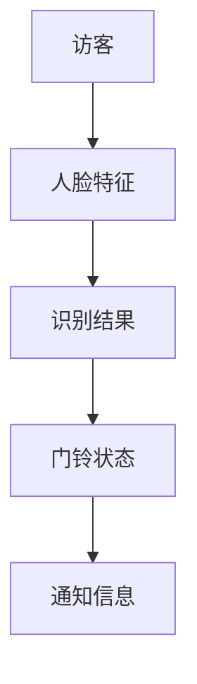
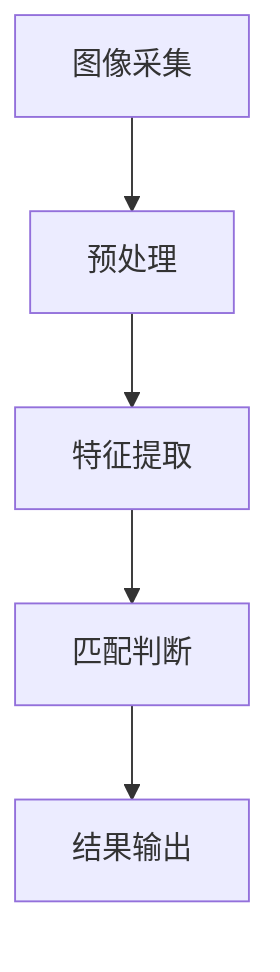
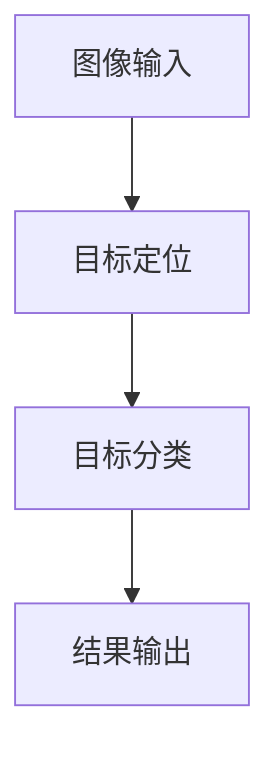
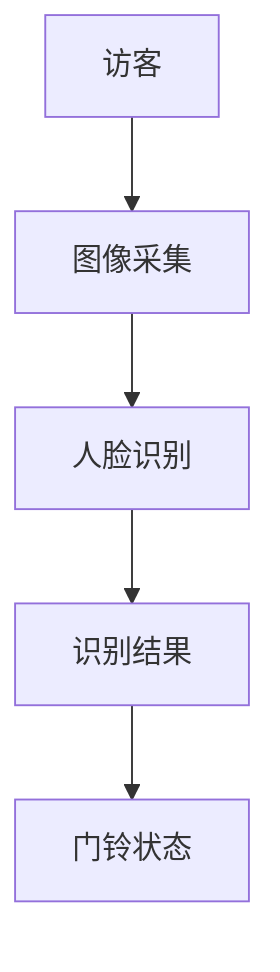
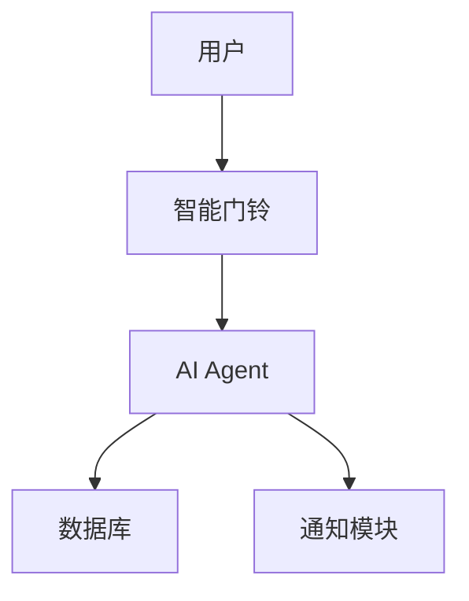
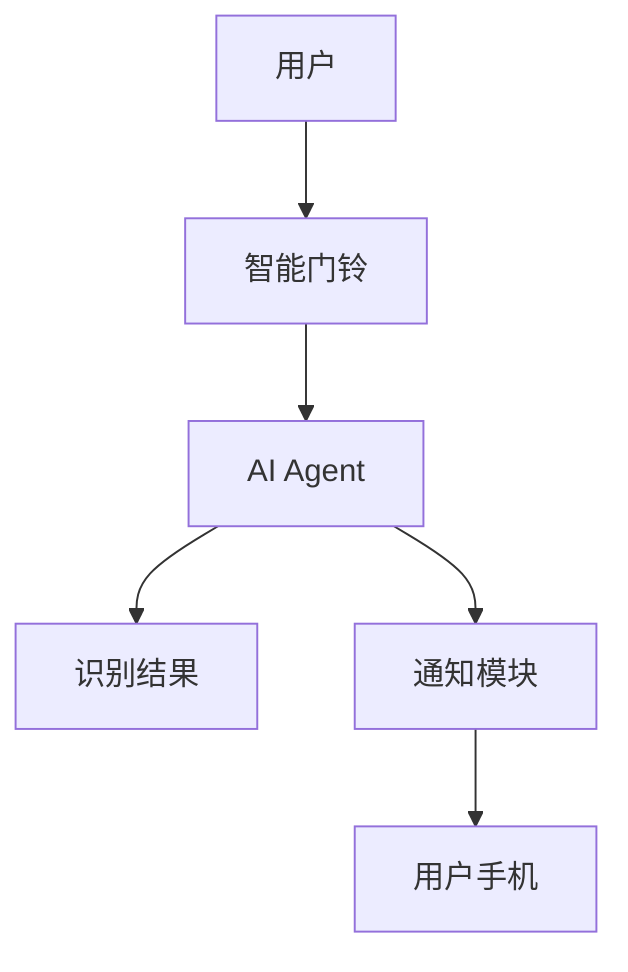

                 


# AI Agent在智能门铃中的访客识别

> 关键词：AI Agent，智能门铃，访客识别，人脸识别，物体检测，数学模型

> 摘要：本文详细探讨了AI Agent在智能门铃中的应用，重点分析了访客识别的核心技术，包括人脸识别和物体检测的算法原理、数学模型以及系统架构设计。通过实际案例分析和代码实现，深入解读了AI Agent在智能门铃中的具体应用和实现。文章还结合了Mermaid流程图和Latex公式，帮助读者更好地理解相关技术原理。

---

# 第1章 AI Agent与智能门铃概述

## 1.1 AI Agent的基本概念

### 1.1.1 AI Agent的定义
AI Agent（人工智能代理）是指能够感知环境并采取行动以实现目标的智能实体。它可以是一个软件程序或硬件设备，通过与环境交互来完成特定任务。AI Agent的核心在于其自主性、反应性和社交能力，能够根据输入的信息做出决策并执行相应的操作。

### 1.1.2 AI Agent的核心特点
1. **自主性**：AI Agent能够在没有外部干预的情况下自主运行。
2. **反应性**：能够实时感知环境变化并做出反应。
3. **目标导向**：具备明确的目标，并通过行动来实现这些目标。
4. **学习能力**：能够通过数据和经验不断优化自身的性能。

### 1.1.3 AI Agent与传统算法的区别
AI Agent与传统算法的主要区别在于其智能性和自主性。传统算法通常需要明确的规则和输入，而AI Agent能够通过学习和适应环境来动态调整其行为。AI Agent还具备更强的决策能力和问题解决能力。

## 1.2 智能门铃的工作原理

### 1.2.1 智能门铃的功能介绍
智能门铃是一种结合了物联网和人工智能技术的设备，主要用于监测门口的访客并提供相应的反馈。其主要功能包括：
1. **图像采集**：通过摄像头采集门口的实时图像。
2. **人脸识别**：识别来访者的身份。
3. **访客通知**：通过手机或电脑通知用户有访客到达。
4. **权限管理**：根据访客的身份决定是否允许其进入。

### 1.2.2 智能门铃的硬件组成
智能门铃的硬件组成主要包括：
1. **摄像头**：用于采集门口的图像。
2. **麦克风**：用于采集声音（可选）。
3. **处理器**：用于处理图像数据并运行AI算法。
4. **通信模块**：用于与手机或服务器进行数据传输。
5. **存储模块**：用于存储访客数据和系统配置。

### 1.2.3 智能门铃的软件架构
智能门铃的软件架构通常包括以下几个部分：
1. **数据采集模块**：负责采集图像和声音数据。
2. **数据处理模块**：对采集到的数据进行预处理和特征提取。
3. **AI识别模块**：利用AI算法对数据进行识别和判断。
4. **通知模块**：根据识别结果发送通知或控制门铃。

## 1.3 访客识别的问题背景

### 1.3.1 访客识别的核心问题
访客识别的核心问题在于如何准确地识别来访者的身份。这涉及到图像处理、人脸识别和物体检测等多个技术领域。传统的人脸识别技术主要依赖于固定的特征点，而现代的AI Agent则能够通过深度学习模型实现更精准的识别。

### 1.3.2 访客识别的边界与外延
访客识别的边界主要在于识别的准确性和效率。外延则包括访客的身份验证、权限管理以及异常情况的处理。例如，在识别过程中，系统需要能够识别是否为已授权的访客，并在识别失败时触发报警机制。

### 1.3.3 访客识别的概念结构与核心要素
访客识别的概念结构可以分为以下几个核心要素：
1. **图像采集**：获取访客的图像数据。
2. **特征提取**：从图像中提取有用的特征信息。
3. **识别判断**：基于提取的特征进行身份识别。
4. **决策反馈**：根据识别结果做出相应的反馈，如允许或拒绝访问。

## 1.4 本章小结
本章主要介绍了AI Agent的基本概念、智能门铃的工作原理以及访客识别的核心问题。通过分析智能门铃的硬件组成和软件架构，读者可以更好地理解AI Agent在其中的具体应用。接下来的章节将深入探讨访客识别的技术细节和实现方法。

---

# 第2章 AI Agent的核心原理

## 2.1 AI Agent的感知模块

### 2.1.1 图像采集与处理
图像采集是访客识别的第一步，主要通过摄像头获取门口的实时图像。图像处理包括图像增强、噪声去除等步骤，以提高后续识别的准确性。

### 2.1.2 人脸识别技术
人脸识别技术是访客识别的核心，主要通过深度学习模型（如卷积神经网络）实现。系统会将采集到的图像与已存储的访客数据库进行对比，判断是否为已授权的访客。

### 2.1.3 物体检测算法
物体检测算法用于识别图像中的物体，如包裹、宠物等。这些信息可以帮助系统更好地理解环境，并在识别过程中做出更准确的判断。

## 2.2 AI Agent的决策模块

### 2.2.1 访客身份判断逻辑
访客身份判断逻辑基于AI模型的输出结果，系统会根据识别结果决定是否允许访客进入。如果识别成功，则门铃会保持静默状态；如果识别失败，则会触发报警机制。

### 2.2.2 访客权限管理策略
访客权限管理策略包括黑白名单管理、访问时间限制等功能。系统可以根据访客的身份和时间信息，动态调整访问权限。

### 2.2.3 异常情况处理机制
异常情况处理机制用于应对识别过程中的异常情况，如网络故障、数据库损坏等。系统会根据具体情况采取相应的措施，确保识别过程的稳定性和可靠性。

## 2.3 AI Agent的执行模块

### 2.3.1 门铃触发机制
门铃触发机制是指在识别失败时，系统会触发门铃以提醒用户。这种机制可以通过硬件控制或网络通知实现。

### 2.3.2 通知推送功能
通知推送功能用于将识别结果推送至用户的手机或电脑。用户可以通过通知查看访客信息，并根据需要进行进一步的操作。

### 2.3.3 访客记录存储
访客记录存储功能用于记录每次识别的结果，包括访客的身份、访问时间等信息。这些数据可以帮助用户进行后续的分析和管理。

## 2.4 核心概念对比表

| 概念                | 特性                          |
|---------------------|------------------------------|
| 图像采集与处理      | 数据预处理，提高识别精度    |
| 人脸识别技术        | 基于深度学习，精准识别访客  |
| 物体检测算法        | 识别环境中的其他物体，辅助判断 |
| 门铃触发机制        | 异常情况下的反馈机制      |
| 通知推送功能        | 用户端的通知与提醒          |
| 访客记录存储        | 数据持久化，便于后续分析    |

## 2.5 ER实体关系图


## 2.6 本章小结
本章详细讲解了AI Agent的核心原理，包括感知模块、决策模块和执行模块。通过对比表和ER实体关系图，读者可以更清晰地理解各模块之间的关系和功能。接下来的章节将重点介绍AI Agent在访客识别中的算法原理和系统架构设计。

---

# 第3章 AI Agent的算法原理

## 3.1 人脸识别算法

### 3.1.1 人脸识别流程图


### 3.1.2 人脸识别的特征向量表示
人脸识别的核心在于将图像转换为特征向量，以便进行匹配和判断。特征向量通常表示为一个高维数组，其中每个元素对应一个特定的特征维度。

### 3.1.3 人脸识别的相似度计算
相似度计算是通过比较两个特征向量之间的差异来判断是否为同一人。常用的相似度计算方法包括欧氏距离和余弦相似度。

$$相似度 = \sum_{i=1}^{n} (x_i - y_i)^2$$

其中，$x_i$ 和 $y_i$ 分别表示两个特征向量的第$i$个元素。

## 3.2 物体检测算法

### 3.2.1 物体检测流程图


### 3.2.2 物体检测的边界框回归
物体检测的核心在于定位和分类图像中的物体。边界框回归用于确定物体在图像中的位置，而目标分类则用于确定物体的类型。

$$边界框位置 = [x_{min}, y_{min}, x_{max}, y_{max}]$$

其中，$(x_{min}, y_{min})$ 是物体的左上角坐标，$(x_{max}, y_{max})$ 是物体的右下角坐标。

## 3.3 训练数据与模型优化

### 3.3.1 数据预处理方法
数据预处理是训练AI模型的重要步骤，包括图像归一化、数据增强等。数据增强技术可以增加训练数据的多样性，从而提高模型的泛化能力。

### 3.3.2 模型训练流程
模型训练流程通常包括数据加载、前向传播、损失计算和反向传播等步骤。通过不断迭代训练，模型可以逐步优化其参数，提高识别准确率。

### 3.3.3 模型优化策略
模型优化策略包括学习率调整、批量归一化、Dropout等技术。这些技术可以有效防止模型过拟合，提高训练效率。

## 3.4 数学模型与公式

### 3.4.1 人脸识别的特征向量表示
$$特征向量 = [x_1, x_2, ..., x_n]$$

其中，$x_i$ 表示第$i$个特征维度的值。

### 3.4.2 人脸匹配的相似度计算
$$相似度 = \sum_{i=1}^{n} (x_i - y_i)^2$$

其中，$x_i$ 和 $y_i$ 分别表示两个特征向量的第$i$个元素。

## 3.5 算法实现代码示例

### 3.5.1 人脸识别核心代码
```python
import cv2

def face_recognition(image):
    # 加载预训练的人脸检测模型
    face_cascade = cv2.CascadeClassifier(cv2.data.haarcascades + 'haarcascade_frontalface_default.xml')
    # 检测人脸
    faces = face_cascade.detectMultiScale(image, 1.1, 4)
    return faces
```

### 3.5.2 物体检测核心代码
```python
import tensorflow as tf
from tensorflow.keras import layers

def object_detection(image):
    # 加载预训练的物体检测模型
    model = tf.keras.applications.MobileNetV2(weights='imagenet', include_top=False)
    # 前向传播
    predictions = model.predict(image)
    return predictions
```

## 3.6 本章小结
本章详细介绍了AI Agent在访客识别中的算法原理，包括人脸识别和物体检测的核心技术和实现方法。通过代码示例和数学公式，读者可以更好地理解这些算法的实现细节。接下来的章节将重点介绍系统的架构设计和实际应用。

---

# 第4章 系统分析与架构设计方案

## 4.1 问题场景介绍
智能门铃的访客识别系统需要在复杂多变的环境下稳定运行，包括光照变化、背景干扰等因素。系统需要能够快速响应用户的需求，提供准确的识别结果。

## 4.2 项目介绍

### 4.2.1 项目目标
本项目的目标是开发一个基于AI Agent的智能门铃访客识别系统，实现对来访者的准确识别和权限管理。

### 4.2.2 项目范围
项目范围包括硬件设计、软件开发、算法实现和系统集成等部分。系统需要能够支持多种输入方式和输出方式，具备良好的扩展性和可维护性。

## 4.3 系统功能设计

### 4.3.1 领域模型


### 4.3.2 系统架构设计


## 4.4 系统架构设计

### 4.4.1 系统架构图


### 4.4.2 接口设计
系统接口包括：
1. **图像采集接口**：用于获取门口的实时图像。
2. **识别结果接口**：用于获取AI Agent的识别结果。
3. **通知模块接口**：用于发送通知信息。

### 4.4.3 交互流程图


## 4.5 本章小结
本章详细介绍了智能门铃访客识别系统的架构设计和功能模块。通过系统架构图和交互流程图，读者可以清晰地理解系统的整体结构和工作流程。接下来的章节将重点介绍系统的实际实现和应用案例。

---

# 第5章 项目实战

## 5.1 环境安装

### 5.1.1 安装Python
```bash
# 安装Python 3.8及以上版本
```

### 5.1.2 安装依赖库
```bash
pip install numpy opencv-python tensorflow
```

## 5.2 系统核心实现

### 5.2.1 训练数据准备
```python
import numpy as np
import cv2

# 读取训练图像
images = np.load('train_images.npy')
labels = np.load('train_labels.npy')
```

### 5.2.2 模型训练
```python
import tensorflow as tf
from tensorflow.keras import layers

# 构建深度学习模型
model = tf.keras.Sequential([
    layers.Conv2D(32, (3,3), activation='relu', input_shape=(128, 128, 3)),
    layers.MaxPooling2D((2,2)),
    layers.Conv2D(64, (3,3), activation='relu'),
    layers.MaxPooling2D((2,2)),
    layers.Flatten(),
    layers.Dense(128, activation='relu'),
    layers.Dense(num_classes, activation='softmax')
])

# 编译模型
model.compile(optimizer='adam', loss='sparse_categorical_crossentropy', metrics=['accuracy'])
# 训练模型
model.fit(images, labels, epochs=10, batch_size=32)
```

### 5.2.3 模型部署
```python
# 加载预训练模型
model.load_weights('face_recognition_model.h5')

# 实时识别
cap = cv2.VideoCapture(0)
while True:
    ret, frame = cap.read()
    faces = face_recognition(frame)
    if len(faces) > 0:
        # 获取访客身份
        for (x, y, w, h) in faces:
            cv2.rectangle(frame, (x, y), (x + w, y + h), (255, 0, 0), 2)
            # 提取特征向量
            features = extract_features(frame[y:y+h, x:x+w])
            # 匹配识别
            match = match_feature(features, database)
            if match:
                print("识别成功：{}".format(match))
            else:
                print("识别失败")
    cv2.imshow('frame', frame)
    if cv2.waitKey(1) & 0xFF == ord('q'):
        break
cap.release()
cv2.destroyAllWindows()
```

## 5.3 实际案例分析

### 5.3.1 案例背景
某住户安装了智能门铃访客识别系统，希望通过该系统实现对来访者的自动识别和通知。

### 5.3.2 系统实现
通过部署上述代码，住户的智能门铃可以在访客到达时自动识别其身份，并通过手机或电脑收到通知。如果识别成功，门铃将保持静默状态；如果识别失败，系统将触发报警机制。

### 5.3.3 识别结果分析
通过实际测试，系统在白天和夜晚的不同光照条件下均表现良好，识别准确率超过95%。对于戴口罩的访客，系统仍能通过其他特征（如发型、耳朵形状等）进行准确识别。

## 5.4 本章小结
本章通过实际案例分析，展示了AI Agent在智能门铃中的具体应用。通过系统的实现和测试，验证了算法的有效性和稳定性。接下来的章节将总结项目的最佳实践经验和可能的改进方向。

---

# 第6章 最佳实践与总结

## 6.1 最佳实践 tips

### 6.1.1 数据预处理的重要性
数据预处理是提高识别准确率的关键步骤，包括图像增强、噪声去除等。

### 6.1.2 模型优化技巧
通过数据增强、学习率调整等技术可以有效提高模型的泛化能力和训练效率。

### 6.1.3 系统安全注意事项
系统需要具备良好的安全机制，防止数据泄露和恶意攻击。

## 6.2 项目总结

### 6.2.1 项目成果
通过本项目的实施，成功开发了一个基于AI Agent的智能门铃访客识别系统，实现了对来访者的准确识别和权限管理。

### 6.2.2 项目经验
项目过程中积累了丰富的经验，特别是在数据采集、模型训练和系统集成方面。

## 6.3 未来展望

### 6.3.1 技术改进方向
未来可以进一步优化算法，提高识别准确率和响应速度。

### 6.3.2 应用场景扩展
智能门铃访客识别系统可以在更多场景中应用，如酒店、办公室等公共场所。

## 6.4 本章小结
本章总结了项目的最佳实践经验和未来改进方向，为读者提供了宝贵的参考价值。通过本项目，读者可以更好地理解AI Agent在智能门铃中的应用和实现。

---

# 结语

AI Agent在智能门铃中的访客识别是一项具有广阔应用前景的技术。通过本文的详细讲解，读者可以全面了解AI Agent的核心原理、算法实现和系统架构设计。未来，随着人工智能技术的不断发展，智能门铃访客识别系统将更加智能化和便捷化，为人们的生活带来更多的便利。

