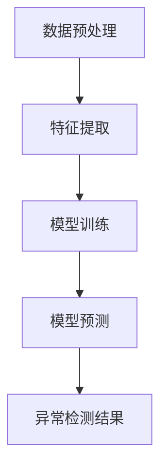

                 


# AI Agent在智能门锁中的异常行为检测

> 关键词：智能门锁，AI Agent，异常行为检测，机器学习，网络安全，物联网

> 摘要：本文详细探讨了AI Agent在智能门锁中的应用，特别是如何通过异常行为检测来提升智能门锁的安全性。文章从背景介绍、核心概念、算法原理、系统架构、项目实战等多个维度展开，结合实际案例和代码实现，为读者提供全面的技术解析。

---

# 第一章: 异常行为检测的背景与问题背景

## 1.1 问题背景

### 1.1.1 智能门锁的发展现状

智能门锁作为物联网技术的重要应用之一，近年来得到了快速发展。传统的机械门锁逐渐被智能门锁取代，后者支持指纹识别、人脸识别、蓝牙/NFC开门等多种开门方式，极大地提升了用户体验和安全性。然而，智能门锁的普及也带来了新的安全挑战，尤其是针对智能门锁的非法入侵和恶意攻击行为日益增多。

### 1.1.2 异常行为检测的必要性

智能门锁的异常行为检测是指通过监测开门行为的异常特征，识别并预警可能的安全威胁。例如，多次输入错误密码、非法尝试指纹识别、异常时间段的开门行为等，都可能是潜在的安全威胁。通过及时发现这些异常行为，可以有效防止非法入侵，保护用户财产和隐私安全。

### 1.1.3 AI Agent在智能门锁中的应用潜力

AI Agent（人工智能代理）是一种能够感知环境并采取行动以实现目标的智能实体。在智能门锁中，AI Agent可以通过分析开门行为的历史数据和实时数据，识别异常模式，并采取相应的预警或干预措施。例如，AI Agent可以实时分析用户的开门行为，判断是否存在异常，并在检测到异常时向用户或管理系统发送警报。

---

## 1.2 问题描述

### 1.2.1 智能门锁异常行为的定义

异常行为是指不符合正常开门模式的行为，通常表现为非授权用户试图非法进入、设备被篡改或攻击等。具体包括但不限于以下几种行为：
- 多次尝试输入错误的密码或指纹识别失败。
- 在非正常时间段（如深夜）进行开门操作。
- 感应到异常的开门力度或速度。

### 1.2.2 异常行为检测的目标与范围

异常行为检测的目标是通过实时监测和分析智能门锁的使用数据，识别潜在的安全威胁，并及时发出警报。其范围包括：
- 用户行为分析：检测用户的开门行为是否异常。
- 设备状态监测：检测门锁设备是否受到物理或网络攻击。
- 网络流量分析：监控智能门锁与云端的通信是否存在异常。

### 1.2.3 异常行为检测的边界与外延

异常行为检测的边界在于区分正常操作与异常操作。例如，用户在特定时间段多次尝试开门可能是正常的，也可能是异常的，这需要结合具体场景进行判断。外延则包括对异常行为的分类、分级和后续处理。

---

## 1.3 问题解决与核心概念

### 1.3.1 异常行为检测的核心问题

异常行为检测的核心问题是如何从大量数据中识别出潜在的威胁。这涉及到数据采集、特征提取、模型训练等多个环节。

### 1.3.2 AI Agent在异常检测中的角色

AI Agent在异常行为检测中扮演着关键角色，它不仅可以实时监测开门行为，还能根据历史数据和实时数据进行分析，预测潜在的异常行为，并采取相应的措施。

### 1.3.3 智能门锁异常行为检测的系统架构

智能门锁异常行为检测的系统架构通常包括以下几个部分：
1. 数据采集层：负责采集开门行为数据。
2. 数据分析层：对采集到的数据进行特征提取和分析。
3. 异常检测层：基于机器学习算法进行异常行为检测。
4. 警报与响应层：在检测到异常行为时，发出警报并采取相应措施。

---

## 1.4 本章小结

本章介绍了智能门锁异常行为检测的背景、问题背景以及核心概念。通过分析智能门锁的发展现状和异常行为检测的必要性，我们明确了AI Agent在智能门锁中的应用潜力。接下来，我们将深入探讨AI Agent与智能门锁的结合方式。

---

# 第二章: AI Agent与智能门锁的结合

## 2.1 AI Agent的基本概念

### 2.1.1 AI Agent的定义与特点

AI Agent是一种智能实体，能够感知环境并采取行动以实现目标。与传统的自动化系统不同，AI Agent具有更强的自主性和适应性，能够根据环境变化动态调整自己的行为。

### 2.1.2 AI Agent的核心功能与能力

AI Agent的核心功能包括：
- 数据采集与分析：能够从智能门锁中采集数据并进行分析。
- 异常检测：能够识别异常行为并发出警报。
- 自主决策：能够在检测到异常行为时采取相应的措施。

### 2.1.3 AI Agent与智能门锁的结合方式

AI Agent与智能门锁的结合可以通过以下几种方式实现：
- 内置于智能门锁中：AI Agent作为门锁的一部分，实时监测开门行为。
- 作为云端服务：AI Agent通过云端与智能门锁进行通信，提供远程监控和管理功能。

---

## 2.2 智能门锁的核心功能与技术

### 2.2.1 智能门锁的基本功能

智能门锁的基本功能包括：
- 用户身份验证：支持指纹、密码、刷卡等多种开门方式。
- 实时监测：监测门锁的状态和开门行为。
- 网络通信：与云端或其他设备进行数据通信。

### 2.2.2 智能门锁的通信协议

智能门锁通常采用Wi-Fi、蓝牙、ZigBee等通信协议与云端或其他设备进行数据传输。不同的通信协议具有不同的特点和适用场景。

### 2.2.3 智能门锁的传感器与数据采集

智能门锁中常用的传感器包括指纹传感器、磁感应传感器、加速度传感器等。这些传感器能够采集用户的开门行为数据，如指纹图像、开门力度、开门时间等。

---

## 2.3 AI Agent在智能门锁中的应用场景

### 2.3.1 日常开门行为的智能化

AI Agent可以通过分析用户的日常开门行为，优化开门流程。例如，根据用户的开门习惯，提前准备好开门方式，提高用户体验。

### 2.3.2 异常行为的实时监测

AI Agent可以实时监测用户的开门行为，识别异常模式，并发出警报。例如，检测到多次输入错误密码时，AI Agent会向用户或管理系统发出警报。

### 2.3.3 系统异常的主动预警

AI Agent可以通过分析门锁的状态和网络通信数据，检测门锁是否存在异常状态。例如，检测到门锁被非法篡改时，AI Agent会发出警报并采取相应的措施。

---

## 2.4 本章小结

本章详细介绍了AI Agent与智能门锁的结合方式，分析了AI Agent在智能门锁中的应用场景。通过这些应用，AI Agent能够有效提升智能门锁的安全性和智能化水平。接下来，我们将深入探讨异常行为检测的核心概念与联系。

---

# 第三章: 异常行为检测的核心概念与联系

## 3.1 异常行为检测的核心概念

### 3.1.1 异常行为的特征分析

异常行为的特征分析是异常行为检测的基础。例如，异常行为可能表现为：
- 时间特征：在非正常时间段进行开门操作。
- 频率特征：短时间内多次尝试开门。
- 动作特征：开门力度、速度异常。

### 3.1.2 异常行为的分类与分级

异常行为可以按照严重程度进行分类和分级。例如：
- 一级异常：门锁被非法篡改。
- 二级异常：多次输入错误密码。
- 三级异常：非正常时间段的开门行为。

### 3.1.3 异常行为检测的评价指标

异常行为检测的评价指标包括：
- 检测准确率：检测到异常行为的准确程度。
- 检测延迟率：从异常行为发生到检测到的时间间隔。
- 检测覆盖率：能够检测到的异常行为类型比例。

---

## 3.2 AI Agent与异常行为检测的联系

### 3.2.1 AI Agent在数据采集中的作用

AI Agent可以通过智能门锁中的传感器采集数据，如指纹图像、开门时间、开门力度等。

### 3.2.2 AI Agent在异常分析中的应用

AI Agent可以利用机器学习算法对采集到的数据进行分析，识别异常行为模式。

### 3.2.3 AI Agent在行为预测中的价值

AI Agent可以通过分析历史数据，预测潜在的异常行为，并提前采取预防措施。

---

## 3.3 实体关系图与概念结构

### 3.3.1 实体关系图（ER图）

以下是一个简单的ER图，展示了智能门锁异常行为检测系统的主要实体及其关系：

```mermaid
erDiagram
    actor User {
        +string username
        +string password
    }
    actor Intruder {
        +string device_id
    }
    entity DoorLock {
        +string lock_id
        +string status
    }
    entity BehaviorLog {
        +string log_id
        +datetime timestamp
        +string behavior_type
    }
    User --> DoorLock : uses
    Intruder --> DoorLock : attempts
    DoorLock --> BehaviorLog : records
```

### 3.3.2 概念结构图

以下是一个概念结构图，展示了智能门锁异常行为检测系统的核心概念及其关系：

```mermaid
graph TD
    User --> DoorLock : uses
    Intruder --> DoorLock : attempts
    DoorLock --> BehaviorLog : records
    BehaviorLog --> AI-Agent : analyzes
    AI-Agent --> System_Alert : triggers
```

### 3.3.3 核心概念的属性对比表

以下是一个核心概念的属性对比表：

| 概念       | 属性               | 描述                                       |
|------------|--------------------|--------------------------------------------|
| User       | username           | 用户的用户名                               |
|            | password           | 用户的密码                                 |
| Intruder   | device_id          | 非法用户的设备ID                           |
| DoorLock   | lock_id            | 门锁的唯一标识                             |
|            | status             | 门锁的状态（打开/关闭）                     |
| BehaviorLog| log_id             | 行为日志的唯一标识                         |
|            | timestamp          | 行为发生的时间                             |
|            | behavior_type      | 行为类型（正常/异常）                       |

---

## 3.4 本章小结

本章深入探讨了异常行为检测的核心概念与AI Agent的联系，通过ER图和概念结构图展示了系统的实体关系。接下来，我们将详细讲解异常行为检测的算法原理。

---

# 第四章: 异常行为检测的算法原理

## 4.1 异常行为检测的算法概述

### 4.1.1 基于统计的方法

基于统计的方法是异常行为检测的一种简单有效的方法。例如，使用马尔可夫链模型分析用户的开门行为序列，判断是否存在异常。

### 4.1.2 基于机器学习的方法

基于机器学习的方法是异常行为检测的核心技术。例如，使用随机森林、支持向量机（SVM）等算法对开门行为数据进行分类。

### 4.1.3 基于深度学习的方法

基于深度学习的方法是异常行为检测的前沿技术。例如，使用循环神经网络（RNN）或长短期记忆网络（LSTM）对时间序列数据进行建模，识别异常行为。

---

## 4.2 AI Agent的算法实现

### 4.2.1 数据预处理与特征提取

数据预处理是异常行为检测的关键步骤。例如，对开门行为数据进行归一化处理，提取特征如开门时间、开门力度等。

### 4.2.2 异常检测模型的训练

以下是一个基于机器学习的异常检测模型的Python代码示例：

```python
from sklearn.ensemble import IsolationForest
import numpy as np

# 生成正常数据和异常数据
normal_data = np.random.normal(0, 1, 100)
outlier_data = np.random.uniform(10, 20, 20)

# 训练IsolationForest模型
model = IsolationForest(n_estimators=100, contamination=0.1)
model.fit(normal_data.reshape(-1, 1))

# 预测异常行为
test_data = np.concatenate([normal_data, outlier_data])
test_labels = model.predict(test_data.reshape(-1, 1))

# 输出异常行为的索引
outlier_indices = np.where(test_labels == -1)[0]
print("异常行为的索引为:", outlier_indices)
```

### 4.2.3 模型的优化与调参

模型的优化与调参是提升异常检测准确率的关键。例如，可以通过网格搜索（Grid Search）找到最优的模型参数。

---

## 4.3 异常检测的数学模型

### 4.3.1 基于概率的异常检测模型

基于概率的异常检测模型通常使用概率密度函数来判断数据点是否为异常。例如，使用高斯混合模型（GMM）进行异常检测。

公式：
$$ P(x) = \sum_{i=1}^{k} \pi_i N(x|\mu_i, \sigma_i^2) $$

其中，$k$是高斯分布的数量，$\pi_i$是混合系数，$N(x|\mu_i, \sigma_i^2)$是第$i$个高斯分布的概率密度函数。

### 4.3.2 基于距离的异常检测模型

基于距离的异常检测模型通过计算数据点之间的距离来判断是否存在异常。例如，使用K最近邻（KNN）算法进行异常检测。

公式：
$$ d(x_i, x_j) = \sqrt{\sum_{p=1}^{n} (x_{ip} - x_{jp})^2} $$

其中，$d(x_i, x_j)$是数据点$x_i$和$x_j$之间的欧氏距离，$n$是特征维度数。

### 4.3.3 基于聚类的异常检测模型

基于聚类的异常检测模型通过将数据点聚类，识别出与大多数数据点聚类不同的数据点。例如，使用DBSCAN算法进行异常检测。

公式：
$$ \text{DBSCAN}(D, \epsilon, \text{min\_samples}) $$

其中，$D$是数据集，$\epsilon$是邻域半径，$\text{min\_samples}$是邻域中所需的最小样本数。

---

## 4.4 算法流程图

以下是一个基于机器学习的异常检测算法流程图：



---

## 4.5 本章小结

本章详细讲解了异常行为检测的算法原理，包括基于统计、机器学习和深度学习的方法。通过Python代码和数学公式，我们展示了如何实现异常检测模型。接下来，我们将探讨系统分析与架构设计方案。

---

# 第五章: 系统分析与架构设计方案

## 5.1 系统功能设计

### 5.1.1 系统功能模块划分

智能门锁异常行为检测系统的功能模块包括：
- 数据采集模块：负责采集开门行为数据。
- 数据分析模块：对采集到的数据进行特征提取和分析。
- 异常检测模块：基于机器学习算法进行异常行为检测。
- 警报与响应模块：在检测到异常行为时，发出警报并采取相应措施。

### 5.1.2 功能模块的交互关系

以下是一个功能模块的交互关系图：

```mermaid
graph TD
    DataCollector --> DataAnalyzer : sends data
    DataAnalyzer --> AnomalyDetector : triggers detection
    AnomalyDetector --> AlarmSystem : sends alert
```

### 5.1.3 系统功能的实现流程

系统功能的实现流程包括：
1. 数据采集：通过传感器采集开门行为数据。
2. 数据分析：对采集到的数据进行预处理和特征提取。
3. 异常检测：基于机器学习算法进行异常行为检测。
4. 警报与响应：在检测到异常行为时，发出警报并采取相应措施。

---

## 5.2 系统架构设计

### 5.2.1 分层架构

智能门锁异常行为检测系统的分层架构包括：
- 数据采集层：负责采集开门行为数据。
- 数据分析层：对数据进行处理和分析。
- 异常检测层：基于机器学习算法进行异常行为检测。
- 警报与响应层：发出警报并采取相应措施。

---

## 5.3 本章小结

本章详细探讨了智能门锁异常行为检测系统的功能设计和架构设计。通过分层架构和模块化设计，我们能够实现高效、可靠的异常行为检测。接下来，我们将通过项目实战，展示如何实现这一系统。

---

# 第六章: 项目实战

## 6.1 环境安装与配置

### 6.1.1 系统环境

- 操作系统：Linux（推荐Ubuntu 20.04及以上版本）
- 开发工具：Python 3.8及以上版本，Jupyter Notebook
- 依赖库：scikit-learn、numpy、pandas、mermaid

### 6.1.2 硬件设备

- 智能门锁：支持Wi-Fi或蓝牙连接的智能门锁
- 开发板：如Raspberry Pi

---

## 6.2 系统核心实现

### 6.2.1 数据采集模块

以下是一个数据采集模块的Python代码示例：

```python
import serial

# 配置串口
ser = serial.Serial('COM3', 9600)

while True:
    # 读取数据
    data = ser.readline().decode()
    # 处理数据
    print("接收到的数据:", data)
```

### 6.2.2 异常检测模块

以下是一个基于Isolation Forest算法的异常检测模块的Python代码示例：

```python
from sklearn.ensemble import IsolationForest
import numpy as np

# 生成正常数据和异常数据
normal_data = np.random.normal(0, 1, 100)
outlier_data = np.random.uniform(10, 20, 20)

# 训练Isolation Forest模型
model = IsolationForest(n_estimators=100, contamination=0.1)
model.fit(normal_data.reshape(-1, 1))

# 预测异常行为
test_data = np.concatenate([normal_data, outlier_data])
test_labels = model.predict(test_data.reshape(-1, 1))

# 输出异常行为的索引
outlier_indices = np.where(test_labels == -1)[0]
print("异常行为的索引为:", outlier_indices)
```

---

## 6.3 实际案例分析

### 6.3.1 案例背景

假设某用户在深夜多次尝试输入错误密码，AI Agent检测到异常行为并发出警报。

### 6.3.2 数据分析

通过分析用户的开门行为数据，AI Agent识别到用户的开门行为模式异常。

### 6.3.3 异常检测与响应

AI Agent发出警报，并通知用户或管理系统采取相应措施。

---

## 6.4 项目小结

本章通过项目实战，展示了如何实现智能门锁异常行为检测系统的核心功能。通过数据采集、数据分析和异常检测模块的实现，我们能够有效识别异常行为并发出警报。接下来，我们将总结最佳实践，并展望未来的发展方向。

---

# 第七章: 最佳实践与未来展望

## 7.1 最佳实践

### 7.1.1 数据安全

确保数据的安全性，防止数据泄露和被篡改。

### 7.1.2 系统优化

通过模型优化和算法改进，提升异常检测的准确率和响应速度。

### 7.1.3 用户隐私

保护用户的隐私，确保用户数据不被滥用。

---

## 7.2 小结

通过本文的探讨，我们深入分析了AI Agent在智能门锁中的应用，特别是异常行为检测的核心技术和实现方法。通过项目实战，我们展示了如何将理论应用于实际。

---

## 7.3 注意事项

- 异常行为检测的准确性依赖于数据质量和模型训练。
- 系统的安全性和稳定性需要通过严格的测试和优化。
- 用户隐私保护是系统设计和实现中的重要考虑因素。

---

## 7.4 拓展阅读

- 《机器学习实战》：深入学习异常检测的算法实现。
- 《网络安全实战》：了解智能门锁可能面临的网络安全威胁。
- 《物联网开发指南》：掌握智能门锁的开发和部署技巧。

---

# 附录

## 附录A: 异常检测算法的代码实现

以下是基于Isolation Forest算法的异常检测代码：

```python
from sklearn.ensemble import IsolationForest
import numpy as np

# 生成正常数据和异常数据
normal_data = np.random.normal(0, 1, 100)
outlier_data = np.random.uniform(10, 20, 20)

# 训练Isolation Forest模型
model = IsolationForest(n_estimators=100, contamination=0.1)
model.fit(normal_data.reshape(-1, 1))

# 预测异常行为
test_data = np.concatenate([normal_data, outlier_data])
test_labels = model.predict(test_data.reshape(-1, 1))

# 输出异常行为的索引
outlier_indices = np.where(test_labels == -1)[0]
print("异常行为的索引为:", outlier_indices)
```

---

## 附录B: 系统架构图

以下是一个智能门锁异常行为检测系统的架构图：

```mermaid
graph TD
    User --> DoorLock : uses
    DoorLock --> DataCollector : sends data
    DataCollector --> DataAnalyzer : processes data
    DataAnalyzer --> AnomalyDetector : triggers detection
    AnomalyDetector --> AlarmSystem : sends alert
```

---

# 结语

通过本文的探讨，我们深入分析了AI Agent在智能门锁中的应用，特别是异常行为检测的核心技术和实现方法。通过项目实战，我们展示了如何将理论应用于实际。希望本文能够为读者提供有价值的技术参考和实践指导。

--- 

**全文完**

