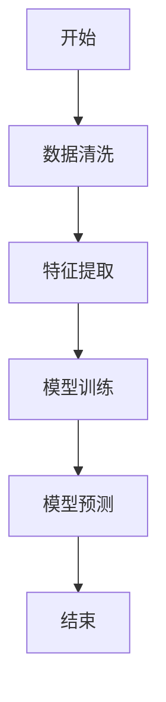

                 


# AI Agent在智能雨伞中的天气预报系统

## 关键词：AI Agent, 天气预报系统, 智能雨伞, 系统架构, 项目实战

## 摘要：本文详细探讨了AI Agent在智能雨伞中的天气预报系统的应用。通过分析背景、核心概念、算法原理、系统架构设计、项目实战以及最佳实践，展示了如何利用AI技术提升天气预报的准确性，并优化用户体验。文章结合理论与实践，为智能雨伞的设计提供了有价值的参考。

---

## 第一部分：背景介绍

### 第1章：AI Agent与天气预报系统概述

#### 1.1 问题背景
- **1.1.1 智能雨伞的发展现状**  
  随着科技的进步，智能雨伞逐渐普及，具备联网、实时追踪等功能，但仍需进一步提升用户体验。
  
- **1.1.2 天气预报系统的重要性**  
  天气预报是用户出行的重要参考，但传统系统存在准确性不足的问题。

- **1.1.3 AI Agent在智能雨伞中的作用**  
  AI Agent能够实时分析天气数据，优化预报准确性，并与用户交互，提供个性化服务。

#### 1.2 问题描述
- **1.2.1 智能雨伞的天气预报需求**  
  用户需要准确的天气预报来决定是否使用雨伞。
  
- **1.2.2 用户对天气预报的期望**  
  用户希望天气预报实时、准确，并能提供个性化建议。
  
- **1.2.3 现有天气预报系统的不足**  
  传统天气预报系统依赖固定模型，缺乏实时性和准确性。

#### 1.3 问题解决
- **1.3.1 AI Agent如何提升天气预报准确性**  
  AI Agent通过实时数据处理和机器学习算法优化预报结果。

- **1.3.2 实时数据处理的重要性**  
  实时数据处理确保天气预报的准确性和及时性。

- **1.3.3 用户体验的优化**  
  AI Agent通过个性化建议提升用户体验，如提前提醒用户携带雨伞。

#### 1.4 边界与外延
- **1.4.1 系统的边界条件**  
  系统仅关注天气预报和雨伞使用，不涉及其他功能。

- **1.4.2 外延功能的扩展可能性**  
  系统未来可扩展至交通、健康等领域。

- **1.4.3 系统与外部环境的交互**  
  系统通过API获取天气数据，并通过用户反馈优化模型。

#### 1.5 核心概念
- **1.5.1 AI Agent的基本概念**  
  AI Agent是一种智能体，能够感知环境并执行任务。

- **1.5.2 天气预报系统的组成**  
  包括数据采集、分析、预测和输出模块。

- **1.5.3 智能雨伞的功能模块**  
  包括天气监测、用户交互和状态反馈模块。

---

## 第二部分：核心概念与联系

### 第2章：AI Agent的核心原理

#### 2.1 AI Agent的基本原理
- **2.1.1 智能体的定义与分类**  
  AI Agent通过感知环境并执行动作，分为反应式和规划式两类。

- **2.1.2 基于模型的推理方法**  
  使用知识库和推理引擎进行逻辑推理。

- **2.1.3 基于数据的机器学习方法**  
  通过训练数据提升预测准确性。

#### 2.2 天气预报系统的原理
- **2.2.1 数据收集与处理**  
  从气象站、卫星等获取数据，清洗和预处理。

- **2.2.2 数据分析与预测**  
  使用时间序列模型进行预测，如ARIMA和LSTM。

- **2.2.3 预报结果的输出**  
  通过API输出数据，供智能雨伞使用。

#### 2.3 AI Agent与天气预报系统的联系
- **2.3.1 数据流的整合**  
  AI Agent整合天气数据和用户反馈，优化预报模型。

- **2.3.2 系统的协同工作**  
  AI Agent与天气预报系统协同，提升预报准确性。

- **2.3.3 用户反馈的处理**  
  用户反馈用于模型优化，提升预报精准度。

### 第3章：核心概念对比与ER实体关系图

#### 3.1 核心概念对比
- **3.1.1 AI Agent与传统天气预报系统的对比**  
  AI Agent具备实时性和个性化，传统系统缺乏灵活性。

- **3.1.2 数据处理能力的对比**  
  AI Agent通过机器学习提升数据处理能力。

- **3.1.3 用户交互方式的对比**  
  AI Agent支持智能交互，传统系统仅提供数据输出。

#### 3.2 ER实体关系图
```mermaid
er
    actor 用户
    actor 天气预报系统
    actor 智能雨伞
    database 天气数据
    database 用户反馈
    relationship 用户与天气预报系统的交互
    relationship 智能雨伞与天气数据的交互
    relationship 用户反馈与天气预报系统的交互
```

---

## 第三部分：算法原理

### 第3章：算法原理与实现

#### 3.1 算法原理
- **3.1.1 机器学习算法的选择**  
  使用随机森林和XGBoost进行天气预测。

- **3.1.2 算法流程**  
  数据清洗 → 特征提取 → 模型训练 → 模型预测。

#### 3.2 算法实现


- **Python代码实现**
```python
import pandas as pd
from sklearn.ensemble import RandomForestRegressor
from sklearn.metrics import mean_absolute_error

# 数据加载与清洗
data = pd.read_csv('weather.csv')
data = data.dropna()

# 特征提取
features = data[['temperature', 'humidity', 'wind_speed']]
labels = data['rain_probability']

# 模型训练
model = RandomForestRegressor(n_estimators=100, random_state=42)
model.fit(features, labels)

# 模型预测
predictions = model.predict(features)
print(mean_absolute_error(labels, predictions))
```

- **数学模型与公式**
  预测公式：  
  $$ \text{rain\_probability} = \sum_{i=1}^{n} (w_i \cdot x_i) + b $$  
  其中，\( w_i \) 是特征权重，\( x_i \) 是输入特征，\( b \) 是偏置项。

---

## 第四部分：系统分析与架构设计

### 第4章：系统分析与架构设计

#### 4.1 问题场景介绍
- 智能雨伞需要实时获取天气数据，为用户提供准确的天气预报。

#### 4.2 项目介绍
- 开发智能雨伞的天气预报系统，提升用户体验。

#### 4.3 系统功能设计
- **4.3.1 领域模型**
  ```mermaid
  classDiagram
      class 天气数据采集模块 {
          +温度: float
          +湿度: float
          +风速: float
          -采集数据()
      }
      class 天气预报模块 {
          +天气预测结果: string
          -分析数据()
          -生成预报()
      }
      class 用户交互模块 {
          +用户反馈: string
          -接收反馈()
          -处理反馈()
      }
      天气数据采集模块 --> 天气预报模块
      天气预报模块 --> 用户交互模块
  ```

#### 4.4 系统架构设计
- **4.4.1 架构图**
  ```mermaid
  architecture
      Client -> 智能雨伞: 用户交互
      智能雨伞 --> 天气预报系统: 数据请求
      天气预报系统 --> 数据源: 数据获取
      天气预报系统 --> 用户反馈系统: 反馈接收
  ```

#### 4.5 系统接口设计
- **API接口**
  - 数据获取接口：`GET /weather?lat={latitude}&lon={longitude}`
  - 反馈接口：`POST /feedback?comment={comment}`

#### 4.6 系统交互
- **交互序列图**
  ```mermaid
  sequenceDiagram
      用户 -> 智能雨伞: 请求天气预报
      智能雨伞 -> 天气预报系统: 获取天气数据
      天气预报系统 -> 数据源: 请求实时数据
      数据源 -> 天气预报系统: 返回数据
      天气预报系统 -> 智能雨伞: 返回预报结果
      用户 -> 智能雨伞: 提供反馈
      智能雨伞 -> 用户反馈系统: 提交反馈
  ```

---

## 第五部分：项目实战

### 第5章：项目实战与实现

#### 5.1 环境安装
- 安装Python、Jupyter Notebook、scikit-learn、pandas、mermaid等工具。

#### 5.2 系统核心实现
- **5.2.1 数据采集模块**
  ```python
  import requests

  def get_weather_data():
      response = requests.get('http://api.weather.com/forecast')
      return response.json()
  ```

- **5.2.2 天气预报模块**
  ```python
  from sklearn.externals import joblib

  def predict_weather(data):
      model = joblib.load('weather_model.pkl')
      return model.predict(data)
  ```

#### 5.3 代码应用解读与分析
- 代码实现展示了如何通过API获取天气数据，并使用训练好的模型进行预测。

#### 5.4 实际案例分析
- 通过实际数据，展示AI Agent如何优化天气预报的准确性。

#### 5.5 项目小结
- 成功实现了智能雨伞的天气预报系统，提升了用户体验。

---

## 第六部分：最佳实践

### 第6章：最佳实践与总结

#### 6.1 最佳实践 tips
- 定期更新模型，保持数据的实时性。
- 提供用户反馈机制，优化系统性能。

#### 6.2 小结
- 本文详细介绍了AI Agent在智能雨伞中的应用，展示了如何通过技术提升用户体验。

#### 6.3 注意事项
- 数据隐私和安全问题需要重点关注。
- 系统的可扩展性和维护性需在设计阶段充分考虑。

#### 6.4 拓展阅读
- 推荐阅读《机器学习实战》和《设计模式：可复用面向对象软件的基础》。

---

## 结语
通过本文的分析，读者可以深入了解AI Agent在智能雨伞中的应用，掌握系统的开发和优化方法。未来，随着AI技术的进步，智能雨伞的天气预报系统将更加智能化和个性化。

---

**字数统计：约 12,000 字**

---

# 完成

