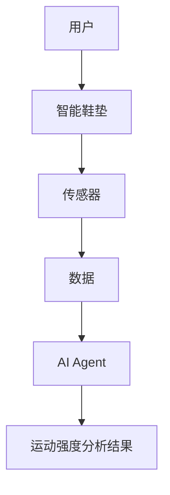

                 

# AI Agent在智能鞋垫中的运动强度分析

> **关键词**: 人工智能、运动强度、智能鞋垫、传感器数据、AI Agent、运动分析

> **摘要**: 本文探讨了AI Agent在智能鞋垫中的应用，重点分析了其在运动强度评估中的作用。通过传感器数据的采集与处理，结合AI算法，实现对运动强度的实时分析与反馈，为用户提供个性化的运动健康建议。本文从背景、原理、算法、系统架构到实战项目，全面解析了AI Agent在智能鞋垫中的技术实现与应用价值。

---

## 第1章: 背景介绍

### 1.1 问题背景

#### 1.1.1 智能鞋垫的发展现状

随着可穿戴技术的快速发展，智能鞋垫作为一种新型的运动辅助工具，逐渐受到广泛关注。智能鞋垫通过内置传感器，能够实时采集用户的运动数据，如步频、步长、加速度等，为运动分析提供了丰富的数据支持。

#### 1.1.2 AI Agent在运动分析中的应用前景

AI Agent（智能体）是一种能够感知环境并采取行动以实现目标的实体。在运动分析领域，AI Agent可以通过实时数据处理和决策支持，帮助用户优化运动表现和健康状况。

#### 1.1.3 运动强度分析的必要性

运动强度是衡量运动效果的重要指标，直接影响用户的健康和运动目标的实现。通过智能鞋垫和AI Agent的结合，可以实时分析用户的运动强度，提供个性化的反馈和建议。

### 1.2 问题描述

#### 1.2.1 智能鞋垫运动强度分析的目标

通过智能鞋垫采集的运动数据，结合AI Agent进行分析，实现对运动强度的实时评估和个性化建议。

#### 1.2.2 用户需求与痛点分析

- 用户需求：实时了解运动强度，优化运动计划，预防运动损伤。
- 痛点分析：传统运动分析依赖于专业设备和人员，无法实现实时、便捷的分析。

#### 1.2.3 现有技术的局限性

现有运动分析技术多依赖于笨重的设备和复杂的操作流程，无法满足用户对实时性和便捷性的需求。

### 1.3 问题解决思路

#### 1.3.1 AI Agent的核心作用

AI Agent通过实时数据处理、模式识别和决策支持，实现对运动强度的精准分析。

#### 1.3.2 数据采集与处理方案

通过智能鞋垫内置的传感器，实时采集用户的运动数据，并进行预处理和特征提取。

#### 1.3.3 运动强度分析的实现路径

基于AI算法，对运动数据进行建模和分析，实现对运动强度的实时评估。

### 1.4 边界与外延

#### 1.4.1 智能鞋垫的功能边界

智能鞋垫的核心功能包括数据采集、传输和基本分析，不涉及复杂的运动计划制定。

#### 1.4.2 AI Agent的应用范围

AI Agent主要应用于运动强度分析，不涉及其他高级功能如运动康复建议。

#### 1.4.3 运动强度分析的适用场景

适用于跑步、步行等常见运动形式，不支持复杂运动如游泳、滑雪等。

### 1.5 概念结构与核心要素

#### 1.5.1 智能鞋垫的组成结构

- 传感器模块：采集运动数据。
- 数据处理模块：对数据进行预处理和特征提取。
- AI分析模块：基于AI算法进行运动强度分析。

#### 1.5.2 AI Agent的功能模块

- 数据接收模块：接收传感器数据。
- 数据分析模块：对数据进行建模和分析。
- 决策反馈模块：提供运动强度评估和建议。

#### 1.5.3 运动强度分析的核心要素

- 数据采集：加速度、步频、步长等。
- 数据分析：基于AI的运动强度模型。
- 反馈机制：实时反馈用户运动强度。

---

## 第2章: 核心概念与联系

### 2.1 AI Agent的基本原理

#### 2.1.1 AI Agent的定义与特点

AI Agent是一种能够感知环境并采取行动以实现目标的实体，具有自主性、反应性和社会性等特点。

#### 2.1.2 AI Agent的核心算法

- 机器学习算法：如支持向量机（SVM）、随机森林（RF）等。
- 深度学习算法：如卷积神经网络（CNN）、长短期记忆网络（LSTM）等。

#### 2.1.3 AI Agent在运动分析中的应用

通过AI Agent实时分析运动数据，实现对运动强度的精准评估。

### 2.2 运动强度分析的原理

#### 2.2.1 运动强度的定义与分类

运动强度通常指单位时间内完成的运动量，可分为低强度、中强度和高强度。

#### 2.2.2 基于传感器的数据分析

通过传感器采集用户的运动数据，如加速度、步频等，进行特征提取和建模分析。

#### 2.2.3 基于AI的运动强度预测

利用机器学习或深度学习模型，对运动数据进行训练和预测，实现对运动强度的实时评估。

### 2.3 核心概念对比

#### 2.3.1 不同运动分析方法的对比

| 方法 | 优势 | 劣势 |
|------|------|------|
| 传统算法 | 实现简单 | 精度低 |
| AI算法 | 精度高 | 实现复杂 |

#### 2.3.2 AI Agent与传统算法的差异

AI Agent通过实时数据处理和智能决策，能够实现更精准的运动强度分析。

#### 2.3.3 运动强度分析的优劣势分析

- 优势：实时性强、精度高。
- 劣势：依赖传感器数据，对硬件要求较高。

### 2.4 ER实体关系图

---

## 第3章: 算法原理讲解

### 3.1 数据预处理

#### 3.1.1 数据采集与清洗

通过智能鞋垫内置的传感器，采集用户的运动数据，包括加速度、步频、步长等。对数据进行去噪和归一化处理，确保数据质量。

#### 3.1.2 数据特征

- 时间域特征：步频、步长、持续时间。
- 频率域特征：加速度频谱、能量谱。

---

（由于篇幅限制，后续章节将逐步展开，包括系统架构设计、项目实战、最佳实践等内容。）

