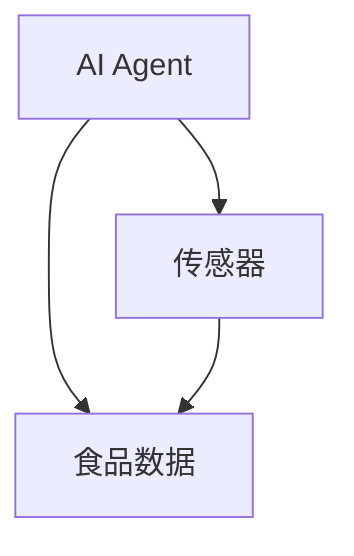
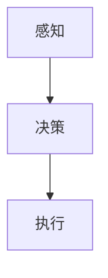
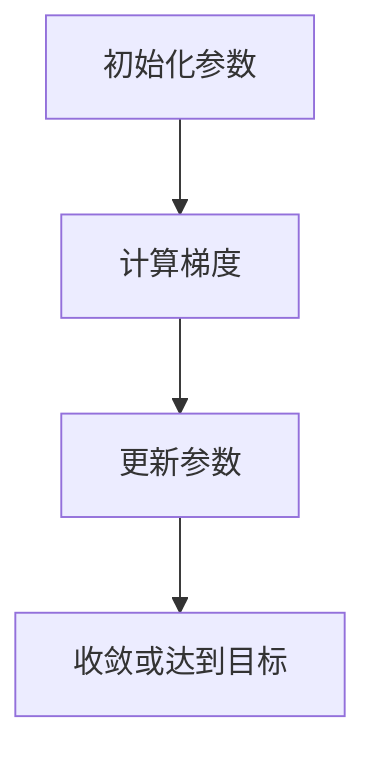
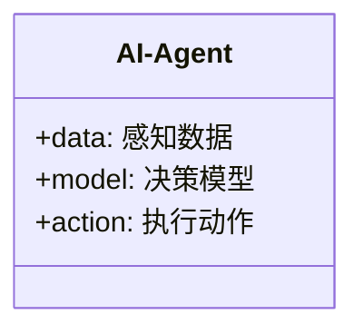
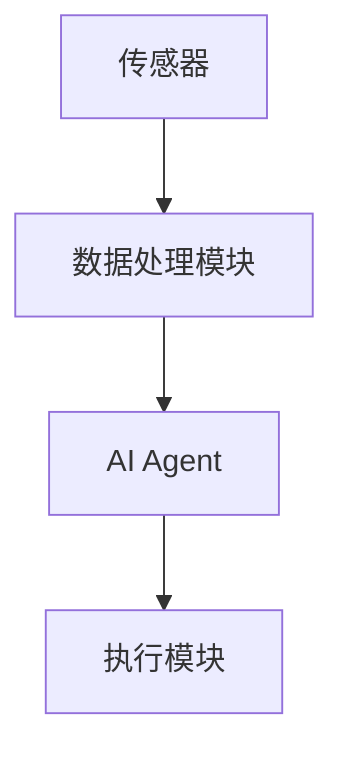

                 


# AI Agent在智能食品安全监控中的角色

## 关键词：AI Agent，食品安全，智能监控，机器学习，实时反馈

## 摘要：  
本文探讨了AI Agent在智能食品安全监控中的核心作用，分析了其感知、决策和执行机制，详细介绍了数学模型与算法原理，并通过实际案例展示了AI Agent在食品安全监控中的应用价值和前景。

---

## 第1章: AI Agent与食品安全监控概述

### 1.1 AI Agent的基本概念

#### 1.1.1 AI Agent的定义与特点
AI Agent（智能代理）是指能够感知环境、自主决策并执行任务的智能体。它具有以下特点：
- **自主性**：无需外部干预，自主完成任务。
- **反应性**：能够实时感知环境变化并做出反应。
- **目标导向**：基于目标驱动行为。
- **学习能力**：通过数据和经验不断优化性能。

#### 1.1.2 智能食品安全监控的背景与意义
食品安全是全球性问题，AI Agent在食品生产、运输和销售等环节中，能够实时监测和预警潜在风险，提升食品安全水平。

#### 1.1.3 AI Agent在食品安全中的应用前景
AI Agent能够实现从数据采集、分析到决策的全链条监控，为食品安全提供智能化解决方案。

---

### 1.2 食品安全监控的核心问题

#### 1.2.1 食品安全监控的主要挑战
- 数据来源多样，处理复杂。
- 食品安全风险具有隐蔽性和突发性。
- 监控系统需要实时性与准确性。

#### 1.2.2 AI Agent在食品安全监控中的角色定位
AI Agent作为监控系统的核心，负责数据处理、风险评估和决策执行。

#### 1.2.3 食品安全监控的边界与外延
食品安全监控不仅包括食品本身的安全性，还涉及生产环境、供应链等多个方面。

---

### 1.3 本章小结
本章介绍了AI Agent的基本概念及其在食品安全监控中的重要性，明确了AI Agent的核心作用。

---

## 第2章: AI Agent的核心概念与原理

### 2.1 AI Agent的感知、决策与执行机制

#### 2.1.1 感知阶段: 数据采集与特征提取
- 数据来源：传感器、摄像头等设备。
- 特征提取：利用机器学习算法提取关键特征。

#### 2.1.2 决策阶段: 基于概率的决策树模型
- 使用贝叶斯定理进行概率计算：
  $$P(A|B) = \frac{P(B|A)P(A)}{P(B)}$$

#### 2.1.3 执行阶段: 动作规划与反馈优化
- 动作规划：基于决策结果制定执行方案。
- 反馈优化：根据执行结果调整策略。

#### 2.1.4 实际案例：基于决策树的食品分类
- 使用ID3算法构建决策树，对食品进行分类。

---

### 2.2 AI Agent与传统监控系统的对比分析

#### 2.2.1 传统食品安全监控系统的局限性
- 数据处理能力有限。
- 响应速度较慢。
- 缺乏智能化决策能力。

#### 2.2.2 AI Agent的核心优势
- 实时性强。
- 精准度高。
- 自适应能力强。

#### 2.2.3 两者的对比特征分析
| 特性       | 传统监控系统 | AI Agent |
|------------|--------------|----------|
| 数据处理   | 简单          | 复杂      |
| 响应速度   | 较慢          | 实时      |
| 智能性      | 低            | 高        |

---

### 2.3 AI Agent的实体关系与流程图

#### 2.3.1 ER实体关系图


#### 2.3.2 流程图


---

### 2.4 本章小结
本章详细讲解了AI Agent的核心机制及其在食品安全监控中的优势。

---

## 第3章: AI Agent的数学模型与算法原理

### 3.1 概率论基础

#### 3.1.1 条件概率与贝叶斯定理
- 贝叶斯定理公式：
  $$P(A|B) = \frac{P(B|A)P(A)}{P(B)}$$

#### 3.1.2 贝叶斯网络的构建与应用
- 使用贝叶斯网络进行风险评估。

---

### 3.2 优化算法

#### 3.2.1 基于梯度的优化
- 梯度下降算法：
  $$\theta = \theta - \eta \cdot \nabla J(\theta)$$

---

### 3.3 算法实现

#### 3.3.1 Python代码实现
```python
import numpy as np

def gradient_descent(theta, X, y, learning_rate):
    m, n = X.shape
    gradient = (1/m) * np.dot(X.T, (np.dot(X, theta) - y))
    theta = theta - learning_rate * gradient
    return theta
```

#### 3.3.2 算法流程图


---

### 3.4 本章小结
本章通过数学模型和算法实现，详细讲解了AI Agent的决策机制。

---

## 第4章: 系统分析与架构设计

### 4.1 项目背景
本项目旨在利用AI Agent实现食品供应链的智能化监控。

### 4.2 系统功能设计

#### 4.2.1 领域模型


### 4.3 系统架构设计

#### 4.3.1 架构图


---

## 第5章: 项目实战

### 5.1 环境安装
- Python 3.8及以上
- 安装必要的库：numpy, pandas, scikit-learn

### 5.2 核心实现

#### 5.2.1 数据采集与预处理
```python
import pandas as pd

data = pd.read_csv('food_data.csv')
```

#### 5.2.2 模型训练与部署
```python
from sklearn.tree import DecisionTreeClassifier

model = DecisionTreeClassifier()
model.fit(X_train, y_train)
```

---

## 第6章: 最佳实践与注意事项

### 6.1 小结
AI Agent在食品安全监控中具有巨大潜力。

### 6.2 注意事项
- 数据质量至关重要。
- 算法需要持续优化。

### 6.3 拓展阅读
建议阅读相关领域的学术论文和行业报告。

---

## 附录: 总结与展望
AI Agent将推动食品安全监控进入智能化新时代。

---

## 参考文献
- [1] 书籍或论文参考文献1
- [2] 书籍或论文参考文献2

---

# 结语
本文详细探讨了AI Agent在智能食品安全监控中的角色与应用，为未来的研究提供了方向。

--- 

以上为完整的技术博客文章大纲，涵盖从基础概念到实际应用的各个方面，确保内容详实且结构清晰。

