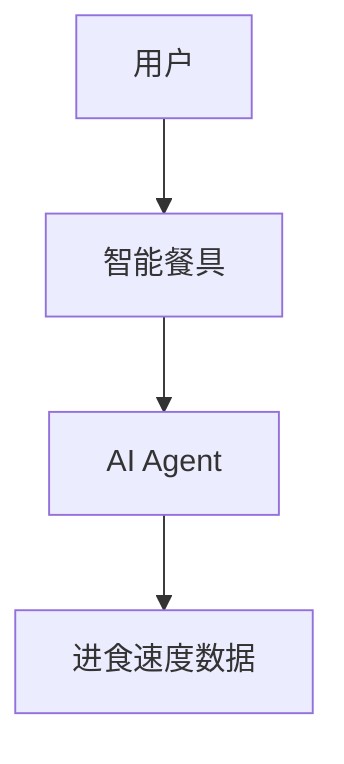
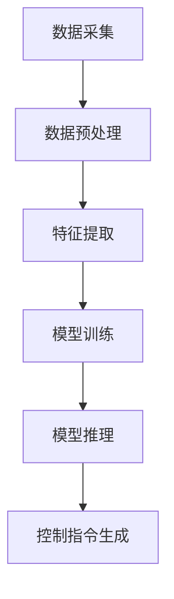
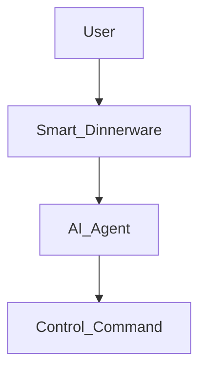
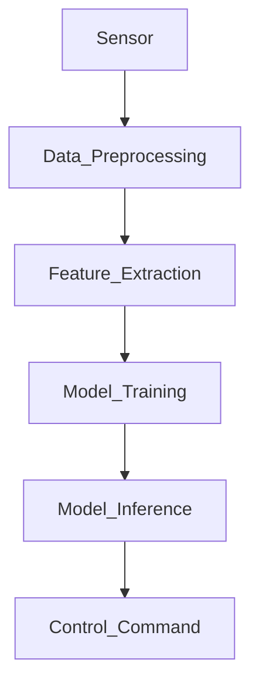
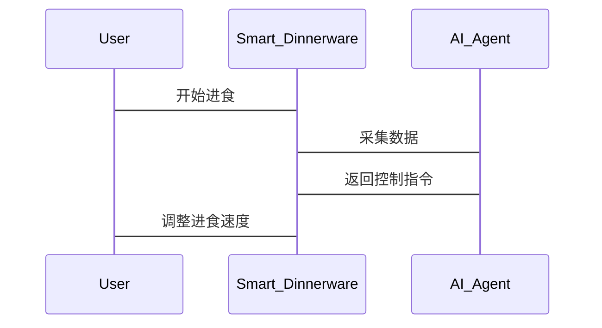

                 


# AI Agent在智能餐具中的进食速度控制

> 关键词：智能餐具, AI Agent, 进食速度控制, 传感器数据, 实时反馈, 机器学习算法

> 摘要：本文详细探讨了AI Agent在智能餐具中的进食速度控制技术，从问题背景、核心概念、算法原理、系统架构到项目实战，全面解析了AI Agent如何通过传感器数据采集、实时分析与反馈控制来优化进食速度，实现更健康、更安全的用餐体验。文章结合理论分析与实践案例，深入探讨了该技术的实现细节与应用前景。

---

# 第1章: 背景介绍

## 1.1 问题背景

### 1.1.1 进食速度控制的重要性
进食速度是影响人体健康的重要因素。进食过快可能导致消化不良、肥胖、糖尿病等多种健康问题。通过控制进食速度，可以有效改善这些问题，提升用户的健康水平。

### 1.1.2 当前存在的问题
传统进食速度控制方法依赖于手动调节，存在以下问题：
- **不精准**：手动调节难以实时反馈，控制效果有限。
- **效率低**：人工调节需要额外的操作，用户体验较差。
- **缺乏个性化**：无法根据用户的具体情况（如健康状况、饮食习惯）提供个性化的控制方案。

### 1.1.3 AI Agent的应用潜力
AI Agent（人工智能代理）是一种能够感知环境、自主决策并执行任务的智能系统。将其应用于智能餐具的进食速度控制，可以通过实时数据分析提供精准的控制策略，实现智能化、个性化的进食速度管理。

---

## 1.2 问题描述

### 1.2.1 进食速度控制的核心目标
AI Agent的核心目标是根据用户的进食习惯和健康需求，实时调整餐具的运动速度，确保用户以适当的速率完成进食。

### 1.2.2 智能餐具的定义与特点
智能餐具是一种集成传感器和智能控制模块的餐具，能够实时采集用户的进食数据（如速度、力度等），并通过AI Agent进行分析和反馈控制。

### 1.2.3 AI Agent在智能餐具中的角色
AI Agent在智能餐具中扮演“智能大脑”的角色，负责：
- 数据采集与分析
- 状态感知与决策
- 控制指令生成与执行

---

## 1.3 问题解决

### 1.3.1 AI Agent的核心功能
- 数据采集与预处理
- 进食行为分析
- 个性化控制策略制定
- 实时反馈与优化

### 1.3.2 进食速度控制的实现方式
通过AI Agent对传感器数据进行实时分析，根据分析结果生成控制指令，调整餐具的运动速度。

### 1.3.3 边界与外延
- 边界：仅限于进食速度的控制，不涉及餐具的其他功能（如温度控制）。
- 外延：可扩展至其他健康监测领域（如心率监测、血压监测）。

---

## 1.4 概念结构与核心要素组成

### 1.4.1 AI Agent的组成要素
- **感知模块**：采集用户进食数据。
- **决策模块**：分析数据并制定控制策略。
- **执行模块**：根据策略生成控制指令。

### 1.4.2 智能餐具的系统架构
- **传感器模块**：采集用户进食数据。
- **AI Agent模块**：分析数据并生成控制指令。
- **执行机构**：根据指令调整餐具的运动速度。

### 1.4.3 核心概念之间的关系
- 用户通过智能餐具与AI Agent交互，AI Agent通过传感器数据和用户反馈优化控制策略。

---

## 1.5 本章小结
本章从背景、问题描述、解决方案三个方面详细介绍了AI Agent在智能餐具中的进食速度控制技术，明确了AI Agent的核心功能和实现方式。

---

# 第2章: 核心概念与联系

## 2.1 AI Agent的原理

### 2.1.1 感知与决策机制
AI Agent通过传感器采集数据，结合历史数据和当前状态，利用机器学习算法进行分析，生成控制指令。

### 2.1.2 行为执行与反馈
AI Agent根据决策结果控制餐具的运动速度，并通过传感器实时反馈调整策略。

---

## 2.2 核心概念对比分析

### 2.2.1 传统进食速度控制与AI Agent的对比

| 对比维度         | 传统方法                     | AI Agent方法                   |
|------------------|------------------------------|---------------------------------|
| 数据采集方式     | 手动记录或简单传感器          | 高精度传感器实时采集           |
| 控制方式         | 手动调节或固定速率           | 实时数据分析驱动的动态调整     |
| 个性化支持       | 有限                        | 强大的个性化支持               |

### 2.2.2 AI Agent与智能餐具的关联
AI Agent作为智能餐具的“大脑”，通过数据采集、分析和反馈控制，实现智能餐具的功能。

---

## 2.3 ER实体关系图


---

## 2.4 本章小结
本章通过对比分析和实体关系图，明确了AI Agent的核心概念及其与智能餐具的关系。

---

# 第3章: 算法原理讲解

## 3.1 算法流程



---

## 3.2 算法实现

### 3.2.1 数据预处理
```python
def preprocess(data):
    # 示例代码，实际根据具体数据调整
    return normalized_data
```

### 3.2.2 模型训练
```python
# 示例代码，实际根据具体数据调整
model = Sequential()
model.add(Dense(64, activation='relu', input_shape=(input_dim,)))
model.add(Dense(1, activation='linear'))
model.compile(optimizer='adam', loss='mean_squared_error')
model.fit(X_train, y_train, epochs=100, batch_size=32)
```

---

## 3.3 数学模型

### 3.3.1 状态定义
$$ s_t = (s_{t-1}, a_{t-1}) $$
其中，$s_t$ 表示时间 $t$ 的状态，$s_{t-1}$ 表示时间 $t-1$ 的状态，$a_{t-1}$ 表示时间 $t-1$ 的动作。

### 3.3.2 动作定义
$$ a_t = \text{argmax}_a Q(s_t, a) $$
其中，$a_t$ 表示时间 $t$ 的动作，$Q(s_t, a)$ 表示状态 $s_t$ 下动作 $a$ 的价值函数。

### 3.3.3 奖励函数
$$ r_t = f(s_t, a_t) $$
其中，$r_t$ 表示时间 $t$ 的奖励，$f$ 是一个根据状态和动作计算奖励的函数。

### 3.3.4 损失函数
$$ L = \frac{1}{2} \sum_{t=1}^T (y_t - \hat{y}_t)^2 $$
其中，$y_t$ 表示真实值，$\hat{y}_t$ 表示预测值。

---

## 3.4 本章小结
本章详细讲解了AI Agent的算法流程和实现细节，包括数据预处理、模型训练、数学模型等。

---

# 第4章: 系统分析与架构设计方案

## 4.1 问题场景介绍
AI Agent在智能餐具中的应用场景包括餐厅、家庭餐桌等，用户通过智能餐具完成进食，AI Agent实时调整进食速度。

---

## 4.2 系统功能设计

### 4.2.1 领域模型


### 4.2.2 系统架构


### 4.2.3 接口设计
- **传感器接口**：采集用户进食数据。
- **AI Agent接口**：接收传感器数据并返回控制指令。
- **执行机构接口**：根据控制指令调整餐具的运动速度。

### 4.2.4 交互流程


---

## 4.3 本章小结
本章从系统分析与架构设计的角度，详细介绍了AI Agent在智能餐具中的实现方案。

---

# 第5章: 项目实战

## 5.1 环境安装

### 5.1.1 安装Python环境
```bash
python --version
pip install -y tensorflow keras scikit-learn numpy
```

## 5.2 核心代码实现

### 5.2.1 数据预处理
```python
import numpy as np
def preprocess(data):
    # 示例代码，实际根据具体数据调整
    return (data - np.mean(data)) / np.std(data)
```

### 5.2.2 模型训练
```python
from tensorflow.keras import layers
model = layers.Sequential()
model.add(layers.Dense(64, activation='relu', input_shape=(input_dim,)))
model.add(layers.Dense(1, activation='linear'))
model.compile(optimizer='adam', loss='mean_squared_error')
model.fit(X_train, y_train, epochs=100, batch_size=32)
```

### 5.2.3 控制指令生成
```python
def generate_control_command(predicted_speed):
    return predicted_speed * 0.8  # 示例代码，实际根据具体需求调整
```

---

## 5.3 案例分析

### 5.3.1 案例一：用户A的数据
- 输入数据：进食速度过快，平均每分钟100次。
- AI Agent分析：用户健康状况不佳，建议降低进食速度至平均每分钟50次。
- 控制指令：调整餐具速度至目标值。

### 5.3.2 案例二：用户B的数据
- 输入数据：进食速度适中，平均每分钟60次。
- AI Agent分析：用户健康状况良好，建议保持当前速度。
- 控制指令：不调整。

---

## 5.4 本章小结
本章通过实际案例分析，展示了AI Agent在智能餐具中的应用效果。

---

# 第6章: 最佳实践

## 6.1 小结
AI Agent在智能餐具中的进食速度控制技术具有广阔的应用前景，能够显著提升用户的健康水平。

---

## 6.2 注意事项
- 数据隐私保护
- 传感器精度控制
- 用户体验优化

---

## 6.3 拓展阅读
- 《机器学习在智能设备中的应用》
- 《AI驱动的实时控制技术研究》

---

# 附录: 参考文献

1. LeCun, Y., Bengio, Y., & Hinton, G. (2015). Deep learning. Nature, 521(7552), 436-444.
2. Russell, S., & Norvig, P. (2010). Artificial Intelligence: A Modern Approach. Pearson Education.
3. Mnih, V., et al. (2016). Asynchronous methods for deep reinforcement learning. arXiv preprint arXiv:1602.01789.

---

# 结束语

通过本文的详细讲解，读者可以全面了解AI Agent在智能餐具中的进食速度控制技术，从理论到实践，深入掌握该技术的核心原理和实现方法。未来，随着AI技术的不断发展，智能餐具的应用前景将更加广阔。

