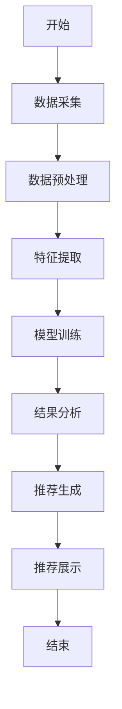

                 

# 第1章: 背景与概述

## 1.1 问题背景

### 1.1.1 AI Agent的基本概念

人工智能代理（AI Agent）是一种能够感知环境、理解用户需求并采取行动以实现目标的智能实体。它可以通过传感器获取数据，利用算法进行分析和决策，并通过执行器与环境互动。AI Agent的核心在于其智能性，它能够自主地解决问题并优化其行为。

### 1.1.2 智能餐桌的定义与特点

智能餐桌是一种结合了物联网技术、AI技术和大数据分析的智能化餐桌系统。它能够通过传感器和摄像头感知用户的用餐行为，并利用AI算法对这些行为进行分析，从而提供个性化的服务和建议。智能餐桌的特点包括：

1. **智能化**：通过AI算法实时分析用餐行为。
2. **数据驱动**：依赖大量的数据进行学习和优化。
3. **用户交互**：能够与用户进行实时互动，提供反馈和建议。
4. **个性化服务**：根据用户的行为和偏好提供定制化的服务。

### 1.1.3 用餐行为分析的必要性

在智能餐桌中，用餐行为分析是实现个性化服务和优化用户体验的核心任务。通过分析用户的用餐行为，可以了解用户的偏好、饮食习惯和健康状况，从而为用户提供更加贴心的服务。例如，AI Agent可以通过分析用户的用餐速度、食物偏好和饮食习惯，推荐适合用户的菜品或调整餐桌上食物的种类和数量。

## 1.2 问题描述

### 1.2.1 用餐行为分析的目标

用餐行为分析的目标是通过AI Agent对用户的用餐行为进行实时监测和分析，从而实现以下目标：

1. **个性化推荐**：根据用户的饮食习惯推荐适合的菜品。
2. **健康监测**：通过分析用户的饮食行为，评估其健康状况并提供建议。
3. **服务优化**：通过分析用餐行为，优化餐厅的服务流程和菜品推荐。

### 1.2.2 智能餐桌中的数据来源

智能餐桌的数据来源主要包括以下几个方面：

1. **传感器数据**：通过传感器获取用户的用餐行为数据，如用餐速度、餐具使用情况等。
2. **摄像头数据**：通过摄像头捕捉用户的面部表情和用餐姿势，分析用户的情绪和饮食习惯。
3. **用户输入**：用户可以通过智能餐桌上的触摸屏或语音输入自己的饮食偏好和健康状况。
4. **历史数据**：用户的用餐记录和历史数据，用于模型的训练和优化。

### 1.2.3 用户需求与场景分析

在智能餐桌中，用户的需求主要集中在以下几个方面：

1. **个性化推荐**：用户希望根据自己的口味和偏好，获得个性化的菜品推荐。
2. **健康监测**：用户希望了解自己的饮食健康状况，并获得改善饮食的建议。
3. **便捷服务**：用户希望获得便捷的用餐体验，如自动调整餐桌上食物的种类和数量。

## 1.3 问题解决

### 1.3.1 AI Agent在用餐行为分析中的作用

AI Agent在智能餐桌中的用餐行为分析中起着关键作用。它能够通过传感器和摄像头获取数据，并利用机器学习算法对这些数据进行分析和处理。AI Agent可以实时监测用户的用餐行为，识别用户的偏好和需求，并根据分析结果提供相应的服务和建议。

### 1.3.2 数据处理与分析的流程

数据处理与分析的流程主要包括以下几个步骤：

1. **数据采集**：通过传感器和摄像头采集用户的用餐行为数据。
2. **数据预处理**：对采集到的数据进行清洗和标准化处理，去除噪声和异常数据。
3. **特征提取**：从数据中提取有用的特征，如用餐速度、食物偏好等。
4. **模型训练**：利用机器学习算法对提取的特征进行建模和训练，得到一个能够预测用户行为的模型。
5. **结果分析**：通过模型预测用户的行为，并根据分析结果提供相应的服务和建议。

### 1.3.3 智能推荐系统的实现

智能推荐系统的实现主要包括以下几个步骤：

1. **数据采集与处理**：采集用户的用餐行为数据，并进行预处理和特征提取。
2. **模型训练**：利用机器学习算法训练一个推荐模型，如协同过滤、基于内容的推荐或深度学习模型。
3. **推荐生成**：根据模型预测结果生成个性化的推荐列表。
4. **推荐展示**：通过智能餐桌的交互界面将推荐结果展示给用户。

## 1.4 边界与外延

### 1.4.1 用餐行为分析的边界

用餐行为分析的边界主要集中在以下几个方面：

1. **数据范围**：仅限于用户的用餐行为数据，不涉及其他领域。
2. **应用场景**：仅限于智能餐桌环境，不涉及其他场景。
3. **服务范围**：仅限于提供用餐行为分析相关的服务，不涉及其他功能。

### 1.4.2 智能餐桌系统的外延

智能餐桌系统的外延主要包括以下几个方面：

1. **扩展功能**：除了用餐行为分析，还可以实现其他功能，如智能点餐、健康监测等。
2. **扩展场景**：智能餐桌技术可以应用于其他场景，如家庭用餐、酒店服务等。
3. **扩展数据源**：除了传感器和摄像头，还可以接入其他数据源，如用户的健康数据、饮食记录等。

### 1.4.3 相关领域的交叉与融合

智能餐桌系统涉及多个领域的技术，如人工智能、物联网、大数据分析等。这些领域的技术相互交叉和融合，共同推动智能餐桌系统的功能完善和服务优化。

## 1.5 概念结构与核心要素

### 1.5.1 AI Agent的核心要素

AI Agent的核心要素主要包括以下几个方面：

1. **感知模块**：通过传感器和摄像头感知环境和用户行为。
2. **推理模块**：利用算法对感知数据进行分析和推理。
3. **决策模块**：根据推理结果做出决策。
4. **执行模块**：通过执行器将决策结果转化为具体行动。

### 1.5.2 智能餐桌的系统架构

智能餐桌的系统架构主要包括以下几个模块：

1. **数据采集模块**：负责采集用户的用餐行为数据。
2. **行为分析模块**：对采集到的数据进行分析和处理，识别用户的偏好和需求。
3. **智能推荐模块**：根据分析结果生成个性化的推荐列表。
4. **交互界面模块**：通过智能餐桌的交互界面将推荐结果展示给用户。

### 1.5.3 用餐行为分析的流程图

---

## 总结

通过以上章节的分析，我们可以看到AI Agent在智能餐桌中的用餐行为分析是一个复杂而系统的工程。它不仅需要对AI Agent的核心原理有深入的理解，还需要对智能餐桌的系统架构和数据处理流程有清晰的认识。只有通过多领域的技术融合和系统的分析，才能实现智能化的用餐行为分析，为用户提供更加个性化和便捷的服务。

