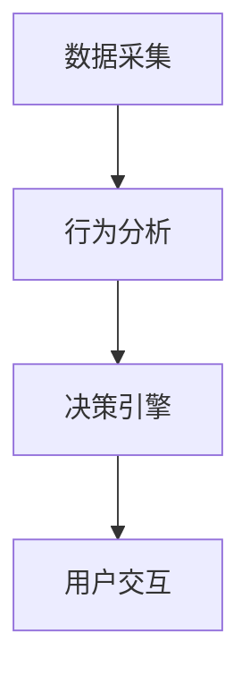
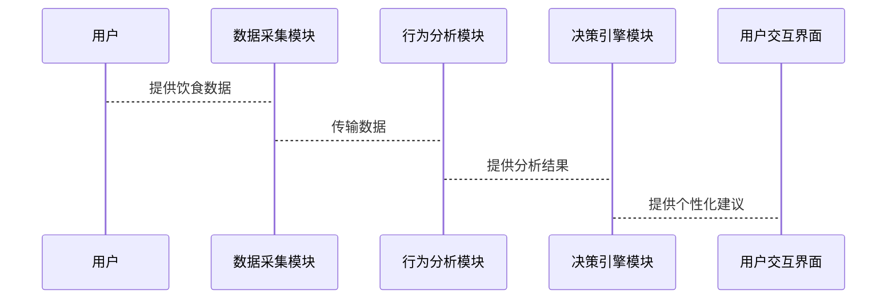

                 


# AI Agent在智能餐桌中的饮食行为矫正

## 关键词：AI Agent，智能餐桌，饮食行为矫正，人工智能，健康饮食，数据驱动，行为分析

## 摘要：
本文探讨了AI Agent在智能餐桌中的应用，通过分析用户的饮食行为，利用强化学习和机器学习算法，设计并实现了一个智能餐桌系统，帮助用户改善饮食习惯。文章详细介绍了系统的架构、算法原理和项目实现，为AI Agent在饮食行为矫正领域的应用提供了理论和实践参考。

---

# 第一部分: AI Agent在智能餐桌中的饮食行为矫正概述

## 第1章: 背景介绍

### 1.1 问题背景

#### 1.1.1 当前饮食行为的问题与挑战
现代人因生活方式的变化，饮食行为出现了诸多问题，如饮食不规律、营养失衡、暴饮暴食等，这些问题严重影响了人们的健康。AI Agent通过智能餐桌系统，实时分析用户的饮食行为，提供个性化的矫正建议。

#### 1.1.2 AI Agent在饮食行为矫正中的作用
AI Agent能够实时监测用户的饮食行为，利用强化学习和机器学习算法，提供个性化建议，帮助用户逐步矫正不良饮食习惯。

#### 1.1.3 智能餐桌的定义与应用场景
智能餐桌是一种结合AI技术的餐桌系统，能够通过传感器和摄像头采集用户的饮食数据，结合AI算法，提供智能化的饮食管理服务。

### 1.2 问题描述

#### 1.2.1 饮食行为矫正的核心目标
通过AI Agent的帮助，改善用户的饮食习惯，使其符合健康饮食标准。

#### 1.2.2 智能餐桌系统的功能需求
智能餐桌系统需要具备数据采集、行为分析、个性化建议等功能。

#### 1.2.3 用户行为分析与数据采集
系统通过传感器和摄像头采集用户的饮食数据，分析用户的饮食行为，包括饮食时间、饮食量、饮食种类等。

### 1.3 问题解决

#### 1.3.1 AI Agent在饮食行为矫正中的解决方案
AI Agent通过实时监测用户的饮食行为，提供个性化建议，帮助用户逐步矫正不良饮食习惯。

#### 1.3.2 智能餐桌系统的实现路径
系统通过数据采集、行为分析、决策引擎等模块，实现饮食行为的智能化管理。

#### 1.3.3 系统边界与外延
系统边界包括数据采集模块、行为分析模块、决策引擎模块等，外延则包括与用户的交互界面和数据存储模块。

### 1.4 概念结构与核心要素

#### 1.4.1 AI Agent的定义与核心要素
AI Agent是一种能够感知环境、做出决策并执行操作的智能体，具备学习能力、决策能力和交互能力。

#### 1.4.2 智能餐桌系统的构成要素
智能餐桌系统包括数据采集模块、行为分析模块、决策引擎模块、用户交互界面等。

#### 1.4.3 饮食行为矫正的实现机制
通过AI Agent实时监测用户的饮食行为，分析数据，提供个性化建议，逐步矫正用户的饮食习惯。

---

## 第2章: 核心概念与联系

### 2.1 AI Agent的核心原理

#### 2.1.1 AI Agent的基本概念
AI Agent是一种能够感知环境、做出决策并执行操作的智能体，具备学习能力、决策能力和交互能力。

#### 2.1.2 AI Agent的分类与特点
AI Agent可以分为基于规则的代理和基于学习的代理，具备自主性、反应性、目标导向性等特点。

#### 2.1.3 AI Agent在智能餐桌中的应用
AI Agent通过实时监测用户的饮食行为，分析数据，提供个性化建议，帮助用户矫正饮食习惯。

### 2.2 饮食行为分析的核心原理

#### 2.2.1 饮食行为的定义与分类
饮食行为是指人们在日常生活中的饮食习惯，包括饮食时间、饮食量、饮食种类等。

#### 2.2.2 饮食行为分析的方法与工具
通过传感器和摄像头采集数据，利用机器学习算法进行分析，识别用户的饮食行为模式。

#### 2.2.3 数据采集与特征提取
系统通过传感器和摄像头采集用户的饮食数据，提取特征，包括饮食时间、饮食量、饮食种类等。

### 2.3 AI Agent与饮食行为矫正的联系

#### 2.3.1 AI Agent在饮食行为矫正中的角色
AI Agent通过实时监测用户的饮食行为，分析数据，提供个性化建议，帮助用户矫正饮食习惯。

#### 2.3.2 数据流与信息交互机制
系统通过传感器和摄像头采集数据，AI Agent分析数据，提供个性化建议，与用户进行交互。

#### 2.3.3 系统架构与功能模块
智能餐桌系统包括数据采集模块、行为分析模块、决策引擎模块、用户交互界面等。

### 2.4 核心概念对比表格

| 概念 | 定义 | 属性 | 关系 |
|------|------|------|------|
| AI Agent | 人工智能代理 | 学习能力、决策能力、交互能力 | 数据输入、行为输出 |
| 饮食行为 | 用户饮食习惯 | 时间、量、种类 | 数据采集、分析、反馈 |

### 2.5 ER实体关系图

```mermaid
erd
    节点: AI Agent
    节点: 饮食行为
    节点: 用户
    

    AI Agent --> 饮食行为: 分析
    饮食行为 --> 用户: 监测
```

---

## 第3章: 算法原理

### 3.1 强化学习算法

#### 3.1.1 Q-Learning算法
Q-Learning是一种基于值的强化学习算法，通过状态-动作-奖励的机制，更新Q值表，实现最优决策。

#### 3.1.2 算法实现步骤
1. 初始化Q值表。
2. 状态感知。
3. 动作选择。
4. 奖励获取。
5. Q值更新。

#### 3.1.3 算法伪代码
```python
def q_learning():
    初始化 Q 表
    while True:
        状态 s = 环境感知()
        动作 a = 选择动作(s)
        奖励 r = 执行动作 a 并获得奖励
        更新 Q 表: Q[s][a] = Q[s][a] + α*(r + γ*max(Q[s']))
    end
end
```

#### 3.1.4 数学公式
强化学习的数学模型如下：
$$ Q(s, a) = Q(s, a) + \alpha [r + \gamma \max Q(s', a')] $$

### 3.2 机器学习算法

#### 3.2.1 线性回归
线性回归是一种简单的回归算法，适用于预测连续型变量。

#### 3.2.2 支持向量机
支持向量机是一种分类算法，适用于分类问题。

#### 3.2.3 神经网络
神经网络是一种深度学习算法，适用于复杂的模式识别问题。

### 3.3 算法选择与优化

#### 3.3.1 算法选择
根据具体问题选择合适的算法，如Q-Learning用于实时决策，线性回归用于预测。

#### 3.3.2 算法优化
通过调整学习率、折扣因子等参数，优化算法性能。

#### 3.3.3 算法实现
使用Python编写算法代码，结合TensorFlow或PyTorch进行训练和优化。

---

## 第4章: 系统分析与架构设计

### 4.1 系统架构设计

#### 4.1.1 模块划分
智能餐桌系统包括数据采集模块、行为分析模块、决策引擎模块、用户交互界面等。

#### 4.1.2 模块功能描述
- 数据采集模块：采集用户的饮食数据。
- 行为分析模块：分析用户的饮食行为。
- 决策引擎模块：提供个性化建议。
- 用户交互界面：与用户进行交互。

#### 4.1.3 系统架构图


### 4.2 系统功能设计

#### 4.2.1 数据采集模块
通过传感器和摄像头采集用户的饮食数据。

#### 4.2.2 行为分析模块
分析用户的饮食行为，识别不良习惯。

#### 4.2.3 决策引擎模块
根据分析结果，提供个性化建议。

### 4.3 系统接口设计

#### 4.3.1 数据接口
系统需要与传感器和摄像头进行数据交互。

#### 4.3.2 用户接口
系统需要与用户进行交互，提供个性化建议。

### 4.4 系统交互流程图



---

## 第5章: 项目实战

### 5.1 环境安装

#### 5.1.1 系统需求
安装Python、TensorFlow、OpenCV等依赖库。

#### 5.1.2 环境配置
配置开发环境，安装必要的工具和库。

### 5.2 核心代码实现

#### 5.2.1 数据采集模块
```python
import cv2

def capture_image():
    cap = cv2.VideoCapture(0)
    ret, frame = cap.read()
    if ret:
        cv2.imwrite("image.jpg", frame)
    cap.release()
```

#### 5.2.2 行为分析模块
```python
import tensorflow as tf

model = tf.keras.models.load_model("behavior_model.h5")
def analyze_behavior(image):
    prediction = model.predict(image)
    return prediction
```

#### 5.2.3 决策引擎模块
```python
def provide_recommendation():
    # 根据分析结果提供个性化建议
    pass
```

### 5.3 实际案例分析

#### 5.3.1 案例背景
某用户饮食不规律，经常暴饮暴食，系统通过实时监测，提供个性化的饮食建议。

#### 5.3.2 实施过程
系统采集用户的饮食数据，分析行为，提供矫正建议。

#### 5.3.3 案例结果
用户的饮食习惯得到改善，健康状况有所提升。

---

## 第6章: 最佳实践

### 6.1 经验总结

#### 6.1.1 算法选择的重要性
选择合适的算法能够显著提高系统的性能。

#### 6.1.2 系统架构设计的关键性
合理的系统架构设计能够提高系统的可扩展性和可维护性。

### 6.2 小结

#### 6.2.1 项目总结
通过AI Agent和智能餐桌系统的结合，能够有效改善用户的饮食行为。

#### 6.2.2 项目意义
为AI技术在健康领域的应用提供了新的思路。

### 6.3 注意事项

#### 6.3.1 数据隐私问题
系统的数据采集和处理需要严格遵守数据隐私保护规定。

#### 6.3.2 系统稳定性
系统的稳定性直接影响用户体验，需要进行充分的测试和优化。

### 6.4 拓展阅读

#### 6.4.1 相关技术领域
推荐阅读强化学习、机器学习、人工智能等领域的新技术和发展趋势。

#### 6.4.2 应用场景扩展
AI Agent在其他健康领域的应用，如运动行为矫正、心理健康管理等。

---

## 附录

### 附录A: 参考文献
1. [1] 强化学习相关文献
2. [2] 机器学习相关文献
3. [3] 智能系统设计相关文献

### 附录B: 工具推荐
1. Python编程语言
2. TensorFlow或PyTorch框架
3. OpenCV图像处理库

---

以上是《AI Agent在智能餐桌中的饮食行为矫正》的技术博客文章目录大纲和具体内容。

