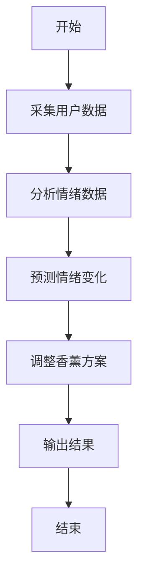
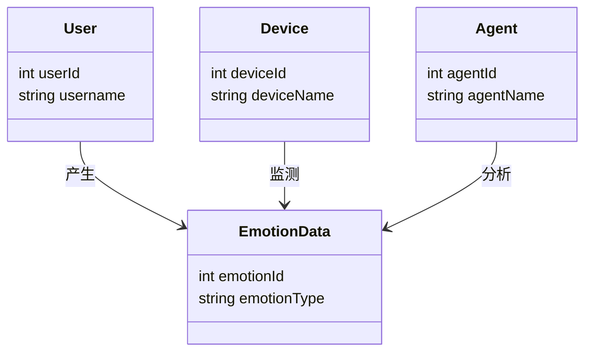
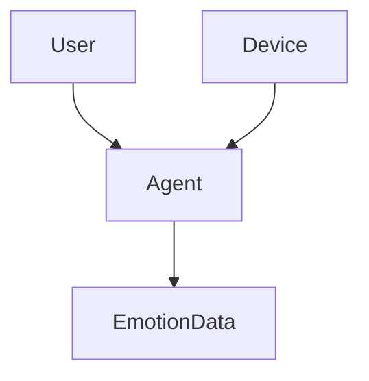

                 


# AI Agent在智能香薰机中的情绪管理助手

## 关键词：智能香薰机、AI Agent、情绪管理、用户行为分析、机器学习算法、系统架构设计、交互设计

## 摘要：  
本文探讨了AI Agent在智能香薰机中的情绪管理应用。通过分析用户的行为和生理数据，AI Agent能够实时调整香薰方案，从而提升用户的情绪状态。文章详细介绍了情绪识别算法、预测模型、系统架构设计以及实际案例，展示了AI技术在智能设备中的巨大潜力。

---

# 第1章: 情绪管理与智能香薰机的背景介绍

## 1.1 情绪管理的定义与重要性  
### 1.1.1 情绪管理的核心概念  
情绪管理是指通过识别、分析和调节个体的情绪状态，以达到优化心理健康和提升生活质量的目的。  

### 1.1.2 情绪管理在智能设备中的应用  
现代智能设备（如手机、可穿戴设备、智能家居）通过传感器和算法，能够实时监测用户的情绪状态，并提供相应的反馈或干预。  

### 1.1.3 情绪管理对用户生活质量的提升  
情绪管理能够帮助用户缓解压力、提升幸福感，并在工作和生活中表现得更加高效和积极。  

## 1.2 智能香薰机的定义与功能  
### 1.2.1 智能香薰机的基本功能  
智能香薰机是一种通过加热和扩散精油来释放香气的设备，能够帮助用户放松心情、缓解压力。  

### 1.2.2 智能香薰机的智能化发展趋势  
现代智能香薰机可以通过AI技术实现自动化操作、个性化推荐和远程控制。  

### 1.2.3 智能香薰机与用户情绪的关系  
香薰机通过释放特定香气影响用户情绪，而AI Agent可以通过分析用户情绪状态，自动调整香薰方案。  

---

# 第2章: AI Agent的核心概念与情绪管理的联系

## 2.1 AI Agent的核心原理  
### 2.1.1 AI Agent的基本原理  
AI Agent是一种能够感知环境、自主决策并执行任务的智能体。它通过传感器获取数据，利用算法进行分析和推理，从而做出最优决策。  

### 2.1.2 AI Agent的感知与决策机制  
AI Agent通过多模态数据（如语音、表情、行为）感知用户情绪，并结合预设规则和机器学习模型进行决策。  

### 2.1.3 AI Agent的学习与优化能力  
AI Agent能够通过强化学习和反馈机制不断优化自身的预测和干预策略。  

## 2.2 情绪管理的核心要素  
### 2.2.1 情绪识别与分析  
情绪识别是情绪管理的第一步，包括语音识别、面部表情分析和行为分析。  

### 2.2.2 情绪预测与干预  
通过机器学习模型，AI Agent可以预测用户的情绪变化，并提供相应的干预措施（如调整香薰方案）。  

### 2.2.3 情绪数据的采集与处理  
情绪数据的采集需要多模态传感器和数据融合技术，而数据处理则涉及特征提取和数据清洗。  

## 2.3 AI Agent与情绪管理的系统架构  
### 2.3.1 系统实体关系图（ER图）  
以下是系统实体关系图：  
```mermaid
erDiagram
    user {
        int userId
        string username
    }
    device {
        int deviceId
        string deviceName
    }
    agent {
        int agentId
        string agentName
    }
    emotionData {
        int emotionId
        string emotionType
    }
    user->emotionData: 产生
    device->emotionData: 监测
    agent->emotionData: 分析
```

### 2.3.2 系统功能模块划分  
系统功能模块包括：  
1. 情绪识别模块：负责采集和分析用户情绪数据。  
2. 情绪预测模块：基于历史数据预测未来情绪变化。  
3. 情绪干预模块：根据预测结果调整香薰方案。  

### 2.3.3 系统核心算法流程图  
以下是系统核心算法流程图：  


---

# 第3章: AI Agent在情绪管理中的算法原理

## 3.1 情绪识别算法  
### 3.1.1 基于语音识别的情绪识别  
通过分析用户的语音语调和语速，识别其情绪状态。  

### 3.1.2 基于面部表情的情绪识别  
利用计算机视觉技术，分析用户的面部表情，判断其情绪。  

### 3.1.3 基于用户行为的情绪识别  
通过分析用户的动作和行为模式，推断其情绪状态。  

## 3.2 情绪预测与干计算法  
### 3.2.1 基于机器学习的情绪预测模型  
使用支持向量机（SVM）或随机森林（RF）模型，预测用户的情绪变化。  

### 3.2.2 基于深度学习的情绪干预策略  
通过神经网络（如LSTM）模型，优化情绪干预策略。  

### 3.2.3 情绪预测与干预的优化算法  
使用强化学习（如Q-learning）优化情绪干预的实时性与效果。  

## 3.3 算法实现的数学模型  
### 3.3.1 情绪识别的分类模型  
支持向量机（SVM）分类模型：  
$$ y = \text{sign}(w \cdot x + b) $$  

### 3.3.2 情绪预测的回归模型  
线性回归模型：  
$$ y = \beta_0 + \beta_1 x_1 + \beta_2 x_2 + \ldots + \beta_n x_n $$  

### 3.3.3 情绪干预的强化学习模型  
Q-learning算法：  
$$ Q(s, a) = Q(s, a) + \alpha [r + \max_{a'} Q(s', a') - Q(s, a)] $$  

---

# 第4章: 系统分析与架构设计方案

## 4.1 问题场景介绍  
用户情绪波动的识别需求和情绪干预的实时性要求是系统设计的核心问题。  

## 4.2 系统功能设计  
### 4.2.1 领域模型类图  
以下是领域模型类图：  


### 4.2.2 系统功能模块划分  
系统功能模块包括：  
1. 用户界面：供用户控制香薰机和查看情绪分析结果。  
2. 数据采集模块：采集用户的语音、表情和行为数据。  
3. 数据处理模块：对采集的数据进行清洗和特征提取。  
4. 情绪分析模块：基于机器学习模型分析用户情绪。  
5. 情绪干预模块：根据分析结果调整香薰方案。  

### 4.2.3 系统功能流程图  
以下是系统功能流程图：  


## 4.3 系统架构设计  
### 4.3.1 系统架构图  
以下是系统架构图：  


### 4.3.2 系统组件之间的交互关系  
用户与香薰机交互，香薰机通过AI Agent分析用户情绪，并根据结果调整香薰方案。  

### 4.3.3 系统接口设计  
系统接口包括：  
1. 用户与香薰机的交互接口。  
2. AI Agent与香薰机的数据通信接口。  
3. 系统与用户数据库的接口。  

---

# 第5章: 项目实战

## 5.1 环境安装  
### 5.1.1 安装Python  
```bash
python --version
pip install --upgrade pip
```

### 5.1.2 安装机器学习库  
```bash
pip install numpy
pip install scikit-learn
pip install tensorflow
```

## 5.2 系统核心实现源代码  
### 5.2.1 数据预处理代码  
```python
import numpy as np
from sklearn.preprocessing import StandardScaler

# 数据预处理
data = np.array([[1, 2, 3], [4, 5, 6], [7, 8, 9]])
scaler = StandardScaler()
scaled_data = scaler.fit_transform(data)
print(scaled_data)
```

### 5.2.2 模型训练代码  
```python
from sklearn.svm import SVC
from sklearn.model_selection import train_test_split
from sklearn.metrics import accuracy_score

# 数据分割
X_train, X_test, y_train, y_test = train_test_split(scaled_data, [0, 1, 0], test_size=0.3)

# 模型训练
model = SVC()
model.fit(X_train, y_train)

# 模型预测
y_pred = model.predict(X_test)
print("准确率:", accuracy_score(y_test, y_pred))
```

## 5.3 代码应用解读与分析  
上述代码展示了如何使用支持向量机（SVM）进行情绪分类。数据预处理部分对特征进行了标准化，模型训练部分使用训练数据进行分类器训练，最后通过测试数据验证模型的准确性。  

## 5.4 实际案例分析  
假设用户在使用香薰机时表现出焦虑情绪，AI Agent会通过语音识别和面部表情分析确认其情绪状态，并调整香薰机的香薰方案，选择适合放松的精油组合。  

## 5.5 项目小结  
通过项目实战，我们展示了AI Agent在智能香薰机中的实际应用，验证了算法的有效性和系统的可行性。

---

# 第6章: 数学模型

## 6.1 分类模型  
支持向量机（SVM）分类模型：  
$$ y = \text{sign}(w \cdot x + b) $$  

## 6.2 回归模型  
线性回归模型：  
$$ y = \beta_0 + \beta_1 x_1 + \beta_2 x_2 + \ldots + \beta_n x_n $$  

## 6.3 强化学习模型  
Q-learning算法：  
$$ Q(s, a) = Q(s, a) + \alpha [r + \max_{a'} Q(s', a') - Q(s, a)] $$  

---

# 第7章: 小结

## 7.1 总结  
AI Agent在智能香薰机中的情绪管理应用，通过实时分析用户情绪数据，优化香薰方案，显著提升了用户体验。  

## 7.2 最佳实践 tips  
1. 确保数据隐私和安全。  
2. 定期优化算法模型。  
3. 提供用户友好的交互界面。  

## 7.3 拓展阅读  
建议深入学习强化学习和深度学习的相关知识，了解更复杂的AI算法在智能设备中的应用。

---

通过以上内容，我们详细探讨了AI Agent在智能香薰机中的情绪管理应用，从理论到实践，从算法到系统设计，为读者提供了一个全面的视角。

