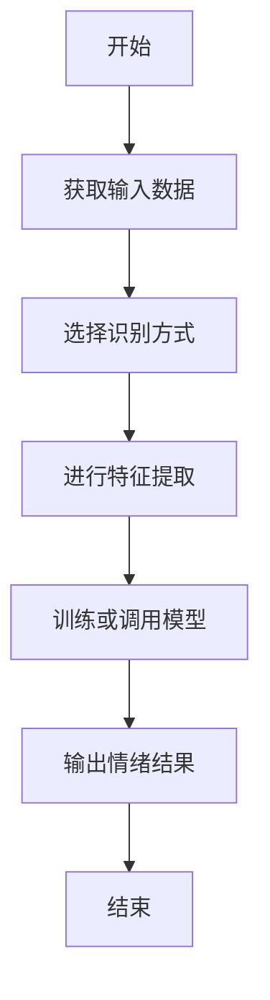
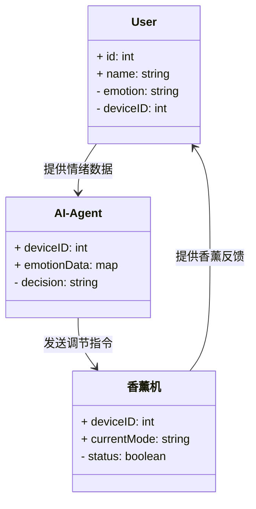
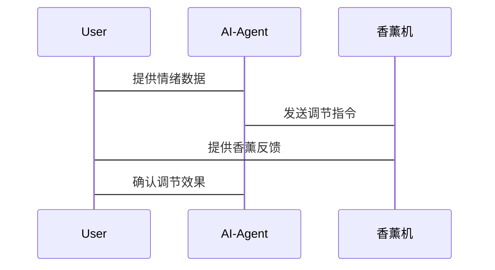

                 


# AI Agent在智能香薰机中的情绪调节功能

> 关键词：AI Agent，智能香薰机，情绪调节，机器学习，算法实现

> 摘要：本文探讨了AI Agent在智能香薰机中的情绪调节功能，从背景、原理、算法到系统设计和项目实战，详细分析了如何通过AI技术实现情绪调节，并优化了用户的生活质量。

---

## 第1章: 情绪调节的背景与问题描述

### 1.1 情绪调节的必要性

#### 1.1.1 现代人的情绪压力现状
现代人面临的工作压力、生活压力日益增加，情绪问题逐渐成为影响生活质量的重要因素。根据世界卫生组织的数据，全球有超过10亿人受到心理健康问题的影响，而情绪调节是缓解这些问题的重要手段之一。

#### 1.1.2 情绪调节在健康生活中的作用
情绪调节不仅有助于缓解压力，还能提高免疫力、改善睡眠质量，甚至影响人际关系和工作效率。通过科学的方法调节情绪，可以显著提升个人的幸福感和生活质量。

#### 1.1.3 智能设备在情绪调节中的潜力
随着科技的发展，智能设备在情绪调节中的应用越来越广泛。通过传感器、AI算法等技术手段，智能设备可以实时监测用户的情绪状态，并提供个性化的调节方案。

### 1.2 智能香薰机的定义与功能

#### 1.2.1 香薰机的基本原理
香薰机通过雾化技术将精油分子释放到空气中，利用嗅觉系统影响人的情绪状态。不同种类的精油具有不同的作用，例如薰衣草有助于放松，薄荷可以提神。

#### 1.2.2 智能香薰机的核心功能
智能香薰机结合了物联网技术，能够通过手机APP远程控制，定时开关，调节雾化强度，并通过内置传感器检测空气质量，自动调整香薰的释放量。

#### 1.2.3 香薰与情绪调节的科学依据
研究表明，香薰可以通过影响大脑的神经递质和激素分泌来调节情绪。例如，薰衣草精油可以促进 serotonin 的分泌，从而缓解焦虑和压力。

### 1.3 AI Agent在智能设备中的应用

#### 1.3.1 AI Agent的基本概念
AI Agent是一种智能代理，能够感知环境、理解用户需求，并通过决策和执行来实现目标。在智能设备中，AI Agent通常用于提供个性化服务、自动化控制和实时反馈。

#### 1.3.2 AI Agent在智能家居中的作用
在智能家居中，AI Agent可以作为中枢系统，协调各种设备的工作。例如，AI Agent可以根据用户的作息习惯，自动调节室内温度、灯光和香薰，营造舒适的居住环境。

#### 1.3.3 情绪调节中的AI Agent潜力
AI Agent可以通过分析用户的语音、面部表情和生理数据，准确识别情绪状态，并通过智能香薰机等设备，提供个性化的调节方案。这种智能化的情绪调节方式，将极大地提升用户体验。

---

## 第2章: 情绪调节的核心概念与联系

### 2.1 AI Agent与情绪调节的原理

#### 2.1.1 情绪识别的基本原理
情绪识别主要通过分析用户的语音、面部表情和生理数据。例如，通过语音分析可以识别情绪中的语调、语速和停顿频率；通过面部表情分析可以识别笑容、皱眉等表情特征。

#### 2.1.2 AI Agent在情绪调节中的作用机制
AI Agent通过实时监测用户的情绪状态，分析当前情绪，并根据预设的规则或机器学习模型，决定采取何种调节措施。例如，当检测到用户处于焦虑状态时，AI Agent可以启动香薰机释放 calming 精油。

#### 2.1.3 情绪调节的核心要素
情绪调节的核心要素包括情绪识别、情绪分析、调节方案制定和效果反馈。这些要素需要通过AI技术实现自动化和智能化。

### 2.2 情绪调节与香薰机的实体关系

#### 2.2.1 用户、AI Agent和香薰机的实体关系
用户通过与AI Agent交互，触发香薰机的调节功能。AI Agent作为中介，负责接收用户的输入、分析情绪并控制香薰机的工作状态。

#### 2.2.2 情绪数据与香薰机的交互流程
用户的情绪数据（如心率、皮肤温度、面部表情）通过传感器收集，传输到AI Agent进行分析。AI Agent根据分析结果，向香薰机发送指令，调整香薰的释放量和种类。

#### 2.2.3 实体关系的ER图展示
```mermaid
erDiagram
    user}-----{aiAgent : "用户与AI Agent交互"
    aiAgent}-----{airPurifier : "AI Agent控制香薰机"
    user}-----{airPurifier : "用户通过手机APP控制香薰机"
    user}-----{sensor : "用户情绪数据采集"
    sensor}-----{aiAgent : "传感器数据传输到AI Agent"
```

### 2.3 情绪调节的核心算法原理

#### 2.3.1 情绪识别算法的流程图


#### 2.3.2 基于机器学习的情绪分类模型
常用的情绪分类模型包括支持向量机（SVM）和随机森林（Random Forest）。以下是基于SVM的情绪分类流程：

1. 数据预处理：将语音、面部表情等数据标准化。
2. 特征提取：提取情绪相关的特征，如语音的声调、面部的微笑频率。
3. 模型训练：使用训练数据训练SVM模型。
4. 情绪分类：输入待测数据，通过SVM模型分类情绪类别。

#### 2.3.3 算法实现的数学模型与公式
情绪分类中的SVM模型可以表示为：
$$
y = \text{sign}(\sum_{i=1}^{n} \alpha_i y_i e_i \cdot x + b)
$$
其中，$\alpha_i$是拉格朗日乘子，$y_i$是训练样本的标签，$e_i$是对应的特征向量，$x$是待测样本，$b$是偏置项。

---

## 第3章: 情绪调节算法的数学模型与实现

### 3.1 情绪识别的数学模型

#### 3.1.1 基于语音的情绪识别模型
语音情绪识别可以基于Mel-Frequency Cepstral Coefficients（MFCC）特征提取，然后通过机器学习模型进行分类。MFCC提取过程如下：

1. 将语音信号转换为频谱图。
2. 对频谱图进行梅尔过滤器处理。
3. 计算Cepstral系数。

#### 3.1.2 基于面部表情的情绪识别模型
面部表情识别通常使用OpenCV库，通过Haar特征提取和SVM分类实现。特征提取过程如下：

1. 检测面部区域。
2. 提取Haar特征。
3. 进行表情分类。

#### 3.1.3 情绪分类的数学公式
在SVM分类中，决策函数为：
$$
f(x) = \sum_{i=1}^{n} \alpha_i y_i (x_i \cdot x + b) \geq 0
$$

### 3.2 AI Agent的决策算法

#### 3.2.1 基于强化学习的决策模型
强化学习通过奖励机制优化决策策略。例如，当用户情绪改善时，给予正向奖励，增强AI Agent的决策行为。

#### 3.2.2 决策树算法在情绪调节中的应用
决策树通过特征选择和分裂规则，将情绪调节策略分解为多个条件分支。例如，当情绪为焦虑时，选择释放薰衣草精油；当情绪为愤怒时，选择释放洋甘菊精油。

#### 3.2.3 决策算法的数学模型
决策树的分裂规则通常基于信息增益：
$$
\text{信息增益}(D, A) = H(D) - H(D|A)
$$
其中，$H(D)$是数据集$D$的熵，$H(D|A)$是在给定特征$A$的条件下，数据集$D$的熵。

---

## 第4章: 系统分析与架构设计

### 4.1 问题场景介绍

智能香薰机与AI Agent的结合，旨在通过实时情绪监测，自动调节香薰释放量和种类，帮助用户缓解情绪压力。

### 4.2 项目介绍

本项目旨在开发一款集成AI Agent的智能香薰机，实现情绪监测与香薰调节的自动化。

### 4.3 系统功能设计

#### 4.3.1 领域模型（Mermaid类图）


### 4.4 系统架构设计

#### 4.4.1 系统架构图（Mermaid架构图）


### 4.5 系统接口设计

#### 4.5.1 用户与AI Agent的接口
用户通过手机APP与AI Agent交互，发送情绪数据或接收调节建议。

#### 4.5.2 AI Agent与香薰机的接口
AI Agent通过Wi-Fi或蓝牙与香薰机通信，发送调节指令或接收设备状态反馈。

### 4.6 系统交互设计（Mermaid序列图）



---

## 第5章: 项目实战

### 5.1 环境安装

#### 5.1.1 开发环境
- 操作系统：Windows 10或macOS
- 开发工具：Python 3.8以上版本、Jupyter Notebook
- 依赖库：numpy, scikit-learn, opencv-python, pyserial

### 5.2 系统核心实现源代码

#### 5.2.1 情绪识别模块

```python
import numpy as np
from sklearn import svm

# 数据预处理
def preprocess(data):
    # 标准化数据
    return (data - np.mean(data)) / np.std(data)

# 特征提取
def extract_features(audio):
    # 提取MFCC特征
    pass

# 情绪分类
def classify_emotion(features):
    model = svm.SVC()
    model.fit(preprocessed_train_data, train_labels)
    return model.predict(features)
```

#### 5.2.2 AI Agent控制模块

```python
import serial

# 连接香薰机
ser = serial.Serial('COM3', 9600)

# 发送指令
def send_command(command):
    ser.write(command.encode())
```

### 5.3 代码应用解读与分析

#### 5.3.1 情绪识别模块
- 数据预处理：对输入数据进行标准化，消除量纲影响。
- 特征提取：提取与情绪相关的特征，如MFCC特征。
- 情绪分类：使用SVM模型进行分类，输出情绪类别。

#### 5.3.2 AI Agent控制模块
- 串口通信：通过串口与香薰机连接，实现指令的发送与接收。
- 指令发送：根据AI Agent的决策，发送相应的控制指令，如启动、停止或调节香薰浓度。

### 5.4 实际案例分析

#### 5.4.1 案例场景
- 用户情绪监测：通过传感器获取用户的情绪数据。
- AI Agent决策：根据情绪数据，选择合适的香薰调节方案。
- 调节效果反馈：香薰机执行调节指令，并反馈调节效果。

### 5.5 项目小结

本项目通过AI Agent实现了智能香薰机的情绪调节功能，验证了AI技术在情绪调节中的应用潜力。

---

## 第6章: 小结与注意事项

### 6.1 小结

本文详细介绍了AI Agent在智能香薰机中的情绪调节功能，从背景、原理到系统设计和项目实战，全面分析了实现过程。

### 6.2 注意事项

- 数据隐私：在处理用户情绪数据时，需注意数据隐私保护。
- 系统稳定性：确保AI Agent与香薰机的通信稳定，避免调节失败。
- 适用场景：目前主要适用于情绪调节，未来可扩展到更多场景。

### 6.3 拓展阅读

- 《机器学习实战》
- 《深度学习入门：基于Python的CNN实现》
- 《自然语言处理：从基础到进阶》

---

通过以上步骤，我们可以看到AI Agent在智能香薰机中的情绪调节功能具有广阔的应用前景。未来，随着AI技术的不断发展，智能香薰机将更加智能化，为用户带来更好的生活体验。

