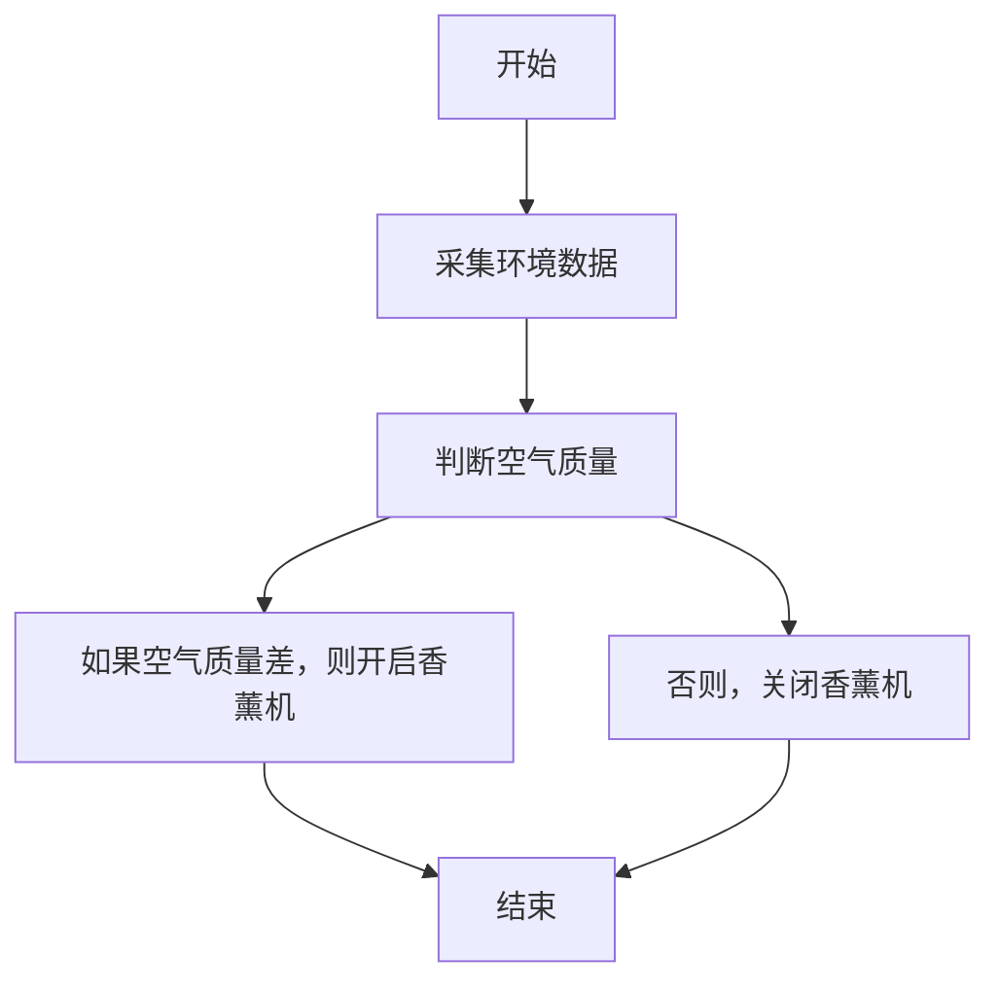
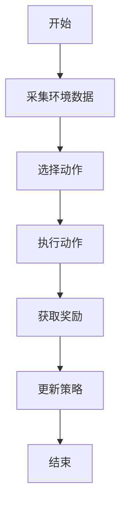
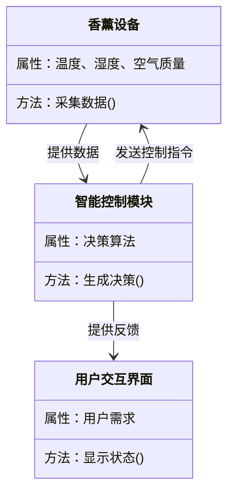
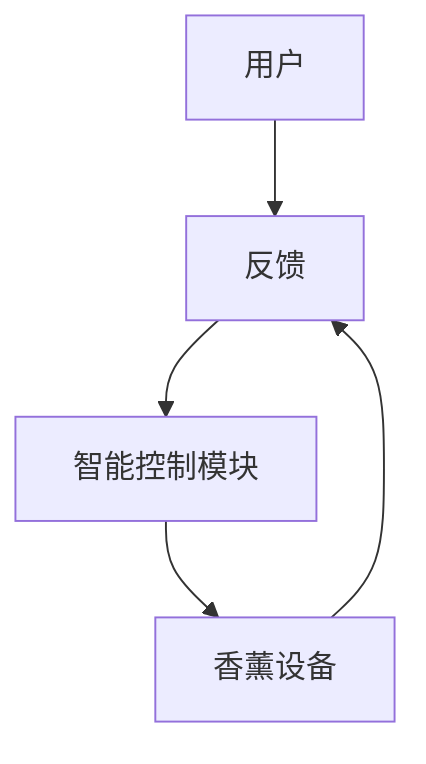
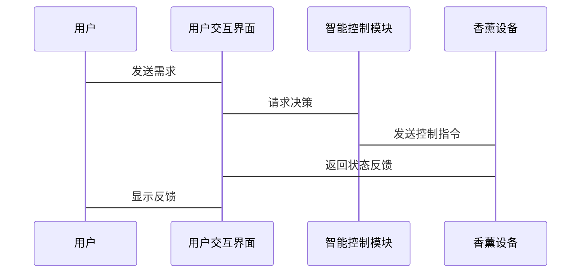

                 


# AI Agent在智能香薰系统中的工作效率提升

---

## 关键词：
AI Agent、智能香薰系统、效率提升、自动化控制、数据分析、用户体验、人工智能

---

## 摘要：
AI Agent（人工智能代理）在智能香薰系统中的应用，通过自动化控制、数据分析和优化用户体验，显著提升了系统的效率和用户满意度。本文将详细探讨AI Agent的核心概念、算法原理、系统架构设计以及实际应用案例，展示如何通过AI技术优化智能香薰系统的工作效率。

---

## 第一部分: AI Agent与智能香薰系统概述

## 第1章: AI Agent的基本概念与背景

### 1.1 AI Agent的定义与特点
#### 1.1.1 AI Agent的定义
AI Agent（人工智能代理）是指能够感知环境、做出决策并执行动作的智能实体。它通过传感器获取信息，利用算法进行分析和判断，并通过执行器与环境交互。

#### 1.1.2 AI Agent的核心特点
1. **自主性**：AI Agent能够自主决策，无需人工干预。
2. **反应性**：能够实时感知环境变化并做出响应。
3. **学习能力**：通过机器学习算法不断优化自身的决策能力。
4. **协作性**：能够与其他系统或用户协同工作。

#### 1.1.3 AI Agent与传统控制系统的区别
| 特性 | AI Agent | 传统控制系统 |
|------|-----------|---------------|
| 决策方式 | 基于机器学习和数据驱动 | 基于预设规则和逻辑 |
| 灵活性 | 高，能够适应环境变化 | 较低，依赖固定规则 |
| 学习能力 | 具备自适应学习能力 | 无学习能力 |

### 1.2 智能香薰系统的背景
#### 1.2.1 香薰系统的功能与应用
香薰系统主要用于通过释放香薰剂来改善空气质量、提升用户舒适度和情绪。传统香薰系统通常基于定时开关，无法根据环境变化自动调节。

#### 1.2.2 智能香薰系统的概念
智能香薰系统是一种结合了物联网（IoT）和人工智能技术的香薰设备，能够通过传感器实时感知环境数据，并利用AI算法优化香薰剂的释放量和时间。

#### 1.2.3 智能香薰系统的应用场景
1. **家庭环境**：提升居住舒适度，改善空气质量。
2. **办公场所**：缓解工作压力，提高员工效率。
3. **酒店和康养中心**：提升用户体验，促进健康。

### 1.3 AI Agent在智能香薰系统中的应用背景
#### 1.3.1 香薰系统效率提升的需求
传统香薰系统存在效率低、能耗高、用户体验差等问题，亟需通过智能化手段进行优化。

#### 1.3.2 AI Agent在香薰系统中的潜在价值
AI Agent可以通过实时数据分析和优化，实现香薰剂的精准释放，降低能耗，提升用户体验。

#### 1.3.3 当前香薰系统效率提升的挑战
1. **环境数据的实时采集与处理**：需要高精度的传感器和高效的算法。
2. **用户需求的多样性**：不同用户对香薰的需求差异较大，需要个性化的解决方案。
3. **系统的稳定性和安全性**：需要确保系统在复杂环境下的稳定运行。

---

## 第2章: AI Agent与智能香薰系统的概念结构

### 2.1 AI Agent的核心要素
#### 2.1.1 感知模块
AI Agent通过传感器感知环境数据，如温度、湿度、空气质量等。

#### 2.1.2 决策模块
基于感知数据和历史数据，利用机器学习算法生成决策。

#### 2.1.3 执行模块
根据决策结果，通过执行器调整香薰剂的释放量和时间。

### 2.2 智能香薰系统的组成部分
#### 2.2.1 香薰设备
包括香薰机、传感器、执行器等硬件设备。

#### 2.2.2 智能控制模块
AI Agent的核心部分，负责数据处理、决策生成和系统控制。

#### 2.2.3 用户交互界面
用户可以通过手机APP或Web界面与系统进行交互，查看系统状态和使用情况。

### 2.3 AI Agent在智能香薰系统中的角色与作用
#### 2.3.1 自动化控制
AI Agent可以根据环境数据和用户需求，自动调整香薰剂的释放量和时间。

#### 2.3.2 数据分析与优化
通过收集和分析大量数据，AI Agent可以优化香薰系统的运行效率，降低能耗。

#### 2.3.3 用户体验提升
AI Agent可以通过个性化推荐和实时反馈，提升用户的使用体验。

---

## 第3章: AI Agent在智能香薰系统中的核心概念与联系

### 3.1 AI Agent的感知机制
#### 3.1.1 数据采集与处理
AI Agent通过传感器采集环境数据，如温度、湿度、空气质量等。

#### 3.1.2 环境感知模型
构建环境感知模型，利用机器学习算法对数据进行分析和预测。

#### 3.1.3 数据分析与决策
结合历史数据和实时数据，生成最优决策。

### 3.2 AI Agent的决策机制
#### 3.2.1 基于规则的决策
根据预设规则进行决策，适用于简单场景。

#### 3.2.2 基于强化学习的决策
通过强化学习算法，AI Agent可以在复杂场景中优化决策策略。

### 3.3 AI Agent在智能香薰系统中的核心流程
1. **数据采集**：传感器采集环境数据。
2. **数据处理**：AI Agent对数据进行分析和处理。
3. **决策生成**：基于分析结果生成决策。
4. **执行动作**：调整香薰剂的释放量和时间。

---

## 第4章: AI Agent在智能香薰系统中的算法原理

### 4.1 基于规则的控制算法
#### 4.1.1 算法原理
基于预设规则，根据环境数据和用户需求生成控制指令。

#### 4.1.2 算法流程图


#### 4.1.3 Python代码示例
```python
def rule_based_control(air_quality, temperature):
    if air_quality < 50 and temperature > 20:
        return "开启香薰机"
    else:
        return "关闭香薰机"
```

### 4.2 基于强化学习的控制算法
#### 4.2.1 算法原理
通过强化学习算法，AI Agent可以在复杂环境中优化决策策略。

#### 4.2.2 算法流程图


#### 4.2.3 Python代码示例
```python
import numpy as np
import gym

env = gym.make('CustomEnvironment-v0')
state = env.reset()

while True:
    action = np.random.randint(0, env.action_space.n)
    next_state, reward, done, _ = env.step(action)
    if done:
        break
```

### 4.3 数学模型与公式
#### 4.3.1 基于强化学习的数学模型
状态转移方程：
$$ P(s' | s, a) $$
奖励函数：
$$ R(s, a) $$

#### 4.3.2 基于规则的数学模型
规则判断条件：
$$ \text{如果} \quad condition \quad \text{则} \quad action $$

---

## 第5章: AI Agent在智能香薰系统中的系统架构设计

### 5.1 问题场景介绍
智能香薰系统需要实时感知环境数据，并根据用户需求优化香薰剂的释放量和时间。

### 5.2 系统功能设计
#### 5.2.1 领域模型


#### 5.2.2 系统架构


#### 5.2.3 接口设计
- 用户交互界面API：提供用户需求和系统状态的接口。
- 智能控制模块API：提供环境数据和决策指令的接口。

#### 5.2.4 交互流程


---

## 第6章: AI Agent在智能香薰系统中的项目实战

### 6.1 环境安装
1. **安装Python**：确保安装最新版Python（推荐3.8及以上）。
2. **安装依赖库**：使用pip安装所需的依赖库，如`numpy`、`gym`、`mermaid`等。

### 6.2 核心代码实现
#### 6.2.1 数据采集模块
```python
import sensor_library

class DataCollector:
    def __init__(self):
        self.sensor = sensor_library.Sensor()

    def collect_data(self):
        temperature = self.sensor.get_temperature()
        humidity = self.sensor.get_humidity()
        air_quality = self.sensor.get_air_quality()
        return temperature, humidity, air_quality
```

#### 6.2.2 决策模块
```python
class DecisionMaker:
    def __init__(self):
        self.temperature = None
        self.humidity = None
        self.air_quality = None

    def make_decision(self):
        if self.air_quality < 50 and self.temperature > 20:
            return "开启香薰机"
        else:
            return "关闭香薰机"
```

#### 6.2.3 执行模块
```python
class Actuator:
    def __init__(self):
        self.state = "关闭"

    def execute(self, decision):
        if decision == "开启香薰机":
            self.state = "开启"
            print("香薰机已开启")
        else:
            self.state = "关闭"
            print("香薰机已关闭")
```

### 6.3 代码功能解读
1. **数据采集模块**：通过传感器获取环境数据。
2. **决策模块**：根据环境数据和预设规则生成决策。
3. **执行模块**：根据决策结果调整香薰机的状态。

### 6.4 实际案例分析
假设当前环境数据为：温度=25℃，湿度=60%，空气质量=40。根据规则，空气质量低于50且温度高于20，AI Agent会生成“开启香薰机”的决策，并通过执行模块调整香薰机的状态。

---

## 第7章: AI Agent在智能香薰系统中的最佳实践

### 7.1 小结
AI Agent通过实时感知、智能决策和优化控制，显著提升了智能香薰系统的效率和用户体验。

### 7.2 注意事项
1. **数据准确性**：确保传感器数据的准确性和实时性。
2. **算法优化**：根据实际需求不断优化AI Agent的决策算法。
3. **系统稳定性**：确保系统在复杂环境下的稳定运行。

### 7.3 拓展阅读
1. **强化学习算法**：深入学习强化学习算法及其应用。
2. **物联网技术**：了解物联网技术在智能系统中的应用。
3. **边缘计算**：探索边缘计算在智能香薰系统中的潜在应用。

---

## 结语
AI Agent在智能香薰系统中的应用展示了人工智能技术在提升系统效率和用户体验方面的巨大潜力。通过不断优化算法和系统架构设计，AI Agent将为智能香薰系统带来更多的创新和突破。

