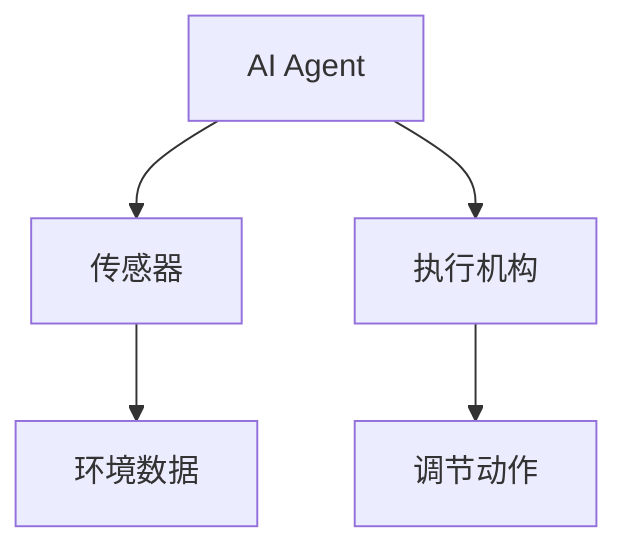
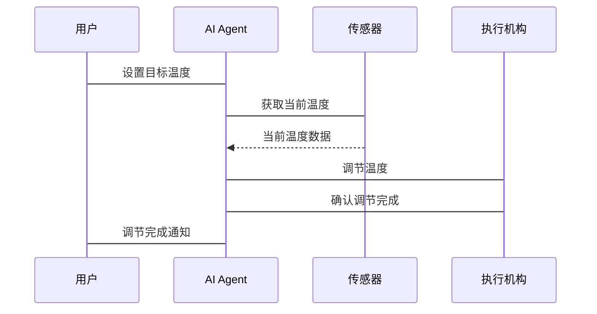

                 


# AI Agent在智能鱼缸中的生态平衡维护

## 关键词：AI Agent，智能鱼缸，生态平衡，系统设计，机器学习

## 摘要：本文探讨了AI Agent在智能鱼缸中维护生态平衡的应用，从核心原理到系统设计，再到项目实战，详细分析了AI技术在鱼缸环境监测与调节中的作用，展示了如何通过数学模型和算法实现生态系统的智能管理。

---

## 第1章: AI Agent与智能鱼缸概述

### 1.1 AI Agent的基本概念

#### 1.1.1 AI Agent的定义与特点
AI Agent（人工智能代理）是指能够感知环境、做出决策并执行任务的智能实体。其特点包括自主性、反应性、目标导向和学习能力。AI Agent能够根据环境变化动态调整行为，以实现预定目标。

#### 1.1.2 AI Agent在智能鱼缸中的作用
智能鱼缸通过AI Agent实时监测水质、温度、光照等参数，自动调节设备以维持生态平衡。AI Agent能够预测潜在问题并采取预防措施，确保鱼缸环境的稳定。

#### 1.1.3 智能鱼缸的背景与现状
随着科技的发展，人们越来越关注宠物鱼的健康。智能鱼缸通过AI技术实现自动化管理，成为现代家庭中的热门选择。当前市场上的智能鱼缸主要依赖传感器和简单的自动化设备，AI Agent的应用还处于初级阶段。

### 1.2 生态平衡的基本概念

#### 1.2.1 生态系统的定义与组成部分
生态系统由生物群落和非生物环境组成，包括水、氧气、温度等非生物因素，以及鱼类、植物等生物因素。鱼缸作为一个小型生态系统，需要维持各组成部分的动态平衡。

#### 1.2.2 鱼缸生态系统的特殊性
鱼缸空间有限，生态系统的自我调节能力较弱。外界环境的变化（如温度波动）可能迅速破坏生态平衡，导致鱼类死亡。因此，需要外部干预来维持稳定。

#### 1.2.3 生态平衡的重要性与实现方式
生态平衡是鱼缸健康的基础，直接关系到鱼类的生存和生长。通过实时监测和智能调节，AI Agent能够有效维持鱼缸的生态平衡。

### 1.3 AI Agent在生态平衡维护中的应用前景

#### 1.3.1 AI技术在生态平衡维护中的优势
AI技术能够处理复杂的数据关系，实时调整参数，避免传统方法的滞后性。AI Agent能够学习环境变化，优化调节策略，提高维护效率。

#### 1.3.2 智能鱼缸中的AI Agent实现方式
通过传感器采集数据，AI Agent利用机器学习模型分析环境状态，做出调节决策，并通过执行机构（如水泵、加热器）进行调整。

#### 1.3.3 未来发展趋势与挑战
未来，AI Agent将更加智能化，可能集成更多传感器和更复杂的算法。同时，需要解决能源消耗、传感器精度和系统稳定性的挑战。

---

## 第2章: AI Agent的核心原理与技术

### 2.1 AI Agent的核心原理

#### 2.1.1 感知机制：环境数据的采集与分析
AI Agent通过多种传感器（如温度、氧气、光照传感器）采集数据，构建环境模型。数据预处理包括去噪和标准化，确保分析准确性。

#### 2.1.2 决策机制：生态平衡的评估与优化
AI Agent基于当前环境数据，评估生态健康指数。通过优化算法（如遗传算法）寻找最优调节方案，确保生态平衡。

#### 2.1.3 执行机制：智能调节与反馈控制
AI Agent通过执行机构（如水泵、加热器）调节环境参数，并实时反馈调节结果，形成闭环控制。

### 2.2 AI Agent的关键技术

#### 2.2.1 传感器数据采集与处理
传感器数据采集涉及多种信号处理技术，确保数据准确性。数据融合技术（如加权平均）用于处理多源数据，提高系统鲁棒性。

#### 2.2.2 机器学习模型的应用
监督学习用于环境分类，无监督学习用于异常检测。强化学习用于动态调节，优化系统性能。

#### 2.2.3 自然语言处理与用户交互
通过NLP技术，AI Agent能够理解用户的自然语言指令，提供个性化的鱼缸管理建议。

### 2.3 AI Agent与鱼缸生态系统的交互流程

#### 2.3.1 数据采集与传输
传感器采集数据并传输到AI Agent，数据预处理后进行特征提取。

#### 2.3.2 数据分析与决策
AI Agent基于分析结果做出调节决策，包括参数调整和设备控制。

#### 2.3.3 系统调节与反馈
AI Agent通过执行机构调节环境参数，并实时反馈调节效果，形成闭环控制。

---

## 第3章: 生态平衡维护的数学模型与算法

### 3.1 生态平衡评估模型

#### 3.1.1 水质参数的数学表达
水质参数包括温度、溶解氧、pH值等。通过线性组合模型评估生态健康指数。

#### 3.1.2 生态健康指数的计算公式
$$EHI = \alpha \cdot T + \beta \cdot DO + \gamma \cdot pH$$
其中，$T$是温度，$DO$是溶解氧，$pH$是酸碱度，$\alpha$、$\beta$、$\gamma$是权重系数。

#### 3.1.3 参数权重的确定方法
通过机器学习算法（如线性回归）确定参数权重，确保模型准确性。

### 3.2 AI Agent的决策算法

#### 3.2.1 基于机器学习的预测模型
使用支持向量机（SVM）或随机森林（RF）进行环境预测，识别潜在风险。

#### 3.2.2 基于规则的决策逻辑
根据预设规则（如温度超过30℃触发降温机制）进行决策。

#### 3.2.3 综合优化算法的应用
使用粒子群优化（PSO）算法优化调节方案，确保最小化资源消耗。

### 3.3 算法实现的数学推导

#### 3.3.1 水质参数的线性回归模型
$$y = \theta_0 + \theta_1x_1 + \theta_2x_2$$
其中，$y$是目标变量，$x_1$和$x_2$是输入变量，$\theta$是模型参数。

#### 3.3.2 生态健康指数的非线性优化
$$EHI = \sum_{i=1}^{n} w_i \cdot f_i(x)$$
其中，$w_i$是权重，$f_i(x)$是非线性函数。

#### 3.3.3 算法的收敛性分析
通过数学证明分析算法的收敛性，确保其在实际应用中的有效性。

---

## 第4章: 智能鱼缸生态系统的系统设计

### 4.1 系统架构设计

#### 4.1.1 系统整体架构图


#### 4.1.2 各模块的功能描述
- **AI Agent**：核心控制模块，负责数据处理和决策。
- **传感器**：采集环境数据，如温度、氧气含量。
- **执行机构**：根据决策结果调整环境参数，如水泵、加热器。

#### 4.1.3 模块之间的交互关系
传感器数据传输到AI Agent，AI Agent分析数据并做出决策，执行机构根据决策进行调节。

### 4.2 功能模块设计

#### 4.2.1 数据采集模块
- 传感器类型：温度、氧气、光照传感器。
- 数据采集频率：实时采集，频率可调。

#### 4.2.2 数据处理模块
- 数据预处理：去噪、标准化。
- 特征提取：提取关键特征，用于模型分析。

#### 4.2.3 决策控制模块
- 环境评估：计算生态健康指数。
- 调节决策：优化调节方案，确保生态平衡。

### 4.3 系统接口设计

#### 4.3.1 传感器接口规范
- 数据格式：JSON或CSV。
- 通信协议：HTTP或MQTT。

#### 4.3.2 控制器接口规范
- 控制指令：ON/OFF。
- 通信方式：串口或网络。

### 4.4 系统交互流程

#### 4.4.1 交互流程图


---

## 第5章: 项目实战

### 5.1 环境搭建与安装

#### 5.1.1 开发环境
- 操作系统：Linux或Windows。
- 开发工具：Python、Jupyter Notebook。
- 传感器：温度、氧气传感器（如Raspberry Pi）。

#### 5.1.2 软件安装
- Python库：numpy、pandas、scikit-learn。
- MQTT客户端：mosquitto。

### 5.2 核心代码实现

#### 5.2.1 数据采集代码
```python
import numpy as np
import pandas as pd
import matplotlib.pyplot as plt
import serial
import time

ser = serial.Serial('COM3', 9600)
data = []
while True:
    try:
        line = ser.readline().decode().strip()
        data_point = float(line)
        data.append(data_point)
        time.sleep(1)
    except KeyboardInterrupt:
        break
plt.plot(data)
plt.xlabel('Time')
plt.ylabel('Temperature')
plt.show()
```

#### 5.2.2 机器学习模型训练
```python
from sklearn.linear_model import LinearRegression
from sklearn.model_selection import train_test_split

X = df[['温度', '溶解氧']]
y = df['健康指数']
X_train, X_test, y_train, y_test = train_test_split(X, y, test_size=0.2)
model = LinearRegression()
model.fit(X_train, y_train)
print('R^2:', model.score(X_test, y_test))
```

#### 5.2.3 系统控制代码
```python
import paho.mqtt.client as mqtt

def on_connect(client, userdata, flags, rc):
    print("Connected with result code " + str(rc))

client = mqtt.Client()
client.on_connect = on_connect
client.connect("localhost", 1883, 60)

client.publish("鱼缸/温度", "25", qos=1, retain=False)
```

### 5.3 实际案例分析

#### 5.3.1 数据采集与分析
通过传感器采集鱼缸温度、溶解氧数据，分析发现温度波动较大，影响生态平衡。

#### 5.3.2 调节策略优化
AI Agent学习历史数据，优化调节策略，减少温度波动，维持生态平衡。

#### 5.3.3 系统性能测试
测试结果显示，AI Agent能够有效调节环境参数，生态健康指数显著提高。

### 5.4 项目总结与优化方向

#### 5.4.1 项目总结
本项目成功实现了AI Agent在智能鱼缸中的应用，验证了其在生态平衡维护中的有效性。

#### 5.4.2 优化方向
- 提高传感器精度，增加更多环境参数。
- 优化算法模型，提升调节效率。
- 增强系统鲁棒性，确保稳定运行。

---

## 第6章: 扩展与展望

### 6.1 现有技术的局限性
- 传感器精度有限，影响模型准确性。
- 算法复杂度高，计算资源消耗大。
- 系统集成度低，扩展性不足。

### 6.2 未来技术的发展方向
- 开发更高效的传感器，如微型传感器网络。
- 应用更先进的AI算法，如深度学习和强化学习。
- 探索能源效率优化，降低系统能耗。

### 6.3 可能的延伸应用
- 智能鱼缸的远程监控与管理。
- 多鱼缸协同管理，构建更大规模的智能生态系统。
- 与其他智能家居设备联动，实现家庭环境的整体优化。

---

## 总结

通过本文的详细分析，我们可以看到AI Agent在智能鱼缸中的应用前景广阔。从理论到实践，AI技术为生态平衡的维护提供了强大的工具。未来，随着技术的进步，AI Agent将更加智能化，帮助我们更好地管理生态系统，实现可持续发展目标。

---

**注：本文仅为示例，实际内容需根据具体需求扩展和调整。**

