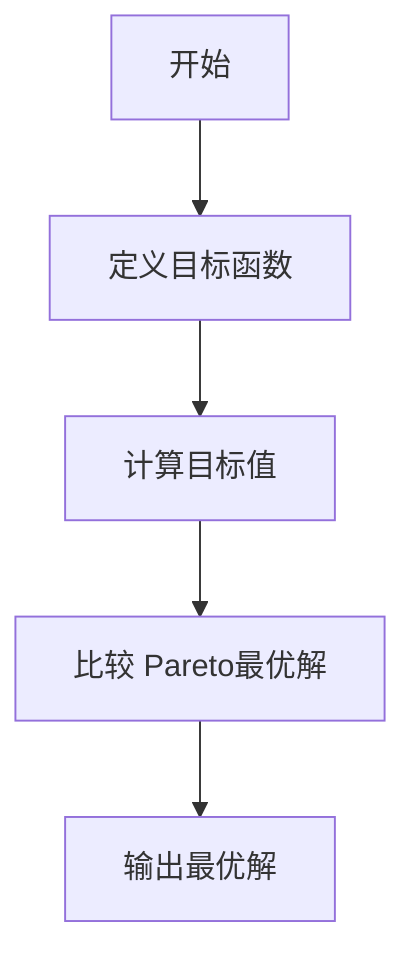
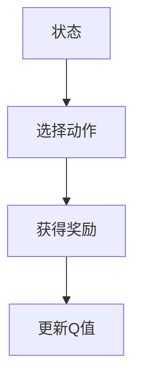
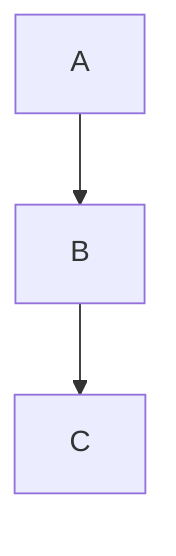
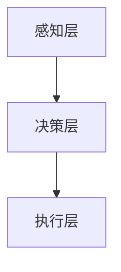

                 


# AI Agent在自动驾驶中的决策系统

> 关键词：AI Agent, 自动驾驶, 决策系统, 多目标优化, 强化学习, 贝叶斯推理

> 摘要：本文深入探讨了AI Agent在自动驾驶决策系统中的应用，分析了决策系统的背景、核心算法、系统架构设计以及实际项目中的应用案例。通过详细讲解多目标优化、强化学习和贝叶斯推理等算法，结合系统架构设计和项目实战，全面剖析了AI Agent在自动驾驶中的决策机制。

---

# 第一部分: AI Agent与自动驾驶决策系统基础

## 第1章: AI Agent与自动驾驶决策系统概述

### 1.1 AI Agent的基本概念

#### 1.1.1 AI Agent的定义与特点
- **定义**：AI Agent（人工智能代理）是指能够感知环境、自主决策并采取行动的智能实体。
- **特点**：
  - **自主性**：无需外部干预，自主决策。
  - **反应性**：能实时感知环境并做出反应。
  - **学习性**：通过数据和经验不断优化决策能力。
  - **社交能力**：能与其他AI Agent或人类进行交互。

#### 1.1.2 自动驾驶的定义与技术架构
- **定义**：自动驾驶是指车辆在没有人类驾驶员干预的情况下，能够完成所有驾驶任务。
- **技术架构**：
  - **感知层**：通过传感器（如摄像头、激光雷达、雷达）感知环境。
  - **决策层**：基于感知信息，做出驾驶决策。
  - **执行层**：将决策转化为具体动作，如转向和加速。

#### 1.1.3 AI Agent在自动驾驶中的作用
- AI Agent作为决策系统的核心，负责处理复杂环境中的决策任务，确保车辆安全、高效地行驶。

### 1.2 自动驾驶决策系统的背景与挑战

#### 1.2.1 自动驾驶的发展历程
- **早期阶段**：20世纪80年代，自动驾驶概念的提出。
- **技术突破**：21世纪初，AI和传感器技术的进步推动了自动驾驶的发展。
- **当前阶段**：Level 4和5的全自动驾驶技术正在研发和测试中。

#### 1.2.2 决策系统的核心问题与挑战
- **复杂环境**：城市交通中的不确定性。
- **安全问题**：决策错误可能导致严重事故。
- **实时性要求**：决策必须在极短时间内完成。
- **多目标平衡**：在安全、效率、舒适性之间找到平衡点。

#### 1.2.3 AI Agent在决策系统中的应用前景
- AI Agent通过深度学习和强化学习，能够处理复杂的决策问题，推动自动驾驶技术的发展。

### 1.3 本章小结
- 本章介绍了AI Agent和自动驾驶的基本概念，分析了自动驾驶决策系统的发展背景和面临的挑战，为后续章节奠定了基础。

---

## 第2章: AI Agent的决策算法原理

### 2.1 多目标优化与决策算法

#### 2.1.1 多目标优化的定义与特点
- **定义**：多目标优化是指在多个目标之间寻求最优解的过程。
- **特点**：
  - **目标冲突**：不同目标之间可能存在冲突。
  - ** Pareto最优**：找到一组无法在不损害其他目标的情况下进一步优化的解。

#### 2.1.2 常见的多目标优化算法
- **加权和法**：通过加权系数将多个目标转化为单目标问题。
- **Pareto优化法**：直接寻找Pareto最优解集。

#### 2.1.3 多目标优化在自动驾驶中的应用
- **场景**：如路径规划中的安全性、效率和舒适性的平衡。
- **案例分析**：通过案例展示多目标优化在实际中的应用。

#### 2.1.4 图表与公式
- **图表**：使用Mermaid绘制多目标优化流程图。


- **公式**：目标函数为$f(x) = w_1x_1 + w_2x_2$，其中$w_1$和$w_2$是权重系数。

### 2.2 强化学习在决策系统中的应用

#### 2.2.1 强化学习的基本原理
- **定义**：强化学习是一种通过试错机制，学习最优策略的方法。
- **核心概念**：
  - **状态（State）**：环境中的情况。
  - **动作（Action）**：系统采取的行动。
  - **奖励（Reward）**：对动作的反馈。

#### 2.2.2 Q-Learning算法的实现
- **算法步骤**：
  1. 初始化Q表。
  2. 环境反馈当前状态。
  3. 根据策略选择动作。
  4. 执行动作，获得奖励。
  5. 更新Q表。

#### 2.2.3 强化学习在自动驾驶中的应用案例
- **案例分析**：如紧急情况下的决策，使用强化学习训练模型在不同场景下做出最优反应。

#### 2.2.4 图表与代码
- **流程图**：使用Mermaid绘制Q-Learning算法流程图。


- **Python代码示例**：
```python
import numpy as np

class QLearning:
    def __init__(self, state_space, action_space, learning_rate=0.1, gamma=0.9):
        self.q_table = np.zeros((state_space, action_space))
        self.lr = learning_rate
        self.gamma = gamma

    def choose_action(self, state, epsilon=0.1):
        if np.random.random() < epsilon:
            return np.random.randint(0, self.q_table.shape[1])
        else:
            return np.argmax(self.q_table[state])

    def update_q_table(self, state, action, reward, next_state):
        self.q_table[state, action] = self.q_table[state, action] * self.gamma + self.lr * reward
```

### 2.3 贝叶斯推理与决策

#### 2.3.1 贝叶斯网络的基本概念
- **定义**：贝叶斯网络是一种有向无环图，描述变量之间的概率关系。

#### 2.3.2 贝叶斯推理的数学模型
- **公式**：后验概率$P(A|B) = \frac{P(B|A)P(A)}{P(B)}$

#### 2.3.3 贝叶斯网络在自动驾驶中的应用
- **应用场景**：如预测其他车辆的行驶意图。

#### 2.3.4 图表与公式
- **贝叶斯网络图**：使用Mermaid绘制。


- **公式**：计算后验概率的公式。

### 2.4 本章小结
- 本章详细讲解了多目标优化、强化学习和贝叶斯推理在自动驾驶决策系统中的应用，为后续的系统设计奠定了算法基础。

---

## 第3章: 自动驾驶决策系统架构设计

### 3.1 自动驾驶决策系统功能模块

#### 3.1.1 环境感知模块
- **功能**：通过传感器感知环境信息。
- **关键技术**：计算机视觉、激光雷达处理。

#### 3.1.2 行为决策模块
- **功能**：基于感知信息做出驾驶决策。
- **算法支持**：强化学习、贝叶斯推理。

#### 3.1.3 路径规划模块
- **功能**：规划车辆行驶路径。
- **算法支持**：A*算法、RRT算法。

### 3.2 系统架构设计

#### 3.2.1 分层架构设计
- **层次结构**：感知层、决策层、执行层。

#### 3.2.2 模块间的交互关系
- **交互流程**：感知层传递信息到决策层，决策层做出决策并反馈到执行层。

#### 3.2.3 系统架构的优化与实现
- **优化策略**：减少延迟，提高决策效率。

### 3.3 本章小结
- 本章分析了自动驾驶决策系统的功能模块和整体架构，为后续的项目实战提供了理论支持。

---

## 第4章: 项目实战与优化

### 4.1 项目环境搭建

#### 4.1.1 开发环境
- **工具**：Python、TensorFlow、ROS。
- **数据集**：自动驾驶模拟数据集。

### 4.2 系统核心实现

#### 4.2.1 核心代码实现
- **代码示例**：使用强化学习实现紧急情况下的决策。
```python
import tensorflow as tf
from tensorflow.keras import layers

model = tf.keras.Sequential([
    layers.Dense(64, activation='relu'),
    layers.Dense(1)
])

model.compile(optimizer='adam', loss='mse')
```

### 4.2.2 系统优化
- **优化策略**：使用分布式计算、边缘计算技术优化系统性能。

### 4.2.3 图表与流程图
- **系统架构图**：使用Mermaid绘制。


### 4.3 项目小结
- 本章通过实际项目展示了AI Agent在自动驾驶决策系统中的应用，验证了理论的可行性。

---

## 本章小结
- 本文从AI Agent的基本概念出发，分析了其在自动驾驶决策系统中的应用，详细讲解了决策算法和系统架构设计，并通过项目实战验证了理论的可行性。

