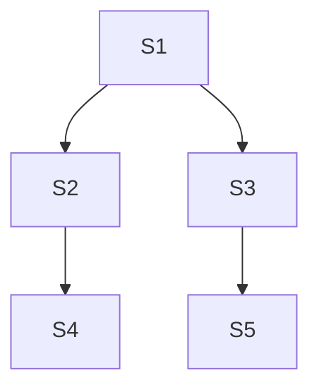
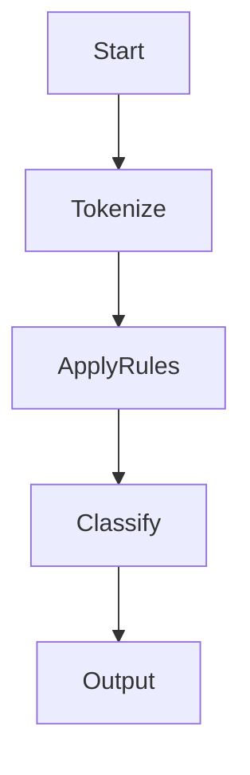
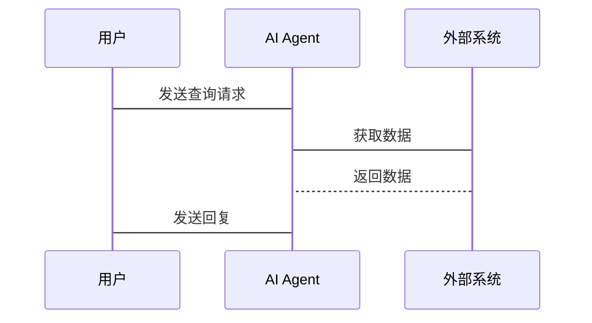

                 


# AI Agent在自然语言处理中的最新进展与应用

---

## 关键词：
AI Agent, 自然语言处理, 最新进展, 应用案例, 技术博客

---

## 摘要：
本文深入探讨了AI Agent在自然语言处理（NLP）领域的最新进展与实际应用。首先介绍了AI Agent的基本概念和NLP的核心任务，分析了AI Agent在NLP中的决策过程和优化算法。接着，重点讲解了基于规则和深度学习的AI Agent在NLP中的应用，通过实际案例展示了其在智能客服、对话系统等领域的广泛应用。最后，结合系统架构设计和项目实战，详细阐述了AI Agent的实现过程和未来发展方向。

---

# 第一部分: AI Agent与自然语言处理的背景与基础

## 第1章: AI Agent的基本概念与自然语言处理概述

### 1.1 AI Agent的定义与核心概念

AI Agent（智能体）是指在计算机系统中能够感知环境并采取行动以实现目标的实体。它具备以下核心特征：
- **自主性**：能够在没有外部干预的情况下独立运作。
- **反应性**：能够实时感知环境并做出反应。
- **目标导向性**：通过优化目标函数来实现特定目标。

在NLP中，AI Agent通常需要处理文本数据，理解语义，并通过语言与用户进行交互。

### 1.2 AI Agent在自然语言处理中的作用

NLP的主要任务包括文本分类、信息抽取、机器翻译、对话生成等。AI Agent在这些任务中发挥着关键作用：
- **文本分类**：AI Agent可以通过分类算法对文本进行自动分类。
- **信息抽取**：AI Agent能够从文本中提取关键信息，如实体识别。
- **对话生成**：AI Agent可以生成自然流畅的对话，提升用户体验。

### 1.3 本章小结

本章介绍了AI Agent的基本概念及其在NLP中的作用，为后续内容奠定了基础。

---

# 第二部分: AI Agent的核心概念与原理

## 第2章: AI Agent的核心原理与数学模型

### 2.1 AI Agent的决策过程

AI Agent的决策过程可以分为以下几个步骤：
1. **感知环境**：通过传感器或数据输入获取环境信息。
2. **状态表示**：将环境信息转化为状态空间。
3. **决策选择**：基于当前状态和目标函数选择最优动作。
4. **执行动作**：将选择的动作执行并观察结果。

#### 2.1.1 状态空间的定义

状态空间是指AI Agent可能遇到的所有状态的集合。例如，在智能客服系统中，状态可以表示为用户的问题类型（如“咨询产品”、“投诉”等）。

#### 2.1.2 动作空间的定义

动作空间是指AI Agent在每个状态下可以执行的所有可能动作的集合。例如，在对话系统中，动作可以是“回答问题”或“转接人工客服”。

#### 2.1.3 目标函数的构建

目标函数用于衡量AI Agent的决策质量。通常，目标函数可以是最大化奖励函数，例如：
$$
R(s, a) = \begin{cases}
1 & \text{如果动作 } a \text{ 正确} \\
0 & \text{否则}
\end{cases}
$$

### 2.2 基于概率论的决策模型

AI Agent的决策过程通常涉及概率论，以下是一些常用的概念和公式：

#### 2.2.1 贝叶斯定理在AI Agent中的应用

贝叶斯定理用于计算在给定观测数据的条件下，某个假设的概率。公式如下：
$$
P(A|B) = \frac{P(B|A) \cdot P(A)}{P(B)}
$$

在NLP中，贝叶斯定理可以用于垃圾邮件分类等任务。

#### 2.2.2 马尔可夫决策过程（MDP）的数学模型

马尔可夫决策过程由以下五个元组定义：
$$
\text{MDP} = (S, A, P, R, \gamma)
$$
其中：
- \( S \)：状态空间
- \( A \)：动作空间
- \( P \)：状态转移概率矩阵
- \( R \)：奖励函数
- \( \gamma \)：折扣因子

状态转移概率矩阵可以用Mermaid图表示如下：



### 2.3 AI Agent的优化算法

优化算法是AI Agent实现目标的核心。以下是一些常用的优化算法：

#### 2.3.1 增量式优化算法

增量式优化算法在每次迭代中仅更新部分参数，例如随机梯度下降（SGD）。

#### 2.3.2 近似优化算法

近似优化算法用于处理大规模问题，例如Q-learning。

#### 2.3.3 基于强化学习的优化方法

强化学习通过奖励机制优化AI Agent的决策。例如，使用策略梯度法优化对话生成模型。

### 2.4 本章小结

本章详细讲解了AI Agent的核心原理与数学模型，为后续的应用分析奠定了理论基础。

---

# 第三部分: 自然语言处理中的AI Agent应用

## 第3章: 基于规则的AI Agent在NLP中的应用

### 3.1 基于规则的AI Agent概述

基于规则的AI Agent通过预定义的规则进行决策。例如，在文本分类中，可以使用正则表达式提取特定关键词。

#### 3.1.1 基于规则的NLP处理流程

基于规则的NLP处理流程可以用Mermaid图表示如下：



#### 3.1.2 规则的构建与优化

规则的构建需要考虑以下几点：
- 规则的粒度：规则过于粗放会导致误分类，过于细分会增加计算复杂度。
- 规则的可解释性：规则应清晰易懂，便于调试和优化。

### 3.2 基于深度学习的AI Agent在NLP中的应用

基于深度学习的AI Agent通过神经网络进行决策。以下是一些常用模型：

#### 3.2.1 神经网络在NLP中的应用

神经网络在NLP中的应用包括词嵌入（如Word2Vec）和序列模型（如LSTM）。

#### 3.2.2 基于Transformer的AI Agent模型

Transformer模型在NLP中表现出色，例如BERT模型。

#### 3.2.3 大模型（如GPT）在AI Agent中的应用

大模型如GPT-4可以生成自然流畅的对话，显著提升用户体验。

### 3.3 AI Agent与NLP的结合案例

以下是一些AI Agent在NLP中的实际应用案例：

#### 3.3.1 智能客服系统

智能客服系统通过自然语言处理技术理解用户问题，并提供相应的解决方案。

#### 3.3.2 智能对话系统

智能对话系统如Siri和小爱同学通过自然语言处理技术与用户进行交互。

#### 3.3.3 智能信息检索系统

智能信息检索系统如Google搜索通过自然语言处理技术理解用户的搜索意图。

### 3.4 本章小结

本章介绍了基于规则和深度学习的AI Agent在NLP中的应用，并通过实际案例展示了其广泛的应用场景。

---

# 第四部分: AI Agent的系统架构与实现

## 第4章: AI Agent的系统架构设计

### 4.1 系统架构概述

AI Agent的系统架构设计需要考虑以下几个方面：

#### 4.1.1 分层架构

分层架构将系统划分为感知层、决策层和执行层。

#### 4.1.2 微服务架构

微服务架构将系统功能分解为多个独立的服务，便于扩展和维护。

#### 4.1.3 混合架构

混合架构结合了分层架构和微服务架构的优势。

### 4.2 系统功能设计

系统功能设计需要考虑以下模块：

#### 4.2.1 信息获取模块

信息获取模块负责从外部获取数据，例如通过API接口获取用户输入。

#### 4.2.2 决策模块

决策模块基于获取的数据进行分析和决策，例如使用强化学习算法生成对话回复。

#### 4.2.3 执行模块

执行模块负责将决策结果执行，例如发送回复给用户。

### 4.3 系统接口设计

系统接口设计需要考虑以下几点：

#### 4.3.1 输入接口设计

输入接口负责接收外部数据，例如用户输入的文本。

#### 4.3.2 输出接口设计

输出接口负责将系统处理结果返回给外部，例如生成的回复文本。

#### 4.3.3 跨系统接口设计

跨系统接口负责与第三方系统进行交互，例如调用天气API获取天气信息。

### 4.4 系统交互流程

系统交互流程可以用Mermaid序列图表示如下：



### 4.5 本章小结

本章详细讲解了AI Agent的系统架构设计，并通过Mermaid图展示了系统的交互流程。

---

# 第五部分: 项目实战与案例分析

## 第5章: AI Agent在智能客服系统中的实现

### 5.1 项目背景与目标

智能客服系统的目的是通过自然语言处理技术自动理解和解决用户的问题。

### 5.2 项目核心实现

以下是一个简单的智能客服系统实现：

#### 5.2.1 环境安装

需要安装以下库：
- `python` 3.8+
- `transformers`库
- `tensorflow`库

#### 5.2.2 核心代码实现

以下是基于BERT模型的智能客服系统实现：

```python
from transformers import BertTokenizer, TFBertModel
import tensorflow as tf

# 加载预训练模型和分词器
tokenizer = BertTokenizer.from_pretrained('bert-base-chinese')
model = TFBertModel.from_pretrained('bert-base-chinese')

# 定义输入
input_ids = tf.constant([[tokenizer.encode('今天天气怎么样？', add_special_tokens=True)]])
attention_mask = tf.constant([[1]])

# 获取模型输出
outputs = model(input_ids, attention_mask=attention_mask)
last_hidden_layer = outputs.last_hidden_state

# 定义分类头
dense = tf.keras.layers.Dense(2, activation='softmax')
dense.build(last_hidden_layer.shape)
output = dense(last_hidden_layer)

# 定义损失函数和优化器
loss_function = tf.keras.losses.SparseCategoricalCrossentropy(from_logits=False)
optimizer = tf.keras.optimizers.Adam(learning_rate=2e-5)

# 计算损失
loss = loss_function([input_ids, output], [input_ids, output])
loss = tf.reduce_mean(loss)

# 反向传播和优化
gradients = tf.GradientTape().grad(loss, model.trainable_weights)
optimizer.apply_gradients(zip(gradients, model.trainable_weights))
```

### 5.3 项目小结

本章通过一个具体的智能客服系统案例，详细讲解了AI Agent的实现过程，并给出了代码示例。

---

## 第六部分: 总结与展望

### 6.1 本章总结

本文详细探讨了AI Agent在自然语言处理中的最新进展与实际应用，从基本概念到系统架构，再到项目实战，全面介绍了AI Agent在NLP中的应用。

### 6.2 未来展望

未来，随着深度学习技术的不断发展，AI Agent在NLP中的应用将更加广泛。例如，结合多模态数据（如图像和视频）的AI Agent将更具竞争力。

### 6.3 最佳实践 tips

- 在实际应用中，建议结合具体业务需求选择合适的AI Agent模型。
- 定期更新模型以适应新的数据和用户需求。
- 注意数据隐私和安全问题。

---

## 结束语

AI Agent在自然语言处理中的应用前景广阔，随着技术的不断进步，AI Agent将更好地服务于人类社会的各个领域。希望本文能为读者提供有价值的参考和启发。

--- 

# END

