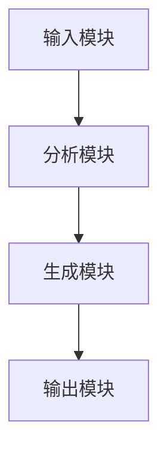

                 


# AI Agent在自然语言生成中的风格转换与控制

> 关键词：自然语言生成、风格转换、风格控制、AI Agent、文本生成、语言模型

> 摘要：本文系统探讨AI Agent在自然语言生成中的风格转换与控制，涵盖概念、算法、系统架构、项目实战等多方面内容，深入剖析技术原理和应用实践，为AI Agent在自然语言生成中的应用提供全面指导。

---

## 第1章 AI Agent与自然语言生成的基础

### 1.1 AI Agent的基本概念

#### 1.1.1 AI Agent的定义
AI Agent（人工智能代理）是指能够感知环境并采取行动以实现目标的智能实体。AI Agent可以是软件程序或实体机器人，具备自主决策和学习能力。

#### 1.1.2 AI Agent的核心特点
- **自主性**：AI Agent能够自主决策，无需外部干预。
- **反应性**：能够实时感知环境并做出反应。
- **学习能力**：通过数据和经验不断优化性能。
- **社交能力**：能够与其他AI Agent或人类进行交互。

#### 1.1.3 AI Agent与传统程序的区别
AI Agent的核心区别在于其具备自主性、学习能力和适应性，能够处理复杂和动态的环境，而传统程序通常遵循固定的逻辑步骤。

### 1.2 自然语言生成的定义与特点

#### 1.2.1 自然语言生成的定义
自然语言生成（NLG, Natural Language Generation）是将结构化数据转化为自然语言文本的过程。其目标是让计算机生成符合人类语言习惯的文本。

#### 1.2.2 自然语言生成的核心技术
- **文本规划**：确定生成文本的内容和结构。
- **文本生成**：将规划内容转化为自然语言文本。
- **文本优化**：对生成文本进行润色和调整，使其更符合目标读者的期望。

#### 1.2.3 自然语言生成的应用场景
- **对话系统**：生成自然的对话内容。
- **文本摘要**：将长文本压缩成简洁的摘要。
- **机器翻译**：将一种语言翻译成另一种语言。
- **内容生成**：自动生成新闻、文章等文本。

### 1.3 AI Agent在自然语言生成中的作用

#### 1.3.1 AI Agent在自然语言生成中的角色
AI Agent可以作为自然语言生成的驱动者和控制器，负责处理输入数据、制定生成策略以及优化生成结果。

#### 1.3.2 AI Agent对自然语言生成的影响
AI Agent通过引入上下文理解和实时反馈机制，显著提高了自然语言生成的准确性和灵活性。

#### 1.3.3 AI Agent在自然语言生成中的优势
- **智能化**：AI Agent能够理解上下文，生成更符合场景的文本。
- **实时性**：能够快速响应用户需求，生成实时文本。
- **可定制化**：可以根据不同用户或场景调整生成风格。

---

## 第2章 风格转换与控制的核心概念

### 2.1 风格转换的定义与分类

#### 2.1.1 风格转换的定义
风格转换是指将一段文本从一种风格转换为另一种风格的过程，例如将正式风格的文本转换为口语风格。

#### 2.1.2 风格转换的主要分类
- **语言风格转换**：如正式与非正式风格的转换。
- **情感风格转换**：如负面到积极情感的转换。
- **领域风格转换**：如将医疗领域的文本转换为法律领域的文本。

#### 2.1.3 风格转换的关键技术
- **文本表示**：将文本转换为向量表示，便于风格分析。
- **风格分类**：通过机器学习模型对文本风格进行分类。
- **风格生成**：根据目标风格生成新的文本。

### 2.2 风格控制的定义与实现

#### 2.2.1 风格控制的定义
风格控制是指在生成文本时，主动调整文本的风格特征，以满足特定需求。

#### 2.2.2 风格控制的主要方法
- **基于规则的风格控制**：通过预定义规则调整文本风格。
- **基于模型的风格控制**：利用机器学习模型生成符合目标风格的文本。
- **混合方法**：结合规则和模型的优势进行风格控制。

#### 2.2.3 风格控制的实现流程
1. **风格分析**：分析输入文本的风格特征。
2. **风格目标设定**：明确目标风格的要求。
3. **文本生成**：根据目标风格生成新的文本。
4. **风格验证**：验证生成文本是否符合目标风格。

### 2.3 AI Agent在风格转换与控制中的应用

#### 2.3.1 AI Agent在风格转换中的作用
AI Agent可以通过分析上下文和用户需求，自动调整文本的风格特征。

#### 2.3.2 AI Agent在风格控制中的应用
AI Agent可以根据用户意图或场景需求，实时控制文本的风格生成。

#### 2.3.3 AI Agent在风格转换与控制中的优势
- **智能化**：AI Agent能够理解上下文，生成更符合场景的文本。
- **实时性**：能够快速响应用户需求，生成实时文本。
- **可定制化**：可以根据不同用户或场景调整生成风格。

---

## 第3章 风格转换与控制的算法原理

### 3.1 预训练语言模型的原理

#### 3.1.1 预训练语言模型的基本原理
预训练语言模型通过在大规模数据上进行无监督学习，掌握语言的分布特征和语义关系。

#### 3.1.2 预训练语言模型的主要技术
- **词嵌入**：将单词或短语映射为低维向量。
- **注意力机制**：通过注意力机制捕捉文本中的长距离依赖关系。
- **Transformer架构**：利用自注意力机制和前馈网络进行文本生成。

#### 3.1.3 预训练语言模型的应用场景
- **文本生成**：生成连贯且有意义的文本。
- **文本摘要**：将长文本压缩成简洁的摘要。
- **机器翻译**：将一种语言翻译成另一种语言。

### 3.2 风格控制模型的原理

#### 3.2.1 风格控制模型的基本原理
风格控制模型通过引入风格向量或条件，指导生成模型输出符合目标风格的文本。

#### 3.2.2 风格控制模型的主要技术
- **条件生成对抗网络（Conditional GANs）**：通过条件输入控制生成文本的风格。
- **风格向量编码**：将风格特征编码为向量，指导生成过程。
- **多任务学习**：同时学习风格分类和文本生成任务。

#### 3.2.3 风格控制模型的应用场景
- **文本生成**：生成符合特定风格的文本。
- **风格转换**：将输入文本的风格转换为目标风格。
- **个性化生成**：根据用户偏好生成个性化文本。

### 3.3 AI Agent在风格转换与控制中的算法实现

#### 3.3.1 AI Agent在风格转换中的算法实现
1. **输入文本分析**：分析输入文本的风格特征。
2. **风格向量生成**：根据目标风格生成风格向量。
3. **文本生成**：利用预训练语言模型生成符合目标风格的文本。

#### 3.3.2 AI Agent在风格控制中的算法实现
1. **目标风格设定**：明确目标风格的要求。
2. **生成条件设置**：设置生成模型的条件参数。
3. **文本生成**：生成符合目标风格的文本。

#### 3.3.3 AI Agent在风格转换与控制中的算法优化
- **多风格训练**：通过多风格数据训练模型，提高风格转换的多样性。
- **在线调整**：根据实时反馈调整生成风格，提高生成结果的满意度。
- **高效推理**：优化生成过程，提高生成速度和效率。

---

## 第4章 风格转换与控制的系统架构设计

### 4.1 系统功能设计

#### 4.1.1 系统功能模块
- **输入模块**：接收输入文本和风格参数。
- **分析模块**：分析输入文本的风格特征。
- **生成模块**：根据目标风格生成新的文本。
- **输出模块**：输出生成的文本和相关结果。

#### 4.1.2 系统功能流程
1. **输入处理**：接收输入文本和风格参数。
2. **风格分析**：分析输入文本的风格特征。
3. **风格控制**：根据目标风格生成新的文本。
4. **结果输出**：输出生成的文本和相关结果。

### 4.2 系统架构设计

#### 4.2.1 系统架构图


#### 4.2.2 系统接口设计
- **输入接口**：接收输入文本和风格参数。
- **输出接口**：输出生成的文本和相关结果。
- **控制接口**：调整系统参数和风格设置。

#### 4.2.3 系统交互流程
1. **用户输入**：用户输入需要转换的文本和目标风格。
2. **系统分析**：系统分析输入文本的风格特征。
3. **系统生成**：系统根据目标风格生成新的文本。
4. **用户反馈**：用户对生成结果进行反馈。
5. **系统优化**：系统根据反馈优化生成过程。

---

## 第5章 项目实战

### 5.1 环境安装

#### 5.1.1 安装Python
```bash
python --version
```

#### 5.1.2 安装依赖库
```bash
pip install transformers
pip install numpy
pip install matplotlib
```

### 5.2 核心代码实现

#### 5.2.1 风格分析代码
```python
import transformers
import numpy as np

def analyze_style(text):
    model = transformers.AutoModel.from_pretrained('bert-base-uncased')
    tokenizer = transformers.AutoTokenizer.from_pretrained('bert-base-uncased')
    inputs = tokenizer.encode_plus(text, return_tensors='np', padding=True, truncation=True)
    outputs = model(**inputs)
    style_vector = outputs.last_hidden_state[:, 0, :]
    return style_vector.numpy()
```

#### 5.2.2 风格生成代码
```python
import transformers
import numpy as np

def generate_text(style_vector, target_style):
    model = transformers.AutoModelForCausalLM.from_pretrained('gpt2')
    inputs = tokenizer.encode_plus(style_vector, return_tensors='np', padding=True, truncation=True)
    outputs = model.generate(**inputs, max_length=50)
    return tokenizer.decode(outputs[0])
```

### 5.3 案例分析

#### 5.3.1 案例1：正式风格转换为口语风格
输入文本： "The experiment was conducted under controlled conditions."
生成文本： "We did the experiment in a controlled setting."

#### 5.3.2 案例2：消极情感转换为积极情感
输入文本： "The project failed due to insufficient funding."
生成文本： "The project faced funding issues but we are working to overcome them."

### 5.4 项目小结

通过以上实战，我们可以看到AI Agent在风格转换与控制中的强大能力。通过预训练语言模型和风格控制算法，我们可以实现多种风格的文本生成和转换，满足不同场景的需求。

---

## 第6章 最佳实践与小结

### 6.1 最佳实践

#### 6.1.1 小结
AI Agent在自然语言生成中的风格转换与控制是一项复杂但极具应用价值的技术。通过预训练语言模型和风格控制算法，我们可以实现多种风格的文本生成和转换，满足不同场景的需求。

#### 6.1.2 注意事项
- **数据质量**：确保训练数据的多样性和代表性。
- **模型优化**：根据实际需求优化模型参数和生成策略。
- **用户反馈**：及时收集用户反馈，不断优化生成效果。

#### 6.1.3 拓展阅读
- **相关论文**：阅读相关领域的学术论文，了解最新的研究成果。
- **技术博客**：关注技术博客和社区，获取最新的技术动态。
- **实践项目**：参与更多的实践项目，提升实际应用能力。

---

通过以上章节的详细讲解，我们全面探讨了AI Agent在自然语言生成中的风格转换与控制。从理论到实践，从算法到系统设计，我们深入了解了这一领域的核心技术和发展趋势。希望本文能够为相关领域的研究者和实践者提供有价值的参考和指导。

