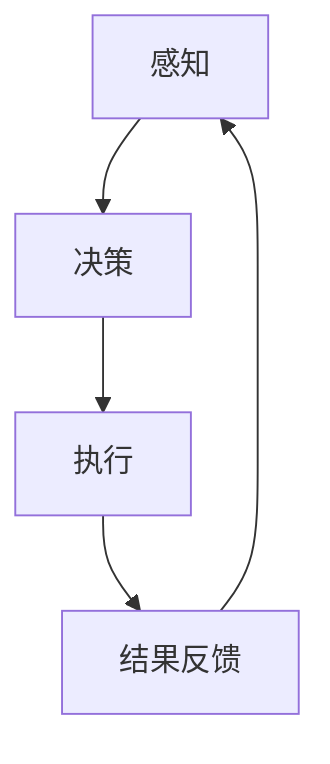
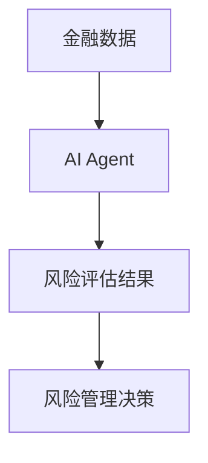
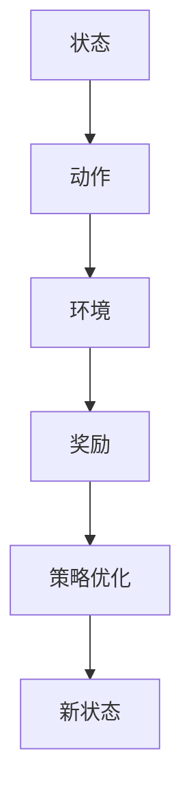
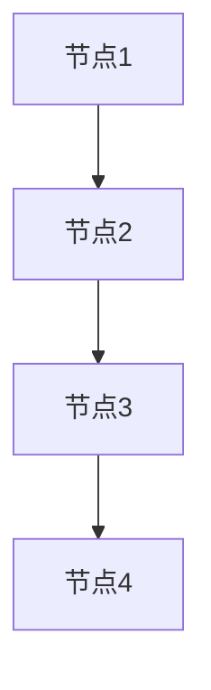
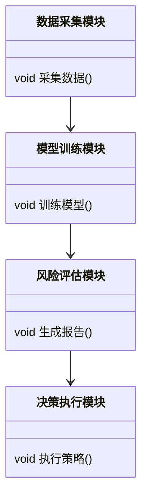
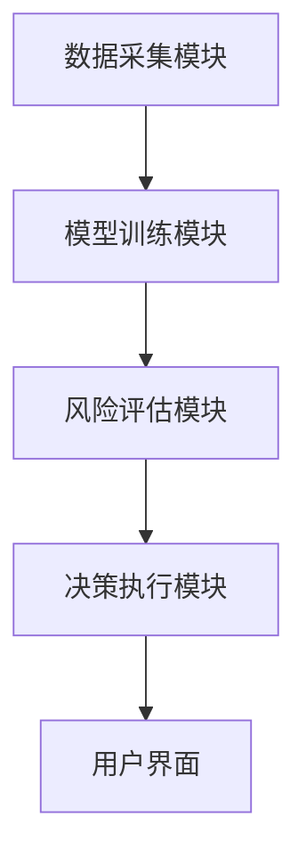

                 


# AI Agent在金融风险评估中的应用与挑战

> 关键词：AI Agent，金融风险评估，强化学习，图神经网络，数学模型

> 摘要：本文深入探讨了AI Agent在金融风险评估中的应用与挑战。首先，介绍了AI Agent的基本概念与核心原理，详细分析了其在金融风险评估中的优势与应用场景。接着，从算法原理的角度，重点阐述了强化学习和图神经网络在金融风险评估中的具体应用，并通过数学公式与实际案例，深入解析了这些算法的工作机制。最后，本文讨论了AI Agent在金融风险评估中的系统架构设计、项目实战与最佳实践，并展望了未来的发展方向。

---

# 第一部分: AI Agent与金融风险评估的背景与基础

## 第1章: AI Agent与金融风险评估概述

### 1.1 AI Agent的基本概念

AI Agent（人工智能代理）是指能够感知环境、自主决策并执行任务的智能实体。它能够通过传感器获取信息，利用算法进行分析，并根据结果采取行动。AI Agent的核心特征包括自主性、反应性、目标导向性和学习能力。在金融领域，AI Agent可以用于自动化交易、风险管理、客户服务等场景。

**表1-1: AI Agent的核心特征对比**

| 特征         | 描述                                                                 |
|--------------|----------------------------------------------------------------------|
| 自主性       | AI Agent能够自主决策，无需外部干预                                             |
| 反应性       | 能够实时感知环境变化并做出反应                                                 |
| 目标导向性   | 以特定目标为导向，优化决策过程                                                 |
| 学习能力     | 通过机器学习算法不断优化自身性能                                             |

### 1.2 金融风险评估的基本概念

金融风险评估是通过对金融市场的数据进行分析，识别和量化潜在风险的过程。常见的金融风险类型包括市场风险、信用风险、流动性风险和操作风险。传统金融风险评估方法主要包括VaR（Value at Risk）模型和情景分析法，但这些方法在复杂市场环境下往往存在局限性。

### 1.3 AI Agent在金融风险评估中的结合

AI Agent与金融风险评估的结合，主要体现在以下几个方面：

1. **实时数据分析**：AI Agent能够快速处理海量数据，发现潜在风险。
2. **智能决策**：通过强化学习等算法，AI Agent可以在复杂环境中做出最优决策。
3. **动态风险管理**：AI Agent能够根据市场变化实时调整风险管理策略。

---

## 第2章: AI Agent的核心概念与原理

### 2.1 AI Agent的核心原理

AI Agent的核心原理包括感知、决策和执行三个主要环节。感知阶段通过传感器获取环境信息，决策阶段基于感知信息进行分析并制定策略，执行阶段则根据决策结果采取行动。

**图2-1: AI Agent的核心原理流程图**



### 2.2 AI Agent在金融风险评估中的应用模型

在金融风险评估中，AI Agent通常采用以下几种模型：

1. **强化学习模型**：通过与环境交互，学习最优策略。
2. **图神经网络模型**：利用图结构数据进行风险传播分析。
3. **聚类分析模型**：识别市场中的风险集群。

**图2-2: AI Agent在金融风险评估中的应用模型**



---

## 第3章: AI Agent在金融风险评估中的算法原理

### 3.1 强化学习算法在AI Agent中的应用

强化学习是一种通过试错机制优化决策的算法。在金融风险评估中，强化学习可以用于交易策略优化和风险控制。

**图3-1: 强化学习算法流程图**



**公式3-1: 强化学习中的Q-learning算法**

$$ Q(s,a) = r + \gamma \max Q(s',a') $$

其中：
- \( Q(s,a) \) 表示状态 \( s \) 下采取动作 \( a \) 的价值。
- \( r \) 是奖励值。
- \( \gamma \) 是折扣因子。

---

### 3.2 图神经网络在AI Agent中的应用

图神经网络是一种处理图结构数据的算法，在金融风险评估中，可以用于分析市场网络中的风险传播。

**图3-2: 图神经网络在金融风险评估中的应用**



**公式3-2: 图神经网络中的节点表示公式**

$$ h = \text{聚合函数}(\{h_{\text{邻居}}\}) $$

其中：
- \( h \) 表示节点的表示向量。
- 聚合函数用于聚合邻居节点的特征。

---

## 第4章: 金融风险评估中的数学模型与公式

### 4.1 传统金融风险评估模型

传统金融风险评估模型主要包括：

1. **马科维茨投资组合理论**：用于优化投资组合的风险和收益。
2. **CAPM模型**：用于评估资产的预期收益。
3. **VaR模型**：用于衡量投资组合在给定置信水平下的潜在损失。

**公式4-1: 马科维茨投资组合理论**

$$ \text{目标：} \min_w \{ \sigma^2(w) \} $$
$$ \text{约束：} \sum_i w_i = 1 $$

其中：
- \( w_i \) 是第 \( i \) 只股票的权重。
- \( \sigma^2(w) \) 是投资组合的方差。

---

### 4.2 AI Agent中的数学模型

在AI Agent中，常用的数学模型包括强化学习中的Q-learning算法和图神经网络中的节点表示模型。

**公式4-2: 强化学习中的Q-learning算法**

$$ Q(s,a) = r + \gamma \max Q(s',a') $$

其中：
- \( Q(s,a) \) 表示状态 \( s \) 下采取动作 \( a \) 的价值。
- \( r \) 是奖励值。
- \( \gamma \) 是折扣因子。

---

## 第5章: 金融风险评估系统的系统架构设计

### 5.1 系统功能设计

金融风险评估系统的主要功能模块包括：

1. **数据采集模块**：采集金融市场数据。
2. **模型训练模块**：训练AI Agent的数学模型。
3. **风险评估模块**：生成风险评估报告。
4. **决策执行模块**：根据评估结果执行风险管理策略。

**图5-1: 金融风险评估系统的功能模块类图**



### 5.2 系统架构设计

金融风险评估系统的架构设计可以采用微服务架构，各模块之间通过接口进行通信。

**图5-2: 金融风险评估系统的架构图**



---

## 第6章: 项目实战——基于AI Agent的股票市场风险评估

### 6.1 项目背景

本项目旨在利用AI Agent技术，对股票市场中的风险进行实时评估和管理。

### 6.2 环境配置

需要安装以下工具和库：

1. Python 3.8+
2. TensorFlow 2.0+
3. Scikit-learn
4. Pandas
5. Matplotlib

### 6.3 核心代码实现

以下是AI Agent在股票市场风险评估中的核心代码示例：

```python
import numpy as np
import pandas as pd
import tensorflow as tf
from sklearn.model_selection import train_test_split

# 加载数据
data = pd.read_csv('stock_data.csv')
X = data.drop('target', axis=1).values
y = data['target'].values

# 划分训练集和测试集
X_train, X_test, y_train, y_test = train_test_split(X, y, test_size=0.2)

# 定义模型
model = tf.keras.Sequential([
    tf.keras.layers.Dense(64, activation='relu'),
    tf.keras.layers.Dense(32, activation='relu'),
    tf.keras.layers.Dense(1, activation='sigmoid')
])

# 编译模型
model.compile(optimizer='adam', loss='binary_crossentropy', metrics=['accuracy'])

# 训练模型
model.fit(X_train, y_train, epochs=100, batch_size=32)

# 评估模型
loss, accuracy = model.evaluate(X_test, y_test)
print(f'Loss: {loss}, Accuracy: {accuracy}')
```

---

## 第7章: 最佳实践与总结

### 7.1 最佳实践

1. **数据预处理**：确保数据质量和完整性。
2. **模型调优**：通过交叉验证优化模型参数。
3. **实时监控**：定期监控模型性能并进行调整。

### 7.2 总结

AI Agent在金融风险评估中的应用具有巨大的潜力，但同时也面临数据质量、模型解释性和计算成本等挑战。未来的研究方向可以集中在算法优化、模型可解释性提升和多模态数据融合等方面。

---

## 第8章: 未来展望与注意事项

### 8.1 未来展望

1. **算法优化**：探索更高效的强化学习算法。
2. **多模态数据融合**：结合文本、图像等多种数据源进行风险评估。
3. **可解释性提升**：开发更透明的AI模型，便于监管和解释。

### 8.2 注意事项

1. **数据隐私**：确保数据的安全性和隐私性。
2. **模型鲁棒性**：增强模型的抗干扰能力和稳定性。
3. **监管合规**：遵守相关金融监管政策和法规。

---

通过本文的分析与探讨，我们可以看到AI Agent在金融风险评估中的巨大潜力，但也需要在实践中不断探索和优化，以应对各种挑战。

