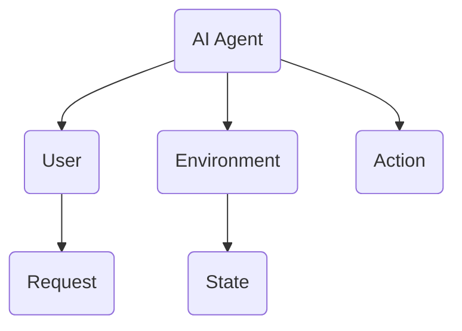
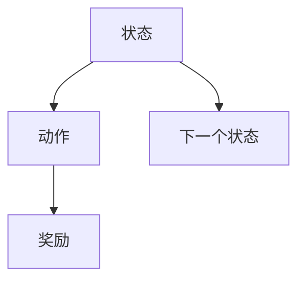
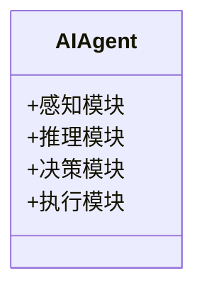
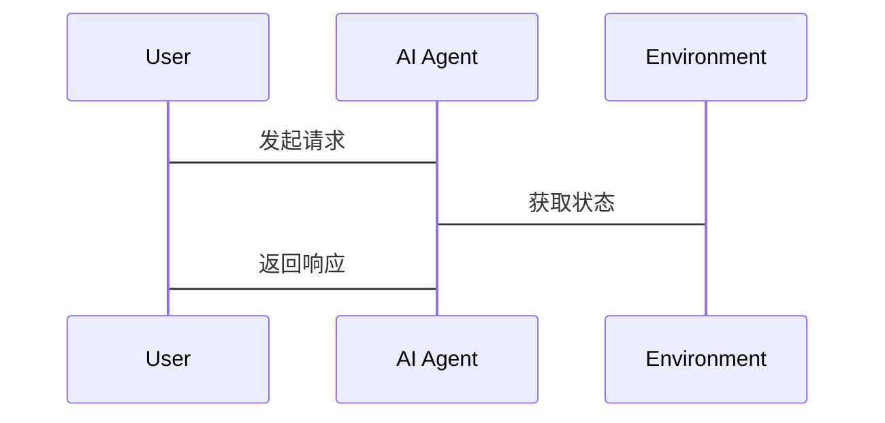

                 


# AI Agent开发中的常见挑战及对策

> **关键词**：AI Agent、机器学习、自然语言处理、强化学习、知识图谱、系统架构

> **摘要**：本文详细探讨了AI Agent开发中的常见挑战，并提出了相应的解决对策。文章从AI Agent的基本概念出发，分析了其核心原理与应用场景，随后重点阐述了在复杂环境决策优化、知识表示与推理、多模态交互等方面的挑战，并结合实际案例，给出了基于强化学习和监督学习的算法实现方案，最后总结了AI Agent开发的最佳实践与未来发展方向。

---

## 第一部分: AI Agent开发背景与核心概念

### 第1章: AI Agent的基本概念与背景

#### 1.1 AI Agent的定义与核心概念
##### 1.1.1 什么是AI Agent
AI Agent（人工智能代理）是一种能够感知环境、自主决策并执行任务的智能实体。它通过传感器获取信息，利用推理能力进行分析，并通过执行器与环境交互。AI Agent可以是软件程序、机器人或其他智能设备。

##### 1.1.2 AI Agent的核心属性
- **自主性**：无需外部干预，自主完成任务。
- **反应性**：能够实时感知环境变化并做出反应。
- **目标导向性**：基于目标进行决策和行动。
- **学习能力**：通过经验改进自身性能。

##### 1.1.3 AI Agent与传统软件的区别
| 特性            | AI Agent                     | 传统软件               |
|-----------------|------------------------------|-----------------------|
| 智能性          | 高                           | 低或无                |
| 适应性          | 强                           | 弱或无                |
| 自主性          | 高                           | 低或无                |
| 学习能力        | 强                           | 无或弱                |

#### 1.2 AI Agent的发展背景
##### 1.2.1 AI技术的演进历程
AI技术经历了从符号逻辑推理到机器学习的转变，近年来深度学习的崛起推动了AI Agent的发展。

##### 1.2.2 AI Agent在现代应用中的地位
AI Agent已成为智能化系统的核心组件，广泛应用于自动驾驶、智能助手、机器人等领域。

##### 1.2.3 当前AI Agent开发的趋势
- **多模态交互**：支持文本、语音、视觉等多种交互方式。
- **强化学习应用**：强化学习成为AI Agent决策的核心方法。
- **人机协作**：AI Agent与人类协同工作的能力越来越强。

#### 1.3 AI Agent的应用场景
##### 1.3.1 智能助手与个人服务
- 例如Siri、Alexa等智能助手。
##### 1.3.2 企业级应用与自动化
- 例如企业流程自动化机器人（RPA）。
##### 1.3.3 行业特定应用案例
- 医疗领域的智能诊断助手。

### 第2章: AI Agent的核心概念与联系

#### 2.1 AI Agent的核心原理
##### 2.1.1 感知与决策机制
AI Agent通过传感器获取环境信息，利用推理引擎进行分析，并基于预设策略做出决策。

##### 2.1.2 行为与执行策略
AI Agent根据决策结果执行动作，例如发送指令、调整参数等。

##### 2.1.3 知识表示与推理
知识表示是AI Agent理解世界的基础，常用知识图谱或逻辑推理方法。

#### 2.2 AI Agent与相关技术的关系
##### 2.2.1 AI Agent与机器学习
AI Agent依赖机器学习算法进行感知和决策。
##### 2.2.2 AI Agent与自然语言处理
自然语言处理技术使AI Agent能够理解并生成人类语言。
##### 2.2.3 AI Agent与机器人技术
AI Agent与机器人技术结合，实现了智能机器人的应用。

#### 2.3 AI Agent的实体关系图


---

## 第二部分: AI Agent开发中的常见挑战

### 第3章: AI Agent开发中的常见挑战

#### 3.1 挑战一：复杂环境下的决策优化
##### 3.1.1 多目标优化问题
AI Agent需要在多个目标之间找到平衡点，例如在推荐系统中平衡用户满意度和商业利益。

##### 3.1.2 动态环境适应性
环境的变化可能导致AI Agent的策略失效，需要动态调整。

##### 3.1.3 稀疏反馈的处理
在某些场景下，用户反馈稀疏，AI Agent难以通过反馈改进。

#### 3.2 挑战二：知识表示与推理的局限性
##### 3.2.1 知识图谱的构建难度
知识图谱需要大量人工标注，构建成本高。

##### 3.2.2 非结构化数据的处理
非结构化数据（如文本、图像）难以直接用于推理。

##### 3.2.3 实时推理的效率问题
实时推理需要高效的计算能力，对硬件要求高。

#### 3.3 挑战三：多模态交互的协调性
##### 3.3.1 文本与语音的协同
需要统一的交互框架处理文本和语音信息。

##### 3.3.2 视觉与语言的结合
多模态数据的融合需要复杂的处理逻辑。

##### 3.3.3 多渠道交互的统一性
不同交互渠道（如网页、移动APP）的统一性问题。

---

## 第三部分: AI Agent开发的核心算法与数学模型

### 第4章: AI Agent开发的核心算法与数学模型

#### 4.1 基于强化学习的决策算法
##### 4.1.1 Q-learning算法

##### 4.1.2 算法公式
$$ Q(s,a) = Q(s,a) + \alpha (r + \max Q(s',a') - Q(s,a)) $$

#### 4.2 基于监督学习的知识表示
##### 4.2.1 知识图谱构建
$$ node = (id, label) $$
$$ edge = (source, relation, target) $$

---

## 第四部分: AI Agent开发的系统架构设计

### 第5章: AI Agent开发的系统架构设计

#### 5.1 系统功能设计
##### 5.1.1 领域模型


#### 5.2 系统架构设计
##### 5.2.1 系统架构图


#### 5.3 系统接口设计
##### 5.3.1 API接口
- `/api/v1/agent/action`
- `/api/v1/agent/status`

#### 5.4 系统交互设计
##### 5.4.1 序列图


---

## 第五部分: AI Agent开发的项目实战

### 第6章: AI Agent开发的项目实战

#### 6.1 项目介绍
##### 6.1.1 项目背景
开发一个智能推荐系统，基于强化学习算法。

#### 6.2 核心代码实现
##### 6.2.1 环境配置
```python
import numpy as np
from collections import deque
import random
```

##### 6.2.2 核心代码
```python
class AI-Agent:
    def __init__(self, state_space, action_space):
        self.state_space = state_space
        self.action_space = action_space
        self.q_table = deque()

    def perceive(self, state):
        # 处理感知
        pass

    def decide(self, state):
        # 基于Q-learning的决策
        return self.q_table[state]

    def learn(self, state, action, reward):
        # 更新Q值
        self.q_table[state][action] += reward
```

#### 6.3 实际案例分析
##### 6.3.1 应用效果
- 提高用户满意度
- 增加系统响应速度

#### 6.4 项目小结
通过实际项目，验证了强化学习算法的有效性，为后续开发提供了参考。

---

## 第六部分: 总结与展望

### 第7章: 总结与展望

#### 7.1 本文总结
本文详细探讨了AI Agent开发中的常见挑战，并提出了相应的解决对策。

#### 7.2 未来展望
未来，AI Agent将在更多领域得到应用，算法也将更加智能化。

---

## 附录

### 参考文献
1. Russell, S., & Norvig, P. (2010). Artificial Intelligence: A Modern Approach.
2. Sutton, R. S., & Barto, A. G. (2018). Introduction to Reinforcement Learning.

### 工具推荐
- **强化学习框架**：OpenAI Gym
- **知识图谱工具**：Neo4j
- **多模态交互工具**：spaCy

---

通过本文的系统讲解，读者可以全面了解AI Agent开发中的常见挑战，并掌握相应的解决方法，为实际开发提供有力指导。

