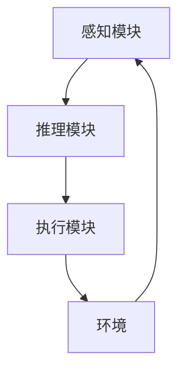
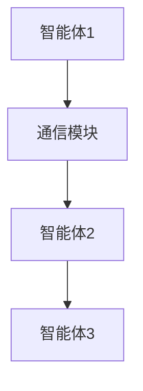

                 


# AI Agent技术未来发展趋势预测

> 关键词：AI Agent, 人工智能, 生成式AI, 强化学习, 多智能体系统, 未来趋势

> 摘要：本文将探讨AI Agent技术的未来发展趋势，从技术背景、核心概念、算法原理、系统架构、项目实战到未来预测，全面分析AI Agent的发展方向和技术应用前景。

---

## 第1章: AI Agent 的基本概念与背景

### 1.1 AI Agent 的定义与核心要素

#### 1.1.1 什么是 AI Agent
AI Agent（人工智能代理）是一种能够感知环境、做出决策并采取行动以实现特定目标的智能实体。与传统程序不同，AI Agent具有自主性、反应性和目标导向性，能够在动态环境中适应变化。

#### 1.1.2 AI Agent 的核心要素与属性
AI Agent的核心要素包括：
- **自主性**：能够独立决策和行动，无需外部干预。
- **反应性**：能够感知环境并实时调整行为。
- **目标导向性**：以实现特定目标为导向。
- **知识表示**：通过知识库表示任务相关的知识和经验。
- **推理能力**：基于感知信息和知识库进行逻辑推理。

#### 1.1.3 AI Agent 与传统 AI 的区别
| 对比维度       | 传统AI                     | AI Agent                |
|----------------|---------------------------|--------------------------|
| 行为方式       | 预定义规则执行             | 自主决策和行动           |
| 环境适应性     | 静态或固定场景             | 动态环境适应             |
| 交互方式       | 单向输出结果               | 可与环境和用户交互         |

### 1.2 AI Agent 的发展背景

#### 1.2.1 人工智能技术的演进历程
人工智能技术经历了从符号推理到机器学习，再到深度学习的演变。AI Agent作为AI技术的延伸，结合了生成式AI和强化学习的优势，成为新一代智能系统的核心。

#### 1.2.2 大模型技术对 AI Agent 的影响
大模型（如GPT系列）的出现，为AI Agent提供了强大的自然语言处理和生成能力。通过与强化学习结合，AI Agent能够实现更复杂的任务。

#### 1.2.3 当前 AI Agent 的应用现状
AI Agent已在多个领域得到应用，如智能助手（Siri、Alexa）、自动驾驶、智能推荐系统等。这些应用展示了AI Agent的强大潜力。

### 1.3 AI Agent 的应用场景与价值

#### 1.3.1 AI Agent 在各行业的应用案例
- **金融行业**：智能投资顾问、风险评估。
- **医疗行业**：疾病诊断辅助、药物研发。
- **制造业**：智能监控、生产优化。

#### 1.3.2 AI Agent 的核心价值与优势
- 提高效率：通过自动化决策和执行，减少人工干预。
- 实时响应：快速感知并做出决策。
- 智能学习：通过强化学习不断优化行为。

#### 1.3.3 AI Agent 的未来潜力与挑战
- 潜力：广泛应用于各行业，提升智能化水平。
- 挑战：数据隐私、计算资源需求、多智能体协作复杂性。

---

## 第2章: AI Agent 的核心概念与技术原理

### 2.1 AI Agent 的核心概念体系

#### 2.1.1 AI Agent 的问题背景与目标设定
AI Agent的目标设定需要明确任务和约束条件。例如，在自动驾驶场景中，AI Agent的目标是安全到达目的地。

#### 2.1.2 AI Agent 的问题描述与解决方案
AI Agent需要解决的问题包括路径规划、障碍物 avoidance等。解决方案通常涉及感知、决策和执行三个阶段。

#### 2.1.3 AI Agent 的边界与外延分析
AI Agent的边界包括其感知范围和决策能力。外延则涉及与其他系统的协作。

### 2.2 AI Agent 的技术原理与关键模块

#### 2.2.1 知识表示与推理机制
- **知识表示**：通过知识图谱表示任务相关的知识。
- **推理机制**：基于逻辑推理或概率推理做出决策。

#### 2.2.2 感知与交互能力
- **感知**：通过传感器或API获取环境信息。
- **交互**：与用户或环境进行自然语言对话。

#### 2.2.3 决策与执行系统
- **决策系统**：基于感知信息和知识库做出决策。
- **执行系统**：通过API或动作执行决策。

### 2.3 AI Agent 的核心算法与实现

#### 2.3.1 基于大模型的生成式 AI
- **生成式AI**：利用GPT模型生成自然语言文本。
- **应用案例**：智能对话系统。

#### 2.3.2 强化学习与决策优化
- **强化学习**：通过奖励机制优化决策策略。
- **数学模型**：Q-Learning算法。

#### 2.3.3 多智能体协作机制
- **协作机制**：通过通信协议实现多智能体协作。
- **挑战**：任务分配和冲突解决。

---

## 第3章: AI Agent 的算法原理与数学模型

### 3.1 生成式 AI 的数学模型

#### 3.1.1 变压器模型（Transformer）的基本结构
- **编码器**：将输入序列编码为向量。
- **解码器**：根据编码向量生成输出序列。

#### 3.1.2 注意力机制（Attention）的数学公式
$$\text{Attention}(Q, K, V) = \text{softmax}\left(\frac{QK^T}{\sqrt{d_k}}\right)V$$

#### 3.1.3 梯度下降与损失函数优化
- **损失函数**：交叉熵损失。
- **优化算法**：Adam优化器。

### 3.2 强化学习的核心算法

#### 3.2.1 Q-Learning 算法的实现原理
- **状态**：环境中的当前情况。
- **动作**：AI Agent的决策。
- **奖励**：环境对决策的反馈。

#### 3.2.2 策略梯度（Policy Gradient）方法
- **策略函数**：$\pi_\theta(a|s)$，表示在状态$s$下采取动作$a$的概率。

#### 3.2.3 深度强化学习（Deep RL）的数学模型
- **深度Q网络**：$Q(s, a)$，表示状态$s$和动作$a$的Q值。

### 3.3 多智能体协作的数学建模

#### 3.3.1 多智能体系统中的通信协议
- **异步通信**：通过消息队列实现。
- **同步通信**：通过共享内存实现。

#### 3.3.2 联合决策的数学模型
- **联合策略**：多个智能体协作决策。

#### 3.3.3 协作与竞争关系的数学分析
- **协作收益**：$R_c$
- **竞争损失**：$R_l$

---

## 第4章: AI Agent 的系统架构与设计

### 4.1 系统架构设计

#### 4.1.1 AI Agent 的功能模块划分
- **感知模块**：获取环境信息。
- **推理模块**：逻辑推理和决策。
- **执行模块**：执行决策动作。

#### 4.1.2 系统架构的 Mermaid 图



### 4.2 多智能体协作系统设计

#### 4.2.1 多智能体系统的 Mermaid 图



#### 4.2.2 通信协议设计
- **基于消息队列**：Kafka或RabbitMQ。
- **基于服务调用**：gRPC或HTTP API。

### 4.3 项目实战：实现一个简单的AI Agent

#### 4.3.1 环境配置
- **安装Python**：`python --version`
- **安装依赖**：`pip install transformers`

#### 4.3.2 核心代码实现
```python
from transformers import GPT2Tokenizer, GPT2Model

tokenizer = GPT2Tokenizer.from_pretrained('gpt2')
model = GPT2Model.from_pretrained('gpt2')

def generate_response(prompt):
    inputs = tokenizer(prompt, return_tensors='np')
    outputs = model.generate(inputs.input_ids, max_length=50)
    response = tokenizer.decode(outputs[0], skip_special_tokens=True)
    return response
```

#### 4.3.3 代码解读与分析
- **tokenizer**：将输入文本转换为模型可理解的格式。
- **model**：生成对应的输出序列。

---

## 第5章: AI Agent 的未来发展趋势

### 5.1 技术演变与突破

#### 5.1.1 大模型技术的进一步发展
- **更大参数量**：万亿参数模型。
- **更高效的训练方法**：分布式训练。

#### 5.1.2 多智能体协作的优化
- **更高效的通信机制**：如图灵完备的通信协议。
- **更智能的协作算法**：如基于深度强化学习的协作策略。

### 5.2 行业应用与生态建设

#### 5.2.1 金融行业的智能化转型
- **智能投资顾问**：基于AI Agent的自动化投资决策。
- **风险管理**：AI Agent实时监控市场风险。

#### 5.2.2 医疗健康领域的创新
- **疾病诊断**：AI Agent辅助医生诊断疾病。
- **药物研发**：AI Agent加速药物研发过程。

### 5.3 伦理与社会影响

#### 5.3.1 数据隐私问题
- **数据加密**：保护用户隐私。
- **数据共享机制**：平衡数据隐私与协作需求。

#### 5.3.2 人机协作模式的演变
- **从替代人类**到**人机协同**：AI Agent作为人类的辅助工具。

---

## 第6章: 结语与展望

### 6.1 结语
AI Agent技术的发展将深刻改变我们的生活方式和工作方式。随着技术的进步，AI Agent将在更多领域发挥重要作用。

### 6.2 展望
未来的AI Agent将更加智能、自主和协作。它们将与人类共同工作，推动社会的进步。

---

通过以上内容，我们可以清晰地看到AI Agent技术的未来发展趋势。从技术背景到系统设计，从算法实现到项目实战，再到未来预测，AI Agent将在更多领域展现出其强大的潜力。

