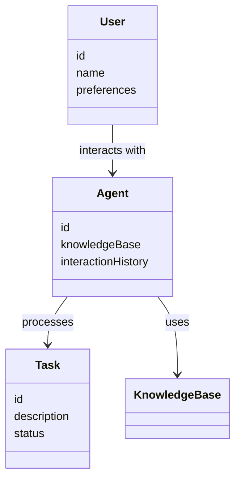
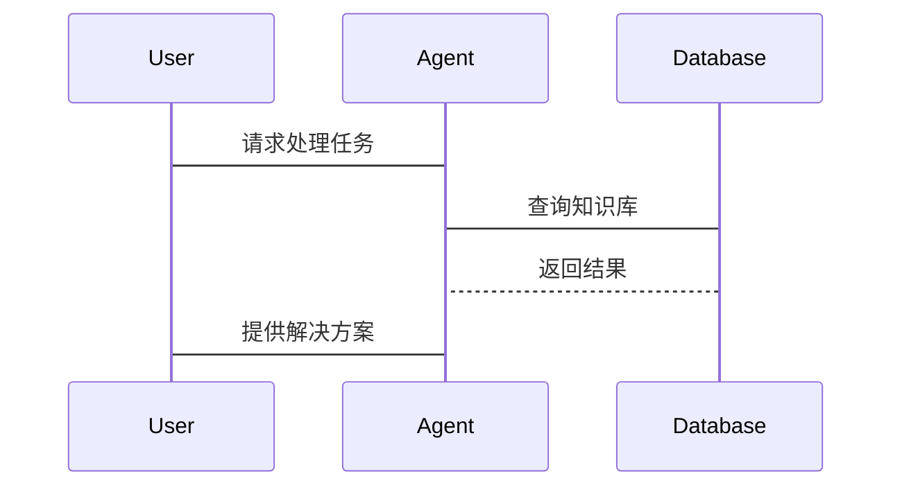

                 


# AI Agent架构设计：从概念到实现

> 关键词：AI Agent、架构设计、强化学习、马尔可夫决策过程、知识表示、系统架构

> 摘要：AI Agent作为一种智能实体，在现代信息技术和人工智能领域发挥着重要作用。本文将从AI Agent的基本概念、架构类型、核心模块、算法原理、系统架构设计、项目实战等多个方面，全面解析AI Agent的架构设计过程，帮助读者从理论到实践，掌握AI Agent的设计方法。

---

# 第一部分: AI Agent架构设计概述

## 第1章: AI Agent的基本概念与背景

### 1.1 AI Agent的定义与背景

#### 1.1.1 什么是AI Agent
AI Agent（人工智能代理）是一种能够感知环境、自主决策并执行任务的智能实体。它可以是一个软件程序，也可以是一个物理机器人，其核心目标是通过与环境交互，实现特定的目标或解决问题。

#### 1.1.2 AI Agent的发展历程
AI Agent的概念起源于20世纪60年代，随着人工智能技术的发展，AI Agent逐渐从理论研究走向实际应用。近年来，随着深度学习和强化学习的兴起，AI Agent在自动驾驶、智能助手、游戏AI等领域取得了显著进展。

#### 1.1.3 AI Agent的应用场景
AI Agent广泛应用于多个领域，例如：
- **自动驾驶**：通过感知环境和决策系统实现车辆的自主驾驶。
- **智能助手**：如Siri、Alexa等，通过语音交互帮助用户完成任务。
- **游戏AI**：在电子游戏中，AI Agent可以控制非玩家角色，提供更智能的游戏体验。
- **机器人技术**：用于工业自动化、服务机器人等领域。

### 1.2 AI Agent的核心概念

#### 1.2.1 Agent的智能性
AI Agent的核心特征之一是其智能性。智能性体现在以下几个方面：
- **感知能力**：通过传感器或其他输入方式获取环境信息。
- **推理能力**：基于感知的信息，通过逻辑推理或机器学习模型做出决策。
- **学习能力**：通过与环境的交互，不断优化自身的行为策略。

#### 1.2.2 Agent的自主性
AI Agent的自主性是指其能够在没有外部干预的情况下，独立完成任务。这种自主性体现在：
- **自主决策**：AI Agent可以根据当前状态和环境信息，自主选择最优动作。
- **自适应能力**：在动态变化的环境中，AI Agent能够调整策略以应对新的挑战。

#### 1.2.3 Agent的协作性
AI Agent的协作性是指多个AI Agent之间能够通过通信和协作，共同完成复杂任务。协作性涉及：
- **分布式决策**：多个AI Agent在分布式系统中协作，共同完成目标。
- **通信机制**：通过消息传递或其他通信方式，实现Agent之间的信息共享和协作。

### 1.3 AI Agent与相关技术的关系

#### 1.3.1 AI Agent与机器学习
AI Agent的核心技术之一是机器学习，尤其是监督学习和强化学习。机器学习为AI Agent提供了感知和决策的能力。

#### 1.3.2 AI Agent与机器人技术
AI Agent与机器人技术密切相关，尤其是机器人中的自主决策和运动控制部分。AI Agent为机器人提供了智能决策的核心模块。

#### 1.3.3 AI Agent与分布式系统
AI Agent在分布式系统中扮演着重要角色，特别是在多 Agent 系统中，需要通过分布式架构实现高效的通信和协作。

---

## 第2章: AI Agent的类型与架构

### 2.1 基于智能体的类型

#### 2.1.1 简单反射型Agent
简单反射型Agent是一种最简单的AI Agent类型，其行为基于当前感知到的环境信息，不考虑长期规划。例如，一个简单的自动贩卖机可以根据用户的输入直接响应，而不考虑库存的全局状态。

#### 2.1.2 基于模型的反射型Agent
基于模型的反射型Agent在决策过程中引入了对环境的模型，能够更好地理解环境的状态，并做出更复杂的决策。例如，在自动驾驶系统中，AI Agent会根据地图、传感器数据等信息，构建环境的模型，并基于此模型做出驾驶决策。

#### 2.1.3 目标驱动型Agent
目标驱动型Agent具有明确的目标，并通过规划和执行来实现这些目标。例如，在智能助手系统中，AI Agent会根据用户的请求，通过任务分解和执行来完成目标。

#### 2.1.4 计划驱动型Agent
计划驱动型Agent是一种更复杂的AI Agent类型，其决策过程基于详细的计划和任务分解。例如，在复杂的机器人任务中，AI Agent会制定详细的执行计划，并根据环境的变化进行调整。

### 2.2 AI Agent的架构模式

#### 2.2.1 反射型架构
反射型架构是一种基于感知和反应的架构模式，其核心是快速响应环境的变化。例如，在实时游戏AI中，反射型架构可以快速响应玩家的动作并做出相应的反应。

#### 2.2.2 行为选择架构
行为选择架构是一种基于多行为选择的架构模式，其核心是通过选择最优行为来实现目标。例如，在智能助手系统中，AI Agent会根据用户的需求，从多个可能的行为中选择最优的一个。

#### 2.2.3 知识表示架构
知识表示架构是一种基于知识库的架构模式，其核心是通过知识表示和推理来做出决策。例如，在复杂问题求解中，AI Agent会利用知识图谱等工具，通过推理来做出决策。

#### 2.2.4 分层架构
分层架构是一种将AI Agent的功能分解为多个层次的架构模式，其核心是通过层次化的设计来提高系统的可扩展性和可维护性。例如，在自动驾驶系统中，分层架构可以将感知、决策和执行分解为不同的层次。

### 2.3 不同架构的优缺点对比

#### 2.3.1 简单反射型Agent的适用场景
简单反射型Agent适用于任务简单、环境变化缓慢的场景，例如简单的自动贩卖机。

#### 2.3.2 基于模型的反射型Agent的复杂性
基于模型的反射型Agent适用于任务复杂、需要对环境有深入理解的场景，例如自动驾驶系统。其复杂性较高，但决策更准确。

#### 2.3.3 目标驱动型Agent的灵活性
目标驱动型Agent适用于任务明确、需要灵活调整的场景，例如智能助手系统。其灵活性较高，但需要明确的目标。

#### 2.3.4 分层架构的可扩展性
分层架构适用于复杂系统的设计，例如自动驾驶系统。其可扩展性较高，但设计复杂。

---

## 第3章: AI Agent的核心模块与功能

### 3.1 感知模块

#### 3.1.1 感知模块的功能
感知模块是AI Agent的核心模块之一，其功能包括：
- **数据采集**：通过传感器或其他输入方式获取环境信息。
- **数据处理**：对采集到的数据进行预处理，提取有用的信息。
- **特征提取**：通过特征提取技术，将原始数据转换为特征向量，以便后续处理。

#### 3.1.2 常用的感知算法
常用的感知算法包括：
- **图像处理**：如CNN（卷积神经网络）用于图像识别。
- **自然语言处理**：如NLP技术用于文本理解和语义分析。
- **语音识别**：如Kaldi或TensorFlow Lite用于语音识别。

#### 3.1.3 感知数据的处理流程
感知数据的处理流程通常包括以下几个步骤：
1. **数据采集**：通过传感器或输入接口获取原始数据。
2. **数据预处理**：对原始数据进行清洗、归一化等处理。
3. **特征提取**：将预处理后的数据转换为特征向量。
4. **特征选择**：选择对任务最有用的特征。

#### 3.1.4 感知模块的实现案例
以图像识别为例，感知模块可以通过CNN提取图像的特征向量，然后将这些特征向量传递给决策模块进行分类。

### 3.2 决策模块

#### 3.2.1 决策模块的作用
决策模块是AI Agent的核心模块之一，其作用包括：
- **行为选择**：根据感知模块提供的信息，选择最优的行为。
- **策略优化**：通过强化学习等技术，不断优化决策策略。
- **风险评估**：评估不同行为的风险，并选择风险最小的行为。

#### 3.2.2 常用的决策算法
常用的决策算法包括：
- **强化学习**：如Q-learning和Deep Q-Networks。
- **逻辑推理**：如基于规则的推理和基于知识图谱的推理。
- **遗传算法**：用于复杂的优化问题。

#### 3.2.3 决策过程中的权衡
在决策过程中，需要权衡以下几个方面：
- **效率**：决策速度是否满足实时性要求。
- **准确性**：决策的准确性是否足够高。
- **鲁棒性**：决策是否能够应对环境的变化和不确定性。

### 3.3 行动模块

#### 3.3.1 行动模块的实现
行动模块是AI Agent的执行模块，其功能包括：
- **动作执行**：根据决策模块的指令，执行具体的动作。
- **反馈收集**：收集动作执行后的反馈信息，用于后续的优化。

#### 3.3.2 行动执行的挑战
行动执行的挑战包括：
- **环境的不确定性**：环境的变化可能导致动作执行失败。
- **系统的实时性**：需要在规定的时间内完成动作执行。
- **系统的安全性**：需要确保动作执行的安全性，避免对环境或系统造成损害。

#### 3.3.3 行动结果的反馈机制
反馈机制是AI Agent的重要组成部分，其作用包括：
- **优化决策策略**：通过反馈信息，优化决策模块的策略。
- **改进感知模型**：通过反馈信息，改进感知模块的模型。
- **增强系统鲁棒性**：通过反馈信息，增强系统的整体鲁棒性。

### 3.4 本章小结
本章详细介绍了AI Agent的核心模块，包括感知模块、决策模块和行动模块。每个模块的功能、实现方法和挑战都进行了详细的讨论。通过这些模块的协同工作，AI Agent能够实现感知、决策和执行的闭环，从而完成复杂的任务。

---

## 第4章: AI Agent的算法原理

### 4.1 强化学习算法

#### 4.1.1 强化学习的基本原理
强化学习是一种通过试错方式来优化决策策略的算法。其核心是通过与环境的交互，不断优化策略，以最大化累积奖励。

#### 4.1.2 Q-learning算法的实现
Q-learning是一种经典的强化学习算法，其核心是通过更新Q值表来优化策略。Q值表表示在特定状态下采取某个动作的期望奖励。

##### Q-learning算法步骤：
1. 初始化Q值表为0。
2. 在每一步，根据当前状态选择一个动作。
3. 执行动作，获得奖励，并转移到新的状态。
4. 更新Q值表：$Q(s, a) = Q(s, a) + \alpha (r + \gamma \max Q(s', a') - Q(s, a))$，其中$\alpha$是学习率，$\gamma$是折扣因子。
5. 重复上述步骤，直到收敛。

##### 示例：
假设我们有一个简单的迷宫问题，AI Agent的目标是找到从起点到终点的最短路径。通过Q-learning算法，AI Agent可以通过试错的方式，逐步优化Q值表，最终找到最优路径。

#### 4.1.3 Deep Q-Networks的原理
Deep Q-Networks（DQN）是将深度学习与Q-learning结合的一种强化学习算法。其核心是通过神经网络来近似Q值函数，从而避免了Q值表的维护。

##### DQN算法步骤：
1. 初始化神经网络模型。
2. 在每一步，根据当前状态，通过神经网络预测Q值。
3. 执行动作，获得奖励，并转移到新的状态。
4. 将当前状态、动作、奖励和新状态存储在经验回放中。
5. 通过随机抽取经验回放中的样本，更新神经网络模型。
6. 重复上述步骤，直到收敛。

##### 示例：
以DQN为例，假设我们有一个Atari游戏，AI Agent的目标是通过游戏并获得最高分数。DQN可以通过经验回放和神经网络的更新，不断优化策略，最终在游戏环境中取得较高的分数。

#### 4.1.4 强化学习算法的优缺点分析
- **优点**：
  - 强化学习能够通过试错的方式，自动优化策略。
  - 适用于复杂环境和非结构化任务。
- **缺点**：
  - 强化学习需要大量的训练数据和计算资源。
  - 策略的收敛性依赖于环境的马尔可夫性质。

### 4.2 马尔可夫决策过程（MDP）

#### 4.2.1 MDP的定义与特点
马尔可夫决策过程（MDP）是一种描述决策过程的数学模型，其核心假设是当前状态只依赖于当前的环境信息，而不考虑历史信息。MDP由以下五个要素组成：
- **状态空间**（S）：所有可能的状态的集合。
- **动作空间**（A）：所有可能的动作的集合。
- **转移概率**（P）：从当前状态和动作转移到下一个状态的概率。
- **奖励函数**（R）：执行某个动作后获得的奖励。
- **终止条件**（T）：是否到达终止状态。

#### 4.2.2 MDP在AI Agent中的应用
MDP广泛应用于AI Agent的决策过程中，例如在自动驾驶、机器人控制和游戏AI中，MDP模型被用来描述环境的状态和动作，从而指导AI Agent的决策。

#### 4.2.3 MDP的扩展与优化
- **扩展**：将MDP扩展到部分可观察的环境，即状态空间包括所有可能的环境信息。
- **优化**：通过动态规划或强化学习等方法，优化MDP的决策策略。

### 4.3 知识表示与推理

#### 4.3.1 知识表示的基本方法
知识表示是AI Agent的核心能力之一，其基本方法包括：
- **逻辑表示**：使用逻辑规则和谓词逻辑来表示知识。
- **语义网络**：通过节点和边来表示知识。
- **知识图谱**：通过图结构表示实体和概念之间的关系。

#### 4.3.2 逻辑推理的实现
逻辑推理是通过知识表示进行推理的过程，其主要方法包括：
- **演绎推理**：从一般到特殊的推理。
- **归纳推理**：从特殊到一般的推理。
- **溯因推理**：从结果推导原因。

#### 4.3.3 知识图谱的应
知识图谱是一种大规模的语义网络，广泛应用于AI Agent的知识表示和推理。例如，在智能助手系统中，知识图谱可以用来理解和关联用户的需求。

---

## 第5章: AI Agent的系统架构设计

### 5.1 问题场景介绍
在本章中，我们将以一个具体的AI Agent系统为例，详细介绍系统的架构设计过程。假设我们设计一个智能助手系统，其目标是通过与用户的交互，帮助用户完成各种任务。

### 5.2 系统功能设计
系统的功能需求包括：
- **用户交互**：通过语音或文本与用户交互。
- **任务处理**：根据用户的需求，分解任务并执行。
- **知识库管理**：维护一个知识库，用于存储和管理用户的相关信息。

#### 5.2.1 领域模型（mermaid 类图）
以下是系统的领域模型类图：



### 5.3 系统架构设计

#### 5.3.1 mermaid 架构图
以下是系统的架构设计图：


### 5.4 系统接口设计
系统的接口设计包括：
- **用户接口**：通过API或图形界面与用户交互。
- **服务接口**：与其他系统（如知识库、第三方服务）进行通信。

### 5.5 系统交互流程（mermaid 序列图）



---

## 第6章: AI Agent的项目实战

### 6.1 环境安装
要运行AI Agent系统，需要安装以下环境和工具：
- **编程语言**：Python 3.8+
- **深度学习框架**：TensorFlow或PyTorch
- **自然语言处理库**：spaCy或NLTK
- **强化学习库**：OpenAI Gym或Gymnasium
- **可视化工具**：Mermaid CLI或Visual Studio Code的Mermaid扩展

### 6.2 系统核心实现源代码

#### 6.2.1 强化学习部分（Q-learning实现）
```python
import numpy as np
import random

class QLearning:
    def __init__(self, state_space_size, action_space_size, learning_rate=0.1, gamma=0.9):
        self.q_table = np.zeros((state_space_size, action_space_size))
        self.learning_rate = learning_rate
        self.gamma = gamma

    def choose_action(self, state, epsilon=0.1):
        if random.random() < epsilon:
            return random.randint(0, action_space_size-1)
        else:
            return np.argmax(self.q_table[state])

    def update_q_table(self, state, action, reward, next_state):
        current_q = self.q_table[state][action]
        max_next_q = np.max(self.q_table[next_state])
        target = reward + self.gamma * max_next_q
        self.q_table[state][action] = current_q + self.learning_rate * (target - current_q)
```

#### 6.2.2 知识表示部分（知识图谱构建）
```python
from kglib import kgconstruction

class KnowledgeGraph:
    def __init__(self):
        self.graph = kgconstruction.KnowledgeGraph()

    def add_relation(self, subject, predicate, object):
        self.graph.add_triple(subject, predicate, object)

    def query(self, subject, predicate):
        return self.graph.query_triples(subject, predicate)
```

### 6.3 代码应用解读与分析
以上代码实现了AI Agent的核心功能，包括强化学习和知识表示。Q-learning算法用于决策过程，而知识图谱用于存储和管理知识。

### 6.4 实际案例分析和详细讲解剖析
以智能助手系统为例，AI Agent可以通过强化学习优化其对话策略，并通过知识图谱提供准确的信息检索服务。例如，当用户询问“最近的咖啡店在哪里？”，AI Agent可以通过强化学习选择最优的回复策略，并通过知识图谱检索附近的咖啡店信息。

### 6.5 项目小结
本章通过实际案例，详细讲解了AI Agent系统的实现过程，包括环境安装、核心代码实现、系统交互流程等。通过这些实践，读者可以更好地理解AI Agent的架构设计和实现细节。

---

## 第7章: 总结与展望

### 7.1 本章总结
本文从AI Agent的基本概念、架构类型、核心模块、算法原理、系统架构设计和项目实战等多个方面，全面解析了AI Agent的架构设计过程。通过理论与实践的结合，帮助读者从理论到实践，掌握AI Agent的设计方法。

### 7.2 未来展望
随着人工智能技术的不断发展，AI Agent的应用场景将更加广泛，其架构设计也将更加复杂和多样化。未来的研究方向包括：
- **多 Agent 协作**：研究多个AI Agent之间的协作机制，提高系统的整体性能。
- **人机协作**：探索人机协作的新模式，增强AI Agent与人类的交互能力。
- **边缘计算**：将AI Agent部署在边缘设备上，实现低延迟和高实时性的目标。

### 7.3 最佳实践 tips
- **模块化设计**：在设计AI Agent时，建议采用模块化设计，以便于系统的扩展和维护。
- **数据驱动**：强化学习等数据驱动的方法在AI Agent设计中非常重要，建议优先选择数据驱动的方法。
- **持续优化**：AI Agent的性能需要通过持续优化来提高，建议定期收集反馈并优化系统。

### 7.4 注意事项
- **数据隐私**：在设计AI Agent时，需要特别注意数据隐私问题，确保系统的安全性。
- **系统鲁棒性**：AI Agent需要具备较强的鲁棒性，能够应对各种复杂和不确定的环境。

### 7.5 拓展阅读
- **推荐书籍**：《Reinforcement Learning: Theory and Algorithms》
- **推荐论文**：《Deep Reinforcement Learning: An Overview》
- **推荐网站**：[OpenAI Gym](https://www.gymlibrary.ml/)

---

通过以上内容，读者可以系统地了解AI Agent的架构设计过程，并掌握从概念到实现的完整流程。

