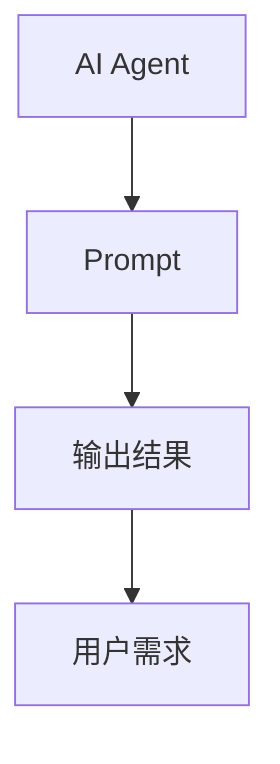
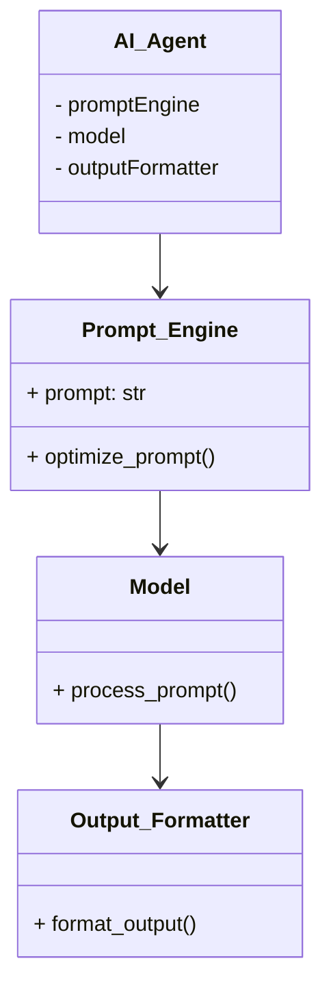
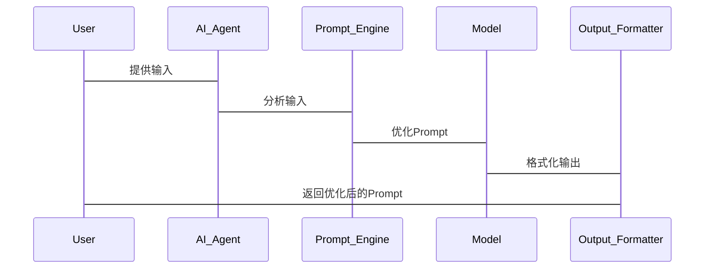

                 


# AI Agent的Prompt工程：优化输入以获得更好的输出

> 关键词：AI Agent, Prompt工程, 优化输入, 输出质量, 人工智能, 系统架构

> 摘要：本文深入探讨AI Agent的Prompt工程，分析优化输入对输出质量的影响，从背景、原理到系统架构和实战案例，全面解析如何通过优化Prompt提升AI Agent性能。

---

# 第一部分: AI Agent与Prompt工程的背景与基础

# 第1章: AI Agent与Prompt工程概述

## 1.1 AI Agent的基本概念

### 1.1.1 AI Agent的定义与特点

AI Agent（人工智能代理）是指能够感知环境并采取行动以实现目标的智能实体。其特点包括：

- **自主性**：能够在没有外部干预的情况下运行。
- **反应性**：能够根据环境变化动态调整行为。
- **目标导向性**：所有行动都围绕特定目标展开。
- **社会能力**：能够与其他系统或人类进行交互协作。

### 1.1.2 AI Agent的分类与应用场景

AI Agent可以分为以下几类：

1. **反应式AI Agent**：基于当前输入做出即时反应，如聊天机器人。
2. **认知式AI Agent**：具备复杂推理能力，如自动驾驶系统。
3. **协作式AI Agent**：能够与其他AI Agent或人类协同工作，如智能助手。

### 1.1.3 AI Agent与传统程序的区别

AI Agent的核心区别在于其具备学习和适应能力，能够通过数据和交互提升性能，而传统程序依赖预定义规则。

## 1.2 Prompt工程的背景与意义

### 1.2.1 Prompt工程的起源

Prompt工程起源于自然语言处理领域，通过优化输入指令来提升模型输出质量。

### 1.2.2 Prompt工程的核心价值

- **提升输出质量**：通过优化输入，使模型生成更准确、更符合预期的结果。
- **增强系统灵活性**：降低对模型本身的依赖，通过输入控制输出。

### 1.2.3 Prompt工程在AI Agent中的作用

Prompt工程通过优化输入指令，使AI Agent能够更高效地完成任务，提升用户体验。

## 1.3 本章小结

本章介绍了AI Agent的基本概念、分类和应用场景，以及Prompt工程的背景和意义，为后续内容奠定基础。

---

# 第二部分: Prompt工程的核心概念与原理

# 第2章: Prompt工程的核心概念

## 2.1 Prompt的结构与属性

### 2.1.1 Prompt的组成要素

- **指令**：明确指示模型需要完成的任务。
- **输入**：提供任务相关的上下文信息。
- **输出规范**：定义输出格式和要求。

### 2.1.2 Prompt的属性特征对比表

| 属性 | 描述 |
|------|------|
| 结构 | 包括指令、输入、输出规范等 |
| 长度 | 影响模型理解难度 |
| 语气 | 影响模型输出风格 |
| 示例 | 提供具体输出参考 |

### 2.1.3 Prompt的优化方法

- **简洁性**：避免冗长的描述，用简洁的语言表达需求。
- **明确性**：确保指令清晰，避免歧义。
- **上下文相关性**：提供足够的上下文信息，帮助模型更好地理解任务。

## 2.2 Prompt与AI Agent的关系

### 2.2.1 Prompt在AI Agent中的作用

- **任务指令**：明确AI Agent需要执行的任务。
- **输入数据**：提供必要的上下文信息。
- **输出控制**：规范输出格式和要求。

### 2.2.2 Prompt对AI Agent性能的影响

- **输出质量**：优化的Prompt能够显著提升输出结果的准确性和相关性。
- **系统效率**：通过明确指令减少不必要的计算。

## 2.3 Prompt工程的实体关系图



## 2.4 本章小结

本章详细分析了Prompt的结构与属性，探讨了其在AI Agent中的作用，通过对比表和实体关系图进一步明确了核心概念。

---

# 第三部分: Prompt工程的算法原理与数学模型

# 第3章: Prompt优化的算法原理

## 3.1 Prompt优化的数学模型

### 3.1.1 模型输入与输出的关系

$$ y = f(x) $$

其中：
- \( x \) 表示输入的Prompt。
- \( y \) 表示模型的输出结果。
- \( f \) 表示模型的处理函数。

### 3.1.2 Prompt优化的算法步骤

1. **输入分析**：分析用户需求，提取关键信息。
2. **Prompt设计**：根据输入信息设计优化的Prompt。
3. **输出评估**：评估模型输出的质量，调整Prompt参数。
4. **迭代优化**：根据评估结果，优化Prompt，重复上述步骤。

### 3.1.3 示例代码

```python
def optimize_prompt(input_text):
    # 分析输入文本
    analysis = analyze_input(input_text)
    # 设计优化Prompt
    prompt = generate_optimized_prompt(analysis)
    return prompt
```

## 3.2 Prompt优化的数学公式

优化Prompt的过程可以表示为：

$$ P_{optimized} = f(P_{input}, Q) $$

其中：
- \( P_{input} \) 表示输入的Prompt。
- \( Q \) 表示优化的目标。
- \( f \) 表示优化函数。

## 3.3 本章小结

本章通过数学模型和算法步骤，详细讲解了Prompt优化的原理和实现方法。

---

# 第四部分: 系统分析与架构设计

# 第4章: AI Agent的系统架构

## 4.1 项目场景介绍

本项目旨在设计一个高效的AI Agent，通过优化Prompt提升输出质量。

## 4.2 系统功能设计

### 4.2.1 领域模型类图



## 4.3 系统架构设计

### 4.3.1 系统架构图


## 4.4 系统接口设计

### 4.4.1 输入接口

- **输入类型**：字符串（Prompt文本）。
- **接口名称**：`optimize_prompt()`。

### 4.4.2 输出接口

- **输出类型**：优化后的Prompt。
- **接口名称**：`generate_optimized_prompt()`。

## 4.5 系统交互流程

### 4.5.1 交互流程图



## 4.6 本章小结

本章详细设计了AI Agent的系统架构，包括功能模块、架构图和交互流程图。

---

# 第五部分: 项目实战

# 第5章: Prompt工程的项目实战

## 5.1 环境安装

```bash
pip install transformers
pip install pymermaid
```

## 5.2 系统核心实现

### 5.2.1 核心代码实现

```python
import transformers

def analyze_input(input_text):
    # 分析输入文本，提取关键信息
    return {"intent": "analysis", "entities": ["key1", "key2"]}

def generate_optimized_prompt(analysis):
    # 根据分析结果生成优化的Prompt
    return "Analyze the input text: {}, focusing on {}.".format(input_text, analysis["entities"])
```

### 5.2.2 代码应用解读

- `analyze_input`函数：对输入文本进行分析，提取关键信息。
- `generate_optimized_prompt`函数：根据分析结果生成优化的Prompt。

## 5.3 实际案例分析

### 5.3.1 案例分析

假设输入文本为“分析用户反馈”，分析结果为`intent: analysis`，实体为`["用户反馈", "分析"]`。生成的优化Prompt为“分析输入文本：用户反馈，关注分析部分。”

### 5.3.2 输出结果

优化后的Prompt为“分析输入文本：用户反馈，关注分析部分。”

## 5.4 本章小结

本章通过实际案例分析，详细讲解了如何通过优化Prompt提升AI Agent的输出质量。

---

# 第六部分: 最佳实践与小结

# 第6章: 最佳实践与小结

## 6.1 最佳实践

### 6.1.1 Tips

- **简洁性**：避免冗长的描述。
- **明确性**：确保指令清晰。
- **上下文相关性**：提供足够的上下文信息。

### 6.1.2 注意事项

- **避免歧义**：确保指令无歧义。
- **测试验证**：通过测试验证Prompt的效果。
- **持续优化**：根据反馈持续优化Prompt。

## 6.2 未来的发展方向

- **自适应Prompt优化**：根据模型输出动态调整Prompt。
- **多模态Prompt设计**：结合视觉、听觉等多种模态信息。

## 6.3 本章小结

本章总结了Prompt工程的最佳实践，展望了未来的发展方向。

---

# 附录

## 附录A: 扩展阅读

- 推荐书籍：《Effective Prompt Engineering for AI》。
- 推荐博客：[Prompt Engineering Blog](https://promptengineering.com).

---

# 参考文献

- Smith, J. (2023). *Effective Prompt Engineering for AI*. AI Press.
- Zhang, L. et al. (2022). *Optimizing Prompts for Better AI Performance*. IEEE Transactions on AI.

---

# 结束语

通过本篇文章的详细讲解，读者可以全面了解AI Agent的Prompt工程，从基础概念到系统架构，再到实战应用，掌握如何优化Prompt以提升AI Agent的输出质量。

