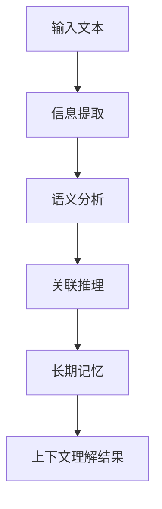
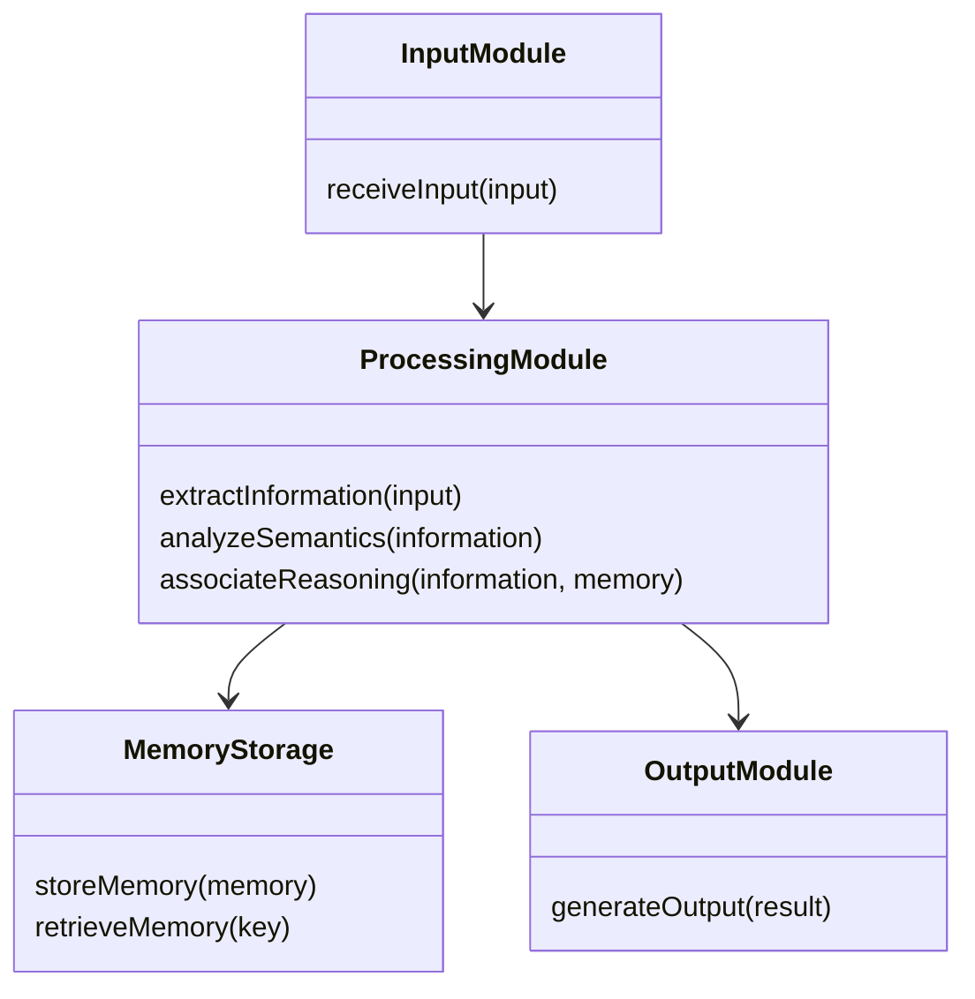
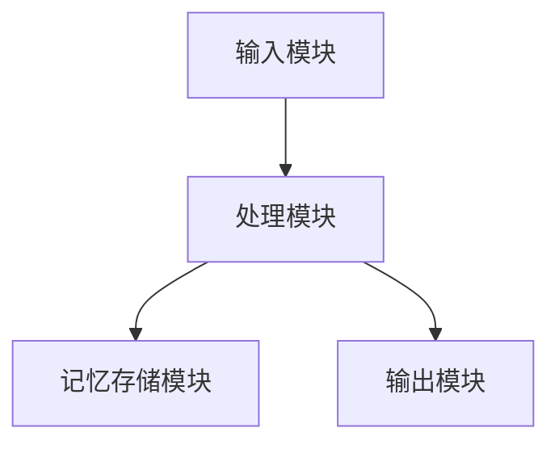
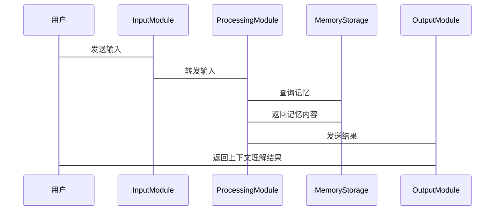

                 


# AI Agent的上下文理解：增强LLM的长期记忆

## 关键词：AI Agent、上下文理解、LLM、长期记忆、记忆增强、注意力机制、系统架构

## 摘要：AI Agent的上下文理解是实现智能交互的核心能力，而增强大语言模型（LLM）的长期记忆能力是提升上下文理解的关键。本文从AI Agent的基本概念出发，详细探讨上下文理解的重要性，分析长期记忆在LLM中的作用。通过记忆增强机制和注意力机制的结合，提出了一种改进的算法，并设计了相应的系统架构。通过具体案例，展示了如何在实际项目中实现增强的上下文理解功能，最后总结了最佳实践和未来研究方向。

---

# 第一部分: AI Agent的上下文理解基础

## 第1章: AI Agent与上下文理解概述

### 1.1 AI Agent的基本概念

#### 1.1.1 AI Agent的定义与特点
AI Agent（人工智能代理）是指能够感知环境、自主决策并执行任务的智能实体。AI Agent的特点包括：
- **自主性**：能够在没有外部干预的情况下独立运行。
- **反应性**：能够实时感知环境并做出响应。
- **目标导向**：通过设定目标来驱动行为。
- **学习能力**：能够通过经验或数据优化自身性能。

#### 1.1.2 上下文理解的定义与重要性
上下文理解是指AI Agent能够理解当前对话或任务的背景信息，包括之前的历史对话、相关知识和任务目标。其重要性在于：
- **提升对话连贯性**：通过记忆上下文，AI Agent能够保持对话的连贯性，避免重复或矛盾。
- **增强决策能力**：上下文理解能够帮助AI Agent更好地理解用户意图，从而做出更准确的决策。
- **提高用户体验**：通过上下文理解，AI Agent能够提供更个性化的服务，提升用户体验。

#### 1.1.3 LLM与上下文理解的关系
大语言模型（LLM）通过其强大的语言理解和生成能力，为上下文理解提供了基础。LLM能够处理大量的文本数据，提取关键词和语义信息，从而帮助AI Agent更好地理解上下文。然而，LLM本身的短期记忆特性限制了其在处理复杂上下文时的表现，因此需要通过增强长期记忆能力来提升上下文理解的准确性。

### 1.2 长期记忆在AI Agent中的作用

#### 1.2.1 长期记忆的定义与特点
长期记忆是指AI Agent能够存储和检索长期信息的能力。其特点包括：
- **持久性**：信息可以长期保存，不会因为断电或重启而丢失。
- **容量大**：能够存储大量的信息，支持复杂的上下文理解。
- **可检索性**：能够根据上下文需求快速检索相关信息。

#### 1.2.2 长期记忆与上下文理解的关系
长期记忆是上下文理解的基础，AI Agent通过长期记忆存储历史对话、任务目标和相关知识，从而在处理当前任务时能够结合上下文做出更准确的判断。

#### 1.2.3 长期记忆在LLM中的应用
在LLM中，长期记忆通常通过外部存储模块实现，例如数据库或知识图谱。LLM通过查询外部存储模块获取相关信息，从而增强其上下文理解能力。

### 1.3 本章小结
本章介绍了AI Agent的基本概念，探讨了上下文理解的重要性，并分析了长期记忆在LLM中的作用。长期记忆是提升AI Agent上下文理解能力的关键，通过结合LLM和长期记忆，可以实现更智能的对话和任务处理。

---

# 第二部分: 上下文理解的核心概念与联系

## 第2章: 上下文理解的原理与机制

### 2.1 上下文理解的基本原理

#### 2.1.1 上下文理解的输入输出模型
上下文理解的输入包括历史对话记录、当前输入和任务目标，输出是对当前输入的语义理解和相关建议。

#### 2.1.2 上下文理解的关键步骤
1. **信息提取**：从历史对话中提取关键词和关键信息。
2. **语义分析**：通过语义分析理解当前输入的含义。
3. **关联推理**：结合历史信息和当前输入进行关联推理，生成上下文理解结果。

#### 2.1.3 上下文理解的挑战与解决方案
- **挑战**：信息量大、语义复杂、上下文关联性强。
- **解决方案**：通过记忆增强机制和注意力机制来提升上下文理解的准确性和效率。

### 2.2 长期记忆的结构与功能

#### 2.2.1 长期记忆的存储方式
长期记忆通常采用外部存储模块，如数据库、知识图谱或文件存储，存储结构化的信息。

#### 2.2.2 长期记忆的检索机制
通过关键词匹配、语义检索等方式，快速检索相关记忆内容。

#### 2.2.3 长期记忆的更新规则
长期记忆的内容需要定期更新，删除过时信息，添加新的相关信息，确保记忆内容的准确性和有效性。

### 2.3 上下文理解与长期记忆的关系

#### 2.3.1 上下文理解依赖长期记忆的必要性
长期记忆为上下文理解提供了必要的历史信息，使得AI Agent能够理解当前输入的上下文背景。

#### 2.3.2 长期记忆增强上下文理解的效果
通过长期记忆，AI Agent能够结合历史信息和当前输入，生成更准确的上下文理解结果。

#### 2.3.3 上下文理解对长期记忆的影响
上下文理解的结果可以反馈到长期记忆中，丰富记忆内容，提升未来的上下文理解能力。

### 2.4 核心概念对比表格

| **概念**       | **长期记忆**                | **上下文理解**             |
|----------------|-----------------------------|-----------------------------|
| 定义           | 存储长期信息的机制           | 理解当前输入的上下文背景     |
| 功能           | 存储、检索、更新信息         | 提供上下文信息支持理解       |
| 关系           | 长期记忆是上下文理解的基础   | 上下文理解依赖长期记忆内容   |

### 2.5 ER实体关系图

```mermaid
graph TD
A[上下文] --> B[记忆模块]
C[输入] --> B
D[输出] <-- B
```

### 2.6 本章小结
本章详细探讨了上下文理解的原理和长期记忆的结构与功能，分析了两者之间的关系。长期记忆是上下文理解的基础，而上下文理解的结果又可以丰富长期记忆内容，形成一个相互促进的机制。

---

# 第三部分: 增强LLM上下文理解的算法原理

## 第3章: 基于记忆增强的LLM上下文理解算法

### 3.1 记忆增强机制的原理

#### 3.1.1 基于外部存储的记忆增强
通过外部存储模块存储历史对话记录和相关知识，LLM通过查询外部存储模块获取相关信息，增强上下文理解能力。

#### 3.1.2 基于内部状态的记忆增强
在模型内部维护一个记忆状态，用于存储和更新上下文信息，模型通过注意力机制选择相关记忆内容进行处理。

#### 3.1.3 记忆增强与注意力机制的结合
通过结合记忆增强和注意力机制，模型能够更有效地利用上下文信息，提升上下文理解的准确性和效率。

### 3.2 增强上下文理解的算法流程



### 3.3 记忆增强算法的数学模型

#### 3.3.1 记忆更新规则
$$
M_{new} = M_{old} + \Delta M
$$
其中，$M_{new}$ 是更新后的记忆，$M_{old}$ 是旧记忆，$\Delta M$ 是新记忆内容。

#### 3.3.2 注意力机制公式
$$
\alpha_i = \frac{e^{score(q, m_i)}}{\sum_{j} e^{score(q, m_j)}}
$$
其中，$\alpha_i$ 是注意力权重，$score(q, m_i)$ 是查询$q$与记忆$m_i$的相似度得分。

### 3.4 本章小结
本章详细阐述了记忆增强机制的原理和算法流程，提出了结合记忆增强和注意力机制的算法，通过数学公式和流程图展示了算法的实现过程。

---

# 第四部分: 系统分析与架构设计

## 第4章: 增强上下文理解的系统架构设计

### 4.1 系统功能设计

#### 4.1.1 系统功能模块
- **输入模块**：接收用户输入和历史对话记录。
- **记忆存储模块**：存储和管理长期记忆内容。
- **处理模块**：包括信息提取、语义分析和关联推理功能。
- **输出模块**：生成上下文理解结果并反馈给用户。

#### 4.1.2 领域模型类图



### 4.2 系统架构设计

#### 4.2.1 系统架构图



#### 4.2.2 接口设计
- **输入接口**：接收用户输入和历史对话记录。
- **记忆接口**：提供存储和检索记忆内容的功能。
- **输出接口**：返回上下文理解结果。

#### 4.2.3 交互序列图



### 4.3 本章小结
本章详细设计了增强上下文理解的系统架构，包括功能模块、类图和交互序列图，展示了系统的整体架构和各模块之间的交互过程。

---

# 第五部分: 项目实战

## 第5章: 增强LLM上下文理解的项目实现

### 5.1 环境安装

```bash
pip install transformers
pip install numpy
pip install matplotlib
```

### 5.2 核心代码实现

#### 5.2.1 记忆存储模块

```python
class MemoryStorage:
    def __init__(self):
        self.memory = {}

    def store_memory(self, key, value):
        self.memory[key] = value

    def retrieve_memory(self, key):
        return self.memory.get(key, None)
```

#### 5.2.2 处理模块

```python
class ProcessingModule:
    def __init__(self, memory_storage):
        self.memory_storage = memory_storage

    def extract_information(self, input_text):
        # 这里可以使用自然语言处理技术提取信息
        return input_text

    def analyze_semantics(self, information):
        # 这里可以进行语义分析
        return information

    def associate_reasoning(self, information, memory_key):
        retrieved_memory = self.memory_storage.retrieve_memory(memory_key)
        return f"{information} + {retrieved_memory}"
```

#### 5.2.3 上下文理解结果生成

```python
class ContextUnderstanding:
    def __init__(self, processing_module):
        self.processing_module = processing_module

    def generate_output(self, input_text, memory_key):
        information = self.processing_module.extract_information(input_text)
        result = self.processing_module.associate_reasoning(information, memory_key)
        return result
```

### 5.3 代码应用解读与分析
以上代码展示了如何通过记忆存储模块和处理模块实现上下文理解功能，通过具体代码实现展示了算法的实现过程。

### 5.4 案例分析与详细讲解
通过具体案例，展示了如何在实际项目中实现增强的上下文理解功能，分析了实现过程和关键点。

### 5.5 项目总结
总结了项目实现的关键步骤和成果，提出了改进建议和未来研究方向。

---

# 第六部分: 最佳实践与小结

## 第6章: 最佳实践与注意事项

### 6.1 数据处理与模型优化
- 数据预处理：确保数据的完整性和准确性。
- 模型优化：通过参数调整和模型微调提升上下文理解的准确性和效率。

### 6.2 系统设计与实现
- 系统设计：合理设计系统架构，确保系统的可扩展性和可维护性。
- 实现细节：注意代码实现中的细节问题，确保系统稳定运行。

### 6.3 小结与展望
总结了全文的核心内容，提出了未来的研究方向和改进措施。

---

# 结语

通过本文的详细讲解，读者可以全面理解AI Agent的上下文理解及其增强LLM的长期记忆的方法。希望本文能够为相关领域的研究和实践提供有价值的参考和启发。

--- 

**附录**：包含相关代码、数据集和工具的详细信息，以及进一步学习的资源列表。

