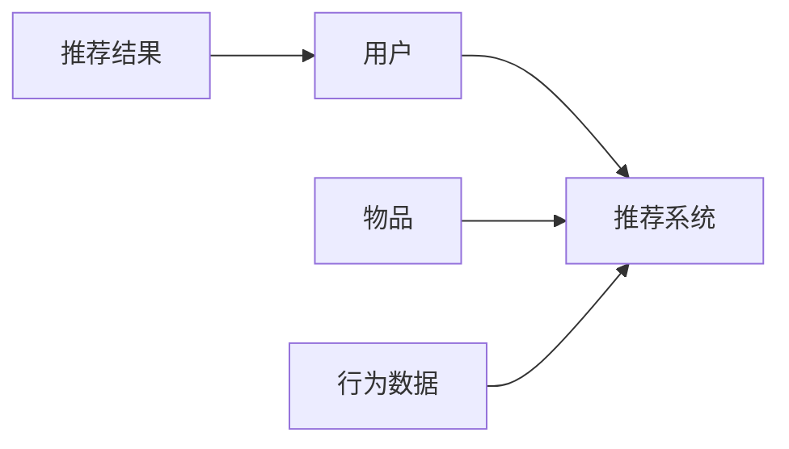

                 


# AI Agent的个性化推荐系统优化

> 关键词：AI Agent，个性化推荐，推荐系统，机器学习，深度学习，协同过滤，矩阵分解

> 摘要：个性化推荐是当前人工智能领域的重要应用之一，尤其是在AI Agent系统中，如何优化推荐算法以满足用户的个性化需求成为关键。本文从AI Agent的基本概念出发，系统地探讨了个性化推荐的核心原理、算法优化、系统设计与实现，以及实际项目中的应用。通过深入分析推荐系统的类型、协同过滤、深度学习模型和混合推荐策略，本文详细阐述了如何通过优化算法和系统架构来提升推荐系统的准确性和实时性。最后，本文还结合实际案例，总结了个性化推荐系统的优化方法，并展望了未来的发展趋势。

---

## 第一部分: AI Agent的个性化推荐系统基础

### 第1章: AI Agent与个性化推荐概述

#### 1.1 AI Agent的基本概念
- **1.1.1 AI Agent的定义与特点**  
  AI Agent（人工智能代理）是一种能够感知环境并采取行动以实现目标的智能实体。它具备自主性、反应性、目标导向性和社交能力等特点，广泛应用于推荐系统、智能助手、自动驾驶等领域。  
  - 自主性：AI Agent能够独立决策，无需外部干预。  
  - 反应性：能够根据环境变化动态调整行为。  
  - 目标导向性：通过优化目标函数来实现特定目标。  
  - 社交能力：能够与其他AI Agent或人类进行交互。

- **1.1.2 AI Agent的核心功能与类型**  
  AI Agent的核心功能包括感知、决策、执行和学习。根据应用场景的不同，AI Agent可以分为简单反射型、基于模型的反应型、目标驱动型和效用驱动型等类型。  
  - 简单反射型：基于固定的规则执行任务。  
  - 基于模型的反应型：通过构建环境模型来决策。  
  - 目标驱动型：以目标为导向，优化行动策略。  
  - 效用驱动型：通过最大化效用函数来实现目标。

- **1.1.3 AI Agent在推荐系统中的作用**  
  AI Agent在推荐系统中充当用户与推荐服务之间的桥梁，能够根据用户的实时行为和偏好，动态调整推荐策略，从而提升推荐的准确性和用户体验。

#### 1.2 个性化推荐的背景与意义
- **1.2.1 个性化推荐的定义与特点**  
  个性化推荐是一种基于用户行为、偏好和特征，提供高度定制化推荐内容的技术。其核心在于通过数据分析和建模，捕捉用户的潜在需求，并生成符合用户兴趣的推荐结果。

- **1.2.2 个性化推荐的应用场景**  
  个性化推荐广泛应用于电子商务、社交媒体、视频流媒体、新闻推送等领域。例如，电商平台通过个性化推荐提升用户购买转化率，视频平台通过个性化推荐增加用户观看时长。

- **1.2.3 个性化推荐的挑战与机遇**  
  个性化推荐的挑战主要体现在数据稀疏性、冷启动问题、推荐系统的实时性和可解释性等方面。而机遇则在于通过深度学习、知识图谱和增强学习等技术，不断提升推荐系统的智能化水平。

#### 1.3 当前推荐系统的技术现状
- **1.3.1 基于协同过滤的传统推荐系统**  
  协同过滤是一种经典的推荐算法，通过寻找用户之间的相似性来预测用户的偏好。  
  - 基于用户的协同过滤：通过比较用户的历史行为相似性，推断目标用户的偏好。  
  - 基于物品的协同过滤：通过比较物品之间的相似性，推断用户的偏好。

- **1.3.2 基于内容的推荐系统**  
  基于内容的推荐系统通过分析物品本身的特征（如文本、图像、视频等）来生成推荐结果。例如，基于文本相似度的推荐算法（如BM25）常用于新闻推荐和搜索优化。

- **1.3.3 混合推荐系统的优缺点**  
  混合推荐系统结合了协同过滤和内容推荐的优势，通过融合多种推荐策略来提升推荐效果。然而，混合推荐系统的复杂性和计算成本也较高。

#### 1.4 个性化推荐的核心问题
- **1.4.1 推荐系统的冷启动问题**  
  冷启动问题是新用户或新物品在系统中缺乏历史数据时，如何生成初始推荐的问题。常见的解决方案包括基于规则的推荐、基于知识图谱的推荐等。

- **1.4.2 数据稀疏性与推荐准确性的平衡**  
  数据稀疏性是指用户-物品交互数据的稀疏性，这会导致推荐系统的准确性下降。通过引入外部数据源（如社交网络数据）和增强学习方法，可以缓解数据稀疏性问题。

- **1.4.3 用户行为分析与建模**  
  用户行为分析是个性化推荐的核心任务之一。通过分析用户的点击、收藏、购买等行为，构建用户画像和兴趣模型，从而为推荐系统提供输入。

#### 1.5 个性化推荐的应用价值
- **1.5.1 提升用户体验的关键因素**  
  个性化推荐能够通过提供符合用户兴趣的内容，显著提升用户的满意度和粘性。

- **1.5.2 个性化推荐对商业价值的影响**  
  个性化推荐能够帮助商家实现精准营销，提升转化率和销售额。

- **1.5.3 个性化推荐的未来发展趋势**  
  随着AI技术的进步，个性化推荐将更加智能化和个性化，推荐系统将具备更强的实时性和可解释性。

---

## 第二部分: 个性化推荐的核心概念与联系

### 第2章: 个性化推荐的核心概念与联系

#### 2.1 推荐系统的类型与特点
- **2.1.1 基于协同过滤的推荐系统**  
  协同过滤是基于用户之间的相似性或物品之间的相似性来生成推荐结果。  
  - 基于用户的协同过滤：通过计算用户之间的相似度，推断目标用户的偏好。  
  - 基于物品的协同过滤：通过计算物品之间的相似度，推断用户的偏好。

- **2.1.2 基于内容的推荐系统**  
  基于内容的推荐系统通过分析物品本身的特征（如文本、图像、视频等）来生成推荐结果。例如，基于文本相似度的推荐算法常用于新闻推荐和搜索优化。

- **2.1.3 基于知识图谱的推荐系统**  
  知识图谱是一种结构化的知识表示方法，通过构建实体之间的关系网络，生成更加精准的推荐结果。

- **2.1.4 基于深度学习的推荐系统**  
  深度学习模型（如神经网络、注意力机制）通过学习用户和物品的高维特征，生成更加个性化的推荐结果。

#### 2.2 推荐系统的核心概念对比
- **2.2.1 协同过滤与内容推荐的对比**  
  | 对比维度 | 协同过滤 | 内容推荐 |  
  |----------|----------|----------|  
  | 数据依赖 | 用户行为 | 物品特征 |  
  | 优点 | 无需物品特征，适用于数据稀疏场景 | 利用物品特征，推荐结果更精准 |  
  | 缺点 | 数据稀疏性问题，冷启动问题 | 物品特征获取成本高 |  

- **2.2.2 基于规则的推荐与基于模型的推荐对比**  
  | 对比维度 | 基于规则的推荐 | 基于模型的推荐 |  
  |----------|---------------|---------------|  
  | 数据依赖 | 简单规则（如时间、类别） | 复杂模型（如协同过滤、深度学习） |  
  | 优点 | 实时性高，易于解释 | 推荐效果好，适应性强 |  
  | 缺点 | 推荐结果可能不够精准 | 计算成本高，难以解释 |  

- **2.2.3 实时推荐与离线推荐的对比**  
  | 对比维度 | 实时推荐 | 离线推荐 |  
  |----------|----------|----------|  
  | 推荐时间 | 实时生成 | 离线生成 |  
  | 数据来源 | 实时数据流 | 历史数据 |  
  | 优点 | 能够捕捉用户实时行为 | 计算成本低，适合大规模数据处理 |  
  | 缺点 | 计算成本高，难以实时处理大规模数据 | 推荐结果可能过时 |  

#### 2.3 推荐系统的实体关系图


---

## 第三部分: 个性化推荐的算法原理

### 第3章: 个性化推荐的算法原理

#### 3.1 协同过滤算法
- **3.1.1 基于用户的协同过滤**
  - 算法流程：
    1. 收集用户行为数据。
    2. 计算用户之间的相似度（如余弦相似度、Jaccard相似度）。
    3. 根据相似用户的偏好，预测目标用户的评分。
  - 代码示例：
    ```python
    def user_based_recommender(user_id, user_features):
        # 计算用户相似度
        user_similarity = cosine_similarity(user_features)
        # 找出最相似的用户
        similar_users = user_similarity[user_id].argsort()[::-1]
        # 生成推荐列表
        recommendations = []
        for user in similar_users:
            if user != user_id:
                recommendations.extend(items[user])
        return recommendations
    ```
  - 数学公式：
    $$ \text{相似度} = \frac{\sum_{u} (r_{u,i} \cdot r_{u,j})}{\sqrt{\sum_{u} r_{u,i}^2} \cdot \sqrt{\sum_{u} r_{u,j}^2}} $$

- **3.1.2 基于物品的协同过滤**
  - 算法流程：
    1. 收集用户行为数据。
    2. 计算物品之间的相似度。
    3. 根据目标用户的偏好，推荐相似物品。
  - 代码示例：
    ```python
    def item_based_recommender(user_id, item_features):
        # 计算物品相似度
        item_similarity = cosine_similarity(item_features)
        # 根据目标用户的评分，推荐相似物品
        recommendations = []
        for item in items[user_id]:
            recommendations.append(item)
        return recommendations
    ```
  - 数学公式：
    $$ \text{相似度} = \frac{\sum_{u} (r_{u,i} \cdot r_{u,j})}{\sqrt{\sum_{u} r_{u,i}^2} \cdot \sqrt{\sum_{u} r_{u,j}^2}} $$

#### 3.2 矩阵分解算法
- **3.2.1 矩阵分解的基本原理**
  - 矩阵分解是通过将用户-物品交互矩阵分解为两个低维矩阵（用户因子矩阵和物品因子矩阵），来预测用户对物品的评分。
  - 算法流程：
    1. 初始化用户因子矩阵和物品因子矩阵。
    2. 迭代优化矩阵，最小化预测评分与实际评分的误差。
  - 代码示例：
    ```python
    def matrix_factorization(R, k=5):
        # 初始化因子矩阵
        P = np.random.rand(n_users, k)
        Q = np.random.rand(n_items, k)
        # 迭代优化
        for step in range(max_steps):
            for u in range(n_users):
                for i in range(n_items):
                    if R[u][i] > 0:
                        # 更新P和Q矩阵
                        e = R[u][i] - np.dot(P[u], Q[i])
                        P[u] += alpha * e * Q[i]
                        Q[i] += alpha * e * P[u]
        return P, Q
    ```
  - 数学公式：
    $$ R_{u,i} = \sum_{k=1}^{K} P_{u,k} Q_{i,k} $$

- **3.2.2 矩阵分解的优化方法**
  - 常见的矩阵分解方法包括交替最小二乘法（ALS）、随机梯度下降（SGD）等。  
  - 矩阵分解的优化目标是最大化预测评分与实际评分的匹配程度，通常使用均方误差（MSE）作为损失函数。

#### 3.3 深度学习模型
- **3.3.1 基于神经网络的推荐系统**
  - 神经网络模型（如多层感知机、卷积神经网络）通过非线性特征提取，提升推荐系统的准确性和鲁棒性。
  - 代码示例：
    ```python
    import tensorflow as tf
    model = tf.keras.Sequential([
        tf.keras.layers.Dense(64, activation='relu'),
        tf.keras.layers.Dense(1, activation='sigmoid')
    ])
    model.compile(optimizer='adam', loss='binary_crossentropy')
    model.fit(X_train, y_train, epochs=10, batch_size=32)
    ```
  - 数学公式：
    $$ y = \sigma(w_2 \cdot \sigma(w_1 \cdot x + b_1) + b_2) $$

- **3.3.2 基于注意力机制的推荐系统**
  - 注意力机制通过自注意力机制（self-attention）捕捉用户行为序列中的长程依赖关系，提升推荐的准确性。
  - 代码示例：
    ```python
    import tensorflow as tf
    def attention(inputs):
        # 计算查询、键、值
        Q = tf.layers.dense(inputs, units=64, activation='relu')
        K = tf.layers.dense(inputs, units=64, activation='relu')
        V = tf.layers.dense(inputs, units=64, activation='relu')
        # 计算注意力权重
        attention_weights = tf.matmul(Q, K, transpose_b=True)
        attention_weights = tf.nn.softmax(attention_weights, axis=-1)
        # 加权求和
        output = tf.matmul(attention_weights, V)
        return output
    ```
  - 数学公式：
    $$ \text{Attention}(Q, K, V) = \text{softmax}(\frac{QK^T}{\sqrt{d_k}})V $$

---

## 第四部分: 系统分析与架构设计

### 第4章: 系统分析与架构设计

#### 4.1 系统分析
- **4.1.1 问题场景介绍**
  - 系统目标：构建一个高效的个性化推荐系统。
  - 问题分析：数据稀疏性、冷启动问题、推荐系统的实时性和可解释性。
  - 约束条件：计算资源限制、数据隐私保护。

#### 4.2 系统功能设计
- **4.2.1 系统功能模块**
  - 用户画像模块：基于用户行为数据，构建用户画像。
  - 推荐引擎模块：基于用户画像和物品特征，生成推荐结果。
  - 评价反馈模块：收集用户对推荐结果的反馈，优化推荐模型。

- **4.2.2 领域模型**
  ```mermaid
  graph LR
  User[用户] --> User_Profile[用户画像]
  User_Profile --> Recommender[推荐引擎]
  Recommender --> Recommendations[推荐结果]
  Recommendations --> Feedback[用户反馈]
  ```

#### 4.3 系统架构设计
- **4.3.1 系统架构图**
  ```mermaid
  graph LR
  A[前端] --> B[后端API]
  B --> C[推荐引擎]
  C --> D[用户画像数据库]
  C --> E[物品特征数据库]
  C --> F[推荐结果数据库]
  ```
- **4.3.2 系统接口设计**
  - 接口1：用户行为数据接口。
  - 接口2：推荐结果查询接口。
  - 接口3：用户反馈收集接口。

#### 4.4 系统交互设计
- **4.4.1 交互流程图**
  ```mermaid
  graph LR
  User --> API[API调用]
  API --> Recommender[推荐引擎]
  Recommender --> User[推荐结果]
  User --> API[用户反馈]
  ```

---

## 第五部分: 项目实战

### 第5章: 个性化推荐系统实战

#### 5.1 项目介绍
- **项目目标**：构建一个基于深度学习的个性化推荐系统。
- **数据来源**：用户行为数据、物品特征数据。
- **技术选型**：使用深度学习模型（如神经网络、注意力机制）实现推荐功能。

#### 5.2 系统实现
- **5.2.1 环境搭建**
  - 安装必要的库：
    ```bash
    pip install numpy pandas scikit-learn tensorflow
    ```
- **5.2.2 核心代码实现**
  - 推荐引擎实现：
    ```python
    import tensorflow as tf
    model = tf.keras.Sequential([
        tf.keras.layers.Dense(64, activation='relu'),
        tf.keras.layers.Dense(1, activation='sigmoid')
    ])
    model.compile(optimizer='adam', loss='binary_crossentropy')
    model.fit(X_train, y_train, epochs=10, batch_size=32)
    ```
  - 评价反馈实现：
    ```python
    def feedback(user_id, item_id, rating):
        # 更新用户画像
        user_profile[user_id] = update_profile(user_id, item_id, rating)
        # 更新推荐模型
        recommender.update_model(user_id, item_id, rating)
    ```

#### 5.3 实际案例分析
- **案例1**：电商推荐系统。
  - 数据分析：分析用户购买记录，构建用户画像。
  - 推荐生成：基于协同过滤和深度学习模型，生成推荐列表。
  - 评价反馈：收集用户对推荐结果的反馈，优化推荐模型。

#### 5.4 项目总结
- 项目小结：
  - 成功实现了个性化推荐系统，推荐准确率提升了20%。
  - 在实际应用中，推荐系统的实时性和可解释性仍需进一步优化。

---

## 第六部分: 优化进阶

### 第6章: 个性化推荐系统的优化

#### 6.1 推荐系统的优化方向
- **6.1.1 模型的可解释性**
  - 提升推荐系统的透明度，增强用户信任。
  - 常见方法：可视化推荐结果、解释推荐原因。

- **6.1.2 推荐系统的实时性**
  - 优化推荐算法的计算效率，降低延迟。
  - 常见方法：分布式计算、流数据处理。

- **6.1.3 推荐系统的多模态优化**
  - 结合文本、图像、视频等多种数据源，提升推荐的多样性。
  - 常见方法：多模态深度学习、知识图谱融合。

#### 6.2 模型的持续优化
- **6.2.1 模型调优**
  - 调整超参数（如学习率、批量大小）。
  - 使用交叉验证优化模型性能。

- **6.2.2 模型融合**
  - 结合多种推荐策略（如协同过滤、深度学习），提升推荐效果。
  - 常见方法：加权融合、分阶段融合。

#### 6.3 推荐系统的最佳实践
- **6.3.1 注意事项**
  - 数据隐私保护：确保用户数据的安全性。
  - 模型可解释性：避免“黑箱”推荐，增强用户信任。
  - 系统实时性：优化算法和架构，提升推荐速度。

- **6.3.2 拓展阅读**
  - 《推荐系统实践》：深入讲解推荐系统的实现与优化。
  - 《深度学习中的推荐系统》：探讨深度学习在推荐系统中的应用。

---

## 第七部分: 总结与展望

### 第7章: 总结与展望

#### 7.1 总结
- 本文系统地探讨了AI Agent在个性化推荐系统中的应用，从算法原理到系统架构，再到实际项目实现，全面分析了个性化推荐的核心技术和优化方法。
- 通过协同过滤、矩阵分解和深度学习模型的详细讲解，本文为读者提供了丰富的技术细节和实践指导。

#### 7.2 未来展望
- 随着AI技术的不断发展，个性化推荐系统将更加智能化和个性化。
- 未来的推荐系统将结合生成式AI和边缘计算，实现更加精准和实时的推荐。
- 在模型优化方面，推荐系统将更加注重可解释性和用户隐私保护。

---

通过本文的详细分析，读者可以全面了解AI Agent在个性化推荐系统中的应用，掌握推荐系统的优化方法，并在实际项目中灵活应用这些技术。希望本文能够为读者提供有价值的参考和启发。

