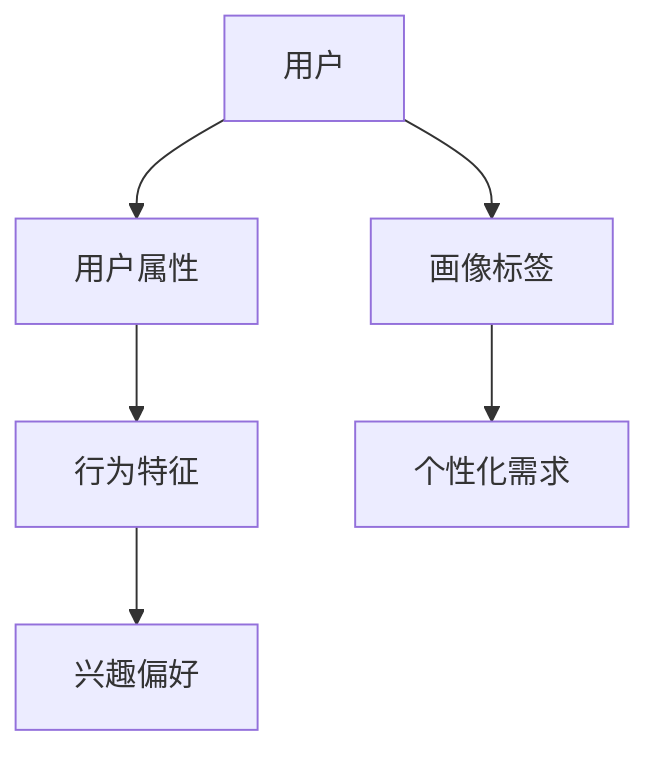
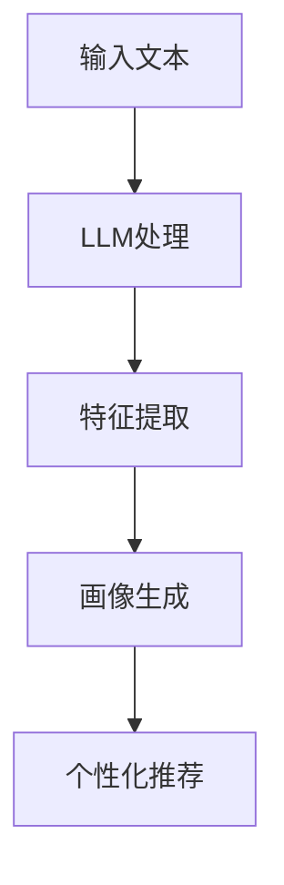
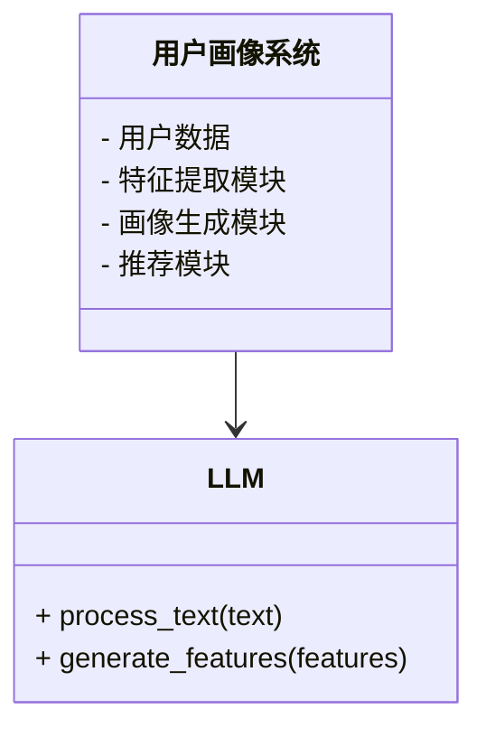
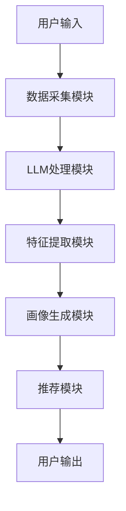

                 


# AI Agent的个性化：基于LLM的用户画像构建

> 关键词：AI Agent，用户画像，LLM，个性化推荐，NLP，人工智能

> 摘要：本文将深入探讨如何基于大语言模型（LLM）构建AI Agent的个性化用户画像。通过分析用户需求、设计画像构建算法、优化系统架构，我们能够为AI Agent赋予更强的个性化服务能力。文章从背景、原理、算法、系统架构到项目实战，全面解析基于LLM的用户画像构建方法，为技术实践者提供系统化的解决方案。

---

# 第1章: AI Agent的背景与问题背景

## 1.1 问题背景

### 1.1.1 从传统AI到AI Agent的演进
随着人工智能技术的快速发展，AI Agent（智能体）逐渐从概念走向实际应用。传统的AI系统通常基于规则或预设的逻辑运行，而AI Agent则更加注重动态交互和个性化服务。AI Agent能够根据用户的行为、偏好和需求，实时调整其行为模式，从而提供更精准的服务。

### 1.1.2 当前AI Agent的核心挑战
尽管AI Agent的概念已经提出多年，但实际应用中仍面临诸多挑战。核心问题在于如何准确理解和预测用户的个性化需求。传统的基于规则的系统难以应对复杂多变的用户行为，而基于数据驱动的系统则需要依赖高质量的用户画像数据。

### 1.1.3 用户个性化需求的日益增长
随着互联网和移动应用的普及，用户对个性化服务的需求日益增长。无论是在线购物、娱乐推荐，还是智能助手服务，用户都希望系统能够理解自己的偏好，并提供量身定制的服务。这种需求推动了AI Agent技术的发展，同时也对用户画像构建提出了更高的要求。

## 1.2 问题描述

### 1.2.1 用户画像构建的核心问题
用户画像是AI Agent实现个性化服务的基础。构建准确、全面的用户画像是解决个性化服务问题的关键。然而，如何从海量数据中提取有效的用户特征，并将其转化为可操作的画像，是一个复杂的系统工程。

### 1.2.2 AI Agent个性化的目标与边界
AI Agent的个性化目标是通过分析用户的行为、偏好和需求，提供定制化的服务。然而，个性化服务并非无边界，需要在用户隐私保护和系统性能之间找到平衡点。AI Agent的个性化服务通常聚焦于特定场景，如推荐系统、智能客服等。

### 1.2.3 问题解决的路径与方法
构建基于LLM的用户画像，可以通过以下路径：
1. 数据收集：从用户交互数据中提取行为特征。
2. 特征提取：利用LLM模型分析文本数据，提取语义特征。
3. 画像构建：将行为特征和语义特征整合，形成用户画像。
4. 个性化推荐：基于用户画像，生成个性化推荐结果。

## 1.3 问题解决方法

### 1.3.1 基于LLM的用户画像构建思路
LLM（Large Language Model）具有强大的文本理解和生成能力，可以用于提取用户的语义特征。通过分析用户的对话记录、搜索历史和社交数据，LLM可以帮助构建更准确的用户画像。

### 1.3.2 AI Agent个性化的核心技术
AI Agent的个性化服务依赖于以下核心技术：
- 数据挖掘与特征提取
- 自然语言处理（NLP）
- 机器学习（ML）
- 推荐系统

### 1.3.3 当前技术的优劣势分析
- **优势**：LLM能够处理非结构化文本数据，提取深层次语义特征，为用户画像构建提供丰富信息。
- **劣势**：数据隐私问题、计算资源消耗大、模型泛化能力有限。

## 1.4 概念结构与核心要素

### 1.4.1 用户画像的核心要素
用户画像是一个多维度的结构，通常包括以下要素：
- **行为特征**：用户在系统中的行为记录，如点击、购买、搜索等。
- **兴趣偏好**：用户对某些内容或主题的偏好。
- **语义特征**：通过文本分析提取的用户意图和情感倾向。
- **画像标签**：基于特征提取生成的用户标签，如“科技爱好者”、“美食爱好者”等。

### 1.4.2 AI Agent的构成与功能
AI Agent通常包括以下功能模块：
- 数据采集模块：收集用户行为和反馈数据。
- 画像构建模块：基于LLM提取用户特征，生成画像。
- 个性化推荐模块：根据用户画像生成推荐结果。
- 交互模块：与用户进行实时对话和反馈。

### 1.4.3 个性化构建的边界与外延
AI Agent的个性化服务需要明确边界，避免过度个性化导致用户体验下降。例如，在推荐系统中，个性化推荐需要在多样性与相关性之间找到平衡。

---

## 本章小结
本章从背景出发，分析了AI Agent个性化服务的核心问题，明确了基于LLM的用户画像构建思路，并探讨了当前技术的优劣势。下一章将深入探讨核心概念及其相互关系。

---

# 第2章: 核心概念与联系

## 2.1 核心概念原理

### 2.1.1 用户画像的定义与属性
用户画像是对用户行为、偏好和特征的综合描述。其属性包括但不限于：
- **基本属性**：年龄、性别、职业等。
- **行为属性**：用户的操作记录、访问频率等。
- **语义属性**：用户的兴趣、情感倾向等。

### 2.1.2 AI Agent的工作原理
AI Agent通过感知用户输入（如文本、语音）和系统反馈，生成相应的输出（如推荐、响应）。其核心在于理解和预测用户的个性化需求。

### 2.1.3 LLM在用户画像构建中的作用
LLM（Large Language Model）能够处理海量文本数据，提取语义特征，为用户画像构建提供丰富的语义信息。

## 2.2 核心概念特征对比

### 2.2.1 用户画像与传统画像的对比
| 特性 | 用户画像 | 传统画像 |
|------|----------|-----------|
| 数据来源 | 行为数据+文本数据 | 基本属性+行为数据 |
| 数据维度 | 高维 | 低维 |
| 更新频率 | 实时更新 | 定期更新 |

### 2.2.2 AI Agent与传统AI的区别
| 特性 | AI Agent | 传统AI |
|------|----------|-----------|
| 个性化能力 | 强 | 弱 |
| 自适应能力 | 强 | 弱 |
| 交互方式 | 实时交互 | 批处理 |

### 2.2.3 LLM与其他NLP模型的对比
| 特性 | LLM | 基于规则的NLP模型 |
|------|----------|-------------------|
| 处理能力 | 强大 | 有限 |
| 模型复杂度 | 高 | 低 |
| 应用场景 | 复杂场景 | 简单场景 |

## 2.3 ER实体关系图

用户与用户画像之间的关系可以通过ER图表示：



---

## 2.4 本章小结
本章通过对比分析，明确了用户画像、AI Agent和LLM的核心概念及其相互关系。下一章将深入探讨基于LLM的用户画像构建算法。

---

# 第3章: 基于LLM的用户画像构建算法原理

## 3.1 算法原理概述

### 3.1.1 基于LLM的特征提取方法
通过LLM模型分析用户的文本数据，提取语义特征。例如，可以通过分析用户的对话记录，生成语义向量表示。

### 3.1.2 用户画像的生成与优化
基于LLM提取的特征，结合行为数据，生成用户画像。优化过程包括特征加权和模型调优。

### 3.1.3 AI Agent的个性化推荐机制
通过用户画像匹配系统中的资源或服务，生成个性化推荐结果。

## 3.2 算法流程图



## 3.3 算法实现代码

```python
def llm_based_user_profile(text):
    # LLM处理文本
    features = extract_features(text)
    # 生成用户画像
    user_profile = generate_profile(features)
    return user_profile
```

---

## 3.4 本章小结
本章详细介绍了基于LLM的用户画像构建算法，包括特征提取、画像生成和推荐机制。下一章将探讨数学模型和系统架构设计。

---

# 第4章: 数学模型与系统架构设计

## 4.1 数学模型

### 4.1.1 特征权重计算
通过向量空间模型（VSM）计算特征权重：

$$
w_i = \frac{tf_i \cdot idf_i}{\sum_{i=1}^{n} tf_i \cdot idf_i}
$$

其中，\( tf_i \) 是词频，\( idf_i \) 是逆文档频率。

### 4.1.2 画像匹配算法
基于余弦相似度的用户画像匹配：

$$
similarity(u, v) = \frac{\sum_{i=1}^{n} u_i v_i}{\sqrt{\sum_{i=1}^{n} u_i^2} \cdot \sqrt{\sum_{i=1}^{n} v_i^2}}
$$

---

## 4.2 系统架构设计

### 4.2.1 系统功能设计



### 4.2.2 系统架构图



---

## 4.3 本章小结
本章从数学模型和系统架构设计的角度，详细探讨了用户画像构建的实现细节。下一章将结合实际项目，展示如何基于LLM构建用户画像。

---

# 第5章: 项目实战

## 5.1 项目介绍

### 5.1.1 项目背景
本项目旨在构建一个基于LLM的用户画像系统，用于个性化推荐服务。

### 5.1.2 项目目标
- 实现用户数据的采集与处理。
- 基于LLM构建用户画像。
- 实现个性化推荐功能。

## 5.2 环境安装

### 5.2.1 安装依赖
```bash
pip install transformers
pip install numpy
pip install matplotlib
```

## 5.3 核心代码实现

### 5.3.1 数据采集模块
```python
import requests

def collect_user_data(url):
    response = requests.get(url)
    return response.json()
```

### 5.3.2 LLM处理模块
```python
from transformers import AutoModelForMaskedLM, AutoTokenizer

model = AutoModelForMaskedLM.from_pretrained('bert-base-uncased')
tokenizer = AutoTokenizer.from_pretrained('bert-base-uncased')
```

### 5.3.3 特征提取模块
```python
def extract_features(text):
    inputs = tokenizer(text, return_tensors='np')
    outputs = model(**inputs)
    return outputs.last_hidden_state.numpy()
```

### 5.3.4 画像生成模块
```python
def generate_profile(features):
    # 简单的聚类算法示例
    from sklearn.cluster import KMeans
    kmeans = KMeans(n_clusters=5).fit(features)
    return kmeans.labels_
```

## 5.4 案例分析

### 5.4.1 案例背景
假设我们有一个在线购物平台，用户数据包括用户的点击记录和评论内容。

### 5.4.2 数据处理与分析
```python
user_data = collect_user_data('https://example.com/api/users')
features = extract_features(user_data['comments'])
labels = generate_profile(features)
```

### 5.4.3 个性化推荐
```python
def generate_recommendation(labels):
    # 基于标签的推荐
    recommendations = []
    for label in labels:
        recommendations.append(get_recommendations(label))
    return recommendations
```

---

## 5.5 本章小结
本章通过一个实际项目，展示了基于LLM的用户画像构建过程。从数据采集到特征提取，再到画像生成和推荐，每个步骤都进行了详细实现。

---

# 第6章: 最佳实践与总结

## 6.1 最佳实践

### 6.1.1 数据质量的重要性
确保数据的准确性和完整性是构建高质量用户画像的关键。

### 6.1.2 模型调优的注意事项
- 数据预处理：特征选择和标准化。
- 模型选择：选择适合任务的模型。
- 调参优化：使用交叉验证等方法。

### 6.1.3 个性化服务的边界
在个性化推荐中，需要平衡多样性和相关性。

## 6.2 总结

通过本文的探讨，我们了解到基于LLM的用户画像构建是实现AI Agent个性化服务的核心技术。从背景分析到算法实现，再到项目实战，我们详细展示了构建个性化服务的全过程。

## 6.3 注意事项

- 用户隐私保护：在处理用户数据时，必须遵守相关法律法规。
- 系统性能优化：确保系统在高并发场景下的稳定性。
- 模型可解释性：提升模型的可解释性，便于调试和优化。

## 6.4 拓展阅读

- 《Large Language Models for NLP》
- 《User Modeling and User-Adaptive Systems》
- 《Deep Learning for Natural Language Processing》

---

## 本章小结
本文从理论到实践，全面探讨了基于LLM的用户画像构建方法，为AI Agent的个性化服务提供了系统化的解决方案。

