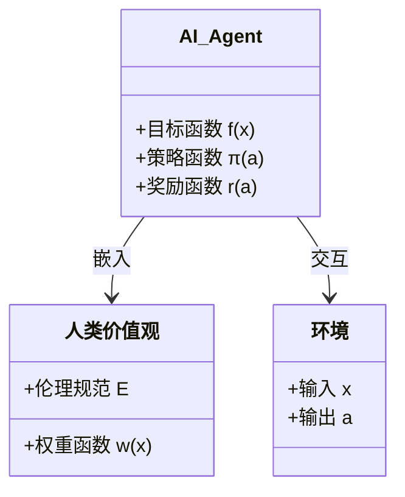
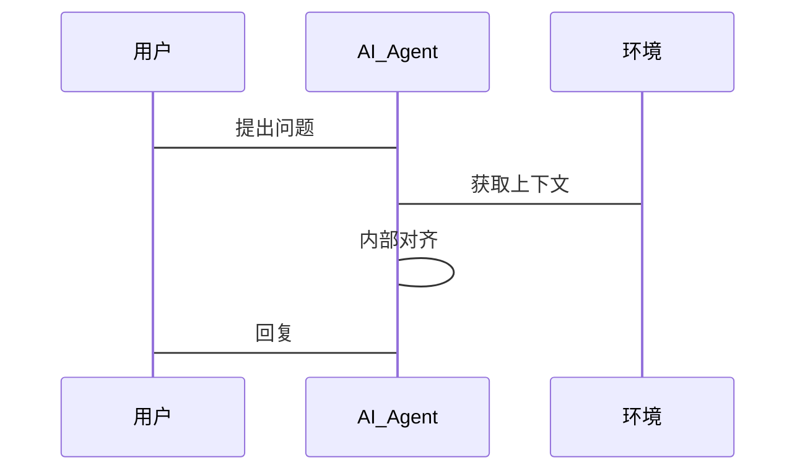

                 


# AI Agent的价值对齐：在LLM中植入人类价值观

> 关键词：AI Agent, 价值对齐, 大语言模型, 人类价值观, 伦理框架

> 摘要：本文探讨了AI Agent与人类价值观对齐的重要性，分析了在大语言模型（LLM）中植入人类价值观的核心概念、算法原理和实现方法。通过结合伦理学、强化学习和系统架构设计，本文为实现AI Agent与人类价值观的深度对齐提供了理论依据和实践指导。

---

## 第1章: AI Agent与价值对齐的背景介绍

### 1.1 AI Agent的基本概念

#### 1.1.1 AI Agent的定义与分类
AI Agent（人工智能代理）是指能够感知环境、自主决策并采取行动的智能实体。根据智能水平和应用场景，AI Agent可以分为简单反应式代理、基于模型的反射式代理、目标驱动代理和效用驱动代理。

- **简单反应式代理**：基于当前感知做出反应，如基于规则的聊天机器人。
- **基于模型的反射式代理**：利用环境模型进行决策，如路径规划算法。
- **目标驱动代理**：具有明确的目标，如自动驾驶系统。
- **效用驱动代理**：通过优化效用函数实现目标，如强化学习模型。

#### 1.1.2 价值对齐的定义与内涵
价值对齐是指AI Agent的行为与人类价值观保持一致，确保AI系统的目标与人类利益相符合。核心在于理解、建模和实现人类价值观的多样性与复杂性。

#### 1.1.3 问题背景与现实意义
随着AI技术的快速发展，AI Agent的应用范围不断扩大。然而，AI系统的目标函数往往与人类价值观存在偏差，可能导致不可预期的行为后果。例如，AI Agent在医疗、金融等领域的决策失误可能引发严重后果。因此，实现AI Agent的价值对齐具有重要的现实意义。

---

### 1.2 价值对齐的核心问题

#### 1.2.1 人类价值观的复杂性
人类价值观具有主观性、多样性和动态性。不同个体、文化背景和应用场景下，人类价值观存在显著差异。例如，某些情况下，AI Agent需要优先考虑效率，而在其他情况下则需要优先考虑公平性。

#### 1.2.2 AI Agent的目标设定与对齐挑战
AI Agent的目标通常由开发者设定，而开发者可能无法全面理解所有应用场景下的人类价值观。此外，AI Agent在运行过程中可能会遇到未预见的情况，导致目标函数与实际需求产生偏差。

#### 1.2.3 价值对齐的边界与外延
价值对齐并非要求AI Agent完全模仿人类行为，而是要在特定场景下实现与人类价值观的一致性。例如，在医疗领域，AI Agent的目标可能是辅助医生制定治疗方案，而不是直接替代医生做出决策。

---

### 1.3 当前LLM的发展现状

#### 1.3.1 大语言模型的崛起
大语言模型（Large Language Model，LLM）是指基于Transformer架构的大型神经网络模型，具有强大的文本生成和理解能力。例如，GPT系列模型在自然语言处理领域取得了显著进展。

#### 1.3.2 LLM在AI Agent中的应用
LLM可以作为AI Agent的核心组件，用于自然语言理解、对话生成和决策支持。例如，智能客服系统通过LLM实现与用户的自然对话，同时基于用户意图生成相应的响应。

#### 1.3.3 价值对齐的必要性与紧迫性
随着LLM的应用范围不断扩大，确保AI Agent的行为与人类价值观一致变得尤为重要。例如，在社交媒体内容审核中，AI Agent需要避免生成有害或不当内容。

---

### 1.4 本章小结

本章从AI Agent的基本概念出发，分析了价值对齐的定义与内涵，并探讨了当前LLM的发展现状。价值对齐是实现AI Agent与人类价值观一致性的关键，具有重要的理论和实践意义。

---

## 第2章: 价值对齐的核心概念与联系

### 2.1 价值对齐的理论基础

#### 2.1.1 伦理学与人类价值观的框架
伦理学是研究道德与价值的学科，为人类价值观提供了系统的理论框架。例如，功利主义强调最大化整体利益，义务论强调遵循道德规范。

#### 2.1.2 AI Agent的目标函数与优化
AI Agent的目标函数是其行为决策的核心依据。为了实现价值对齐，需要将人类价值观转化为可量化的目标函数。例如，可以通过优化函数$f(x)$，使得$f(x)$反映人类价值观的优先级。

#### 2.1.3 价值对齐的数学模型
价值对齐可以通过数学模型的形式表示。例如，可以将人类价值观建模为一个权重函数$w(x)$，并将其融入AI Agent的目标函数中。

$$ \text{目标函数} = f(x) + \lambda w(x) $$

其中，$\lambda$是调节参数，用于平衡AI Agent的目标与人类价值观之间的关系。

---

### 2.2 价值对齐的关键方法

#### 2.2.1 监督学习中的对齐策略
监督学习是一种常用的价值对齐方法。通过标注数据训练AI Agent，使其行为符合人类价值观。例如，可以使用人工标注的对话数据，训练LLM生成符合伦理规范的回复。

#### 2.2.2 强化学习中的奖励建模
强化学习是一种通过奖励机制优化AI Agent行为的方法。通过设计合理的奖励函数，可以引导AI Agent实现与人类价值观一致的目标。例如，可以定义奖励函数$r(a)$，表示AI Agent行为$a$的伦理合规性。

$$ r(a) = \begin{cases} 1 & \text{如果行为$a$符合伦理规范} \\ 0 & \text{否则} \end{cases} $$

#### 2.2.3 对齐的内在化与外在化
内在化对齐是指将人类价值观直接融入AI Agent的目标函数中，例如通过权重函数。外在化对齐则是通过外部监督或奖励机制实现对齐。

---

### 2.3 价值对齐的挑战与解决方案

#### 2.3.1 价值观的多样性与冲突
不同个体和文化背景下，人类价值观存在显著差异。例如，在某些情况下，隐私保护可能优先于信息共享。为了应对这一挑战，可以通过多目标优化方法，权衡不同价值观的优先级。

#### 2.3.2 对齐过程中的可解释性问题
AI Agent的行为往往难以解释，这使得价值对齐的实现过程更加复杂。例如，强化学习模型的决策过程可能缺乏透明性，导致对齐效果难以验证。

#### 2.3.3 解决方案的对比分析
可以通过以下方法实现价值对齐的可解释性：
1. 使用可解释的模型，例如基于规则的AI Agent。
2. 提供可视化工具，展示AI Agent的决策过程。
3. 建立验证机制，通过人工审核确保对齐效果。

---

### 2.4 本章小结

本章从价值对齐的理论基础出发，分析了监督学习和强化学习中的对齐策略，并探讨了实现价值对齐的关键挑战与解决方案。价值对齐需要综合考虑伦理学、算法优化和系统设计等多个方面。

---

## 第3章: 价值对齐的算法原理

### 3.1 监督学习中的对齐方法

#### 3.1.1 监督学习的基本原理
监督学习是一种基于标注数据的机器学习方法。通过训练模型预测给定输入的正确输出，AI Agent可以学习人类价值观。

#### 3.1.2 基于人类反馈的对齐策略
通过收集人类反馈，可以优化AI Agent的行为。例如，可以通过人工标注的对话数据，训练LLM生成符合伦理规范的回复。

#### 3.1.3 案例分析：通过人工反馈优化LLM
以下是一个优化LLM的示例：

1. 人工标注人员对LLM的输出进行评估，标注其是否符合伦理规范。
2. 标注数据用于训练改进的模型，提升其对齐效果。

---

### 3.2 强化学习中的对齐机制

#### 3.2.1 强化学习的基本原理
强化学习是一种基于奖励机制的机器学习方法。通过优化奖励函数，可以引导AI Agent实现与人类价值观一致的目标。

#### 3.2.2 基于奖励建模的对齐方法
通过设计合理的奖励函数，可以实现价值对齐。例如，可以定义奖励函数$r(a)$，表示AI Agent行为$a$的伦理合规性。

$$ r(a) = \begin{cases} 1 & \text{如果行为$a$符合伦理规范} \\ 0 & \text{否则} \end{cases} $$

#### 3.2.3 案例分析：通过强化学习优化AI Agent
以下是一个优化AI Agent的示例：

1. 定义奖励函数，奖励函数反映人类价值观。
2. 通过强化学习算法优化AI Agent的策略。

---

### 3.3 对齐的数学模型与实现

#### 3.3.1 数学模型
可以通过以下数学模型实现价值对齐：

$$ J(\theta) = \mathbb{E}_{x \sim \text{数据}}[\mathbb{E}_{a \sim \text{策略}}[r(a)]] $$

其中，$J(\theta)$是目标函数，$r(a)$是奖励函数。

#### 3.3.2 算法实现
以下是实现价值对齐的Python代码示例：

```python
import numpy as np

def reward_function(action):
    if is_ethical(action):
        return 1
    else:
        return 0

def value_alignment_agent(environment):
    theta = np.random.randn()  # 初始化参数
    while True:
        action = policy(theta, environment)  # 根据策略选择动作
        reward = reward_function(action)  # 计算奖励
        theta += learning_rate * (reward - np.mean(reward))  # 更新参数
```

---

### 3.4 本章小结

本章详细讲解了监督学习和强化学习中的价值对齐方法，并通过数学模型和代码示例进行了分析。价值对齐的实现需要结合算法优化与伦理建模。

---

## 第4章: 系统分析与架构设计方案

### 4.1 问题场景介绍

AI Agent需要在多种场景下实现价值对齐，例如智能客服、医疗辅助决策等。以智能客服为例，AI Agent需要理解用户需求，生成符合伦理规范的回复。

---

### 4.2 系统功能设计

#### 4.2.1 领域模型设计
以下是领域模型的Mermaid类图：



---

#### 4.2.2 系统架构设计
以下是系统架构的Mermaid架构图：

```mermaid
archiecture
    title 系统架构设计
    client --> API_Gateway: 请求
    API_Gateway --> LLM_Server: 调用LLM
    LLM_Server --> 人类价值观模块: 对齐
    LLM_Server --> 环境模块: 交互
```

---

#### 4.2.3 系统接口设计
系统接口设计包括以下内容：
- 输入接口：接收用户输入
- 输出接口：生成符合伦理规范的回复
- 对齐接口：嵌入人类价值观模块

---

#### 4.2.4 系统交互设计
以下是系统交互的Mermaid序列图：



---

### 4.3 本章小结

本章通过系统分析与架构设计，展示了AI Agent在实现价值对齐过程中的关键模块与交互流程。系统架构设计为实现价值对齐提供了理论依据和实践指导。

---

## 第5章: 项目实战

### 5.1 环境安装

要实现价值对齐的AI Agent，首先需要安装以下环境：

- Python 3.8+
- PyTorch 1.9+
- Hugging Face Transformers库

安装命令：

```bash
pip install torch transformers
```

---

### 5.2 系统核心实现

以下是实现价值对齐的Python代码示例：

```python
from transformers import AutoModelForCausalLM, AutoTokenizer
import torch

# 初始化模型
model = AutoModelForCausalLM.from_pretrained('gpt2')
tokenizer = AutoTokenizer.from_pretrained('gpt2')

# 定义奖励函数
def is_ethical(action):
    # 判断行为是否符合伦理规范
    return True

# 定义对齐函数
def align_agent(action):
    if is_ethical(action):
        return action
    else:
        return '抱歉，我无法执行该操作。'

# 生成回复
input_text = "如何帮助你？"
inputs = tokenizer.encode(input_text, return_tensors='pt')
outputs = model.generate(inputs, max_length=50)
response = tokenizer.decode(outputs[0])

# 实现价值对齐
aligned_response = align_agent(response)
print(aligned_response)
```

---

### 5.3 案例分析与详细解读

以智能客服为例，AI Agent需要理解用户需求，并生成符合伦理规范的回复。例如，当用户提出不合理要求时，AI Agent需要拒绝并提供替代方案。

---

### 5.4 项目总结

本章通过实际案例展示了如何在项目中实现价值对齐。代码实现和案例分析为读者提供了实践指导，帮助其理解AI Agent与人类价值观对齐的实现过程。

---

## 第6章: 总结与展望

### 6.1 本章总结

本文详细探讨了AI Agent的价值对齐问题，分析了其核心概念、算法原理和系统架构设计。通过结合伦理学、强化学习和系统设计，为实现AI Agent与人类价值观的深度对齐提供了理论依据和实践指导。

---

### 6.2 未来研究方向

未来的研究可以围绕以下方向展开：
1. **可解释性增强**：提升AI Agent行为的可解释性，确保对齐效果的透明性。
2. **多模态对齐**：结合视觉、听觉等多种模态信息，实现更全面的价值对齐。
3. **动态对齐**：研究动态变化的环境下的价值对齐方法。

---

### 6.3 注意事项与最佳实践

- **伦理审查**：在实现价值对齐前，需进行伦理审查，确保对齐目标符合社会规范。
- **用户反馈**：通过用户反馈不断优化AI Agent的行为，确保对齐效果的持续改进。
- **透明性原则**：在实现过程中，确保系统设计的透明性，便于用户理解和监督。

---

### 6.4 拓展阅读

推荐以下书籍和论文，供读者深入学习：
1. 《AI Ethics》
2. 《强化学习（Deep Reinforcement Learning）》
3. 《Large Language Models for Dialogue Systems》

---

## 附录

### 附录A: 术语表

- **AI Agent**：人工智能代理，能够感知环境并自主决策。
- **价值对齐**：AI Agent的行为与人类价值观一致。
- **LLM**：大语言模型，基于Transformer的大型神经网络模型。

---

### 附录B: 参考文献

1. Goodfellow, I., Bengio, Y., & Courville, A. (2016). *Deep Learning*.
2. Russell, S., & Norvig, P. (2010). *Artificial Intelligence: A Modern Approach*.
3.

