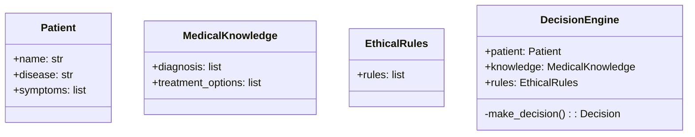
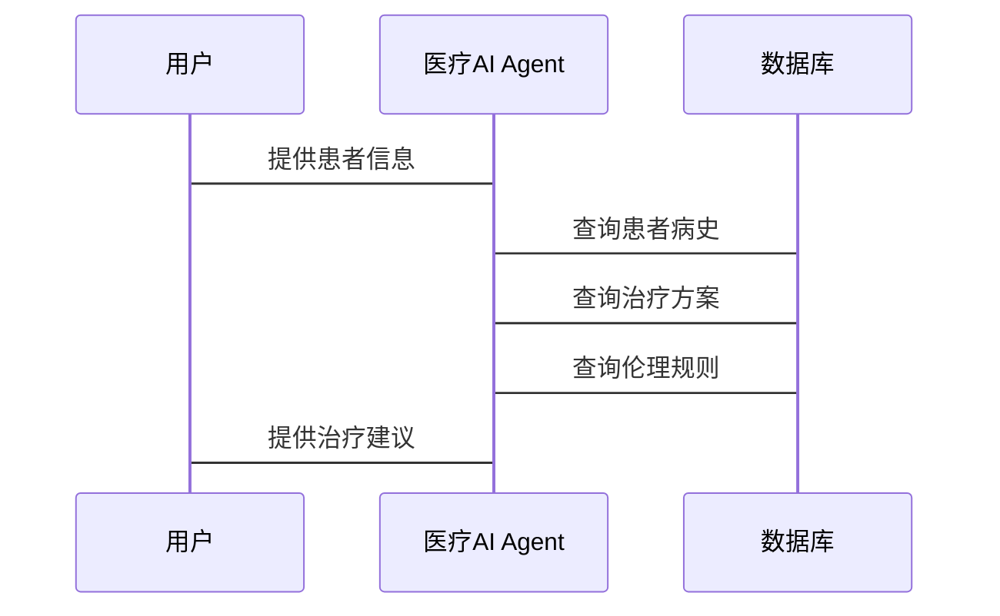

                 


# AI Agent的伦理决策框架：在智能中植入道德考量

> 关键词：AI Agent, 伦理决策, 智能系统, 道德考量, 决策框架, 系统架构

> 摘要：随着人工智能技术的迅速发展，AI Agent在决策过程中的伦理考量变得日益重要。本文探讨了如何在AI Agent中构建伦理决策框架，涵盖背景分析、核心概念、算法原理、系统设计、项目实战及总结等部分，详细讲解了在智能系统中植入道德考量的方法和实践。

---

# 第一部分: AI Agent的伦理决策框架概述

## 第1章: AI Agent与伦理决策的背景介绍

### 1.1 AI Agent的基本概念

#### 1.1.1 AI Agent的定义
AI Agent（人工智能代理）是指能够感知环境、自主决策并执行任务的智能实体。它可以是一个软件程序、机器人或其他智能系统，具备以下核心特征：
- **自主性**：能够在没有外部干预的情况下独立运作。
- **反应性**：能够感知环境并实时响应。
- **目标导向**：通过设定目标来驱动行为。
- **学习能力**：能够通过数据和经验改进自身性能。

#### 1.1.2 AI Agent的分类
AI Agent可以根据不同的标准进行分类，常见的分类方式包括：
1. **按智能水平**：
   - **反应式AI Agent**：基于当前感知做出反应，不依赖历史信息。
   - **认知式AI Agent**：具备复杂的推理和规划能力，能够处理复杂任务。
2. **按应用场景**：
   - **服务机器人**：用于家庭服务、医疗辅助等。
   - **自动驾驶系统**：用于汽车的自动驾驶。
   - **推荐系统**：用于个性化内容推荐。

#### 1.1.3 AI Agent的应用场景
AI Agent广泛应用于多个领域，包括但不限于：
- **智能家居**：控制家庭设备，提供便捷生活。
- **医疗健康**：辅助诊断、个性化治疗方案。
- **金融领域**：智能投资顾问、风险评估。
- **交通系统**：自动驾驶、交通优化。

### 1.2 伦理决策的重要性

#### 1.2.1 伦理决策的定义
伦理决策是指在决策过程中考虑道德原则和伦理规范，确保决策不仅符合逻辑，也符合社会的伦理标准。

#### 1.2.2 伦理决策在AI Agent中的作用
AI Agent在做出决策时，需要考虑伦理因素，以确保决策的合理性和社会接受度。例如，在自动驾驶中，AI Agent需要在紧急情况下做出道德选择，如优先保护乘客还是路人。

#### 1.2.3 伦理决策的挑战与机遇
- **挑战**：
  - **复杂性**：伦理问题往往涉及多个利益相关者，决策需要权衡各方利益。
  - **不确定性**：真实世界的复杂性可能导致伦理决策的不明确性。
  - **文化差异**：不同文化背景下，伦理标准可能不同，如何统一是一个难题。
- **机遇**：
  - **提升信任度**：通过伦理决策，AI Agent可以更符合人类的价值观，增强用户的信任。
  - **推动技术进步**：伦理决策框架的建立将推动AI技术在更广泛领域的应用。

---

## 第2章: AI Agent伦理决策的背景与问题

### 2.1 问题背景

#### 2.1.1 AI技术的快速发展
AI技术的进步使得AI Agent能够处理的任务越来越复杂，但同时也带来了伦理决策的挑战。

#### 2.1.2 AI Agent在决策中的角色
AI Agent不仅是工具，更是决策者。它们需要在复杂的环境中做出决策，这使得伦理问题更加突出。

#### 2.1.3 伦理决策的必要性
随着AI Agent在关键领域的应用（如医疗、交通），伦理决策的必要性日益凸显。错误的决策可能导致严重后果，甚至引发法律和道德纠纷。

### 2.2 问题描述

#### 2.2.1 AI Agent决策的不确定性
AI Agent的决策往往基于概率模型，存在不确定性。如何在这种不确定性中融入伦理考量是一个难题。

#### 2.2.2 伦理决策的复杂性
伦理决策涉及多个因素，如法律、社会习俗、个人价值观等，这使得决策过程复杂化。

#### 2.2.3 伦理决策的边界与外延
明确伦理决策的边界是关键。例如，AI Agent应该在什么范围内考虑伦理因素，如何平衡效率与道德。

### 2.3 问题解决

#### 2.3.1 伦理决策框架的构建
构建一个框架，将伦理考量系统地融入决策过程。例如，可以将伦理规则嵌入到决策算法中，使其在决策时自动考虑道德因素。

#### 2.3.2 伦理决策的实现方法
通过制定伦理规则、使用伦理评分系统等方式，帮助AI Agent在决策时考虑伦理因素。

#### 2.3.3 伦理决策的验证与评估
需要建立评估机制，验证伦理决策框架的有效性和可靠性。例如，通过模拟测试、专家评审等方式，确保决策符合伦理标准。

---

## 第3章: 伦理决策框架的核心概念与联系

### 3.1 核心概念原理

#### 3.1.1 伦理决策的定义与特征
伦理决策是基于道德原则的决策过程，具有以下特征：
- **情境性**：决策结果依赖于具体的情境。
- **价值导向**：决策基于价值判断，而非单纯的事实判断。
- **权衡性**：在多个利益之间进行权衡。

#### 3.1.2 AI Agent的决策机制
AI Agent的决策机制通常包括感知、推理和执行三个阶段。在每个阶段，伦理因素都需要被考虑：
- **感知**：通过传感器或其他数据源获取环境信息。
- **推理**：基于获取的信息进行分析和推理，考虑伦理规则。
- **执行**：根据推理结果采取行动。

#### 3.1.3 伦理规则的制定与应用
伦理规则是伦理决策的基础，通常包括：
- **基本伦理原则**：如不伤害、自主性、公正性等。
- **具体伦理准则**：根据不同场景制定的具体规则。

### 3.2 核心概念对比

#### 3.2.1 不同伦理决策框架的对比
- **功利主义框架**：以最大化整体利益为目标。
- **义务论框架**：基于道德义务和责任。
- **美德伦理框架**：以个人的美德和品格为基础。

#### 3.2.2 伦理决策与传统决策的差异
- **传统决策**：基于事实和数据，注重效率和效果。
- **伦理决策**：考虑道德因素，注重公平和正义。

#### 3.2.3 伦理规则与法律规则的对比
- **法律规则**：由法律机构制定，具有强制性。
- **伦理规则**：由伦理规范制定，具有指导性。

### 3.3 ER实体关系图

```mermaid
er
actor: 用户
agent: AI Agent
decision_rule: 伦理决策规则
action: 决策行

----------------------------------------------------------------

* 关系：
- 用户与AI Agent：用户触发AI Agent的决策过程。
- AI Agent与伦理决策规则：AI Agent遵循伦理决策规则进行决策。
- 伦理决策规则与决策行：伦理决策规则指导AI Agent采取特定行动。
```

---

## 第4章: 伦理决策框架的算法原理

### 4.1 算法原理

#### 4.1.1 基于规则的伦理决策算法
基于规则的伦理决策算法通过预定义的伦理规则进行决策。例如，设定优先级规则，当多个规则冲突时，优先考虑更高优先级的规则。

#### 4.1.2 基于效用的伦理决策算法
基于效用的伦理决策算法通过计算不同决策的效用值，选择效用最大的决策。例如，使用Q-learning算法进行伦理评分。

#### 4.1.3 基于机器学习的伦理决策算法
基于机器学习的伦理决策算法通过训练模型，学习伦理决策模式。例如，使用强化学习模型，通过奖励机制引导模型做出伦理决策。

### 4.2 算法实现

#### 4.2.1 基于规则的伦理决策算法实现
```python
# 示例代码：基于规则的伦理决策算法
def ethical_decision(moral_rules, situation):
    for rule in moral_rules:
        if rule.applies_to(situation):
            return rule.action
    # 如果没有适用规则，则采取默认行动
    return default_action
```

#### 4.2.2 基于效用的伦理决策算法实现
```python
# 示例代码：基于效用的伦理决策算法
def utility_based_decision(actions, situation):
    max_utility = -float('inf')
    best_action = None
    for action in actions:
        utility = calculate_utility(action, situation)
        if utility > max_utility:
            max_utility = utility
            best_action = action
    return best_action
```

#### 4.2.3 算法的数学模型
伦理决策的效用计算可以表示为：
$$ \text{Utility} = \sum_{i=1}^{n} w_i \cdot f_i(s) $$
其中，\( w_i \) 是特征 \( f_i \) 的权重，\( s \) 是当前情境。

---

## 第5章: 系统分析与架构设计方案

### 5.1 项目背景

#### 5.1.1 项目背景介绍
本项目旨在设计一个具备伦理决策能力的AI Agent，用于医疗辅助决策。

### 5.2 系统功能设计

#### 5.2.1 系统功能模块
- **数据采集模块**：收集患者信息和医疗环境数据。
- **决策推理模块**：基于伦理规则和医疗知识进行推理，生成决策。
- **决策执行模块**：将决策转化为具体行动，如建议治疗方案。

#### 5.2.2 领域模型


### 5.3 系统架构设计

#### 5.3.1 系统架构图
```mermaid
architectural
    container 医疗AI Agent {
        component 数据采集模块 {
            use Patient Database
        }
        component 决策推理模块 {
            use Medical Knowledge Base
            use Ethical Rules Database
        }
        component 决策执行模块 {
            use Treatment Database
        }
    }
```

### 5.4 系统接口设计

#### 5.4.1 接口描述
- **数据接口**：与医院数据库交互，获取患者信息。
- **规则接口**：与伦理规则库交互，获取适用的伦理规则。
- **执行接口**：与治疗系统交互，执行决策。

### 5.5 系统交互设计

#### 5.5.1 交互流程


---

## 第6章: 项目实战

### 6.1 环境安装与配置

#### 6.1.1 环境要求
- **操作系统**：Linux/Windows/MacOS
- **编程语言**：Python 3.8+
- **依赖库**：numpy, pandas, scikit-learn

#### 6.1.2 安装配置
```bash
pip install numpy pandas scikit-learn
```

### 6.2 系统核心实现

#### 6.2.1 核心代码实现
```python
# 示例代码：医疗AI Agent的伦理决策框架
from sklearn.tree import DecisionTreeClassifier
import numpy as np

class EthicalDecisionAgent:
    def __init__(self, rules):
        self.rules = rules
        self.model = DecisionTreeClassifier()

    def train(self, data, labels):
        self.model.fit(data, labels)

    def make_decision(self, situation):
        # 应用伦理规则进行初步筛选
        for rule in self.rules:
            if rule.matches(situation):
                return rule.recommended_action()
        # 如果没有适用规则，使用机器学习模型进行预测
        return self.model.predict([situation])[0]
```

#### 6.2.2 代码解读与分析
- **EthicalDecisionAgent** 类：封装了伦理决策逻辑。
- **train** 方法：训练机器学习模型，用于处理规则无法覆盖的情况。
- **make_decision** 方法：首先应用伦理规则，如果没有匹配规则，则使用模型预测。

### 6.3 案例分析与解读

#### 6.3.1 案例背景
一名患者患有罕见病，可能有两种治疗方案，A方案风险较低但效果一般，B方案风险较高但效果较好。

#### 6.3.2 决策过程
1. **数据采集**：收集患者的相关信息，如病史、过敏史等。
2. **伦理规则应用**：检查是否存在优先适用的伦理规则。
3. **模型预测**：如果规则不适用，模型基于历史数据预测最佳治疗方案。

### 6.4 项目小结

#### 6.4.1 核心代码总结
- **规则驱动**：优先应用伦理规则，确保决策符合道德标准。
- **模型辅助**：当规则无法覆盖时，模型提供支持，确保决策的全面性。

---

## 第7章: 总结与展望

### 7.1 总结
本文详细探讨了AI Agent的伦理决策框架，从背景分析到系统设计，再到项目实战，全面阐述了如何在智能系统中植入道德考量。通过构建伦理决策框架，AI Agent能够做出更符合人类价值观的决策，提升系统的可信度和用户满意度。

### 7.2 展望
未来，伦理决策框架将更加复杂和多样化，需要结合更多领域的知识。同时，随着技术的进步，伦理决策的自动化和智能化也将进一步提升，为AI Agent的应用开辟更广阔的空间。

### 7.3 最佳实践Tips
- **明确伦理目标**：在设计框架时，明确伦理目标和原则。
- **动态调整规则**：根据实际情况动态调整伦理规则，确保框架的灵活性。
- **持续评估与优化**：定期评估框架的有效性，并根据反馈进行优化。

---

通过以上内容，我们系统地介绍了AI Agent的伦理决策框架，从理论到实践，为读者提供了全面的知识和见解。希望这本书能够为相关领域的研究和应用提供有价值的参考。

