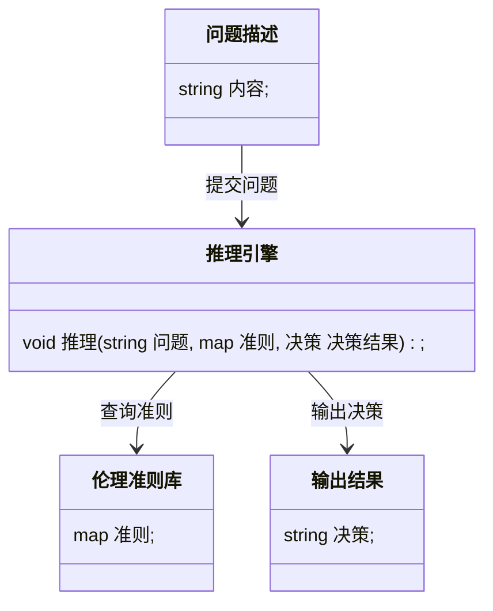
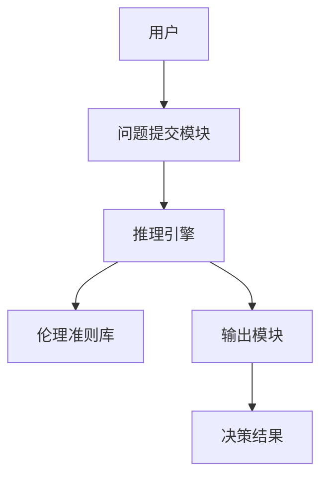
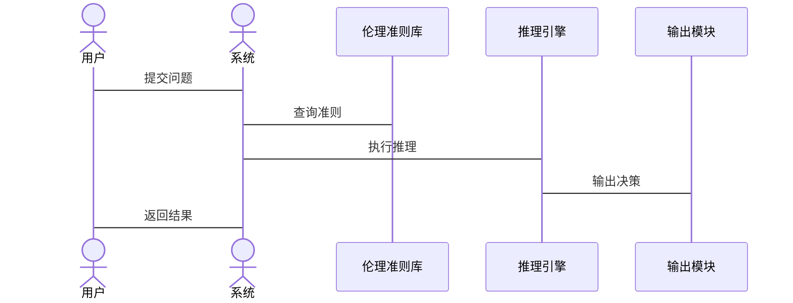

                 


# AI Agent的伦理决策框架：实现LLM的道德推理能力

> 关键词：AI Agent, 伦理决策框架, LLM, 道德推理, 伦理评分, 系统架构, 项目实战

> 摘要：本文深入探讨了AI Agent在伦理决策中的核心作用，详细分析了基于LLM的道德推理能力的实现框架。通过构建伦理决策框架，结合算法原理和系统架构设计，本文为AI Agent的伦理决策提供了一种可行的解决方案，并通过实际案例展示了该框架的应用与优化。

---

# 第一章: AI Agent与伦理决策框架概述

## 1.1 AI Agent的基本概念

### 1.1.1 AI Agent的定义与分类

AI Agent（人工智能代理）是指能够感知环境、自主决策并执行任务的智能体。根据智能水平和决策能力，AI Agent可以分为简单反射型、基于模型的反射型、目标驱动型和效用驱动型。

### 1.1.2 AI Agent的核心特征

- **自主性**：能够在没有外部干预的情况下独立运行。
- **反应性**：能够实时感知环境并做出反应。
- **目标导向**：具备明确的目标，并根据目标优化决策。
- **学习能力**：能够通过经验改进性能。

### 1.1.3 伦理决策在AI Agent中的重要性

AI Agent在医疗、金融、交通等领域广泛应用，其决策可能对人类生命、财产造成重大影响。因此，确保AI Agent的决策符合伦理规范至关重要。

## 1.2 伦理决策框架的背景与意义

### 1.2.1 伦理决策的定义与特点

伦理决策是指在遵循伦理准则的前提下，做出合理决策的过程。其特点包括：规范性、情境性、权变性。

### 1.2.2 AI Agent伦理决策的必要性

AI Agent的决策可能对人类产生重大影响，因此必须确保其决策过程符合伦理规范，避免对人类造成伤害。

### 1.2.3 伦理决策框架的边界与外延

伦理决策框架的边界包括：决策范围、决策主体、决策环境。其外延涵盖：伦理准则的制定、伦理推理的实现、伦理决策的优化。

## 1.3 LLM在伦理决策中的作用

### 1.3.1 LLM的基本原理

LLM（Large Language Model）通过大量文本数据训练，能够理解和生成自然语言文本。其基本原理包括：词嵌入、注意力机制、解码器等。

### 1.3.2 LLM在伦理推理中的优势

- **强大的语言理解能力**：能够准确理解复杂的情境描述。
- **丰富的知识储备**：能够基于上下文进行推理。
- **可解释性**：通过生成中间结果，便于分析和验证。

### 1.3.3 LLM伦理决策的挑战与机遇

- **挑战**：伦理准则的多样性、决策的不确定性和复杂性。
- **机遇**：通过模型的可解释性实现透明决策。

## 1.4 本章小结

本章从AI Agent的基本概念出发，分析了伦理决策在AI Agent中的重要性，并重点介绍了LLM在伦理推理中的作用和优势。

---

# 第二章: 伦理决策框架的核心概念与联系

## 2.1 伦理决策框架的原理

### 2.1.1 伦理决策的基本流程

1. **问题分析**：明确问题情境。
2. **伦理准则匹配**：将问题映射到相关伦理准则。
3. **推理与判断**：基于伦理准则进行推理，得出初步结论。
4. **验证与优化**：验证推理结果，必要时进行调整。

### 2.1.2 基于LLM的伦理推理机制

- **输入处理**：将问题描述输入LLM。
- **推理过程**：LLM基于训练数据生成推理步骤。
- **结果输出**：输出最终的伦理判断结果。

## 2.2 核心概念的属性特征对比

### 2.2.1 不同AI模型的伦理推理能力对比

| 模型类型       | 伦理推理能力 | 优点                           | 缺点                           |
|----------------|--------------|--------------------------------|--------------------------------|
| 简单反射型AI   | 有限         | 实现简单                       | 无法应对复杂情境               |
| 基于模型的反射型AI | 中等         | 可处理复杂任务                 | 需要大量训练数据               |
| 目标驱动型AI   | 较强         | 可根据目标优化决策             | 目标设定复杂                   |
| 效用驱动型AI   | 强大         | 可权衡不同利益                 | 计算复杂，需要大量计算资源     |

### 2.2.2 LLM与其他伦理决策模型的对比分析

- **与简单反射型AI对比**：LLM具备更强的语言理解和推理能力。
- **与目标驱动型AI对比**：LLM可以通过上下文理解目标，灵活性更高。
- **与效用驱动型AI对比**：LLM在处理复杂情境时更具优势。

## 2.3 ER实体关系图

```mermaid
erDiagram
    actor 用户
    actor 系统
    actor 伦理准则库
    actor 推理引擎
    actor 输出结果
    用户 --> 系统 : 提交问题
    系统 --> 伦理准则库 : 查询伦理准则
    系统 --> 推理引擎 : 执行推理
    推理引擎 --> 输出结果 : 输出决策
```

---

# 第三章: 基于LLM的伦理决策算法原理

## 3.1 伦理决策算法的概述

### 3.1.1 算法的基本思路

- **输入**：问题描述、相关伦理准则。
- **输出**：符合伦理的决策。

### 3.1.2 算法的核心步骤

1. **问题分析**：提取问题中的关键信息。
2. **伦理准则匹配**：将问题映射到相关伦理准则。
3. **推理与判断**：基于伦理准则生成决策。
4. **验证与优化**：验证决策的合理性，并进行优化。

## 3.2 基于LLM的伦理推理算法

### 3.2.1 算法的输入与输出

- **输入**：问题描述、伦理准则列表。
- **输出**：符合伦理的决策及其推理过程。

### 3.2.2 算法的实现流程

1. **问题预处理**：将问题描述转换为模型可处理的格式。
2. **推理过程**：LLM生成推理步骤。
3. **结果处理**：输出最终决策，并提供推理过程的可解释性。

## 3.3 算法的数学模型与公式

### 3.3.1 伦理评分计算公式

$$ \text{伦理评分} = \sum_{i=1}^{n} w_i \cdot f_i $$

其中，$w_i$ 是第$i$个伦理准则的权重，$f_i$ 是第$i$个伦理准则的符合程度。

### 3.3.2 伦理决策优化公式

$$ \text{最优决策} = \argmax_{j} \sum_{i=1}^{n} w_i \cdot f_{ij} $$

其中，$j$ 是不同的决策选项，$f_{ij}$ 是第$j$个决策对第$i$个伦理准则的符合程度。

---

# 第四章: 系统分析与架构设计方案

## 4.1 问题场景介绍

### 4.1.1 问题描述

AI Agent在医疗诊断中的伦理决策问题。

### 4.1.2 问题解决目标

确保AI Agent的诊断建议符合伦理规范。

## 4.2 系统功能设计

### 4.2.1 领域模型类图



### 4.2.2 系统架构设计



### 4.2.3 系统交互序列图



---

# 第五章: 项目实战

## 5.1 环境安装与配置

### 5.1.1 安装Python环境

```bash
python --version
pip install --upgrade pip
```

### 5.1.2 安装LLM库

```bash
pip install transformers
pip install torch
```

## 5.2 系统核心实现

### 5.2.1 问题处理模块

```python
class 问题处理模块:
    def __init__(self):
        self.问题描述 = ""
```

### 5.2.2 推理引擎实现

```python
from transformers import pipeline

class 推理引擎:
    def __init__(self):
        self.model = pipeline("text-generation", model="gpt2")
```

## 5.3 代码应用解读与分析

### 5.3.1 问题处理模块的应用

```python
问题处理模块().提交问题("患者有较高的血压，但拒绝药物治疗。")
```

### 5.3.2 推理引擎的应用

```python
推理引擎().推理("患者有较高的血压，但拒绝药物治疗。", 伦理准则库)
```

## 5.4 案例分析与详细讲解

### 5.4.1 案例描述

AI Agent在医疗诊断中的伦理决策问题。

### 5.4.2 分析过程

1. **问题分析**：患者拒绝药物治疗，可能面临健康风险。
2. **伦理准则匹配**：尊重患者自主权与维护患者健康之间的平衡。
3. **推理与判断**：建议患者了解治疗的重要性，同时尊重其决定。
4. **验证与优化**：评估决策的合理性，必要时进行调整。

## 5.5 项目小结

通过实际案例分析，展示了基于LLM的伦理决策框架在实际应用中的有效性。

---

# 第六章: 总结与展望

## 6.1 小结

本章从AI Agent的基本概念出发，分析了伦理决策框架的核心概念与联系，并详细讲解了基于LLM的伦理决策算法原理。通过系统分析与架构设计，结合项目实战，为AI Agent的伦理决策提供了一种可行的解决方案。

## 6.2 注意事项

- **数据隐私**：在处理敏感问题时，需注意数据隐私保护。
- **模型优化**：需要不断优化模型，提高伦理决策的准确性和可解释性。
- **伦理准则的动态更新**：随着社会的发展，伦理准则需要不断更新。

## 6.3 拓展阅读

- 推荐阅读相关领域的最新研究成果，如《Large Language Models and Ethics》。

---

# 结语

通过本文的详细讲解，读者可以深入了解AI Agent的伦理决策框架，并掌握基于LLM的道德推理能力的实现方法。未来，随着技术的不断发展，伦理决策框架将更加完善，为AI Agent的应用提供更强大的支持。

