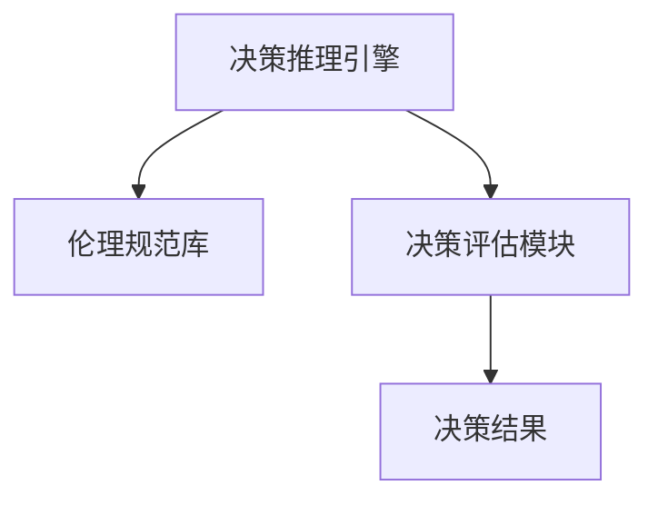

                 


# AI Agent的伦理决策：在LLM中实现道德推理

---

## 关键词

- AI Agent
- 伦理决策
- 道德推理
- 大语言模型（LLM）
- 伦理算法

---

## 摘要

随着AI技术的快速发展，AI Agent（智能体）在各个领域的应用越来越广泛。然而，AI Agent在决策过程中面临的伦理问题也随之而来。如何在AI Agent中实现道德推理，确保其决策符合人类社会的伦理规范，成为一个亟待解决的重要问题。本文将深入探讨AI Agent的伦理决策问题，分析其在大语言模型（LLM）中的实现方法，结合伦理学理论、算法设计和系统架构，提出一种基于伦理框架的道德推理方法，并通过实际案例展示其应用。

---

## 第一部分: AI Agent的伦理决策基础

### 第1章: AI Agent与伦理决策概述

#### 1.1 AI Agent的基本概念

- **AI Agent的定义**：AI Agent是一种能够感知环境、自主决策并采取行动的智能实体，旨在通过交互与环境实现特定目标。
- **AI Agent的分类**：根据智能水平，AI Agent可以分为简单反应式Agent、基于模型的反射式Agent、目标驱动的Agent和效用驱动的Agent。
- **AI Agent的核心特征**：感知能力、决策能力、行动能力、学习能力和协作能力。

#### 1.2 伦理决策的重要性

- **伦理决策的定义**：伦理决策是指在决策过程中，基于伦理规范和价值观，选择最优行动方案的过程。
- **伦理决策的挑战**：
  - 决策的不确定性与风险
  - 伦理规范的多样性与冲突
  - 决策过程的透明性与可解释性

### 第2章: 伦理决策的背景与问题分析

#### 2.1 伦理决策的背景

- **AI技术的发展现状**：AI技术的快速发展推动了AI Agent在医疗、金融、交通等领域的广泛应用。
- **AI Agent在社会中的作用**：AI Agent能够帮助人类完成复杂任务，但同时也带来了伦理决策的问题。
- **伦理决策的必要性**：为了避免AI Agent的决策引发伦理问题，需要在AI Agent中嵌入伦理决策机制。

#### 2.2 伦理决策的核心问题

- **决策的不确定性**：AI Agent需要在不确定的环境中做出决策，可能面临多种选择。
- **伦理规范的多样性**：不同的文化和价值观可能导致伦理规范的冲突。
- **决策的透明性与可解释性**：AI Agent的决策过程需要能够被人类理解和信任。

### 第3章: 伦理决策的理论基础

#### 3.1 伦理学基础

- **功利主义**：以最大化整体幸福为准则，主张选择能够带来最大利益的行动。
- **义务论**：以道德义务和规范为基础，主张基于道德义务做出决策。
- **伦理决策的多学科视角**：伦理决策需要结合伦理学、社会学、心理学等多个学科的理论。

#### 3.2 伦理决策的框架

- **基于规则的伦理决策框架**：通过制定具体的伦理规则来指导决策。
- **基于案例的伦理决策框架**：通过分析类似案例，推导出适用于当前情境的决策。
- **基于效用的伦理决策框架**：通过计算决策的效用值，选择最优行动方案。

---

## 第二部分: AI Agent伦理决策的核心概念与联系

### 第4章: 伦理决策模型与算法

#### 4.1 伦理决策模型的构建

- **模型构建的基本原则**：伦理决策模型需要考虑伦理规范、决策环境和决策目标。
- **模型的输入与输出**：输入包括决策情境、伦理规范和决策目标，输出是决策结果和决策理由。
- **模型的训练与优化**：通过伦理案例数据训练模型，优化其决策准确性和伦理符合性。

#### 4.2 伦理决策算法的实现

- **基于规则的伦理推理算法**：通过预定义的伦理规则进行推理，适用于规则明确的伦理情境。
- **基于案例的伦理推理算法**：通过案例库匹配当前情境，推导出决策方案。
- **基于效用的伦理推理算法**：通过计算效用值，选择最优行动方案。

#### 4.3 伦理决策算法的实现步骤

1. **问题分析**：明确决策情境和目标。
2. **伦理规范提取**：从决策情境中提取相关的伦理规范。
3. **决策模型构建**：根据伦理规范构建决策模型。
4. **决策推理**：通过算法进行决策推理，生成决策方案。
5. **决策评估**：评估决策方案的伦理符合性和可行性。

### 第5章: 伦理决策的核心概念与联系

#### 5.1 伦理决策的核心概念

- **伦理规范的表示与编码**：将伦理规范转化为可计算的数学表达式。
- **决策过程的透明性与可解释性**：确保决策过程可以被人类理解和信任。
- **决策结果的伦理评估**：对决策结果进行伦理评估，确保其符合伦理规范。

#### 5.2 伦理决策的核心要素

- **伦理规范**：决策的基础，需要明确和具体。
- **决策情境**：决策的环境和条件，影响决策结果。
- **决策目标**：决策的最终目标，需要与伦理规范一致。

---

## 第三部分: AI Agent伦理决策的系统架构与实现

### 第6章: 伦理决策的系统架构设计

#### 6.1 系统功能设计

- **伦理规范库**：存储和管理相关的伦理规范和案例。
- **决策推理引擎**：负责根据决策情境和伦理规范进行推理，生成决策方案。
- **决策评估模块**：对决策方案进行伦理评估，确保其符合伦理规范。

#### 6.2 系统架构设计



#### 6.3 系统接口设计

- **输入接口**：接收决策情境和决策目标。
- **输出接口**：输出决策结果和决策理由。

### 第7章: 伦理决策的实现与案例分析

#### 7.1 环境安装

- **编程语言**：Python 3.8+
- **依赖库**：numpy, pandas, transformers, mermaid

#### 7.2 核心代码实现

```python
def ethical_reasoning(rules, scenario):
    # 根据规则和场景进行伦理推理
    # 返回决策结果
    pass

def utility_calculation(action, scenario):
    # 计算行动的效用值
    # 返回效用值
    pass
```

#### 7.3 代码应用解读与分析

- **代码功能解读**：上述代码定义了两个核心函数，分别用于基于规则的伦理推理和基于效用的伦理推理。
- **代码实现细节**：具体实现需要结合具体的伦理规范和决策情境，进行逻辑推理和计算。

#### 7.4 实际案例分析

- **案例背景**：医疗场景中的伦理决策。
- **决策过程**：AI Agent需要在有限的医疗资源下，合理分配给患者，确保公平和效率。
- **决策结果**：根据伦理规范和算法计算，选择最优的分配方案。

---

## 第四部分: 伦理决策的优化与扩展

### 第8章: 伦理决策的优化与扩展

#### 8.1 算法优化

- **规则优化**：通过不断优化伦理规则，提高决策的准确性和伦理符合性。
- **模型优化**：通过改进决策模型，提高决策的效率和质量。

#### 8.2 决策系统的扩展

- **多模态决策**：结合图像、文本等多种数据源，提高决策的全面性。
- **动态伦理规范**：根据实际情况动态调整伦理规范，适应不断变化的环境。

### 第9章: 伦理决策的最佳实践与注意事项

#### 9.1 最佳实践

- **明确伦理规范**：确保伦理规范的明确性和具体性。
- **注重决策透明性**：确保决策过程的透明性和可解释性。
- **持续优化**：定期评估和优化决策系统，确保其适应性。

#### 9.2 注意事项

- **避免伦理冲突**：在决策过程中尽量避免伦理冲突，确保决策的合理性。
- **保护隐私**：在处理个人数据时，确保隐私保护。
- **遵守法律法规**：确保决策系统符合相关法律法规。

---

## 第五部分: 伦理决策的未来展望与总结

### 第10章: 伦理决策的未来展望

#### 10.1 伦理决策的发展趋势

- **智能化**：决策系统将更加智能化，能够处理更复杂的伦理问题。
- **个性化**：决策系统将更加个性化，能够根据具体情况调整决策策略。
- **全球化**：伦理决策将更加全球化，需要考虑不同文化和价值观的影响。

### 第11章: 总结

#### 11.1 文章总结

- 本文详细探讨了AI Agent的伦理决策问题，分析了其在LLM中的实现方法，提出了基于伦理框架的道德推理方法，并通过实际案例展示了其应用。

#### 11.2 展望未来

- 随着AI技术的不断发展，伦理决策将变得更加重要，需要我们不断探索和优化，确保AI Agent的决策符合人类社会的伦理规范。

---

## 参考文献

（此处可以列出相关的参考文献和资料）

---

以上是《AI Agent的伦理决策：在LLM中实现道德推理》的技术博客文章的完整内容，涵盖了从理论到实践的各个方面，希望对您有所帮助！

