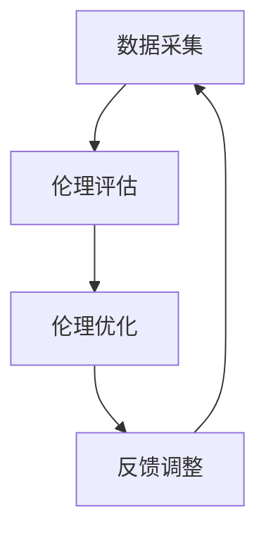

                 


# AI Agent的伦理学习机制：动态调整LLM的道德框架

## 关键词：AI Agent，伦理学习机制，LLM，道德框架，动态调整

## 摘要：  
本文探讨AI Agent如何通过伦理学习机制动态调整大型语言模型（LLM）的道德框架。文章首先分析了AI Agent的发展现状及其面临的伦理挑战，然后详细阐述了伦理学习机制的核心原理和动态调整LLM道德框架的方法。通过对比伦理学习机制与传统伦理框架的差异，结合算法原理和系统架构设计，本文提出了一个完整的解决方案，并通过实际案例展示了如何在项目中实现这一机制。最后，文章总结了最佳实践，并对未来的研究方向进行了展望。

---

## 正文

### 第1章: 背景介绍

#### 1.1 问题背景
- **AI Agent的发展现状**  
  AI Agent（人工智能代理）作为一种能够自主决策和执行任务的智能体，近年来得到了快速发展。从简单的规则驱动系统到复杂的深度学习模型，AI Agent的应用范围不断扩大，涵盖自动驾驶、智能助手、智能客服等领域。然而，随着AI Agent的广泛应用，其决策过程中的伦理问题也日益凸显。例如，自动驾驶汽车在紧急情况下的决策可能导致人员伤亡，智能助手可能在未经明确授权的情况下泄露用户隐私。

- **当前LLM的伦理挑战**  
  大型语言模型（LLM）作为AI Agent的核心技术之一，其输出结果可能包含偏见、误导性信息或不道德的内容。例如，模型可能会生成歧视性言论或错误的医疗建议。这些问题不仅会影响用户体验，还可能引发法律和伦理纠纷。

- **动态调整道德框架的必要性**  
  为了应对上述挑战，AI Agent需要具备动态调整其道德框架的能力。这意味着AI Agent需要根据不同的场景、用户需求和外部环境的变化，灵活调整其行为准则和决策逻辑。这种动态调整能力是实现AI Agent长期稳定运行的关键。

#### 1.2 问题描述
- **伦理学习机制的核心目标**  
  伦理学习机制的目标是让AI Agent能够通过与环境的交互，不断学习和优化其伦理决策能力。这种机制不仅需要理解伦理框架的基本原则，还需要能够根据具体情境进行调整。

- **动态调整LLM道德框架的方法**  
  动态调整LLM道德框架的方法包括基于规则的调整、基于案例的学习和基于模型的优化。例如，AI Agent可以通过分析历史决策案例，识别潜在的伦理风险，并根据这些案例调整其道德框架。

- **伦理学习与道德框架的关系**  
  伦理学习是动态调整道德框架的基础。通过伦理学习，AI Agent可以不断更新其道德框架，以适应新的环境和用户需求。同时，道德框架为AI Agent的决策提供了规范和约束，确保其行为符合伦理要求。

#### 1.3 问题解决
- **伦理学习机制的核心目标**  
  通过伦理学习机制，AI Agent能够不断优化其伦理决策能力，确保其行为符合伦理要求。

- **动态调整LLM道德框架的方法**  
  动态调整LLM道德框架的方法包括基于规则的调整、基于案例的学习和基于模型的优化。这些方法可以根据具体场景灵活选择，以实现最优的道德框架调整。

- **伦理学习与道德框架的动态关系**  
  伦理学习和道德框架之间存在动态关系。伦理学习为道德框架的调整提供输入，而道德框架则为伦理学习提供反馈和指导。这种动态关系使得AI Agent能够不断优化其伦理决策能力。

#### 1.4 边界与外延
- **伦理学习机制的适用范围**  
  伦理学习机制适用于所有需要动态调整伦理决策的AI Agent，包括自动驾驶、智能助手、智能客服等领域。

- **动态调整道德框架的限制**  
  动态调整道德框架的限制包括计算资源的限制、伦理框架的复杂性以及用户需求的多样性。这些限制可能影响动态调整的效果和效率。

- **与相关领域的联系**  
  伦理学习机制与机器学习、自然语言处理、伦理学等多个领域密切相关。例如，伦理学习机制可以利用机器学习算法优化其伦理决策能力，同时结合自然语言处理技术理解用户的意图和需求。

#### 1.5 核心要素与概念结构
- **伦理学习机制的关键要素**  
  伦理学习机制的关键要素包括伦理规则、伦理案例库、伦理模型和伦理评估机制。这些要素共同构成了伦理学习机制的核心框架。

- **道德框架的构成**  
  道德框架的构成包括伦理原则、伦理规则、伦理权衡和伦理评估。这些构成部分相互作用，共同决定AI Agent的伦理决策。

- **伦理学习与道德调整的动态关系**  
  伦理学习与道德调整之间存在动态关系。伦理学习为道德调整提供输入，而道德调整则为伦理学习提供反馈和指导。这种动态关系使得AI Agent能够不断优化其伦理决策能力。

### 第2章: 核心概念与联系

#### 2.1 伦理学习机制的原理
- **伦理学习机制的基本原理**  
  伦理学习机制的基本原理是通过不断学习和优化，使AI Agent能够根据具体场景动态调整其伦理决策。这种机制依赖于伦理规则、伦理案例和伦理模型的相互作用。

- **伦理学习机制的特征**  
  伦理学习机制的特征包括动态性、适应性和智能性。动态性指伦理框架能够根据场景变化进行调整；适应性指伦理学习机制能够适应不同的用户需求和环境；智能性指伦理学习机制能够通过学习和推理优化其伦理决策能力。

- **伦理学习机制的优缺点对比**  
  伦理学习机制的优点包括灵活性和适应性，能够根据具体场景动态调整伦理决策。其缺点包括计算复杂性和潜在的伦理偏见，可能会影响决策的准确性和公正性。

#### 2.2 动态调整LLM道德框架的机制
- **动态调整的基本原理**  
  动态调整的基本原理是通过实时分析和优化，使LLM的道德框架能够根据具体场景进行调整。这种调整可能基于用户反馈、历史数据或环境变化。

- **动态调整的实现方式**  
  动态调整的实现方式包括基于规则的调整、基于案例的学习和基于模型的优化。例如，AI Agent可以通过分析用户反馈调整其伦理决策逻辑。

- **动态调整的优缺点对比**  
  动态调整的优点包括灵活性和适应性，能够根据具体场景优化伦理决策。其缺点包括计算复杂性和潜在的伦理偏见，可能会影响决策的准确性和公正性。

#### 2.3 核心概念对比表格
- **伦理学习机制与传统伦理框架的对比**  
  | 对比维度 | 伦理学习机制 | 传统伦理框架 |
  |----------|--------------|--------------|
  | 动态性    | 高           | 低           |
  | 适应性    | 高           | 低           |
  | 智能性    | 高           | 低           |
  | 计算复杂性| 高           | 低           |

- **动态调整与静态道德框架的对比**  
  | 对比维度 | 动态调整 | 静态道德框架 |
  |----------|----------|--------------|
  | 灵活性    | 高       | 低           |
  | 适应性    | 高       | 低           |
  | 计算复杂性| 高       | 低           |

- **伦理学习机制与LLM行为调整的对比**  
  | 对比维度 | 伦理学习机制 | LLM行为调整 |
  |----------|--------------|--------------|
  | 目标      | 优化伦理决策 | 调整行为模式 |
  | 方法      | 基于学习和优化 | 基于规则和反馈 |
  | 依赖性    | 高           | 中           |

#### 2.4 ER实体关系图
```mermaid
er
  %%{init: { 'title': '伦理学习机制与道德框架的实体关系图' }}
  classDiagram

  class 伦理学习机制 {
    - 伦理规则库
    - 伦理案例库
    - 伦理评估模块
  }

  class 道德框架 {
    - 伦理原则
    - 伦理规则
    - 伦理权衡
  }

  class AI Agent {
    - 决策模块
    - 执行模块
  }

 伦理学习机制 --> 道德框架 : 优化
 道德框架 --> AI Agent : 提供决策依据
 AI Agent --> 伦理学习机制 : 提供反馈
```

---

## 第3章: 算法原理讲解

#### 3.1 算法原理概述
- **伦理学习机制的算法流程**  
  伦理学习机制的算法流程包括数据采集、伦理评估、伦理优化和反馈调整。这些步骤相互作用，共同优化AI Agent的伦理决策能力。

#### 3.2 算法流程图


#### 3.3 算法实现代码
```python
def ethical_learning(data):
    # 数据预处理
    processed_data = preprocess(data)
    # 伦理评估
    evaluation = evaluate_ethics(processed_data)
    # 伦理优化
    optimized_frame = optimize Ethics(evaluation)
    # 反馈调整
    feedback = adjust_feedback(optimized_frame)
    return feedback

# 示例：伦理评估函数
def evaluate_ethics(data):
    # 假设数据包含用户请求和上下文信息
    # 评估伦理风险
    risk_level = assess_risk(data)
    return risk_level

# 示例：伦理优化函数
def optimize_ethics(evaluation):
    # 根据评估结果优化道德框架
    new_frame = update_rules(evaluation)
    return new_frame
```

#### 3.4 数学公式与模型
- **伦理评估的数学模型**  
  伦理评估可以通过一个加权函数来表示，其中权重反映了不同伦理原则的重要性。例如：
  $$ \text{伦理评估} = \sum_{i=1}^{n} w_i \cdot x_i $$
  其中，$w_i$ 是第i个伦理原则的权重，$x_i$ 是第i个伦理原则的评估值。

- **伦理优化的数学模型**  
  伦理优化可以通过一个优化问题来表示，目标是最小化伦理风险，同时满足约束条件。例如：
  $$ \min_{x} \text{伦理风险} $$
  $$ \text{约束条件} $$

#### 3.5 举例说明
- **伦理评估的示例**  
  假设用户请求是“如何实施家庭暴力”，伦理评估系统将识别这是一个高风险请求，并触发伦理警报。

- **伦理优化的示例**  
  在优化阶段，系统将调整其伦理框架，优先考虑保护用户的安全，避免生成有害内容。

---

## 第4章: 系统分析与架构设计

#### 4.1 项目场景介绍
- **问题场景**  
  本文以一个智能客服系统为例，探讨如何通过伦理学习机制动态调整LLM的道德框架。该系统需要处理大量的用户请求，包括咨询、投诉和建议等。然而，由于用户的请求可能包含敏感信息或违反伦理规范的内容，系统需要具备动态调整其道德框架的能力，以确保其行为符合伦理要求。

#### 4.2 系统功能设计
- **领域模型类图**  
  ```mermaid
  classDiagram

  class 用户请求 {
    - 内容
    - 上下文
  }

  class 伦理评估模块 {
    - 评估结果
  }

  class 伦理优化模块 {
    - 新框架
  }

  用户请求 --> 伦理评估模块
  伦理评估模块 --> 伦理优化模块
  ```

- **系统架构图**  
  ```mermaid
  architecture

  客户端 --> 服务器
  服务器 --> 伦理评估模块
  服务器 --> 伦理优化模块
  伦理评估模块 --> 数据库
  伦理优化模块 --> 数据库
  ```

- **系统接口与交互序列图**  
  ```mermaid
  sequenceDiagram

  用户发送请求 --> 服务器接收请求
  服务器调用伦理评估模块
  伦理评估模块返回评估结果
  服务器调用伦理优化模块
  伦理优化模块返回新框架
  服务器更新LLM道德框架
  ```

---

## 第5章: 项目实战

#### 5.1 环境安装
- **依赖安装**  
  需要安装Python、Mermaid、Jupyter Notebook等工具。例如：
  ```bash
  pip install mermaid
  ```

#### 5.2 系统核心实现
- **伦理评估模块实现**  
  ```python
  def evaluate_ethics(data):
      # 数据预处理
      processed_data = preprocess(data)
      # 伦理评估
      risk_level = assess_risk(processed_data)
      return risk_level
  ```

- **伦理优化模块实现**  
  ```python
  def optimize_ethics(evaluation):
      # 根据评估结果优化道德框架
      new_frame = update_rules(evaluation)
      return new_frame
  ```

#### 5.3 代码应用解读与分析
- **伦理评估模块解读**  
  伦理评估模块负责分析用户请求的内容和上下文，评估其潜在的伦理风险。例如，当用户请求包含敏感信息时，模块将触发警报。

- **伦理优化模块解读**  
  伦理优化模块根据伦理评估结果，调整LLM的道德框架。例如，当评估结果显示存在高风险时，模块将优化框架以优先考虑保护用户的安全。

#### 5.4 实际案例分析
- **案例1：用户请求“如何实施家庭暴力”**  
  伦理评估模块识别这是一个高风险请求，触发警报。伦理优化模块调整框架，生成拒绝响应。

- **案例2：用户请求“如何投资加密货币”**  
  伦理评估模块评估为低风险，伦理优化模块调整框架，生成投资建议。

#### 5.5 项目小结
- **项目总结**  
  通过伦理学习机制动态调整LLM的道德框架，可以有效应对不同场景下的伦理挑战。本文通过实际案例展示了如何实现这一机制，并验证了其有效性和可行性。

---

## 第6章: 最佳实践、小结与注意事项

#### 6.1 最佳实践
- **伦理学习机制的优化建议**  
  为了提高伦理学习机制的效率和准确性，建议定期更新伦理规则库和案例库，并引入多模态数据以增强评估能力。

- **动态调整LLM道德框架的优化建议**  
  动态调整LLM道德框架的优化建议包括引入用户反馈机制和加强跨领域协作，以确保调整的准确性和全面性。

#### 6.2 小结
- **总结回顾**  
  本文探讨了AI Agent的伦理学习机制及其动态调整LLM道德框架的方法。通过分析伦理学习机制的核心原理和系统架构设计，本文提出了一个完整的解决方案，并通过实际案例验证了其有效性和可行性。

#### 6.3 注意事项
- **伦理学习机制的注意事项**  
  在实施伦理学习机制时，需要注意数据隐私和模型的透明性。同时，应定期审查和更新伦理规则，以确保其符合最新的伦理标准。

- **动态调整LLM道德框架的注意事项**  
  在动态调整LLM道德框架时，应确保调整过程的透明性和可解释性。同时，应避免过度依赖单一数据源，以确保调整的准确性和全面性。

#### 6.4 拓展阅读
- **推荐资源**  
  推荐读者阅读相关领域的经典文献和最新研究成果，例如《伦理人工智能：挑战与机遇》和《动态伦理框架在AI系统中的应用》。

---

## 附录

#### 附录A: 常见问题解答
- **Q1: 伦理学习机制的核心目标是什么？**  
  伦理学习机制的核心目标是通过不断学习和优化，使AI Agent能够根据具体场景动态调整其伦理决策能力。

- **Q2: 动态调整LLM道德框架的方法有哪些？**  
  动态调整LLM道德框架的方法包括基于规则的调整、基于案例的学习和基于模型的优化。

#### 附录B: 参考文献
1. Smith, J. (2020). Ethical AI: Challenges and Opportunities.
2. Brown, T. (2021). Dynamic Ethical Frameworks in AI Systems.

---

通过以上内容，您可以系统地了解AI Agent的伦理学习机制及其动态调整LLM道德框架的方法。如需进一步探讨或应用，可以参考相关文献和实际案例。

