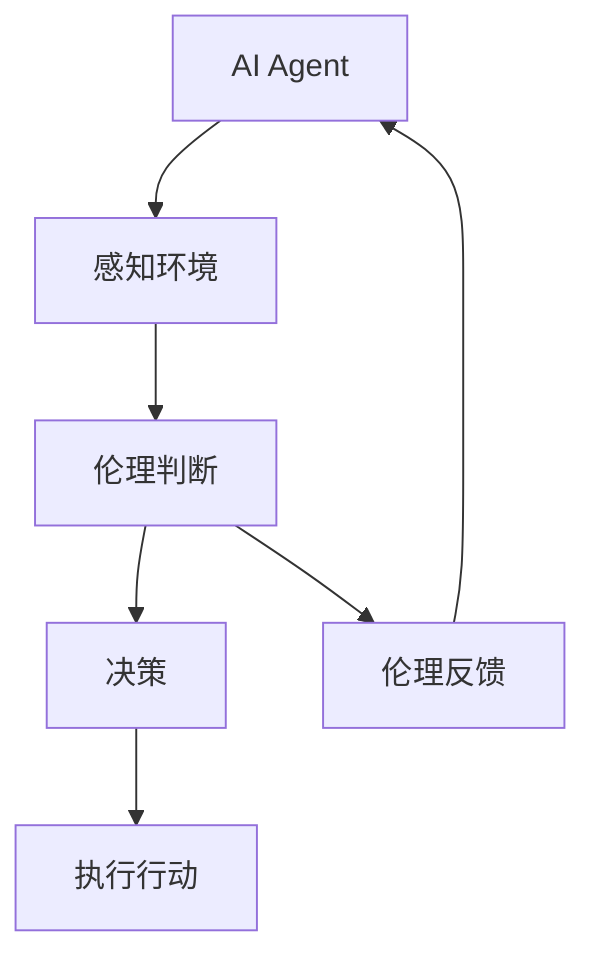
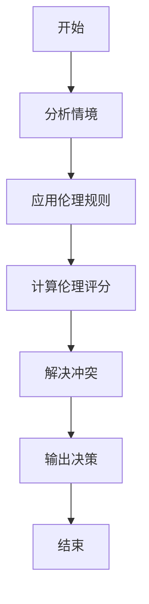
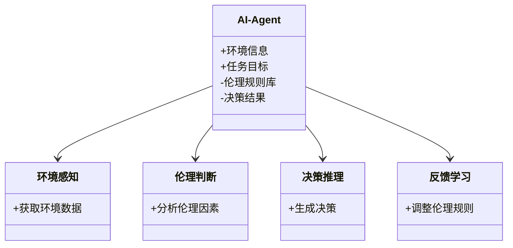
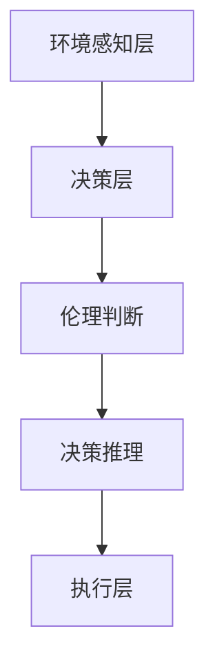
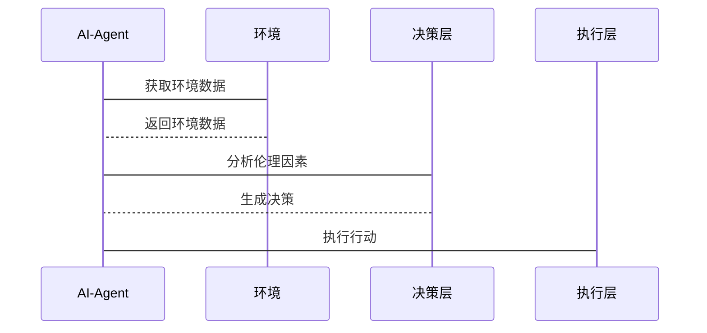

                 


# AI Agent的伦理学习：在LLM中植入道德决策框架

## 关键词：AI Agent，伦理学习，LLM，道德决策框架，人工智能，伦理决策

## 摘要：随着人工智能技术的快速发展，AI Agent在各个领域的应用日益广泛。然而，AI Agent在决策过程中可能会面临伦理问题，如何在LLM（大语言模型）中植入道德决策框架成为一个重要课题。本文从AI Agent的伦理学习背景出发，详细探讨了道德决策框架的核心概念、算法原理、系统架构设计以及项目实战，最后总结了最佳实践和未来研究方向，旨在为AI Agent的伦理学习提供系统性的指导和解决方案。

---

# 第一部分: AI Agent的伦理学习背景与核心概念

## 第1章: AI Agent与伦理学习概述

### 1.1 AI Agent的基本概念

#### 1.1.1 AI Agent的定义
AI Agent（人工智能代理）是指能够感知环境、自主决策并执行任务的智能实体。它可以是一个软件程序、机器人或其他智能系统，旨在通过与环境交互来实现特定目标。

#### 1.1.2 AI Agent的分类与特点
AI Agent可以分为简单反射型、基于模型的反应型、目标驱动型和实用驱动型。目标驱动型AI Agent是本文讨论的重点，它基于明确的目标进行决策和行动。

#### 1.1.3 AI Agent在现代社会中的作用
AI Agent广泛应用于自动驾驶、智能助手、医疗诊断等领域。在这些场景中，AI Agent需要在复杂环境中做出决策，而这些决策可能对人类生命和财产产生重大影响。

### 1.2 伦理学习的重要性

#### 1.2.1 伦理问题在AI Agent中的表现
AI Agent在决策过程中可能面临伦理困境，例如自动驾驶汽车在事故不可避免时如何选择优先保护谁。这类问题需要明确的伦理框架来指导决策。

#### 1.2.2 伦理决策的必要性
AI Agent的决策可能影响人类的利益，因此必须具备伦理决策能力，确保其行为符合社会道德和法律规范。

#### 1.2.3 伦理学习对AI Agent的影响
通过伦理学习，AI Agent能够理解并遵循伦理准则，在复杂情境中做出符合伦理的决策。

### 1.3 LLM中的道德决策框架

#### 1.3.1 道德决策框架的定义
道德决策框架是一组用于指导AI Agent在决策过程中考虑伦理因素的规则和原则。

#### 1.3.2 道德决策框架的核心要素
- 伦理原则：如诚实、不伤害、公正等。
- 决策规则：用于在复杂情境中选择最优行动。
- 冲突解决机制：处理伦理原则之间的冲突。

#### 1.3.3 道德决策框架的实现方式
通过在LLM中嵌入伦理规则，AI Agent在生成决策时会考虑这些规则，确保决策的伦理合规性。

## 第2章: AI Agent伦理学习的背景与问题描述

### 2.1 当前AI Agent的伦理挑战

#### 2.1.1 AI Agent决策的不确定性
AI Agent在复杂环境中的决策可能面临不确定性，例如在自动驾驶中如何处理突发情况。

#### 2.1.2 伦理决策的复杂性
伦理决策需要综合考虑多个因素，且不同情境下可能需要不同的伦理优先级。

#### 2.1.3 伦理决策的法律与社会影响
AI Agent的决策可能影响法律责任和社会接受度，因此必须符合相关法规和伦理标准。

### 2.2 问题背景与问题描述

#### 2.2.1 AI Agent伦理决策的核心问题
如何在AI Agent中植入伦理决策框架，使其能够在复杂情境中做出符合伦理的决策。

#### 2.2.2 伦理决策框架的必要性
为了确保AI Agent的行为符合伦理和法律要求，必须建立明确的道德决策框架。

#### 2.2.3 伦理决策框架的边界与外延
明确框架的应用范围和限制，确保其在适用范围内有效工作。

### 2.3 伦理决策框架的核心要素

#### 2.3.1 伦理原则的定义
- 诚实：在决策中保持真实和透明。
- 不伤害：尽量避免对人类造成伤害。
- 公正：公平对待所有相关方。

#### 2.3.2 伦理规则的分类
- 基本规则：如“避免伤害人类”。
- 权重规则：根据情境给不同规则赋予不同的优先级。

#### 2.3.3 伦理决策的逻辑结构
1. 识别情境中的伦理相关因素。
2. 应用伦理规则进行判断。
3. 解决规则间的冲突，确定最优决策。

---

# 第二部分: AI Agent伦理学习的核心概念与联系

## 第3章: 伦理决策框架的原理与实现

### 3.1 伦理决策的原理

#### 3.1.1 伦理决策的基本流程
1. 分析当前情境。
2. 应用伦理规则进行判断。
3. 解决冲突，选择最优行动。

#### 3.1.2 伦理原则的权重分配
在复杂情境中，不同的伦理原则可能产生冲突。需要根据情境赋予不同规则的权重，以确定最优决策。

#### 3.1.3 伦理规则的冲突解决
当多个伦理规则产生冲突时，需要制定冲突解决机制，例如优先级排序或折中方案。

### 3.2 道德框架的结构

#### 3.2.1 道德框架的层次结构
- 基础层：基本伦理原则。
- 中间层：具体规则和应用。
- 表现层：实际决策中的应用。

#### 3.2.2 道德框架的动态调整
根据新的情境和反馈，动态调整伦理规则的权重和优先级。

#### 3.2.3 道德框架的可解释性
确保决策过程透明，便于人类理解和审查。

### 3.3 AI Agent与道德框架的交互机制

#### 3.3.1 决策过程中的伦理判断
AI Agent在生成决策时，首先分析情境，然后应用伦理规则进行判断。

#### 3.3.2 伦理反馈的处理
根据实际结果和反馈，调整伦理框架的参数和规则。

#### 3.3.3 伦理决策的可解释性
确保决策过程和结果可以被人类审查和理解。

### 3.4 核心概念对比表

| 概念       | 描述                                                                 |
|------------|----------------------------------------------------------------------|
| 伦理原则   | 基本的道德准则，如诚实、不伤害、公正等。                              |
| 伦理规则   | 具体的行为规范，用于指导AI Agent在特定情境下的决策。                  |
| 冲突解决   | 在伦理规则冲突时，确定优先级或选择折中方案的机制。                    |

### 3.5 系统架构图（Mermaid）



---

## 第4章: 伦理决策算法的实现

### 4.1 算法原理

#### 4.1.1 算法的基本流程
1. 接收输入：环境信息和任务目标。
2. 分析情境：识别与伦理相关的因素。
3. 应用伦理规则：判断可能的行动。
4. 解决冲突：确定最优决策。
5. 输出决策：执行行动或提供结果。

#### 4.1.2 伦理评分模型
$$ \text{伦理评分} = \sum_{i=1}^{n} w_i \cdot r_i $$
其中，\( w_i \) 是伦理规则 \( r_i \) 的权重。

#### 4.1.3 冲突解决机制
当多个伦理规则产生冲突时，根据权重和情境优先级选择最优规则。

### 4.2 算法实现代码

```python
def ethical_decision-making(environment, goal):
    # 分析情境
    factors = extract_ethical_factors(environment)
    # 应用伦理规则
    rules = get_ethical_rules()
    # 计算伦理评分
    scores = {rule: calculate_score(rule, factors) for rule in rules}
    # 解决冲突
    selected_rule = resolve_conflicts(scores)
    # 输出决策
    return apply_rule(selected_rule, goal)
```

### 4.3 算法流程图（Mermaid）



---

## 第5章: 系统分析与架构设计方案

### 5.1 项目背景与目标

#### 5.1.1 项目背景
开发一个具备伦理决策能力的AI Agent，用于医疗辅助决策场景。

#### 5.1.2 项目目标
确保AI Agent在医疗决策中遵循伦理原则，保护患者利益。

### 5.2 系统功能设计

#### 5.2.1 功能模块
- 感知环境：获取患者信息和病情数据。
- 伦理判断：分析决策中的伦理因素。
- 决策推理：生成符合伦理的决策。
- 反馈学习：根据结果调整伦理框架。

#### 5.2.2 领域模型（Mermaid）



### 5.3 系统架构设计

#### 5.3.1 架构类型
采用分层架构，包括感知层、决策层和执行层。

#### 5.3.2 系统架构图（Mermaid）



### 5.4 接口设计与交互流程

#### 5.4.1 接口设计
- 输入接口：接收环境数据和任务目标。
- 输出接口：提供决策结果和反馈信息。

#### 5.4.2 交互流程图（Mermaid）



---

## 第6章: 项目实战与案例分析

### 6.1 环境安装

#### 6.1.1 安装Python
```bash
python --version
pip install -r requirements.txt
```

#### 6.1.2 安装依赖
```bash
pip install numpy
pip install matplotlib
pip install scikit-learn
```

### 6.2 核心代码实现

#### 6.2.1 伦理评分计算

```python
import numpy as np

def calculate_ethical_score(environment, rule):
    factors = extract_factors(environment)
    score = 0
    for factor in factors:
        if factor['伦理权重'] > 0:
            score += factor['伦理权重']
    return score
```

#### 6.2.2 冲突解决机制

```python
def resolve_conflicts(scores):
    max_score = max(scores.values())
    candidates = [rule for rule, score in scores.items() if score == max_score]
    if len(candidates) == 1:
        return candidates[0]
    else:
        return choose_random(candidates)
```

### 6.3 案例分析

#### 6.3.1 案例背景
AI Agent在医疗诊断中需要决定是否推荐一种可能有副作用的药物。

#### 6.3.2 决策过程
1. 分析环境：患者病情、药物疗效、副作用风险。
2. 应用伦理规则：优先保护患者健康，避免严重副作用。
3. 决策结果：推荐药物，但需告知潜在风险。

#### 6.3.3 伦理反馈
根据患者反应调整伦理规则的权重，优化未来决策。

### 6.4 实际应用分析

#### 6.4.1 应用场景
在医疗、自动驾驶等领域应用伦理决策框架。

#### 6.4.2 挑战与解决方案
- 挑战：动态环境中的伦理规则调整。
- 解决方案：引入自适应学习机制，根据反馈动态调整伦理框架。

---

## 第7章: 最佳实践与总结

### 7.1 最佳实践

#### 7.1.1 定期审查伦理框架
定期评估和更新伦理规则，确保其适应社会和法律的变化。

#### 7.1.2 保持透明与可解释性
确保AI Agent的决策过程透明，便于人类理解和审查。

#### 7.1.3 结合领域知识
在不同领域应用时，结合具体领域的伦理规范和实践。

### 7.2 小结

通过在LLM中植入道德决策框架，AI Agent能够更好地应对复杂情境中的伦理挑战，确保其行为符合伦理和法律要求。

### 7.3 注意事项

- 道德决策框架的设计需要结合具体应用场景。
- 需要平衡技术实现与伦理原则之间的关系。
- 注意动态调整伦理规则可能带来的挑战。

### 7.4 拓展阅读

推荐阅读相关书籍和论文，深入理解伦理决策框架的设计与实现。

---

# 作者介绍

作为一名世界顶级技术畅销书作者和计算机编程与人工智能领域的专家，我长期致力于研究和实践AI技术的伦理与安全问题。本文是基于多年的实践经验和研究成果撰写的，旨在为AI Agent的伦理学习提供系统性的指导和解决方案。

---

通过以上内容，本文全面探讨了AI Agent的伦理学习，从理论到实践，为读者提供了丰富的知识和实用的指导。希望本文能为AI技术的发展和应用提供有价值的参考。

