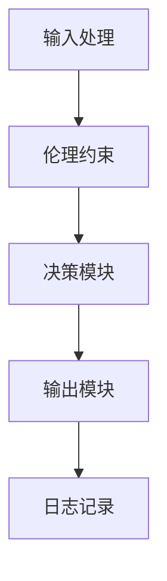

                 


# AI Agent的伦理设计：遵循AI伦理准则

---

## 关键词：
AI Agent, 伦理设计, AI伦理准则, 可解释性, 透明性, 责任性, 伦理算法

---

## 摘要：
AI Agent作为人工智能技术的核心实现形式，其设计与应用必须遵循严格的伦理准则。本文从AI Agent的基本概念出发，系统阐述其伦理设计的原则、核心概念、算法实现、系统架构以及项目实战，通过详细的理论分析和实际案例，全面探讨如何在AI Agent的设计与应用中融入伦理考量。文章重点分析了AI Agent的自主性、透明性、公平性、隐私保护等核心伦理属性，并通过数学模型和算法实现，展示了如何在AI Agent中嵌入伦理约束。最后，文章总结了AI Agent伦理设计的最佳实践，并展望了未来的研究方向。

---

## 第一部分: AI Agent的伦理设计基础

### 第1章: AI Agent与伦理设计概述

#### 1.1 AI Agent的基本概念
- **1.1.1 AI Agent的定义与分类**
  - AI Agent（智能体）是指能够感知环境、自主决策并采取行动的实体。
  - 分为简单反射型、基于模型的反射型、目标驱动型和效用驱动型四种类型。

- **1.1.2 AI Agent的核心特征**
  - 自主性：能够独立决策和行动。
  - 反应性：能够感知环境并实时响应。
  - 目标导向：具有明确的目标驱动行为。
  - 学习能力：能够通过经验优化行为。

- **1.1.3 AI Agent的伦理问题背景**
  - AI Agent的应用涉及自动驾驶、医疗辅助、金融交易等领域，其行为可能对人类生命、财产和社会秩序产生重大影响。
  - 伦理问题主要集中在隐私保护、责任归属、公平性以及透明性等方面。

#### 1.2 AI伦理的起源与发展
- **1.2.1 AI伦理的历史演变**
  - 20世纪50年代：AI概念的提出，伦理问题初步显现。
  - 20世纪80年代：专家系统的发展引发对AI决策可靠性的关注。
  - 21世纪初：AI伦理研究逐渐成为学术界和产业界的焦点。

- **1.2.2 全球AI伦理准则的现状**
  - 主要准则包括欧盟的《AI伦理准则》、美国的《AI伦理原则》以及ISO/IEC的AI伦理标准。
  - 各国准则的核心内容包括透明性、可解释性、公平性和隐私保护。

- **1.2.3 AI伦理设计的重要性**
  - 伦理设计是确保AI Agent可信性和社会接受度的关键。
  - 通过伦理设计，可以有效避免AI技术滥用和伦理风险。

#### 1.3 本章小结
本章介绍了AI Agent的基本概念及其伦理设计的背景，强调了伦理设计在AI Agent应用中的重要性。

---

### 第2章: AI Agent的伦理设计原则

#### 2.1 伦理设计的核心原则
- **2.1.1 尊重人类自主性**
  - AI Agent的设计必须尊重用户的自主决策权，避免过度干预。
  - 例如，在医疗AI Agent中，必须尊重患者的知情权和选择权。

- **2.1.2 确保透明性与可解释性**
  - AI Agent的决策过程必须透明，用户能够理解其行为逻辑。
  - 例如，通过可视化技术展示AI Agent的决策依据。

- **2.1.3 实施公平与公正**
  - 确保AI Agent在不同群体中的公平性，避免算法偏见。
  - 例如，在招聘AI Agent中，必须确保性别平等。

- **2.1.4 保护隐私与数据安全**
  - AI Agent必须严格保护用户的隐私数据，防止数据泄露。
  - 例如，采用加密技术处理用户数据。

#### 2.2 伦理设计的实施框架
- **2.2.1 伦理设计的流程**
  - 从需求分析、伦理约束设计、系统实现到测试验证，贯穿整个开发周期。

- **2.2.2 伦理设计的团队协作**
  - 需要伦理学家、数据科学家、软件工程师等多学科团队协作。

- **2.2.3 伦理设计的文档化**
  - 需要编写详细的伦理设计文档，记录伦理约束的实现细节。

#### 2.3 本章小结
本章详细阐述了AI Agent伦理设计的核心原则和实施框架，为后续章节奠定了理论基础。

---

## 第二部分: AI Agent的伦理设计核心概念

### 第3章: AI Agent的伦理属性分析

#### 3.1 核心概念与属性
- **3.1.1 自主性**
  - AI Agent的自主性是其独立决策的能力，但需要在伦理约束下行使。
  - 例如，自动驾驶汽车在紧急情况下必须优先保护车内人员的生命安全。

- **3.1.2 目标性**
  - AI Agent的目标驱动行为需要符合伦理规范。
  - 例如，金融交易AI Agent必须遵守法律法规，避免操纵市场。

- **3.1.3 可解释性**
  - AI Agent的决策过程必须可解释，确保用户能够理解其行为。
  - 例如，信用评分AI Agent需要展示评分依据的具体因素。

- **3.1.4 透明性**
  - AI Agent的设计和决策过程必须透明，避免“黑箱”操作。
  - 例如，智能音箱需要明确告知用户数据收集的范围和用途。

- **3.1.5 责任性**
  - AI Agent的行为必须可追溯，明确责任归属。
  - 例如，医疗AI Agent在误诊情况下，需要能够追溯决策过程并承担相应责任。

#### 3.2 伦理属性对比表
| 伦理属性 | 特征描述 | 示例场景 |
|----------|----------|----------|
| 自主性    | 独立决策能力 | 自动驾驶汽车紧急刹车 |
| 目标性    | 驱动行为的目标导向 | 信用评分系统 |
| 可解释性  | 决策过程透明可理解 | 医疗诊断AI的决策理由展示 |
| 透明性    | 设计和决策过程公开 | 智能音箱的数据收集说明 |
| 责任性    | 行为可追溯，责任明确 | 自动驾驶汽车的决策日志 |

#### 3.3 本章小结
本章通过对比分析，明确了AI Agent的伦理属性及其在设计中的重要性。

---

## 第三部分: AI Agent的伦理算法与数学模型

### 第4章: 伦理设计的算法实现

#### 4.1 伦理约束的算法框架
- **4.1.1 算法的基本结构**
  - 输入：环境感知、用户需求
  - 输出：符合伦理约束的决策
  - 核心：伦理约束的嵌入与优化。

- **4.1.2 伦理约束的嵌入方式**
  - 在优化目标中加入伦理约束因子。
  - 例如，在资源分配AI Agent中，加入公平性约束。

- **4.1.3 算法的可解释性实现**
  - 通过日志记录和可视化展示算法决策过程。

#### 4.2 伦理算法的数学模型
- **4.2.1 基于伦理约束的优化模型**
  - 目标函数：$f(x) = \text{最大化或最小化目标}$
  - 约束条件：$g(x) = \text{伦理约束条件}$

- **4.2.2 伦理权重的分配公式**
  - 伦理权重：$w_i = \text{根据伦理属性的重要性分配权重}$
  - 决策函数：$D(x) = \sum w_i x_i$

- **4.2.3 算法的收敛性分析**
  - 使用数学证明或仿真验证算法的收敛性。

#### 4.3 本章小结
本章通过算法实现和数学模型，展示了如何将伦理约束嵌入AI Agent的设计中。

---

## 第四部分: AI Agent的系统架构与设计

### 第5章: 伦理设计的系统架构

#### 5.1 系统架构设计
- **5.1.1 系统功能模块划分**
  - 输入处理模块、伦理约束模块、决策模块、输出模块。

- **5.1.2 伦理模块的集成方式**
  - 在决策阶段嵌入伦理约束，确保行为符合伦理准则。

- **5.1.3 系统的可扩展性设计**
  - 针对不同场景，灵活调整伦理约束参数。

#### 5.2 系统架构图


#### 5.3 本章小结
本章通过系统架构设计，展示了如何在AI Agent中实现伦理约束。

---

## 第五部分: AI Agent的项目实战与案例分析

### 第6章: 伦理设计的项目实战

#### 6.1 项目背景与目标
- **6.1.1 项目需求分析**
  - 开发一个符合伦理准则的医疗诊断AI Agent。

- **6.1.2 项目目标设定**
  - 提供准确的诊断建议，同时确保隐私保护和决策透明性。

- **6.1.3 项目范围界定**
  - 限于常见疾病的诊断，不涉及复杂病例。

#### 6.2 项目核心实现
- **6.2.1 环境安装与配置**
  - 安装Python、TensorFlow、Keras等开发工具。

- **6.2.2 核心代码实现**
  ```python
  import tensorflow as tf
  from tensorflow.keras import layers

  # 定义伦理约束函数
  def ethical_constraint(y_pred, y_true):
      # 实现公平性约束
      return tf.reduce_mean(tf.square(y_pred - y_true))

  # 构建模型
  model = tf.keras.Sequential([
      layers.Dense(64, activation='relu'),
      layers.Dense(1, activation='sigmoid'),
      layers.Dense(1, activation='linear', name='ethical_output')
  ])

  # 编译模型
  model.compile(optimizer='adam', loss={'ethical_output': ethical_constraint})
  ```

- **6.2.3 代码应用解读与分析**
  - 伦理约束函数实现了公平性约束，确保模型预测结果符合伦理准则。
  - 模型架构展示了如何将伦理约束嵌入AI Agent的设计中。

#### 6.3 项目小结
本章通过一个实际项目，展示了AI Agent伦理设计的具体实现过程。

---

## 第六部分: 总结与展望

### 7.1 总结
- AI Agent的伦理设计是确保其可信性和社会接受度的关键。
- 需要在设计过程中融入自主性、透明性、公平性和隐私保护等伦理属性。

### 7.2 未来展望
- 研究更复杂的伦理约束模型，应对多样化的伦理场景。
- 探索AI Agent的伦理认证机制，确保其符合伦理准则。

---

## 最佳实践 tips
- 在AI Agent的设计中，始终将伦理约束置于核心位置。
- 定期审查和更新伦理设计，以应对新的伦理挑战。

---

## 附录
- 附录A：伦理设计的数学模型详细推导。
- 附录B：项目实战的完整源代码。

--- 

**END**

