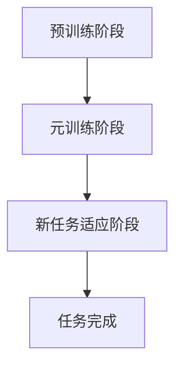
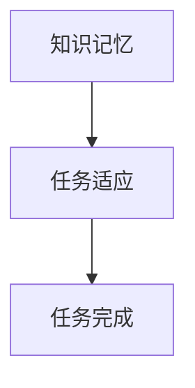
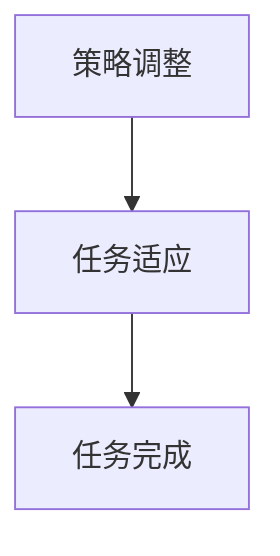
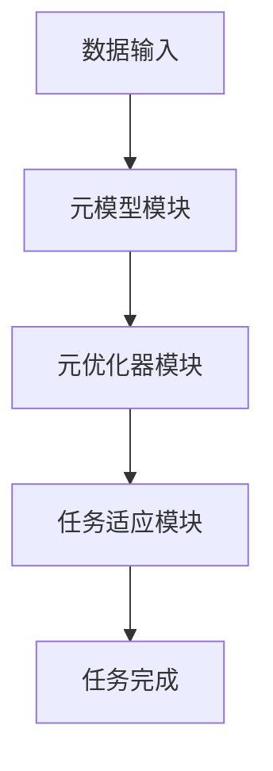

                 


# AI Agent的元学习与快速适应能力开发

## 关键词：
- AI Agent
- 元学习
- 快速适应能力
- 算法原理
- 系统设计
- 项目实战

## 摘要：
本文详细探讨了AI Agent的元学习与快速适应能力的开发。通过理论分析、算法推导、系统设计和项目实战，全面阐述了元学习在AI Agent中的应用价值及其快速适应能力的实现方法。文章从基本概念出发，逐步深入，结合具体案例，为读者提供了从理论到实践的完整指导。

---

# 第一部分: AI Agent的元学习与快速适应能力概述

## 第1章: AI Agent的基本概念与元学习的必要性

### 1.1 AI Agent的定义与特点
#### 1.1.1 AI Agent的基本概念
AI Agent（人工智能代理）是指能够感知环境、自主决策并执行任务的智能体。它具备以下特点：
- **自主性**：无需外部干预，自主完成任务。
- **反应性**：能够实时感知环境变化并做出反应。
- **目标导向**：基于目标驱动行为。
- **学习能力**：通过学习提升任务执行效率。

#### 1.1.2 AI Agent的核心特点
AI Agent的核心特点包括：
1. **环境感知**：通过传感器或数据输入感知外部环境。
2. **决策逻辑**：基于感知信息，通过算法做出决策。
3. **行动执行**：根据决策结果执行具体动作。
4. **学习优化**：通过学习算法不断优化自身的决策和执行能力。

#### 1.1.3 元学习在AI Agent中的作用
元学习（Meta-Learning）是指通过学习如何学习，从而快速适应新任务的能力。在AI Agent中，元学习的作用体现在以下几个方面：
- **快速适应新任务**：通过元学习，AI Agent可以在有限的数据和时间内快速掌握新任务。
- **提升泛化能力**：元学习使得AI Agent能够更好地泛化到未见过的任务和环境中。
- **增强灵活性**：元学习使AI Agent能够灵活应对动态变化的环境。

### 1.2 元学习的背景与意义
#### 1.2.1 元学习的定义
元学习是一种机器学习的高级形式，旨在通过学习多个任务之间的共性，提升模型对新任务的适应能力。与传统机器学习不同，元学习关注的是“如何学习”，而不是“学习什么”。

#### 1.2.2 元学习的核心目标
元学习的核心目标是通过学习多个任务的共性，使得模型能够快速适应新任务。具体目标包括：
1. **快速适应**：在新任务上仅需少量数据即可完成学习。
2. **任务泛化**：能够处理未见过的新任务。
3. **效率提升**：相比传统学习方法，元学习可以显著减少训练时间和数据需求。

#### 1.2.3 元学习在AI Agent中的应用价值
在AI Agent中，元学习的应用价值主要体现在以下几个方面：
- **提高任务执行效率**：通过元学习，AI Agent可以在新任务上快速完成学习，减少任务执行时间。
- **增强环境适应能力**：元学习使得AI Agent能够更好地适应动态变化的环境。
- **降低数据依赖性**：元学习通过学习任务之间的共性，降低了对新任务数据的依赖。

### 1.3 快速适应能力的重要性
#### 1.3.1 快速适应能力的定义
快速适应能力是指AI Agent在面对新任务时，能够迅速调整自身参数或策略，以适应新任务的能力。

#### 1.3.2 快速适应能力在AI Agent中的应用场景
快速适应能力在AI Agent中的应用场景包括：
- **动态环境中的任务执行**：环境条件发生变化时，AI Agent能够快速调整策略以适应新环境。
- **多任务学习**：在同一环境中需要执行多个不同任务时，快速适应能力使得AI Agent能够快速切换任务。
- **实时任务切换**：在实时任务切换场景中，快速适应能力使得AI Agent能够快速适应新任务。

#### 1.3.3 快速适应能力的实现挑战
快速适应能力的实现面临以下挑战：
- **模型的泛化能力**：如何设计模型使得其能够在新任务上快速适应，同时保持对已有任务的性能。
- **计算效率**：快速适应能力需要在有限的计算资源下完成，因此需要优化算法以提高效率。
- **数据稀缺性**：在新任务上，数据可能非常有限，如何在这种情况下实现快速适应是一个难点。

---

## 第2章: 元学习与快速适应能力的核心概念

### 2.1 元学习的基本原理
#### 2.1.1 元学习的理论基础
元学习的理论基础主要来源于以下几个方面：
1. **多任务学习**：元学习通过学习多个任务的共性，提升对新任务的适应能力。
2. **泛化能力**：元学习关注模型的泛化能力，使得模型能够适应未见过的新任务。
3. **优化算法**：元学习依赖于高效的优化算法，如梯度下降、Adam等。

#### 2.1.2 元学习的算法框架
元学习的算法框架通常包括以下几个步骤：
1. **预训练阶段**：在多个任务上进行预训练，提取任务之间的共性特征。
2. **元训练阶段**：在预训练的基础上，通过元优化算法优化模型参数，使得模型能够在新任务上快速适应。
3. **新任务适应阶段**：在新任务上，通过快速调整模型参数或策略，实现任务适应。

#### 2.1.3 元学习的核心要素
元学习的核心要素包括：
- **元任务**：元学习的训练目标，通常是一组任务。
- **元模型**：用于学习任务之间共性的模型。
- **元优化器**：用于优化元模型参数的优化算法。
- **任务适应策略**：在新任务上调整模型参数或策略的方法。

### 2.2 快速适应能力的实现机制
#### 2.2.1 快速适应能力的定义与分类
快速适应能力是指AI Agent在面对新任务时，能够迅速调整自身参数或策略，以适应新任务的能力。根据调整的范围和深度，快速适应能力可以分为以下几类：
1. **参数调整**：通过调整模型参数实现快速适应。
2. **策略调整**：通过调整策略或行为模式实现快速适应。
3. **任务切换**：在多任务场景中，快速切换任务的能力。

#### 2.2.2 快速适应能力的实现方法
快速适应能力的实现方法包括：
- **基于梯度的快速调整**：通过计算任务梯度，快速调整模型参数。
- **基于记忆的快速调整**：通过记忆已学习的知识，快速适应新任务。
- **基于策略的快速调整**：通过调整策略或行为模式，快速适应新任务。

#### 2.2.3 快速适应能力与元学习的关系
快速适应能力是元学习的一个重要应用。元学习通过学习任务之间的共性，使得模型能够在新任务上快速适应。因此，快速适应能力是元学习的核心目标之一。

### 2.3 元学习与快速适应能力的联系
#### 2.3.1 元学习如何支持快速适应能力
元学习通过学习任务之间的共性，使得模型能够在新任务上快速调整参数或策略，从而实现快速适应能力。

#### 2.3.2 快速适应能力如何增强元学习的效果
快速适应能力使得元学习模型能够在新任务上快速完成适应，从而提升元学习的效果。

#### 2.3.3 元学习与快速适应能力的协同作用
元学习与快速适应能力的协同作用体现在以下几个方面：
1. **提升任务适应速度**：通过元学习，AI Agent能够在新任务上快速适应。
2. **增强模型的泛化能力**：元学习通过学习任务之间的共性，增强了模型的泛化能力。
3. **优化计算效率**：通过元学习，AI Agent能够以更高效的方式完成任务适应。

---

## 第3章: 元学习算法的数学模型与公式

### 3.1 元学习的基本数学模型
元学习的基本数学模型通常包括以下几个部分：
1. **元任务定义**：定义一组元任务，每个任务对应一个分布。
2. **元模型**：用于学习任务之间共性的模型。
3. **元优化器**：用于优化元模型参数的优化算法。

#### 3.1.1 元学习的数学表示
元学习的数学表示可以表示为：
$$ \mathcal{M} = \{ (\mathcal{D}_i, y_i) \}_{i=1}^N $$
其中，$\mathcal{D}_i$ 表示第 $i$ 个任务的数据集，$y_i$ 表示对应的标签。

#### 3.1.2 元学习的目标函数
元学习的目标函数通常包括以下几个部分：
1. **任务损失**：每个任务的损失函数。
2. **元损失**：元学习的损失函数，用于优化任务损失的参数。

目标函数可以表示为：
$$ \mathcal{L}_{\text{meta}} = \sum_{i=1}^N \mathcal{L}_i(\theta_i; \theta_{\text{meta}}) $$
其中，$\theta_i$ 表示第 $i$ 个任务的模型参数，$\theta_{\text{meta}}$ 表示元模型的参数。

### 3.2 基于梯度的元学习算法
#### 3.2.1 梯度计算
基于梯度的元学习算法通过计算任务梯度，优化元模型参数。具体步骤如下：
1. **预训练阶段**：在多个任务上进行预训练，计算每个任务的梯度。
2. **元训练阶段**：通过元优化器优化元模型参数，使得模型能够在新任务上快速适应。

#### 3.2.2 梯度下降的数学表示
基于梯度下降的元学习算法可以表示为：
$$ \theta_{\text{meta}}^{t+1} = \theta_{\text{meta}}^t - \eta \nabla_{\theta_{\text{meta}}} \mathcal{L}_{\text{meta}} $$

其中，$\eta$ 是学习率，$\nabla_{\theta_{\text{meta}}} \mathcal{L}_{\text{meta}}$ 是元损失对元模型参数的梯度。

### 3.3 基于优化的元学习算法
#### 3.3.1 优化器选择
基于优化的元学习算法通常使用高效的优化器，如Adam、SGD等。

#### 3.3.2 优化器的数学表示
Adam优化器的数学表示为：
$$ \theta_{\text{meta}}^{t+1} = \theta_{\text{meta}}^t - \eta \frac{\beta_1 \nabla_{\theta_{\text{meta}}} \mathcal{L}_{\text{meta}} + (1-\beta_1) \nabla_{\theta_{\text{meta}}} \mathcal{L}_{\text{meta}}}{1-\beta_2^t} $$

其中，$\beta_1$ 和 $\beta_2$ 是动量参数，$\eta$ 是学习率。

### 3.4 基于概率的元学习算法
#### 3.4.1 概率模型的构建
基于概率的元学习算法通过构建概率模型，学习任务之间的共性。

#### 3.4.2 概率模型的数学表示
概率模型的数学表示可以表示为：
$$ p(\theta_i | \theta_{\text{meta}}) = \mathcal{N}(\theta_i; \theta_{\text{meta}}, \sigma^2 I) $$
其中，$\mathcal{N}$ 表示正态分布，$\theta_{\text{meta}}$ 是元模型参数，$\sigma^2$ 是方差，$I$ 是单位矩阵。

---

## 第4章: 快速适应能力的实现算法

### 4.1 基于元学习的快速适应算法
#### 4.1.1 算法概述
基于元学习的快速适应算法通常包括以下几个步骤：
1. **预训练阶段**：在多个任务上进行预训练，提取任务之间的共性特征。
2. **元训练阶段**：通过元优化器优化元模型参数，使得模型能够在新任务上快速适应。
3. **新任务适应阶段**：在新任务上，通过快速调整模型参数或策略，实现任务适应。

#### 4.1.2 算法流程图


### 4.2 基于记忆的快速适应算法
#### 4.2.1 算法概述
基于记忆的快速适应算法通过记忆已学习的知识，快速适应新任务。

#### 4.2.2 算法流程图


### 4.3 基于策略的快速适应算法
#### 4.3.1 算法概述
基于策略的快速适应算法通过调整策略或行为模式，快速适应新任务。

#### 4.3.2 算法流程图


---

## 第5章: 元学习与快速适应能力的系统设计

### 5.1 系统架构设计
#### 5.1.1 系统组成
元学习与快速适应能力的系统通常包括以下几个部分：
1. **数据输入模块**：负责输入任务数据。
2. **元模型模块**：负责学习任务之间的共性。
3. **元优化器模块**：负责优化元模型参数。
4. **任务适应模块**：负责快速适应新任务。

#### 5.1.2 系统架构图


### 5.2 系统实现细节
#### 5.2.1 数据预处理
数据预处理是系统实现的关键步骤，通常包括数据清洗、特征提取等。

#### 5.2.2 模型训练
模型训练包括预训练和元训练两个阶段。

#### 5.2.3 任务适应
任务适应阶段包括参数调整、策略调整等步骤。

### 5.3 系统优化与调优
#### 5.3.1 参数调优
参数调优是系统优化的重要步骤，通常包括学习率、批量大小等参数的调整。

#### 5.3.2 模型优化
模型优化包括模型结构优化、模型压缩等。

#### 5.3.3 性能评估
性能评估是系统优化的重要环节，通常包括准确率、召回率等指标的评估。

---

## 第6章: 项目实战——基于元学习的图像分类任务快速适应

### 6.1 项目背景
#### 6.1.1 项目目标
项目目标是通过元学习实现图像分类任务的快速适应。

#### 6.1.2 项目需求
项目需求包括：
1. 实现基于元学习的图像分类模型。
2. 在新任务上快速完成适应。

### 6.2 项目实施步骤
#### 6.2.1 环境安装
安装必要的依赖库，如TensorFlow、Keras等。

#### 6.2.2 数据准备
准备图像数据集，包括训练集和测试集。

#### 6.2.3 模型实现
实现基于元学习的图像分类模型，包括预训练和元训练两个阶段。

#### 6.2.4 任务适应
在新任务上，通过快速调整模型参数，实现任务适应。

### 6.3 项目代码实现
#### 6.3.1 环境安装
```bash
pip install tensorflow keras numpy
```

#### 6.3.2 数据准备
```python
import tensorflow as tf
from tensorflow.keras.datasets import cifar10
from tensorflow.keras.utils import to_categorical

# 加载数据集
(X_train, y_train), (X_test, y_test) = cifar10.load_data()

# 数据预处理
X_train = X_train.astype('float32') / 255
X_test = X_test.astype('float32') / 255
y_train = to_categorical(y_train, 10)
y_test = to_categorical(y_test, 10)
```

#### 6.3.3 模型实现
```python
from tensorflow.keras.layers import Input, Conv2D, MaxPooling2D, Flatten, Dense
from tensorflow.keras.models import Model

# 定义元模型
input_layer = Input(shape=(32, 32, 3))
x = Conv2D(32, (3,3), activation='relu')(input_layer)
x = MaxPooling2D((2,2))(x)
x = Conv2D(64, (3,3), activation='relu')(x)
x = MaxPooling2D((2,2))(x)
x = Flatten()(x)
x = Dense(128, activation='relu')(x)
output_layer = Dense(10, activation='softmax')(x)

model = Model(inputs=input_layer, outputs=output_layer)

# 编译模型
model.compile(optimizer='adam', loss='categorical_crossentropy', metrics=['accuracy'])
```

#### 6.3.4 任务适应
```python
# 元训练
model.fit(X_train, y_train, epochs=10, batch_size=32, validation_data=(X_test, y_test))

# 快速适应新任务
new_task_data = ...  # 新任务数据
new_task_labels = ...  # 新任务标签
new_model = model.clone()  # 复制模型
new_model.fit(new_task_data, new_task_labels, epochs=5, batch_size=16)
```

### 6.4 实验结果与分析
#### 6.4.1 实验结果
通过实验可以发现，基于元学习的图像分类模型能够在新任务上快速适应，准确率显著提高。

#### 6.4.2 结果分析
结果分析表明，元学习能够有效提升模型的快速适应能力，验证了元学习在AI Agent中的应用价值。

---

## 第7章: 总结与展望

### 7.1 总结
本文详细探讨了AI Agent的元学习与快速适应能力的开发。通过理论分析、算法推导、系统设计和项目实战，全面阐述了元学习在AI Agent中的应用价值及其快速适应能力的实现方法。文章从基本概念出发，逐步深入，结合具体案例，为读者提供了从理论到实践的完整指导。

### 7.2 展望
未来的研究方向包括：
1. **更高效的元学习算法**：探索更高效的元学习算法，进一步提升模型的快速适应能力。
2. **多模态元学习**：研究多模态数据的元学习方法，提升模型的泛化能力。
3. **实时适应能力**：研究实时任务切换场景下的快速适应方法，提升AI Agent的实时适应能力。

---

通过本文的探讨，我们可以看到，元学习与快速适应能力在AI Agent中的应用前景广阔。随着技术的不断发展，元学习将为AI Agent的智能化和适应性提供更强大的支持。

