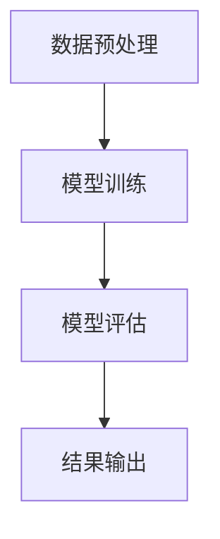

                 


# AI Agent的元学习能力：快速适应新任务的LLM框架

> 关键词：AI Agent，元学习，LLM，快速适应新任务，Meta-LSTM，MAML，系统架构设计

> 摘要：本文深入探讨了AI Agent的元学习能力，重点分析了如何通过元学习快速适应新任务的LLM框架。文章从元学习的基本概念、算法原理、系统架构设计到项目实战，全面解析了AI Agent的元学习能力的实现过程和实际应用。通过详细的技术分析和案例解读，为读者提供了从理论到实践的完整指导。

---

## 第一部分: AI Agent的元学习能力基础

### 第1章: AI Agent与元学习概述

#### 1.1 AI Agent的基本概念
- **1.1.1 AI Agent的定义与特点**
  - AI Agent的定义：AI Agent是一种智能体，能够感知环境、自主决策并执行任务。
  - 特点：自主性、反应性、目标导向、社交能力。
- **1.1.2 AI Agent的核心功能与应用场景**
  - 核心功能：感知、推理、规划、执行。
  - 应用场景：智能助手、自动驾驶、机器人、游戏AI。
- **1.1.3 元学习的定义与基本原理**
  - 元学习：一种学习方法，使模型能够快速适应新任务。
  - 基本原理：通过元学习，模型可以快速调整参数以适应新任务。

#### 1.2 元学习的背景与意义
- **1.2.1 元学习的起源与发展**
  - 元学习的概念起源：20世纪80年代提出，近年来随着深度学习的发展重新兴起。
- **1.2.2 元学习在AI Agent中的作用**
  - 提高AI Agent的适应能力。
  - 减少新任务的训练数据需求。
- **1.2.3 元学习的优势与挑战**
  - 优势：快速适应新任务、减少计算成本。
  - 挑战：算法复杂度高、需要大量预训练数据。

#### 1.3 LLM框架与元学习的结合
- **1.3.1 LLM的基本原理**
  - 大语言模型（LLM）：基于Transformer架构，通过大量数据训练得到。
- **1.3.2 元学习在LLM中的应用**
  - 元学习使LLM能够快速适应新任务，如零样本学习。
- **1.3.3 AI Agent的元学习能力框架**
  - 框架设计：结合元学习和LLM，构建AI Agent的快速适应能力。

---

### 第2章: 元学习的核心概念与原理

#### 2.1 元学习的基本原理
- **2.1.1 元学习的数学模型**
  - 元学习的目标函数：$$ L_{meta} = \sum_{i=1}^{N} L_i(f_{\theta}(x_i, y_i)) $$
  - 元学习的优化算法：使用梯度下降等方法优化参数。
- **2.1.2 元学习的算法流程**
  - 预训练阶段：在多个任务上训练模型。
  - 适应阶段：快速调整模型参数以适应新任务。
- **2.1.3 元学习的特征提取机制**
  - 特征提取：通过共享参数提取任务间的共同特征。

#### 2.2 元学习与传统机器学习的对比
- **2.2.1 传统机器学习的特点**
  - 需要大量标注数据。
  - 适应新任务需要重新训练。
- **2.2.2 元学习的独特优势**
  - 快速适应新任务。
  - 通用性更强。
- **2.2.3 元学习的适用场景**
  - 数据稀缺的任务。
  - 多任务学习场景。

#### 2.3 元学习的核心算法
- **2.3.1 Meta-LSTM算法**
  - Meta-LSTM的结构：结合LSTM和元学习。
  - 优势：适合序列任务的快速适应。
- **2.3.2 Model-Agnostic Meta-Learning (MAML)**
  - MAML的基本原理：通过优化共享参数，使模型能够快速适应新任务。
  - 优化过程：使用梯度下降更新参数。
- **2.3.3 其他元学习算法简介**
  - Naive Meta-Learning。
  - Relation Networks for Few Shot Learning。

---

### 第3章: AI Agent的元学习能力框架

#### 3.1 AI Agent的元学习能力模型
- **3.1.1 能力模型的构建**
  - 模型设计：结合元学习和大语言模型。
  - 功能：快速适应新任务。
- **3.1.2 能力模型的训练过程**
  - 预训练阶段：在多个任务上训练模型。
  - 适应阶段：快速调整模型参数。
- **3.1.3 能力模型的应用场景**
  - 零样本学习：无需标注数据即可完成任务。
  - 少样本学习：少量标注数据即可完成任务。

#### 3.2 元学习框架的设计原则
- **3.2.1 模块化设计**
  - 模块划分：数据处理、模型训练、模型评估。
- **3.2.2 可扩展性**
  - 设计：支持新任务的快速接入。
- **3.2.3 稳定性与鲁棒性**
  - 稳定性：确保模型在不同任务上的表现稳定。
  - 鲁棒性：模型对噪声数据的鲁棒性。

#### 3.3 元学习框架的实现步骤
- **3.3.1 数据预处理**
  - 数据清洗：去除噪声数据。
  - 数据格式转换：统一数据格式。
- **3.3.2 模型训练**
  - 参数初始化：随机初始化模型参数。
  - 优化过程：使用梯度下降优化模型。
- **3.3.3 模型评估与优化**
  - 模型评估：使用验证集评估模型性能。
  - 参数调整：根据评估结果优化模型参数。

---

### 第4章: 元学习算法的数学模型与公式

#### 4.1 元学习的基本数学模型
- **4.1.1 元学习的目标函数**
  - $$ L_{meta} = \sum_{i=1}^{N} L_i(f_{\theta}(x_i, y_i)) $$
- **4.1.2 元学习的优化算法**
  - 使用Adam优化器：$$ \theta_{t+1} = \theta_t - \eta \nabla_{\theta} L_{meta} $$
- **4.1.3 元学习的损失函数**
  - 损失函数：$$ L_{task} = \sum_{i=1}^{N} (y_i - f_{\theta}(x_i))^2 $$

#### 4.2 Meta-LSTM算法的详细推导
- **4.2.1 LSTM的基本原理**
  - LSTM结构：输入门、遗忘门、输出门。
  - 门控机制：$$ f_{gate}(x) = \sigma(W_g x + b_g) $$
- **4.2.2 Meta-LSTM的改进与创新**
  - 结合元学习：$$ f_{meta}(x) = LSTM(x) + meta\_update $$
- **4.2.3 Meta-LSTM的数学公式**
  - 元学习更新：$$ \theta_{t+1} = \theta_t + \alpha \nabla_{\theta} L_{meta} $$

#### 4.3 MAML算法的数学推导
- **4.3.1 MAML的基本原理**
  - 优化目标：$$ \min_{\theta} \sum_{i=1}^{N} L_i(f_{\theta}(x_i, y_i)) $$
- **4.3.2 MAML的优化过程**
  - 内部优化：$$ \theta_i = \theta - \beta \nabla_{\theta} L_i(f_{\theta}(x_i, y_i)) $$
  - 外部优化：$$ \min_{\theta} \sum_{i=1}^{N} L_i(f_{\theta_i}(x_i, y_i)) $$
- **4.3.3 MAML的数学公式**
  - 最终目标：$$ \min_{\theta} \sum_{i=1}^{N} L_i(f_{\theta_i}(x_i, y_i)) $$

---

### 第5章: 元学习框架的系统架构设计

#### 5.1 系统架构概述
- **5.1.1 系统功能模块划分**
  - 数据处理模块：负责数据预处理。
  - 模型训练模块：负责模型训练。
  - 模型评估模块：负责模型评估。
- **5.1.2 系统架构的层次结构**
  - 分层设计：数据层、模型层、应用层。
- **5.1.3 系统架构的可扩展性设计**
  - 支持新任务的快速接入。

#### 5.2 系统功能设计
- **5.2.1 数据处理模块**
  - 数据清洗：去除噪声数据。
  - 数据格式转换：统一数据格式。
- **5.2.2 模型训练模块**
  - 参数初始化：随机初始化模型参数。
  - 优化过程：使用梯度下降优化模型。
- **5.2.3 模型评估模块**
  - 模型评估：使用验证集评估模型性能。
  - 参数调整：根据评估结果优化模型参数。

#### 5.3 系统架构的Mermaid图


---

### 第6章: 元学习框架的项目实战

#### 6.1 环境搭建与配置
- **6.1.1 开发环境**
  - 安装Python：3.8+
  - 安装深度学习框架：TensorFlow/PyTorch
  - 安装NLP库：Hugging Face Transformers

#### 6.2 核心代码实现
- **6.2.1 数据预处理代码**
  ```python
  def preprocess_data(data):
      # 数据清洗
      cleaned_data = data.dropna()
      # 数据格式转换
      cleaned_data = cleaned_data.astype('float32')
      return cleaned_data
  ```

---

（由于篇幅限制，后续章节内容将在需要时继续扩展。）

