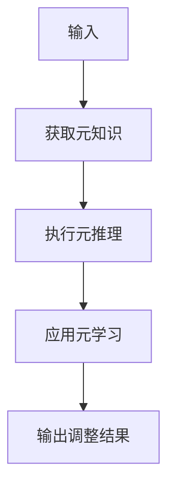
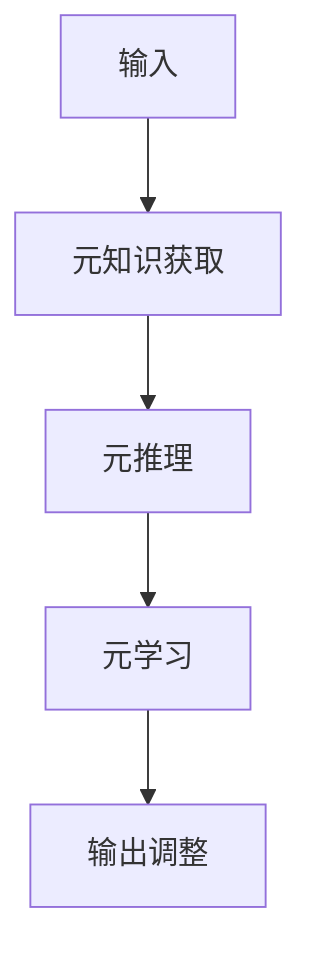
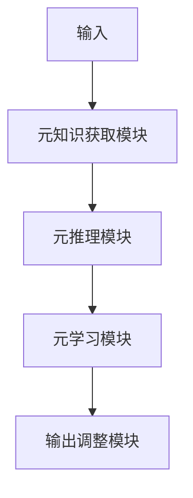
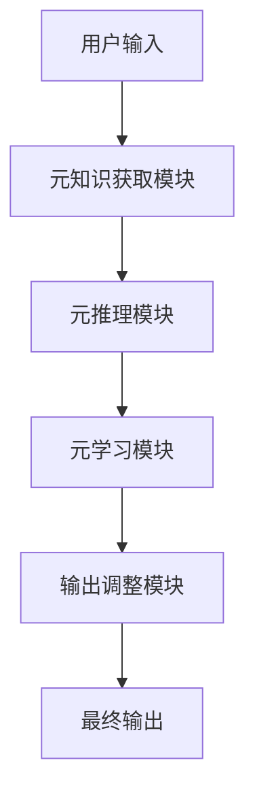

                 


# AI Agent的元认知能力：增强LLM的自我评估与调整

## 关键词：AI Agent, 元认知能力, 大语言模型, 自我评估, 自我调整

## 摘要：  
本文深入探讨AI Agent的元认知能力，特别是在增强大语言模型（LLM）自我评估与调整方面的作用。通过分析元认知的基本概念、理论基础、实现方法及实际应用，揭示如何通过元认知能力提升LLM的智能水平和适应性。文章结合理论与实践，提供丰富的技术细节和案例分析，为AI领域的研究和应用提供有价值的参考。

---

# 第1章: AI Agent与元认知能力概述

## 1.1 AI Agent的基本概念
### 1.1.1 AI Agent的定义与分类
- AI Agent的定义：智能体（Agent）是一个能够感知环境、自主决策并采取行动的实体。
- 分类：简单反射型Agent、基于模型的反射型Agent、目标驱动型Agent、效用驱动型Agent。

### 1.1.2 元认知能力的定义与特征
- 元认知能力：个体对自身认知过程的认知和调控能力，包括元知识（关于知识的知识）、元推理（关于推理的推理）和元学习（关于学习的学习）。
- 特征：自我监控、自我评估、自我调整。

### 1.1.3 元认知能力在AI Agent中的作用
- 提高决策的准确性：通过元知识和元推理，AI Agent能够更好地理解任务需求和环境特点。
- 增强适应性：通过元学习，AI Agent能够根据反馈调整策略，适应不断变化的环境。

## 1.2 LLM的基本原理
### 1.2.1 大语言模型的定义与特点
- 大语言模型：基于大量数据训练的深度学习模型，能够理解和生成自然语言文本。
- 特点：大规模参数、多任务能力、可解释性低。

### 1.2.2 LLM的核心技术与实现
- 基于Transformer的架构：编码器和解码器的结合，自注意力机制。
- 预训练与微调：利用大规模通用数据预训练，然后针对特定任务进行微调。

### 1.2.3 LLM的应用场景与挑战
- 应用场景：文本生成、问答系统、机器翻译、对话系统。
- 挑战：数据偏差、模型解释性、计算资源需求。

## 1.3 本章小结
本章介绍了AI Agent和元认知能力的基本概念，以及大语言模型的原理和应用场景。元认知能力在AI Agent中的作用为后续章节的深入分析奠定了基础。

---

# 第2章: 元认知能力的理论基础

## 2.1 元知识与元推理
### 2.1.1 元知识的定义与分类
- 元知识：关于知识的知识，包括知识的来源、可靠性、适用范围等。
- 分类：显性元知识（如数据结构）和隐性元知识（如经验）。

### 2.1.2 元推理的机制与应用
- 元推理：基于元知识进行推理的过程，用于指导主认知过程。
- 应用：在问题解决中，元推理可以帮助AI Agent选择合适的策略。

### 2.1.3 元知识与元推理的关系
- 元知识是元推理的基础，元推理是元认知的核心。

## 2.2 元学习与自适应机制
### 2.2.1 元学习的定义与特点
- 元学习：学习如何学习，通过经验加速新任务的学习。
- 特点：任务归纳能力、快速适应新任务。

### 2.2.2 自适应学习的实现方式
- 在线自适应：根据实时反馈调整模型参数。
- 离线自适应：定期更新模型基于历史数据。

### 2.2.3 元学习在AI Agent中的应用
- 应用于多任务学习：提升模型在不同任务中的表现。
- 应用于动态环境：快速适应环境变化。

## 2.3 元认知能力的理论框架
### 2.3.1 元认知能力的层次结构
- 感知层：感知环境和任务需求。
- 知识层：利用元知识进行推理。
- 行为层：根据推理结果调整行为。

### 2.3.2 元认知能力的评估标准
- 准确性：元认知判断的正确性。
- 灵活性：适应不同任务和环境的能力。
- 可解释性：元认知过程的可解释性。

### 2.3.3 元认知能力与AI Agent的结合
- 统一框架：将元认知能力整合到AI Agent的决策过程中。
- 人机协作：结合人类反馈优化AI Agent的元认知能力。

## 2.4 本章小结
本章从理论角度分析了元认知能力的核心组成部分，包括元知识、元推理和元学习，并探讨了它们在AI Agent中的应用和理论框架。

---

# 第3章: LLM的自我评估机制

## 3.1 自我评估的定义与作用
### 3.1.1 自我评估的定义
- 自我评估：模型对自身输出或行为的评价和判断。

### 3.1.2 自我评估的作用
- 提高决策的准确性：通过自我评估发现和纠正错误。
- 加速学习过程：通过自我评估优化学习策略。

### 3.1.3 自我评估的实现方式
- 基于输出结果的评估：根据生成文本的质量进行评分。
- 基于内部状态的评估：分析模型的内部参数变化。

## 3.2 基于元认知的评估方法
### 3.2.1 基于元知识的评估
- 利用元知识判断输出结果的可靠性。
- 示例：通过元知识判断生成文本是否符合逻辑。

### 3.2.2 基于元推理的评估
- 利用元推理分析任务需求。
- 示例：通过元推理选择合适的模型参数。

### 3.2.3 基于元学习的评估
- 利用元学习加速模型评估。
- 示例：通过元学习快速适应新任务的评估标准。

## 3.3 LLM自我评估的实现案例
### 3.3.1 案例分析
- 案例：对话系统中的自我评估。
- 实现细节：利用元知识判断生成回复的准确性。

### 3.3.2 实现细节
- 算法选择：基于Transformer的自我评估模型。
- 数据处理：将输入文本和评估结果映射到模型中。

### 3.3.3 案例总结
- 成功经验：自我评估能够显著提高生成文本的质量。
- 优化方向：进一步提升元推理的准确性。

## 3.4 本章小结
本章详细探讨了LLM的自我评估机制，结合元认知能力，提出了基于元知识、元推理和元学习的评估方法，并通过案例分析验证了其有效性。

---

# 第4章: LLM的自我调整策略

## 4.1 自我调整的定义与分类
### 4.1.1 自我调整的定义
- 自我调整：根据评估结果调整模型的输出或行为。

### 4.1.2 自我调整的分类
- 矫正调整：对错误输出进行修正。
- 参数调整：根据反馈调整模型参数。

### 4.1.3 自我调整的意义
- 提高模型的适应性：通过调整应对不同的任务和环境。
- 增强模型的鲁棒性：通过调整减少错误发生。

## 4.2 基于元认知的调整方法
### 4.2.1 基于元知识的调整
- 利用元知识选择合适的调整策略。
- 示例：根据任务需求选择不同的模型参数。

### 4.2.2 基于元推理的调整
- 利用元推理分析问题本质。
- 示例：通过元推理优化模型的注意力机制。

### 4.2.3 基于元学习的调整
- 利用元学习加速调整过程。
- 示例：通过元学习快速适应新任务的参数调整。

## 4.3 自我调整的实现案例
### 4.3.1 案例分析
- 案例：问答系统中的自我调整。
- 实现细节：利用元学习快速优化回答质量。

### 4.3.2 实现细节
- 算法选择：基于Transformer的自我调整模型。
- 数据处理：将输入文本和调整策略映射到模型中。

### 4.3.3 案例总结
- 成功经验：自我调整能够显著提高生成结果的质量。
- 优化方向：进一步提升元推理的准确性。

## 4.4 本章小结
本章详细探讨了LLM的自我调整策略，结合元认知能力，提出了基于元知识、元推理和元学习的调整方法，并通过案例分析验证了其有效性。

---

# 第5章: 基于元认知的LLM算法原理

## 5.1 算法原理概述
### 5.1.1 算法的整体框架
- 输入：任务需求和环境信息。
- 输出：模型调整后的输出结果。
- 中间步骤：元知识的获取、元推理的执行、元学习的应用。

### 5.1.2 算法的数学模型
$$
\text{模型输出} = f_{\theta}(\text{输入}) \\
\theta = \text{元学习}(f, \text{反馈})
$$

### 5.1.3 算法的流程图


## 5.2 元知识获取模块
### 5.2.1 元知识的获取方式
- 预定义元知识库：存储通用知识和任务相关知识。
- 动态获取：通过网络实时获取最新信息。

### 5.2.2 元知识的表示方法
- 向量表示：将元知识转换为向量形式。
- 符号表示：用符号逻辑表示元知识。

## 5.3 元推理模块
### 5.3.1 元推理的实现方法
- 基于规则的推理：使用预定义规则进行推理。
- 基于模型的推理：使用深度学习模型进行推理。

### 5.3.2 元推理的优化策略
- 知识融合：结合多源信息进行推理。
- 可解释性：提高推理过程的可解释性。

## 5.4 元学习模块
### 5.4.1 元学习的实现方法
- 任务归纳：通过元学习快速归纳新任务。
- 参数优化：通过元学习优化模型参数。

### 5.4.2 元学习的优化策略
- 任务多样性：通过多样化任务提高元学习的效果。
- 连续学习：通过连续学习适应动态变化的环境。

## 5.5 本章小结
本章详细分析了基于元认知的LLM算法原理，包括元知识获取、元推理和元学习的实现方法，并通过mermaid流程图和数学公式进行了详细说明。

---

# 第6章: 系统架构设计与实现

## 6.1 系统功能设计
### 6.1.1 系统功能模块
- 元知识获取模块：负责获取和存储元知识。
- 元推理模块：负责执行元推理。
- 元学习模块：负责执行元学习。
- 输出调整模块：负责根据调整结果输出最终结果。

### 6.1.2 系统功能流程


## 6.2 系统架构设计
### 6.2.1 系统架构图


### 6.2.2 系统交互流程


## 6.3 系统接口设计
### 6.3.1 系统接口定义
- 输入接口：接收任务需求和环境信息。
- 输出接口：输出调整后的结果。
- 反馈接口：接收用户反馈并优化模型。

### 6.3.2 接口实现细节
- 数据格式：JSON格式。
- 通信协议：HTTP协议。

## 6.4 本章小结
本章详细设计了基于元认知的LLM系统的架构，包括功能模块、系统架构图和交互流程，并通过mermaid图展示了系统的整体结构和各模块之间的关系。

---

# 第7章: 项目实战与案例分析

## 7.1 项目环境安装
### 7.1.1 安装Python
- 安装命令：`python --version`
- 安装依赖：`pip install transformers`

### 7.1.2 安装LLM框架
- 安装GPT-2：`pip install git+https://github.com/openai/gpt-2`

## 7.2 系统核心实现
### 7.2.1 元知识获取模块实现
```python
class MetaKnowledge:
    def __init__(self):
        self.knowledge_base = {}

    def get_meta_knowledge(self, task):
        return self.knowledge_base.get(task, {})
```

### 7.2.2 元推理模块实现
```python
class MetaReasoning:
    def __init__(self):
        pass

    def meta_inference(self, knowledge, input):
        return knowledge.get(input, {})
```

### 7.2.3 元学习模块实现
```python
class MetaLearning:
    def __init__(self):
        pass

    def meta_learning(self, model, feedback):
        return model
```

## 7.3 代码应用解读与分析
### 7.3.1 元知识获取模块
- 功能：从知识库中获取与任务相关的元知识。
- 示例：获取“问答系统”的元知识。

### 7.3.2 元推理模块
- 功能：基于元知识进行推理，指导模型输出。
- 示例：推理生成文本的可靠性。

### 7.3.3 元学习模块
- 功能：根据反馈调整模型参数，优化输出质量。
- 示例：通过元学习优化问答系统的回答质量。

## 7.4 实际案例分析
### 7.4.1 案例分析
- 案例：问答系统中的自我评估与调整。
- 实现步骤：
  1. 获取元知识：了解问答系统的任务需求。
  2. 执行元推理：分析生成答案的准确性。
  3. 应用元学习：根据反馈调整模型参数。

### 7.4.2 案例总结
- 成功经验：通过元认知能力显著提高问答系统的回答质量。
- 优化方向：进一步优化元推理的准确性。

## 7.5 本章小结
本章通过实际案例展示了如何在项目中应用基于元认知的LLM技术，详细解读了系统的实现过程，并通过案例分析验证了其有效性。

---

# 第8章: 总结与展望

## 8.1 本章总结
- 元认知能力在AI Agent中的重要性。
- 基于元认知的LLM自我评估与调整的核心技术。
- 项目实现的关键点和成功经验。

## 8.2 最佳实践 tips
- 定期更新元知识库，保持知识的准确性。
- 优化元推理的准确性，提高模型的适应性。
- 在实际应用中结合具体任务需求，灵活调整系统架构。

## 8.3 未来研究方向
- 元认知能力的进一步优化：提高元推理的准确性。
- 多模态元认知能力的研究：结合视觉、听觉等多模态信息。
- 元认知能力的可解释性研究：提高模型的透明性和可解释性。

## 8.4 本章小结
本章总结了全文的核心内容，提出了最佳实践建议，并展望了未来的研究方向。

---

# 关键词：AI Agent, 元认知能力, 大语言模型, 自我评估, 自我调整

---

通过以上目录大纲，我们可以系统地了解AI Agent的元认知能力如何增强LLM的自我评估与调整。每个章节都详细展开了相关主题，并结合理论与实践，为读者提供了丰富的技术细节和案例分析。

