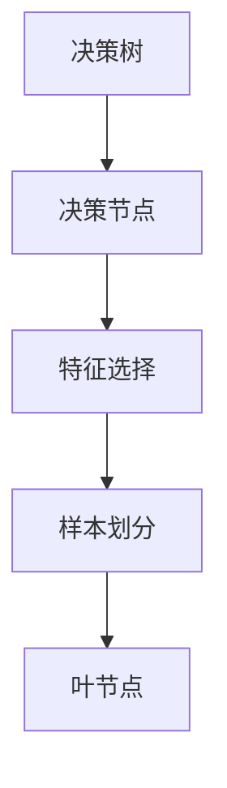
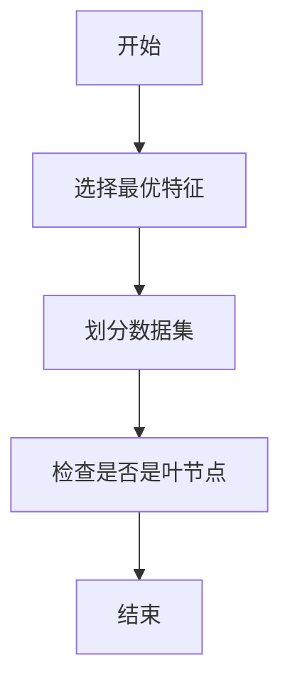
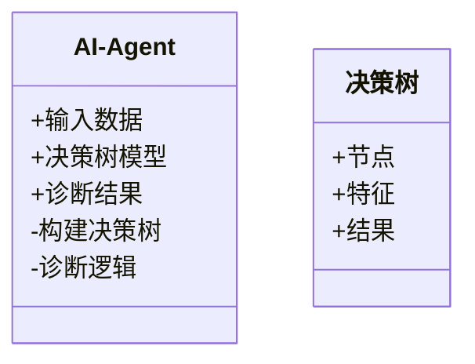

                 


# AI Agent的决策树构建：复杂问题的解决策略

**关键词**：决策树、AI Agent、复杂问题、机器学习、算法设计

**摘要**：  
本文深入探讨了AI Agent在决策树构建中的应用，分析了决策树在处理复杂问题中的优势和挑战。通过详细讲解决策树的基本概念、数学模型、算法原理、系统架构设计以及实际项目案例，本文为读者提供了从理论到实践的全面指导，帮助AI开发者和研究人员更好地理解和应用决策树来解决复杂问题。

---

# 第一部分: 背景介绍

## 第1章: 决策树与AI Agent概述

### 1.1 决策树的基本概念
决策树是一种树状结构，用于表示决策过程中的可能结果。每个内部节点代表一个决策点，每个叶节点代表一个结果或预测值。决策树的构建目标是通过特征选择和节点划分，找到最优的决策路径，从而在复杂问题中做出准确的判断。

### 1.2 AI Agent的基本原理
AI Agent（智能体）是一种能够感知环境并采取行动以实现目标的实体。AI Agent的决策机制依赖于信息处理能力，而决策树作为一种直观且高效的决策模型，成为AI Agent的核心工具之一。

### 1.3 决策树在AI Agent中的作用
决策树在AI Agent中用于处理复杂问题，通过结构化的决策路径帮助智能体快速找到最优解决方案。相比于其他决策方法，决策树具有可视化、易于理解和可解释性强的特点。

---

# 第二部分: 决策树的核心概念与数学模型

## 第2章: 决策树的核心概念与属性

### 2.1 决策树的基本属性
- **决策节点**：内部节点，表示一个决策问题。
- **叶节点**：终点节点，表示一个决策结果。
- **特征选择**：选择最优特征进行划分。
- **样本划分**：根据特征将数据集划分为子集。

### 2.2 决策树的属性对比表
| 属性 | 描述 | 示例 |
|------|------|------|
| 决策节点 | 内部节点，表示一个决策问题 | 根节点 |
| 叶节点 | 终点节点，表示一个决策结果 | 预测结果 |
| 特征选择 | 选择最优特征进行划分 | 信息增益最大的特征 |

### 2.3 决策树的ER实体关系图


## 第3章: 决策树的数学模型与算法原理

### 3.1 决策树的数学模型
- **熵（Entropy）**：衡量数据的混乱程度。
$$ H(S) = -\sum_{i=1}^{k} p_i \log_2 p_i $$
- **信息增益（Information Gain）**：选择最优特征的标准。
$$ IG(S, A) = H(S) - \sum_{j=1}^{m} \frac{|S_j|}{|S|} H(S_j) $$

### 3.2 决策树的算法原理
- **ID3算法**：基于信息增益构建决策树。
- **C4.5算法**：基于信息增益率，克服了ID3对偏态数据的敏感性。
- **C5.0算法**：优化了C4.5，引入了袋装技术和剪枝策略。

### 3.3 决策树的流程图


---

# 第三部分: 决策树的算法实现与优化

## 第4章: 决策树的算法实现

### 4.1 ID3算法的实现
```python
def id3(data, features, target):
    # 特征选择
    best_feature = select_best_feature(data, features, target)
    # 创建决策树节点
    tree = {best_feature: {}}
    # 划分数据集
    for feature_value in data[best_feature].unique():
        subset = data[data[best_feature] == feature_value]
        if subset[target].nunique() == 1:
            tree[best_feature][feature_value] = subset[target].values[0]
        else:
            tree[best_feature][feature_value] = id3(subset, features.remove(best_feature), target)
    return tree
```

### 4.2 C4.5算法的实现
```python
def c45(data, features, target, max_depth=5):
    # 计算信息增益率
    best_feature = select_best_feature_by_info_gain_ratio(data, features, target)
    # 创建决策树节点
    tree = {best_feature: {}}
    # 划分数据集并递归构建子树
    for feature_value in data[best_feature].unique():
        subset = data[data[best_feature] == feature_value]
        if subset.shape[0] == 0:
            tree[best_feature][feature_value] = "叶子节点"
        elif max_depth == 1:
            tree[best_feature][feature_value] = subset[target].mode()[0]
        else:
            tree[best_feature][feature_value] = c45(subset, features.remove(best_feature), target, max_depth-1)
    return tree
```

---

# 第四部分: 系统分析与架构设计

## 第5章: 系统分析与架构设计

### 5.1 项目介绍
假设我们正在开发一个医疗诊断系统，AI Agent需要根据患者的症状和测试结果来诊断疾病。

### 5.2 系统功能设计
- **输入层**：接收患者症状和测试结果。
- **决策树构建层**：基于历史数据构建决策树模型。
- **诊断层**：根据输入数据 travers 决策树，输出诊断结果。

### 5.3 系统架构图


---

# 第五部分: 项目实战与案例分析

## 第6章: 项目实战

### 6.1 环境安装
- Python 3.8+
- scikit-learn库
- Jupyter Notebook

### 6.2 核心代码实现
```python
from sklearn.tree import DecisionTreeClassifier
from sklearn.model_selection import train_test_split

# 数据预处理
X = df.drop('target', axis=1)
y = df['target']

# 划分训练集和测试集
X_train, X_test, y_train, y_test = train_test_split(X, y, test_size=0.2)

# 模型训练
dt = DecisionTreeClassifier().fit(X_train, y_train)

# 预测与评估
print(dt.score(X_test, y_test))
```

### 6.3 案例分析
通过医疗诊断系统的案例，详细分析决策树在诊断过程中的应用，包括数据预处理、模型训练、结果评估等步骤。

---

# 第六部分: 总结与展望

## 第7章: 总结与展望

### 7.1 本章总结
本文详细讲解了AI Agent中决策树的构建与应用，从理论到实践，为读者提供了全面的指导。

### 7.2 未来展望
随着AI技术的发展，决策树在复杂问题中的应用将更加广泛，未来的研究方向包括模型优化、可解释性增强和多模态数据融合等。

---

通过本文的学习，读者可以深入理解决策树在AI Agent中的核心作用，并能够将其应用于实际的复杂问题解决中。

