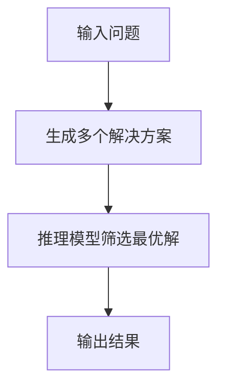
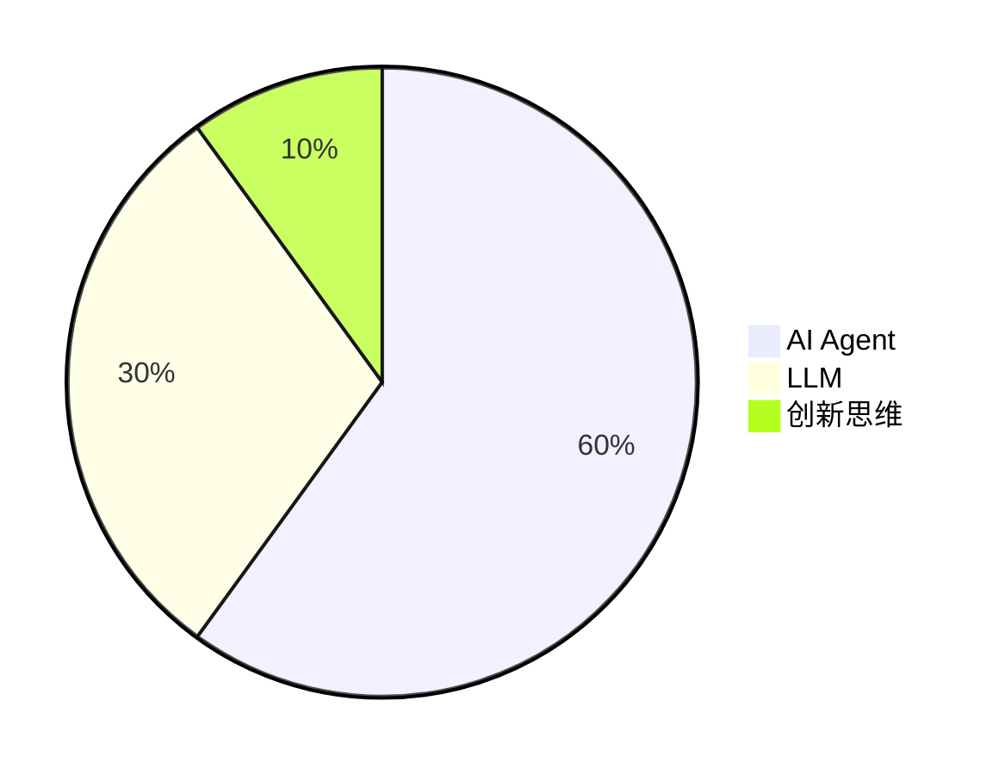
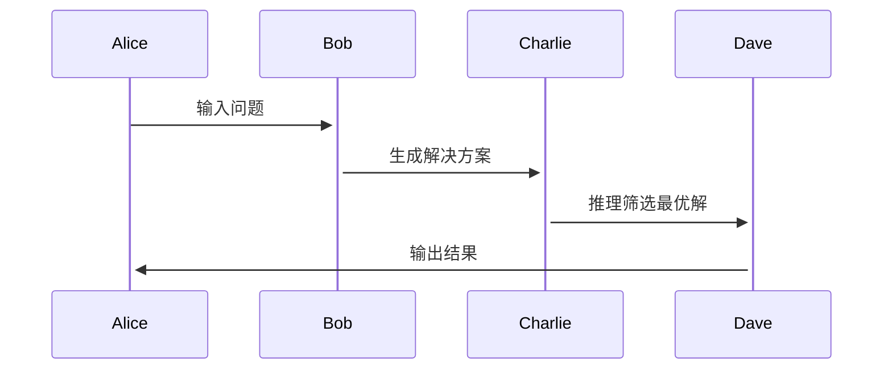

                 


# AI Agent的创新思维：激发LLM的发散性思考

## 关键词：AI Agent, LLM, 创新思维, 发散性思考, 人工智能, 大语言模型

## 摘要：  
本文深入探讨AI Agent如何通过创新思维激发LLM（大语言模型）的发散性思考，分析其背后的算法原理、系统架构，并通过实际案例展示如何在项目中实现这一目标。文章从背景介绍、核心概念、算法原理、系统架构到项目实战，全面解析AI Agent与LLM的结合，为读者提供从理论到实践的详细指导。

---

## 第一部分: AI Agent与LLM的创新思维概述

### 第1章: AI Agent与LLM的基本概念

#### 1.1 AI Agent的定义与特点
- **AI Agent的定义**：AI Agent是具备自主决策能力的智能体，能够根据环境信息做出决策并执行任务。
- **AI Agent的核心特点**：自主性、反应性、目标导向、社会能力。
- **AI Agent与传统AI的区别**：传统AI依赖规则，而AI Agent具备动态决策和自主学习能力。

#### 1.2 LLM的定义与特点
- **LLM的定义**：大语言模型是一种基于深度学习的自然语言处理模型，能够理解并生成人类语言。
- **LLM的核心特点**：强大的文本生成能力、多任务处理能力、可解释性较低。
- **LLM与传统NLP模型的区别**：传统NLP模型依赖规则，而LLM通过大量数据学习，具备更强的泛化能力。

#### 1.3 AI Agent与LLM的结合
- **AI Agent与LLM的关系**：AI Agent作为控制器，利用LLM的生成能力进行决策。
- **LLM作为AI Agent的核心模块**：LLM为AI Agent提供语言理解和生成能力。
- **AI Agent在LLM中的应用**：通过上下文理解和生成，提升LLM的创新思维能力。

### 第2章: AI Agent如何激发LLM的创新思维

#### 2.1 创新思维的定义与特点
- **创新思维的定义**：打破常规，提出新观点的能力。
- **创新思维的核心特点**：发散性、关联性、批判性、创造性。
- **创新思维与传统思维的区别**：传统思维注重逻辑性，创新思维注重独特性。

#### 2.2 AI Agent在LLM创新中的作用
- **AI Agent的引导作用**：通过上下文引导LLM生成新的观点。
- **LLM的创新机制**：结合生成模型和推理模型，提升创新思维能力。
- **AI Agent对LLM创新思维的促进**：通过动态调整生成策略，提升发散性思考。

### 第3章: AI Agent与LLM的创新应用

#### 3.1 创新思维在LLM中的应用
- **LLM在创新思维中的优势**：强大的文本生成能力和多任务处理能力。
- **LLM在创新思维中的挑战**：缺乏上下文理解能力，容易产生不相关结果。
- **实际案例分析**：通过具体案例展示LLM在创新思维中的应用。

#### 3.2 AI Agent在LLM创新中的应用
- **AI Agent的具体应用**：动态调整生成策略，提升创新效率。
- **AI Agent对创新思维的提升**：通过上下文理解和生成，增强创新思维能力。
- **未来影响**：AI Agent将推动LLM在创新思维领域的广泛应用。

---

## 第二部分: AI Agent创新思维的核心模型

### 第4章: 算法原理与数学模型

#### 4.1 算法原理
- **生成模型**：基于LLM的生成能力，动态调整生成策略。
- **推理模型**：结合生成结果进行推理，提升创新思维能力。
- **算法流程**：输入问题，生成多个解决方案，筛选最优解。

#### 4.2 数学模型
- **生成模型公式**：$P(y|x) = \text{softmax}(f(x))$，其中$f(x)$是LLM的输出。
- **推理模型公式**：$P(z|y) = \text{softmax}(g(y))$，其中$g(y)$是推理模型的输出。

#### 4.3 算法流程图


### 第5章: 系统架构与设计

#### 5.1 系统架构
- **领域模型**：AI Agent与LLM的交互模块，确保创新思维的实现。
- **系统架构图**


#### 5.2 系统功能设计
- **功能模块**：输入处理模块、生成模块、推理模块、输出模块。
- **模块交互流程图**


### 第6章: 项目实战

#### 6.1 环境安装
- **工具安装**：安装Python、LLM框架（如TensorFlow、PyTorch）。
- **依赖库安装**：使用pip安装相关库，如transformers、numpy。

#### 6.2 核心代码实现
```python
import transformers
from transformers import AutoModelForCausalLM, AutoTokenizer

class AI_Agent:
    def __init__(self, model_name):
        self.tokenizer = AutoTokenizer.from_pretrained(model_name)
        self.model = AutoModelForCausalLM.from_pretrained(model_name)
    
    def generate(self, input_text):
        inputs = self.tokenizer(input_text, return_tensors="np")
        outputs = self.model.generate(inputs.input_ids, max_length=50)
        return self.tokenizer.decode(outputs[0])
```

#### 6.3 案例分析与总结
- **案例分析**：通过具体案例展示AI Agent在LLM创新中的应用。
- **项目总结**：总结项目经验，提出改进建议。

---

## 第三部分: 最佳实践与总结

### 7.1 最佳实践
- **总结**：AI Agent与LLM结合能够显著提升创新思维能力。
- **注意事项**：注意模型的泛化能力，避免生成不相关结果。
- **拓展阅读**：推荐相关书籍和论文，深入学习AI Agent与LLM的结合。

---

通过本文的详细分析和实践指导，读者可以全面了解AI Agent如何激发LLM的创新思维，并在实际项目中应用这一技术。

