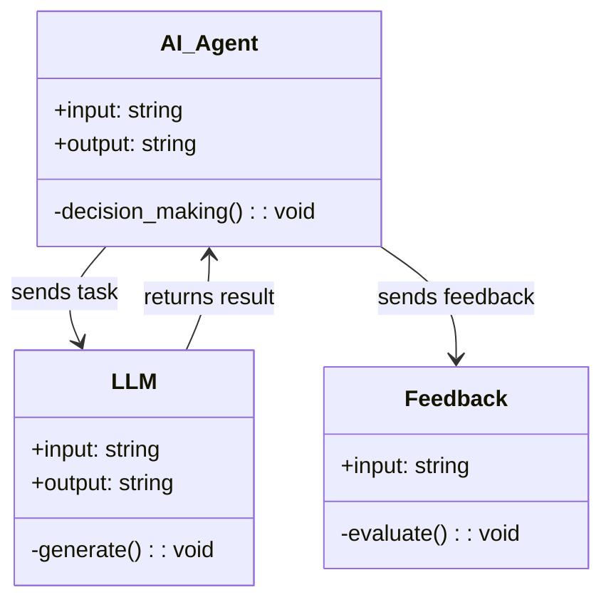

                 


# AI Agent的创造力：激发LLM的创新能力

## 关键词：AI Agent, LLM, 创造力, 创意生成, 多模态创新

## 摘要：  
AI Agent与大语言模型（LLM）的结合为创造力的激发提供了新的可能性。本文将从AI Agent和LLM的基本概念出发，深入分析创造力的定义与特征，探讨LLM的内部机制及其在创造力激发中的应用。通过详细讲解AI Agent的创造力激发策略，结合协同创新的实现方式，本文将展示如何通过算法优化和系统设计提升创造力。最后，通过实际案例分析和项目实战，本文将为读者提供一套完整的解决方案，帮助他们在实际应用中更好地激发LLM的创新能力。

---

# 第一部分: AI Agent与LLM的背景与基础

## 第1章: AI Agent与LLM的概述

### 1.1 AI Agent的基本概念

#### 1.1.1 AI Agent的定义与特点

AI Agent（人工智能代理）是指能够感知环境、自主决策并执行任务的智能体。AI Agent的核心特点包括：

- **自主性**：能够在没有外部干预的情况下独立运行。
- **反应性**：能够实时感知环境并做出相应的反应。
- **目标导向性**：具有明确的目标，能够为实现目标而行动。
- **学习能力**：通过与环境的交互不断学习和优化自身行为。

#### 1.1.2 LLM的基本概念与特点

LLM（Large Language Model，大语言模型）是指基于大量数据训练的深度学习模型，能够理解和生成人类语言。其特点包括：

- **大规模数据训练**：通常基于数十亿甚至更多的文本数据进行训练。
- **多任务能力**：能够执行多种语言任务，如翻译、问答、文本生成等。
- **上下文理解**：能够理解上下文关系，并生成连贯的文本。

#### 1.1.3 AI Agent与LLM的关系

AI Agent与LLM的关系可以理解为一种协同关系。AI Agent作为决策者和执行者，利用LLM强大的语言生成和理解能力，完成复杂的任务。LLM则为AI Agent提供语言理解和生成的支持，帮助其更好地与人类交互和完成任务。

### 1.2 创造力的定义与特征

#### 1.2.1 创造力的定义

创造力是指个体或系统能够产生新颖、独特且有价值的创意或解决方案的能力。在AI Agent和LLM的背景下，创造力通常指AI Agent利用LLM生成创新的文本内容或解决方案的能力。

#### 1.2.2 创造力的特征

创造力具有以下特征：

1. **新颖性**：生成的内容或解决方案具有独特性。
2. **有用性**：生成的内容或解决方案能够满足特定需求。
3. **多样性**：能够生成多种不同的创意。
4. **可扩展性**：能够持续生成创意，不受限制地进行创新。

#### 1.2.3 创造力在AI Agent中的应用

在AI Agent中，创造力主要体现在以下几个方面：

1. **文本生成**：生成创新的文章、故事、广告文案等。
2. **问题解决**：提供独特的解决方案。
3. **创意设计**：生成创新的产品设计、广告创意等。

### 1.3 本章小结

本章从AI Agent和LLM的基本概念出发，介绍了创造力的定义与特征，并探讨了创造力在AI Agent中的应用。这为后续章节的深入分析奠定了基础。

---

## 第2章: LLM的内部机制

### 2.1 LLM的训练原理

#### 2.1.1 基于Transformer的LLM架构

基于Transformer的LLM架构是当前主流的模型架构，其核心组成部分包括编码器和解码器。编码器负责将输入的文本转化为向量表示，解码器则基于这些向量生成输出文本。Mermaid图如下：

```mermaid
graph TD
    Encoder -> Input tokens
    Encoder -> Attention
    Attention -> Output vector
    Decoder -> Output tokens
    Output vector -> Decoder
```

#### 2.1.2 注意力机制的原理

注意力机制是Transformer模型的核心，它通过计算输入序列中每个词与其他词的相关性，生成注意力权重矩阵，从而聚焦于重要的信息。注意力机制的公式如下：

$$
\text{Attention}(Q, K, V) = \text{softmax}\left(\frac{QK^T}{\sqrt{d_k}}\right)V
$$

其中，Q、K、V分别是查询、键和值向量，$$d_k$$是键的维度。

#### 2.1.3 梯度下降与优化算法

在LLM的训练过程中，通常使用梯度下降算法来优化模型参数。常用的优化算法包括Adam、SGD等。以Adam为例，其更新公式如下：

$$
\theta_{t+1} = \theta_t - \eta \frac{\rho_1 g_t + (1-\rho_1)g_t^2}{\sqrt{\rho_2 g_t^2 + (1-\rho_2)g_t^2} + \epsilon}
$$

其中，$$\theta$$是模型参数，$$\eta$$是学习率，$$g_t$$是梯度，$$\rho_1$$和$$\rho_2$$是动量系数，$$\epsilon$$是防止除零的小量。

### 2.2 LLM的生成机制

#### 2.2.1 解码过程

解码过程是LLM生成文本的核心步骤，通常包括以下步骤：

1. 初始化解码器输入。
2. 生成下一个词的概率分布。
3. 根据概率分布选择下一个词。
4. 将新词添加到解码器输入中，重复上述步骤直到生成完整的文本。

解码过程的Mermaid图如下：

```mermaid
graph TD
    Decoder -> Input tokens
    Decoder -> Output tokens
```

#### 2.2.2 概率生成模型

概率生成模型是LLM生成文本的基础。模型通过计算每个词的概率，生成概率最高的词序列。概率生成的公式如下：

$$
P(\text{sequence}) = \prod_{i=1}^n P(w_i | w_{<i})
$$

其中，$$w_i$$是生成序列中的第i个词，$$P(w_i | w_{<i})$$是条件概率。

#### 2.2.3 温度与多样性参数

温度（temperature）和多样性参数（top-k sampling）是控制生成文本多样性的关键参数。温度越高，生成的文本越多样化；top-k sampling的k值越大，生成的文本越保守。

### 2.3 本章小结

本章详细介绍了LLM的训练和生成机制，包括基于Transformer的架构、注意力机制、优化算法以及生成过程中的温度和多样性参数。这为后续章节的创造力激发提供了理论基础。

---

## 第3章: AI Agent的创造力激发策略

### 3.1 创造力激发的核心原理

#### 3.1.1 创意生成的算法模型

创意生成的算法模型通常基于改进的Transformer架构，通过引入创新的注意力机制和解码策略，提升生成文本的多样性和创新性。改进的注意力机制可以通过引入位置编码和句法结构信息来增强模型的理解能力。

#### 3.1.2 创意评估的指标体系

创意评估的指标体系包括新颖性、有用性和多样性。新颖性通过计算生成文本与已有文本的相似性来衡量；有用性通过用户反馈或自动评估指标来衡量；多样性通过生成文本的多样性来衡量。

#### 3.1.3 创意优化的反馈机制

创意优化的反馈机制包括基于用户反馈的强化学习和基于生成结果的自动评估。用户反馈用于指导模型生成更符合需求的创意，自动评估用于快速优化生成结果。

### 3.2 创造力激发的具体方法

#### 3.2.1 基于LLM的创意生成

基于LLM的创意生成通过调整生成参数（如温度、top-k sampling）和引入创新的生成策略（如随机打断、动态注意力权重）来提升生成文本的创新性。例如，动态调整温度可以在生成过程中逐步增加多样性，从而生成更创新的文本。

#### 3.2.2 多模态创意激发

多模态创意激发通过结合视觉、听觉等多模态信息，提升生成创意的丰富性和多样性。例如，结合图像和文本信息生成配文，结合音乐和文本生成歌词等。

#### 3.2.3 创意多样性控制

创意多样性控制通过引入多样性损失函数和动态调节生成策略，控制生成创意的多样性。例如，引入多样性损失函数可以在生成过程中惩罚过于相似的创意，从而提升生成结果的多样性。

### 3.3 本章小结

本章详细探讨了AI Agent激发LLM创造力的具体方法，包括创意生成的算法模型、创意评估的指标体系和创意优化的反馈机制。这些方法为后续章节的系统设计和项目实战提供了理论支持。

---

## 第4章: AI Agent与LLM的协同创新

### 4.1 AI Agent与LLM的协同原理

#### 4.1.1 协同创新的定义

协同创新是指多个智能体通过协同合作，共同完成创新任务的过程。在AI Agent与LLM的协同创新中，AI Agent负责整体决策和任务规划，LLM负责语言理解和生成，两者共同完成复杂的创新任务。

#### 4.1.2 协同创新的实现方式

协同创新的实现方式包括：

1. **任务分解**：将创新任务分解为多个子任务，分别由AI Agent和LLM完成。
2. **协同决策**：AI Agent与LLM通过协同决策，共同制定创新方案。
3. **实时交互**：AI Agent与LLM通过实时交互，动态调整生成策略，确保生成结果的创新性和实用性。

#### 4.1.3 协同创新的系统架构

协同创新的系统架构包括：

1. **输入模块**：接收用户的输入需求。
2. **任务分解模块**：将任务分解为多个子任务。
3. **协同决策模块**：制定创新方案。
4. **生成模块**：生成创新内容。
5. **反馈模块**：根据反馈优化生成结果。

### 4.2 AI Agent与LLM的协同机制

#### 4.2.1 协同创新的实现步骤

协同创新的实现步骤包括：

1. **需求分析**：分析用户的创新需求。
2. **任务分解**：将任务分解为多个子任务。
3. **协同决策**：AI Agent与LLM共同制定创新方案。
4. **生成内容**：生成创新内容。
5. **反馈优化**：根据反馈优化生成结果。

#### 4.2.2 协同创新的优化策略

协同创新的优化策略包括：

1. **动态调整生成参数**：根据生成结果动态调整温度和top-k sampling参数，确保生成内容的创新性和实用性。
2. **引入外部知识库**：通过引入外部知识库，增强生成内容的专业性和准确性。
3. **多模态协同**：结合视觉、听觉等多模态信息，提升生成内容的丰富性和多样性。

### 4.3 本章小结

本章详细探讨了AI Agent与LLM的协同创新机制，包括协同创新的定义、实现方式和系统架构。这些内容为后续章节的系统设计和项目实战提供了理论支持。

---

## 第5章: 项目实战

### 5.1 项目介绍

本项目旨在通过设计一个AI Agent，激发LLM的创造力，生成创新的文本内容。项目的主要目标包括：

1. 设计一个能够生成创新文本的AI Agent。
2. 实现AI Agent与LLM的协同创新机制。
3. 通过实际案例展示生成结果的创新性和实用性。

### 5.2 系统功能设计

系统功能设计包括：

1. **用户输入模块**：接收用户的输入需求。
2. **任务分解模块**：将任务分解为多个子任务。
3. **协同决策模块**：制定创新方案。
4. **生成模块**：生成创新内容。
5. **反馈模块**：根据反馈优化生成结果。

系统功能设计的类图如下：



### 5.3 系统实现

系统实现包括环境安装、代码编写和功能实现。以下是核心代码：

```python
class AI_Agent:
    def __init__(self):
        self.llm = LLM()

    def generate_creative_content(self, input prompt):
        # 任务分解
        task = self._decompose_task(prompt)
        # 协同决策
        decision = self._make_decision(task)
        # 生成内容
        content = self.llm.generate(decision)
        return content

    def _decompose_task(self, prompt):
        # 任务分解逻辑
        pass

    def _make_decision(self, task):
        # 协同决策逻辑
        pass
```

### 5.4 实际案例分析

通过实际案例分析，展示生成结果的创新性和实用性。例如，生成创新的广告文案、创意故事等。

### 5.5 本章小结

本章通过项目实战，展示了AI Agent与LLM协同创新的实际应用。通过实际案例分析，验证了系统的创新性和实用性。

---

## 第6章: 总结与展望

### 6.1 本章总结

本章总结了全文的主要内容，包括AI Agent与LLM的基本概念、创造力的激发方法以及协同创新的实现方式。通过项目实战，展示了系统的实际应用和创新潜力。

### 6.2 未来展望

未来的研究方向包括：

1. **多模态协同创新**：结合视觉、听觉等多模态信息，进一步提升生成内容的多样性和创新性。
2. **动态调整生成策略**：通过实时反馈优化生成策略，提升生成内容的创新性和实用性。
3. **个性化创造力激发**：根据用户需求和偏好，个性化调整生成策略，提供更符合需求的创新内容。

---

## 参考文献

（此处列出相关的参考文献）

---

通过以上内容，本文系统地探讨了AI Agent激发LLM创造力的理论和实践，为读者提供了完整的解决方案和实际案例分析。希望本文能够为AI Agent与LLM的协同创新提供新的思路和方向。

