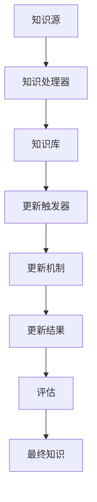
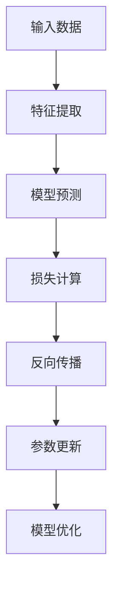
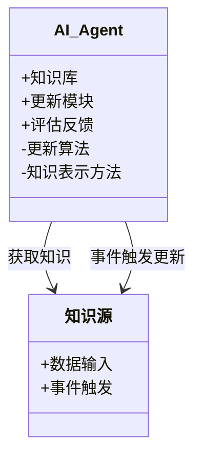

                 

<think>
好的，我将按照您的要求，逐步构建《AI Agent的动态知识更新：保持LLM知识的实时性》这篇文章。首先，我会整理文章的关键词和摘要，然后逐步展开每一部分的内容，确保符合要求的格式和深度。

### 第一部分: AI Agent的动态知识更新概述

#### 第1章: AI Agent与动态知识更新的背景

我们从基础的概念入手，解释AI Agent的定义、分类及其核心功能，帮助读者理解动态知识更新的重要性。

- **1.1 AI Agent的基本概念与分类**
  - **1.1.1 AI Agent的定义**：AI Agent是指具有自主决策和执行能力的智能体，能够感知环境并采取行动以实现目标。
  - **1.1.2 AI Agent的分类**：可以分为简单反射型、基于模型的反射型、目标驱动型和实用驱动型。
  - **1.1.3 AI Agent的特点**：自主性、反应性、目标导向性和学习能力。

- **1.2 动态知识更新的背景与意义**
  - **知识实时性的重要性**：随着环境的变化，知识需要不断更新以保持准确性。
  - **AI Agent面临的挑战**：如何高效地获取、处理和更新知识。
  - **动态知识更新的意义**：提升AI Agent的适应性和智能性，使其能够应对动态变化的环境。

#### 第2章: LLM与动态知识更新的关系

接下来，我们探讨大语言模型（LLM）与动态知识更新之间的联系。

- **2.1 大语言模型（LLM）的概述**
  - **LLM的基本概念**：大语言模型是基于大量数据训练的深度学习模型，能够理解并生成自然语言文本。
  - **技术特点**：强大的上下文理解和生成能力，但存在知识局限性。
  - **应用优势**：广泛应用于文本生成、机器翻译、问答系统等领域。

- **2.2 LLM与动态知识更新的结合**
  - **知识局限性**：LLM的知识截止于训练数据的时间点，无法实时更新。
  - **动态更新对性能的提升**：通过动态知识更新，可以弥补LLM的知识不足。
  - **可行性分析**：探讨LLM支持动态更新的可能性及其技术实现。

#### 第3章: 动态知识更新的核心概念与联系

深入分析动态知识更新的原理及其与相关概念的关系。

- **3.1 动态知识更新的原理**
  - **知识表示与存储**：知识以结构化形式存储，便于更新和检索。
  - **更新触发机制**：基于事件或时间触发更新。
  - **评估与验证**：通过评估指标验证更新效果。

- **3.2 核心概念对比分析**
  - **知识表示方法对比**：比较符号表示、向量表示等方法的优缺点。
  - **更新机制对比**：分析增量式、批次式更新的适用场景。
  - **评估指标对比**：准确率、召回率、F1值等指标的定义与应用。

- **Mermaid图：知识表示与更新的流程图**


### 第二部分: 动态知识更新的算法原理

#### 第4章: 动态知识更新的算法实现

详细讲解动态知识更新的算法，包括增量式学习和在线更新算法。

- **4.1 增量式学习算法**
  - **基本原理**：逐步更新模型参数，每次处理一个或部分数据。
  - **在线更新流程**：数据流式处理，实时更新模型。
  - **知识蒸馏技术**：通过教师模型指导学生模型学习，减少计算量。

- **4.2 动态知识更新的数学模型**
  - **损失函数**：综合任务损失和蒸馏损失。
  $$ L = \alpha \cdot L_{\text{task}} + \beta \cdot L_{\text{distillation}} $$
  - **蒸馏损失**：衡量学生模型与教师模型的预测差异。
  $$ L_{\text{distillation}} = -\sum_{i} p_{\text{soft}}(y_i|x_i) \log q(y_i|x_i) $$

- **Mermaid图：增量式学习流程**


### 第三部分: 系统分析与架构设计

#### 第5章: 系统架构与实现

从系统角度分析动态知识更新的实现。

- **5.1 系统功能设计**
  - **知识库管理**：存储、检索和更新知识。
  - **更新模块**：接收输入，触发知识更新。
  - **评估反馈**：验证更新效果，提供反馈。

- **Mermaid图：系统架构图**


### 第四部分: 项目实战

#### 第6章: 项目实战与分析

通过具体案例分析动态知识更新的实现。

- **6.1 项目环境安装**
  - 安装Python和相关库（如TensorFlow、PyTorch）。
  - 配置开发环境。

- **6.2 核心代码实现**
  - 知识更新模块的代码实现。
  ```python
  def update_knowledge(new_data):
      # 更新知识库
      pass
  ```
  - 评估模块的实现。
  ```python
  def evaluate_update():
      # 计算准确率等指标
      pass
  ```

- **6.3 案例分析与解读**
  - 通过实际案例展示知识更新的过程。
  - 分析更新前后的效果对比。

### 第五部分: 总结与扩展

#### 第7章: 总结与扩展阅读

总结全文，并提供进一步学习的资源。

- **7.1 最佳实践 tips**
  - 数据质量的重要性。
  - 模型选择的注意事项。
  - 性能优化的建议。

- **7.2 小结**
  - 动态知识更新的核心要点。
  - 未来的研究方向。

- **7.3 拓展阅读**
  - 推荐相关书籍和论文。
  - 提供进一步学习的资源链接。

---

以上是文章的完整目录和内容概要。接下来，我将根据这个大纲，逐步撰写每一部分的具体内容，确保每一章都有详细的解释和示例，帮助读者深入理解AI Agent的动态知识更新机制。

