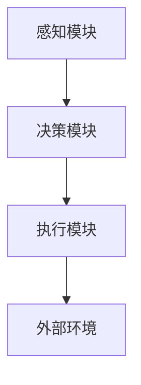
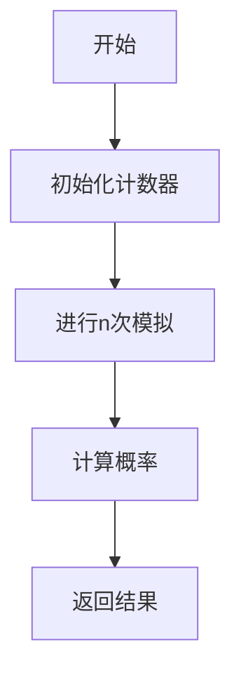

                 


# {{AI Agent的反事实推理：增强决策的前瞻性}}

> 关键词：反事实推理，AI Agent，决策优化，因果关系，人工智能，概率模型

> 摘要：本文深入探讨了反事实推理在AI Agent决策过程中的应用，分析了其增强决策前瞻性的原理与方法。通过理论解析、算法实现和实际案例，详细阐述了反事实推理的数学模型、系统架构和优化策略，为AI Agent的决策优化提供了新的视角和解决方案。

---

# {{AI Agent的反事实推理：增强决策的前瞻性}}

## 引言

在AI Agent的决策过程中，前瞻性思考是关键。反事实推理作为一种新兴的决策增强技术，通过模拟“如果”（what if）场景，帮助AI在复杂环境中做出更明智的选择。本文将从理论到实践，系统地解析反事实推理的实现与应用。

---

## 第1章 反事实推理的逻辑框架

### 1.1 反事实推理的定义与背景

反事实推理是指通过假设与现实相反的情况，推导出可能的结果。在AI Agent中，这帮助系统预测不同决策的后果，从而优化选择。

### 1.2 反事实推理的逻辑框架

#### 1.2.1 可能世界语义学

可能世界模型通过构建多个假设场景，评估每个场景下的结果。这为AI Agent提供了多元化的决策依据。

#### 1.2.2 反事实条件句的逻辑形式

反事实条件句的形式化表示为：如果A发生，那么B的结果如何？这为AI Agent的决策提供了结构化的分析框架。

---

## 第2章 反事实推理的概率模型

### 2.1 贝叶斯网络与反事实推理

贝叶斯网络通过概率关系建模，帮助AI Agent评估反事实场景的可能性。例如，计算在某个假设下，目标事件发生的概率。

### 2.2 反事实推理的概率计算方法

使用概率论中的条件概率公式，计算反事实场景下的结果概率。例如，P(B|A)表示在A发生的情况下，B发生的概率。

### 2.3 反事实推理与因果关系的联系

因果关系是反事实推理的基础。通过分析因果链，AI Agent可以更准确地预测反事实场景的结果。

---

## 第3章 反事实推理的数学模型

### 3.1 反事实推理的数学表达

反事实推理可以用公式表示为：$$ P(B| \text{not } A) $$，即在A不发生的情况下，B发生的概率。

### 3.2 可能世界模型的数学推导

在可能世界模型中，每个假设场景被视为一个概率分布。通过比较不同场景的概率，AI Agent选择最优决策。

### 3.3 反事实推理的因果推断公式

因果推断公式用于计算反事实条件下的因果效应：$$ P(Y|do(X)) $$，其中Y是结果变量，X是干预变量。

---

## 第4章 AI Agent的系统架构

### 4.1 系统功能设计

AI Agent的系统架构包括感知模块、决策模块和执行模块。感知模块收集数据，决策模块应用反事实推理，执行模块采取行动。

### 4.2 系统架构设计

使用Mermaid绘制系统架构图，展示各模块的协作关系：



### 4.3 接口设计与交互流程

AI Agent通过API与外部环境交互，接口设计需考虑数据格式和通信协议。例如，使用RESTful API进行数据传输。

---

## 第5章 反事实推理的算法实现

### 5.1 算法原理

反事实推理算法的核心是计算假设场景下的结果概率。例如，使用蒙特卡洛方法模拟多个可能世界，并评估目标事件的发生概率。

### 5.2 算法实现

以下是一个Python实现示例，使用蒙特卡洛模拟计算反事实概率：

```python
import random

def calculate反事实概率(n_iterations=1000):
    count = 0
    for _ in range(n_iterations):
        # 假设场景下的模拟
        if random.random() < 0.7:
            count += 1
    probability = count / n_iterations
    return probability

result = calculate反事实概率()
print(f"反事实概率为：{result}")
```

### 5.3 算法流程图

使用Mermaid绘制算法流程图，展示实现步骤：



---

## 第6章 项目实战

### 6.1 问题场景

以金融投资为例，AI Agent需要在不同市场条件下，评估投资决策的反事实结果。

### 6.2 系统实现

编写Python代码，模拟股票市场的反事实推理：

```python
import numpy as np

def 反事实推理(数据, 模拟次数=1000):
    results = []
    for _ in range(模拟次数):
        # 模拟不同市场条件下的股票价格变化
        随机波动 = np.random.normal(0, 1, len(数据))
        模拟价格 = 数据 + 随机波动
        results.append(模拟价格)
    return results

模拟结果 = 反事实推理(初始数据)
print("模拟结果：", 模拟结果)
```

### 6.3 案例分析

分析模拟结果，评估不同投资策略在反事实场景下的表现，帮助AI Agent优化决策。

---

## 第7章 最佳实践

### 7.1 小结

反事实推理通过模拟假设场景，增强AI Agent的决策前瞻性。其核心在于构建可能世界模型，并计算反事实概率。

### 7.2 注意事项

在实际应用中，需注意计算复杂度和数据准确性。选择合适的算法和优化方法，以提高推理效率。

### 7.3 未来展望

未来研究可结合强化学习和分布式计算，进一步提升反事实推理的效率和准确性。

---

## 附录

### 附录A: 术语表

- 反事实推理：假设与现实相反的情况，推导可能结果。
- 可能世界模型：用于建模假设场景的数学框架。
- 贝叶斯网络：概率推理工具，用于计算反事实概率。

### 附录B: 参考文献

- Pearl, J. (1995). Causal Reasoning. MIT Press.
- Goodman, N. (1955). The New Riddle of Induction. Mind.

---

通过系统化的理论分析、算法实现和实际案例，本文全面探讨了反事实推理在AI Agent中的应用。未来，随着技术进步，反事实推理将进一步提升AI的决策能力，推动智能系统的发展。

