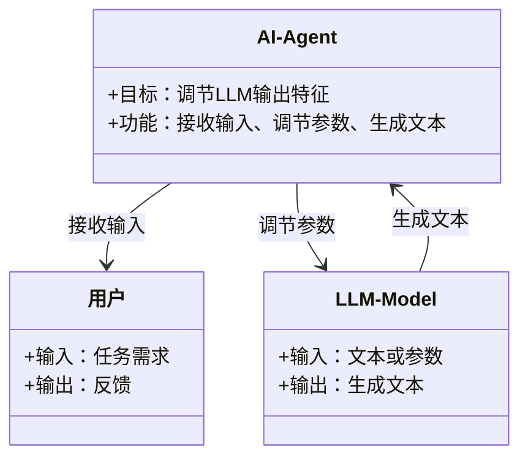
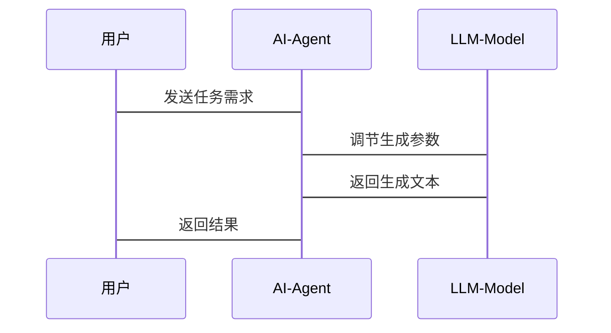

                 


# AI Agent的可控文本生成：精确调节LLM的输出特征

---

## 关键词：
AI Agent，可控文本生成，LLM，大语言模型，输出特征调节，文本生成算法，系统架构设计

---

## 摘要：
本文深入探讨了AI Agent在可控文本生成中的应用，重点分析了如何通过AI Agent精确调节大语言模型（LLM）的输出特征，以实现高质量的文本生成。文章从AI Agent与LLM的基本概念出发，详细阐述了LLM的算法原理、特征调节方法，以及系统的架构设计与实现。通过实际案例和数学公式，本文为读者提供了从理论到实践的全面指导，帮助理解如何在实际应用中优化LLM的输出效果。

---

## 目录

# 第1章 AI Agent与可控文本生成概述

## 1.1 AI Agent的基本概念

### 1.1.1 AI Agent的定义
AI Agent（人工智能代理）是指能够感知环境、自主决策并执行任务的智能体。它通过与用户或系统的交互，实现目标的优化和问题的解决。

### 1.1.2 AI Agent的核心特征
- **自主性**：能够自主决策。
- **反应性**：能实时感知并响应环境变化。
- **目标导向**：基于目标优化行为。
- **学习能力**：通过数据和经验改进性能。

### 1.1.3 AI Agent的应用场景
- 个性化推荐
- 智能客服
- 自动化交易
- 机器人控制

## 1.2 可控文本生成的定义与意义

### 1.2.1 可控文本生成的定义
可控文本生成是指通过调节生成文本的特征（如语气、风格、主题等），实现对生成内容的精确控制。

### 1.2.2 可控文本生成的重要性
- 提高生成文本的质量和相关性。
- 满足不同场景的需求（如客服、营销）。
- 避免生成有害或不适当的内容。

## 1.3 大语言模型（LLM）的基本概念

### 1.3.1 LLM的定义
大语言模型（Large Language Model）是基于大量文本数据训练的深度学习模型，具有强大的文本生成和理解能力。

### 1.3.2 LLM的核心技术
- **Transformer架构**：采用自注意力机制处理长文本。
- **预训练-微调模式**：通过大规模数据预训练，针对特定任务进行微调。
- **生成式模型**：使用概率模型生成多样化的文本。

## 1.4 本章小结
本章介绍了AI Agent和LLM的基本概念，分析了可控文本生成的重要性和应用场景，为后续内容奠定了基础。

---

# 第2章 AI Agent与LLM的关系

## 2.1 AI Agent与LLM的协同工作原理

### 2.1.1 AI Agent作为LLM的控制器
AI Agent通过调节LLM的生成参数（如温度、核对概率）来控制生成内容的特征。

### 2.1.2 LLM作为AI Agent的生成器
LLM为AI Agent提供高质量的文本生成能力，支持复杂任务的实现。

### 2.1.3 AI Agent与LLM的交互流程
1. AI Agent接收用户输入或任务需求。
2. 分析需求，确定生成文本的特征要求。
3. 调节LLM的生成参数，生成符合要求的文本。
4. 根据反馈优化生成策略。

## 2.2 LLM的输出特征分析

### 2.2.1 LLM输出特征的分类
- **内容特征**：主题、关键词。
- **风格特征**：语气、句式复杂度。
- **情感特征**：情感倾向、情感强度。

### 2.2.2 不同特征对文本生成的影响
- **内容特征**：决定生成文本的主题和信息量。
- **风格特征**：影响文本的可读性和专业性。
- **情感特征**：影响用户的情感体验和满意度。

## 2.3 AI Agent对LLM输出特征的调节机制

### 2.3.1 特征调节的目标
- 提高生成文本的相关性和准确性。
- 满足特定场景的需求（如正式、非正式语气）。
- 避免生成不适当或有害的内容。

### 2.3.2 调节机制的实现方式
- **基于温度的调节**：通过调整温度参数控制生成的多样性和确定性。
- **基于核对概率的调节**：通过调整概率阈值，过滤掉低概率的生成结果。
- **基于策略梯度的调节**：通过强化学习优化生成策略。

## 2.4 本章小结
本章分析了AI Agent与LLM的关系，详细探讨了LLM的输出特征及其调节机制，为后续的算法实现奠定了基础。

---

# 第3章 LLM的算法原理

## 3.1 LLM的基本算法框架

### 3.1.1 前向传播过程
1. 输入文本通过编码器生成词向量。
2. 词向量通过自注意力机制生成上下文表示。
3. 上下文表示通过解码器生成概率分布。
4. 根据概率分布生成输出文本。

### 3.1.2 后向传播过程
1. 计算生成文本与预期输出的损失。
2. 使用梯度下降优化模型参数。
3. 更新模型权重以减少损失。

### 3.1.3 模型训练的优化方法
- **Adam优化器**：常用优化算法，结合动量和自适应学习率。
- **学习率调度器**：根据训练轮数调整学习率。
- **批量归一化**：加速训练，提高模型稳定性。

## 3.2 LLM的数学模型

### 3.2.1 概率分布模型
生成文本的概率由模型的参数决定，公式如下：
$$ P(y|x) = \frac{1}{Z} \exp(\theta \cdot y) $$
其中，$x$是输入，$y$是输出，$\theta$是模型参数，$Z$是归一化常数。

### 3.2.2 转换层（Transformer）的结构
转换层由编码器和解码器组成，编码器负责生成词向量，解码器负责生成输出序列。

### 3.2.3 注意力机制的数学表达
自注意力机制的计算公式为：
$$ \text{Attention}(Q, K, V) = \text{softmax}\left(\frac{QK^T}{\sqrt{d_k}}\right)V $$
其中，$Q$是查询向量，$K$是键向量，$V$是值向量，$d_k$是键的维度。

## 3.3 LLM的特征调节算法

### 3.3.1 基于温度的调节方法
通过调整温度参数控制生成的多样性和确定性，公式如下：
$$ y = \argmax P(y|x)^{\text{temp}} $$

### 3.3.2 基于核对概率的调节方法
通过设置概率阈值，过滤掉低概率的生成结果：
$$ \text{保留} y \text{的条件是} P(y|x) > \text{阈值} $$

### 3.3.3 基于策略梯度的调节方法
通过强化学习优化生成策略，目标函数为：
$$ J(\theta) = \mathbb{E}_{\tau \sim \pi_\theta}[\text{奖励}(τ)] $$
其中，$\tau$是策略$\pi_\theta$生成的动作序列，奖励函数根据生成结果的质量进行评分。

## 3.4 本章小结
本章详细讲解了LLM的算法原理，包括前向传播、后向传播和模型优化方法，为后续的特征调节提供了理论基础。

---

# 第4章 系统分析与架构设计

## 4.1 系统功能设计

### 4.1.1 领域模型设计
使用Mermaid类图展示系统功能模块的关系：


### 4.1.2 系统架构设计
使用Mermaid架构图展示系统的整体架构：


### 4.1.3 系统交互设计
使用Mermaid序列图展示系统的交互过程：


## 4.2 系统实现细节

### 4.2.1 环境配置
- **语言**：Python 3.8+
- **框架**：TensorFlow或PyTorch
- **依赖库**：transformers、numpy、scipy

### 4.2.2 核心代码实现
```python
import torch
from transformers import AutoTokenizer, AutoModelForCausalLM

class AI-Agent:
    def __init__(self, model_name):
        self.tokenizer = AutoTokenizer.from_pretrained(model_name)
        self.model = AutoModelForCausalLM.from_pretrained(model_name)
    
    def generate_text(self, input_text, temperature=1.0, top_k=5):
        inputs = self.tokenizer(input_text, return_tensors="pt")
        outputs = self.model.generate(
            inputs['input_ids'],
            temperature=temperature,
            top_k=top_k
        )
        return self.tokenizer.decode(outputs[0], skip_special_tokens=True)
```

### 4.2.3 代码分析
- **输入处理**：将输入文本转换为模型可接受的格式。
- **生成参数调节**：通过调整温度和top_k参数控制生成的多样性和质量。
- **输出处理**：将生成的模型输出解码为人类可读的文本。

## 4.3 本章小结
本章通过系统分析和架构设计，详细阐述了AI Agent与LLM的协同工作流程，为后续的项目实现提供了指导。

---

# 第5章 项目实战：AI Agent的可控文本生成系统

## 5.1 项目背景
本项目旨在开发一个基于AI Agent的可控文本生成系统，用于电商客服场景，实现对生成文本的语气和风格的精确控制。

## 5.2 系统功能实现

### 5.2.1 环境配置
```bash
pip install transformers torch numpy scipy
```

### 5.2.2 核心代码实现
```python
import torch
from transformers import AutoTokenizer, AutoModelForCausalLM

class AI-Agent:
    def __init__(self, model_name):
        self.tokenizer = AutoTokenizer.from_pretrained(model_name)
        self.model = AutoModelForCausalLM.from_pretrained(model_name)
    
    def generate_text(self, input_text, temperature=1.0, top_k=5):
        inputs = self.tokenizer(input_text, return_tensors="pt")
        outputs = self.model.generate(
            inputs['input_ids'],
            temperature=temperature,
            top_k=top_k
        )
        return self.tokenizer.decode(outputs[0], skip_special_tokens=True)
```

### 5.2.3 功能分析
- **输入处理**：用户输入任务需求。
- **参数调节**：AI Agent根据需求调整生成参数。
- **文本生成**：LLM生成符合要求的文本。
- **结果返回**：生成文本返回给用户。

## 5.3 项目小结
本章通过实际案例展示了AI Agent在可控文本生成中的应用，详细讲解了项目的实现过程和关键代码。

---

# 第6章 最佳实践与注意事项

## 6.1 最佳实践

### 6.1.1 参数调节的注意事项
- 温度参数：一般在0.5到2之间。
- top_k参数：建议在5到50之间。

### 6.1.2 模型选择的建议
- 根据任务需求选择合适的模型（如GPT-3、BERT）。
- 考虑模型的计算资源消耗。

## 6.2 小结
通过本文的分析，读者可以深入了解AI Agent在可控文本生成中的应用，掌握调节LLM输出特征的关键技术。

---

# 总结
本文全面探讨了AI Agent在可控文本生成中的应用，从理论到实践，详细讲解了如何通过AI Agent精确调节LLM的输出特征。通过实际案例和数学公式，为读者提供了从理论到实践的全面指导。希望本文能为相关领域的研究和应用提供有价值的参考。

