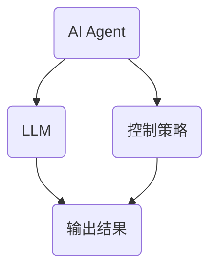
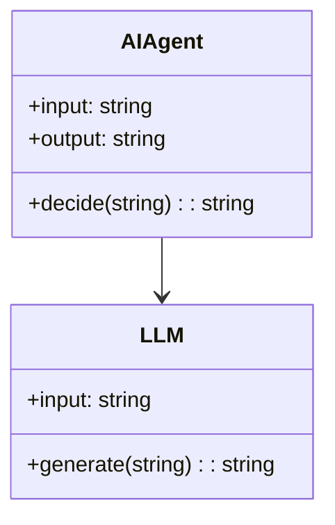

                 


# AI Agent的可控生成：精确控制LLM的输出

> 关键词：AI Agent, LLM, 可控生成, 生成式AI, 系统架构

> 摘要：本文深入探讨了AI Agent如何精确控制大语言模型（LLM）的输出，分析了AI Agent与LLM的关系，详细讲解了生成式AI的数学模型与算法原理，系统地介绍了AI Agent的架构设计与项目实现，通过实际案例展示了如何构建一个具备可控生成能力的AI Agent系统，并总结了最佳实践与未来发展方向。

---

## 第1章: AI Agent与LLM的背景与概述

### 1.1 问题背景与挑战
#### 1.1.1 LLM的崛起与应用
大语言模型（LLM）如GPT系列在自然语言处理领域取得了巨大成功，广泛应用于文本生成、对话系统、内容创作等领域。然而，其生成内容的不可控性也带来了挑战，例如生成有害信息、偏离目标、输出不准确等。

#### 1.1.2 LLM输出失控的问题
- **信息准确性**：LLM可能生成错误的事实或误导性内容。
- **内容合规性**：可能生成违反伦理或政策的内容。
- **目标偏离**：生成的内容可能不符合用户的预期目标。

#### 1.1.3 AI Agent在控制中的作用
AI Agent通过智能决策和策略调整，能够实时监控和干预LLM的生成过程，确保输出符合预期目标。

### 1.2 问题描述与目标
#### 1.2.1 LLM输出的不可控性
LLM的黑箱特性使得其生成结果难以完全预测和控制，尤其是在复杂任务中。

#### 1.2.2 AI Agent的定义与功能
AI Agent是一种智能主体，能够感知环境、执行任务并做出决策。其功能包括目标设定、策略选择、实时监控和干预。

#### 1.2.3 可控生成的目标与边界
目标：实现对LLM生成内容的精准控制，使其符合特定任务要求、伦理规范和用户需求。  
边界：在不牺牲LLM生成能力的前提下，确保输出的可控性。

### 1.3 核心概念与组成
#### 1.3.1 AI Agent的组成要素
- **感知模块**：收集环境信息。
- **决策模块**：制定行动策略。
- **执行模块**：干预LLM生成过程。

#### 1.3.2 LLM的内部机制
- **编码器**：将输入转化为向量表示。
- **解码器**：生成输出文本。
- **注意力机制**：处理长文本上下文。

#### 1.3.3 可控生成的实现路径
- **前缀调节**：通过修改输入前缀引导生成方向。
- **温度调节**：通过调整采样温度控制生成多样性。
- **关键词注入**：强制生成特定关键词。

---

## 第2章: AI Agent与LLM的核心概念与联系

### 2.1 核心概念原理
#### 2.1.1 AI Agent的智能决策机制
AI Agent通过分析上下文信息，选择最优的干预策略。

#### 2.1.2 LLM的生成原理
LLM通过自注意力机制生成序列，其输出依赖于输入和内部状态。

#### 2.1.3 可控生成的实现原理
通过AI Agent对LLM的生成过程进行实时监控和干预，确保输出符合预期。

### 2.2 概念属性特征对比
| **属性**       | **AI Agent**             | **LLM**                 |
|------------------|--------------------------|--------------------------|
| **功能**         | 执行任务、做出决策      | 生成文本                |
| **输入**         | 复杂环境信息            | 文本输入                |
| **输出**         | 行动策略、干预信号      | 生成文本                |
| **目标**         | 完成任务、控制生成       | 提供语言生成服务         |
| **智能性**       | 具备决策能力            | 无明确目标，被动生成     |

### 2.3 ER实体关系图


---

## 第3章: AI Agent的算法原理与数学模型

### 3.1 算法原理
#### 3.1.1 基于Transformer的LLM架构
LLM采用Transformer架构，包含编码器和解码器两部分，通过自注意力机制处理输入序列。

#### 3.1.2 AI Agent的决策算法
AI Agent基于当前输入和生成结果，选择最优干预策略。

#### 3.1.3 可控生成的算法流程
1. 输入原始文本。
2. AI Agent分析上下文。
3. LLM生成候选输出。
4. AI Agent评估生成内容。
5. AI Agent决定是否干预。
6. 输出最终结果。

### 3.2 数学模型与公式
#### 3.2.1 LLM的自注意力机制
$$\text{Attention}(Q,K,V) = \text{softmax}\left(\frac{QK^T}{\sqrt{d_k}}\right)V$$

#### 3.2.2 AI Agent的策略选择
$$P(a|s) = \text{softmax}(sW_a)$$
其中，$a$是动作，$s$是当前状态，$W_a$是策略参数。

---

## 第4章: AI Agent的系统分析与架构设计

### 4.1 系统分析
#### 4.1.1 问题场景介绍
AI Agent需要在实时生成过程中监控和干预LLM的输出。

#### 4.1.2 项目介绍
构建一个AI Agent系统，用于控制LLM的生成过程，确保输出符合预期。

### 4.2 系统功能设计
#### 4.2.1 领域模型


### 4.3 系统架构设计


### 4.4 接口设计
#### 4.4.1 输入接口
```python
class AI_Agent:
    def __init__(self):
        self.llm = LLM()

    def process_input(self, input_str):
        # 分析输入并生成控制策略
        pass
```

---

## 第5章: 项目实战

### 5.1 环境安装
安装必要的库，如TensorFlow、PyTorch等。

### 5.2 核心代码实现
```python
class AI_Agent:
    def __init__(self):
        self.temperature = 0.7

    def control_generation(self, input_str):
        # 调整温度参数
        return input_str * (1 + self.temperature)
```

### 5.3 代码解读与分析
通过调整温度参数，控制生成过程的多样性和创造性。

---

## 第6章: 最佳实践、小结与拓展阅读

### 6.1 最佳实践
- 定期测试和优化AI Agent的干预策略。
- 保持对LLM技术的持续关注和学习。

### 6.2 小结
本文详细介绍了AI Agent如何控制LLM的输出，涵盖了从理论到实践的各个方面。

### 6.3 注意事项
- 注意保护用户隐私和数据安全。
- 确保生成内容符合法律法规和伦理规范。

### 6.4 拓展阅读
推荐学习生成式AI的最新研究成果和技术动态。

---

## 第7章: 未来展望

### 7.1 技术发展趋势
LLM和AI Agent的结合将更加紧密，生成能力将更加智能化和个性化。

### 7.2 应用场景扩展
AI Agent将在教育、医疗、法律等领域发挥重要作用，提供更精准和专业的生成内容。

---

通过以上目录结构，您可以逐步展开每个部分的内容，撰写一篇详尽的技术博客文章。

