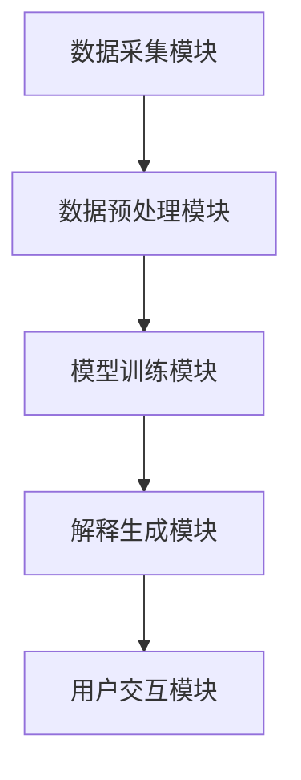
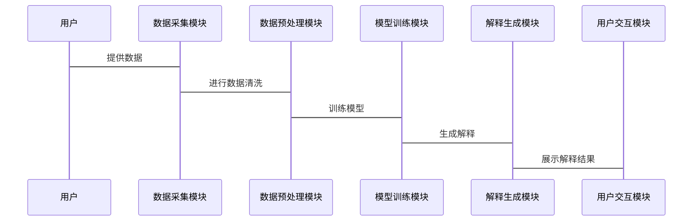

                 


# AI Agent的可解释性设计：提高模型决策的透明度

**关键词**：AI Agent，可解释性，决策透明度，LIME算法，SHAP值，系统架构设计

**摘要**：随着人工智能技术的快速发展，AI Agent在各个领域的应用日益广泛。然而，AI决策的不透明性引发了诸多信任和责任问题。本文系统地探讨了AI Agent的可解释性设计，从核心概念、算法原理到系统架构，全面解析如何提高模型决策的透明度。通过具体案例分析和实战项目，本文为读者提供了深入的理解和实践指导。

---

## 第1章: AI Agent与可解释性概述

### 1.1 AI Agent的基本概念

#### 1.1.1 AI Agent的定义与分类
AI Agent（人工智能代理）是指能够感知环境、自主决策并执行任务的智能实体。根据功能和智能水平，AI Agent可以分为以下几类：

- **简单反射型Agent**：基于预定义规则进行反应，适用于简单的决策任务。
- **基于模型的反射型Agent**：利用内部模型理解和预测环境，适用于复杂场景。
- **目标驱动型Agent**：根据目标进行规划和决策，适用于需要长期策略的任务。
- **效用驱动型Agent**：通过最大化效用函数进行决策，广泛应用于资源分配和优化问题。

#### 1.1.2 AI Agent的核心功能与特点
AI Agent的核心功能包括感知、推理、规划和执行。其特点表现为：

- **自主性**：能够自主决策，无需人工干预。
- **反应性**：能够实时感知环境并做出反应。
- **目标导向性**：通过目标驱动决策，优化行动路径。
- **学习能力**：能够通过经验改进性能。

#### 1.1.3 可解释性在AI Agent中的重要性
可解释性是指AI Agent的决策过程能够被人类理解和验证。其重要性体现在以下几个方面：

- **信任构建**：可解释的决策有助于用户信任AI Agent的判断。
- **责任追溯**：当决策导致问题时，可解释性便于追查原因。
- **合规性**：许多行业（如医疗、金融）要求决策过程符合法规，可解释性是合规的基础。
- **优化改进**：通过理解决策过程，可以发现并修正模型的不足。

### 1.2 可解释性AI的背景与挑战

#### 1.2.1 可解释性AI的定义与目标
可解释性AI（Explainable AI, XAI）是指AI系统能够清晰地解释其决策过程和结果。其目标是使人类能够理解、验证和信任AI的决策。

#### 1.2.2 当前AI决策系统的不透明性问题
当前许多AI系统（如深度神经网络）基于复杂的非线性模型，导致决策过程难以解释。主要问题包括：

- **黑箱问题**：模型内部机制不透明，难以解释决策。
- **数据依赖性**：决策高度依赖训练数据，可能存在偏见。
- **动态变化**：环境变化可能导致模型决策逻辑改变，增加解释难度。

#### 1.2.3 可解释性AI的必要性与应用场景
可解释性AI的必要性体现在以下几个方面：

- **医疗领域**：AI诊断系统需要解释其诊断依据，以确保准确性和可靠性。
- **金融行业**：信用评分系统需解释评分依据，以符合监管要求。
- **自动驾驶**：AI驾驶系统需解释其决策过程，以确保安全性和可追溯性。

### 1.2.4 本章小结
本章介绍了AI Agent的基本概念和可解释性的重要性，分析了当前AI决策系统的不透明性问题，并探讨了可解释性AI的必要性及其应用场景。

---

## 第2章: 可解释性AI的核心要素

### 2.1 可解释性的关键维度

#### 2.1.1 透明度的层次划分
透明度是可解释性的基础，可以分为以下层次：

- **数据透明度**：数据来源、处理方式和特征选择的透明。
- **模型透明度**：模型结构、参数和训练过程的透明。
- **决策透明度**：决策逻辑和推理过程的透明。

#### 2.1.2 可解释性的度量标准
可解释性可以通过以下标准进行评估：

- **可理解性**：解释是否易于理解。
- **可验证性**：解释是否可以验证。
- **可信赖性**：解释是否可靠。

#### 2.1.3 解释的粒度与复杂性
解释的粒度是指解释的详细程度，可以从宏观到微观进行划分。粒度越细，解释越复杂，但越有助于理解具体决策原因。

### 2.2 AI Agent决策过程的可解释性模型

#### 2.2.1 决策树模型的可解释性
决策树是一种直观的可解释性模型，通过树状结构展示决策过程。其优点是易于理解和解释，但决策能力有限。

#### 2.2.2 规则集模型的可解释性
规则集模型通过一组预定义的规则进行决策，具有高度的可解释性。但规则设计复杂，难以覆盖所有场景。

#### 2.2.3 模糊逻辑模型的可解释性
模糊逻辑模型通过模糊规则进行决策，具有一定的可解释性，但规则之间的关系较为复杂。

### 2.3 可解释性与模型复杂性的平衡
模型的复杂性与可解释性之间存在 trade-off。简单模型易于解释，但决策能力有限；复杂模型决策能力强，但难以解释。

#### 2.3.1 简单模型的可解释性优势
简单模型（如线性回归）具有高度的可解释性，适用于因果关系明确的场景。

#### 2.3.2 复杂模型的可解释性挑战
复杂模型（如深度神经网络）难以解释，但决策能力更强，适用于复杂场景。

#### 2.3.3 模型可解释性与性能的权衡
在实际应用中，需要根据具体需求在可解释性和性能之间进行权衡。

### 2.4 本章小结
本章探讨了可解释性的关键维度，分析了不同决策模型的可解释性，并讨论了模型复杂性与可解释性的平衡。

---

## 第3章: 可解释性算法原理

### 3.1 LIME算法原理

#### 3.1.1 LIME算法的基本思想
LIME（局部 interpretable model-agnostic explanations）是一种基于实例的可解释性算法，通过扰动数据生成局部解释。

#### 3.1.2 LIME算法的工作流程
LIME算法通过以下步骤生成解释：

1. 扰动数据：在原始数据周围生成扰动数据。
2. 模型预测：对扰动数据进行预测。
3. 拟合解释模型：使用简单的模型（如线性回归）拟合预测结果。
4. 生成解释：提取解释模型的关键特征。

#### 3.1.3 LIME算法的数学模型
LIME算法通过以下公式计算特征的重要性：

$$ \text{权重} = \sum_{i=1}^{n} w_i x_i $$

其中，\( w_i \) 是特征 \( x_i \) 的权重，表示其对预测结果的影响程度。

#### 3.1.4 LIME算法的优缺点
- **优点**：适用于各种模型，解释性强。
- **缺点**：依赖于扰动数据的分布，可能导致解释偏差。

#### 3.1.5 LIME算法的实现代码
```python
import lime
from lime import lime lime
from lime.lime_tabular import LimeTabular

explainer = LimeTabular()
explanation = explainer.explain_instance(
    data_row,
    model.predict,
    num_features=5
)
print(explanation.as_list())
```

### 3.2 SHAP值原理

#### 3.2.1 SHAP值的基本概念
SHAP（Shapley Additive exPlanations）是一种基于Shapley值的可解释性指标，用于衡量每个特征对预测结果的贡献。

#### 3.2.2 SHAP值的计算公式
$$ SHAP = \phi_i = \sum_{j} w_{i,j} \cdot f(x_j) $$

其中，\( \phi_i \) 是特征 \( i \) 的SHAP值，\( w_{i,j} \) 是特征 \( j \) 的权重。

#### 3.2.3 SHAP值的可视化解释
使用 SHAP 库进行可视化：

```python
import shap
shap.initjs()
explainer = shap.Explainer(model, X_train)
shap_values = explainer.shap_values(X_test)
shap.force_plot(explainer, shap_values, X_test).savefig('force_plot.png')
```

#### 3.2.4 SHAP值的优缺点
- **优点**：基于博弈论，解释具有理论基础。
- **缺点**：计算复杂，难以处理高维数据。

### 3.3 本章小结
本章详细介绍了LIME和SHAP两种可解释性算法，通过数学模型和代码示例，展示了它们的工作原理和应用场景。

---

## 第4章: 系统设计与架构

### 4.1 系统架构设计

#### 4.1.1 系统功能模块
- **数据采集模块**：负责收集和预处理数据。
- **模型训练模块**：训练可解释性模型。
- **解释生成模块**：生成模型的解释。
- **用户交互模块**：展示解释结果并支持交互。

#### 4.1.2 系统架构图


### 4.2 系统接口设计

#### 4.2.1 接口描述
- **输入接口**：接收原始数据和模型。
- **输出接口**：返回解释结果和可视化图表。

#### 4.2.2 接口实现
```python
class Interface:
    def __init__(self, model):
        self.model = model
    
    def explain(self, data):
        # 调用解释算法生成解释
        pass
```

### 4.3 系统交互流程

#### 4.3.1 交互流程图


### 4.4 本章小结
本章设计了一个可解释性AI系统的架构，包括功能模块、接口设计和交互流程，并通过图表展示了系统的整体结构。

---

## 第5章: 项目实战

### 5.1 项目介绍
本项目旨在构建一个可解释的AI Agent，用于预测股票价格。通过LIME算法生成解释，帮助投资者理解模型的决策过程。

### 5.2 项目环境安装
```bash
pip install numpy pandas scikit-learn lime shap
```

### 5.3 核心代码实现

#### 5.3.1 数据预处理
```python
import pandas as pd
data = pd.read_csv('stock_data.csv')
```

#### 5.3.2 模型训练
```python
from sklearn.ensemble import RandomForestRegressor
model = RandomForestRegressor()
model.fit(X_train, y_train)
```

#### 5.3.3 解释生成
```python
from lime import lime lime
explainer = LimeTabular()
explanation = explainer.explain_instance(X_test[0], model.predict, num_features=5)
print(explanation.as_list())
```

### 5.4 实际案例分析
通过实际数据，展示模型的预测结果和解释。例如，解释某次预测的主要驱动因素。

### 5.5 项目小结
本章通过一个实际项目，展示了如何在实际应用中实现AI Agent的可解释性设计。

---

## 第6章: 总结与展望

### 6.1 本章总结
本文系统地探讨了AI Agent的可解释性设计，从核心概念到算法原理，再到系统架构，全面解析了如何提高模型决策的透明度。

### 6.2 最佳实践 tips
- 在实际应用中，优先选择可解释性较强的模型。
- 结合LIME和SHAP等算法，提高解释的全面性和准确性。
- 定期验证和更新解释模型，确保其准确性和有效性。

### 6.3 未来研究方向
- 开发新的可解释性算法，提高解释的深度和广度。
- 研究可解释性与模型性能的平衡优化。
- 探索可解释性在不同领域的具体应用。

### 6.4 本章小结
本文总结了AI Agent可解释性设计的核心内容，并展望了未来的研究方向，为读者提供了全面的视角和深入的思考。

---

通过以上章节的详细分析和具体案例的实践，本文为读者提供了关于AI Agent可解释性设计的全面理解。希望本文能够帮助读者在实际应用中更好地设计和优化可解释性AI系统，推动AI技术的透明化和可信度的提升。

