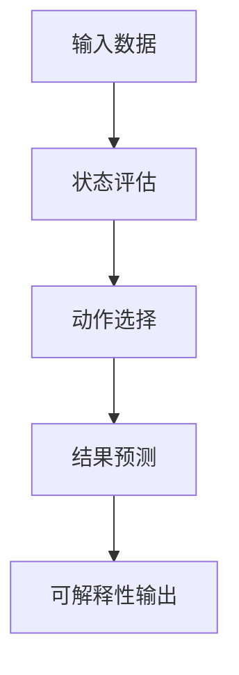
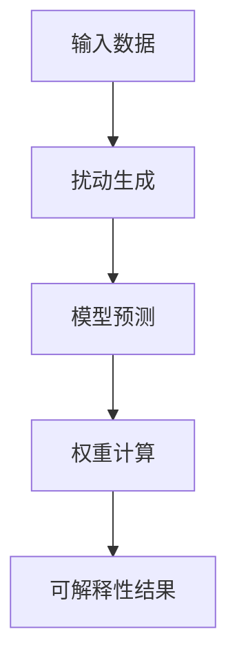
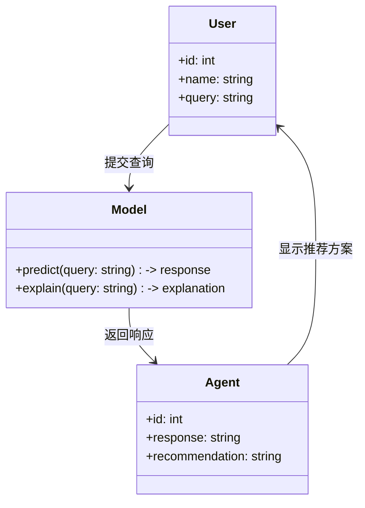
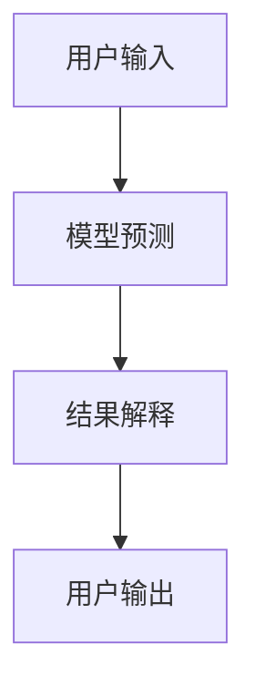
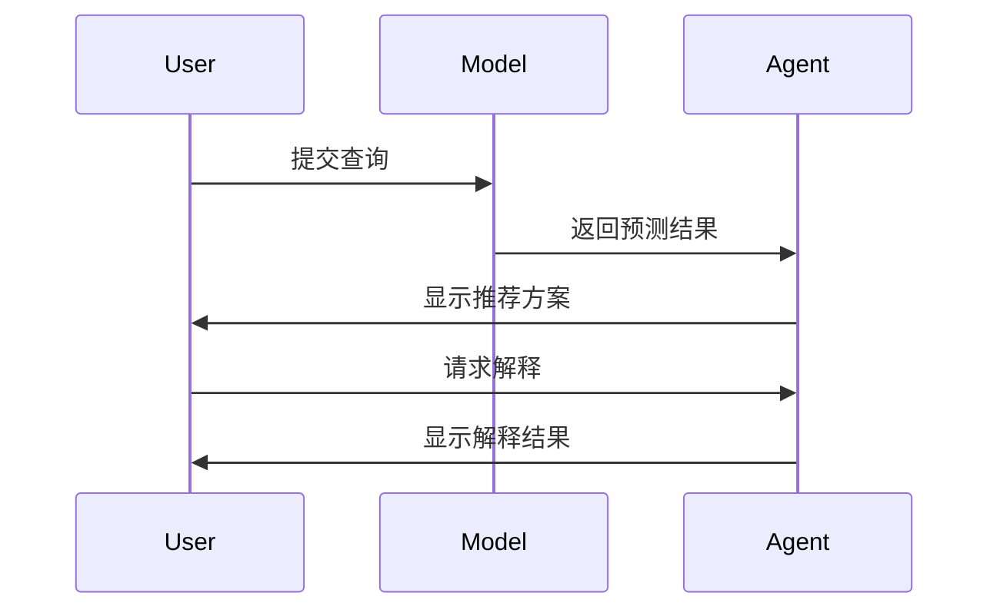

                 


# AI Agent的可解释性设计：理解AI决策过程

**关键词**：AI Agent，可解释性，决策过程，算法原理，系统架构，技术实现

**摘要**：  
AI Agent的可解释性设计是当前人工智能领域的重要研究方向。随着AI Agent在各个领域的广泛应用，理解其决策过程的需求日益迫切。本文从AI Agent的基本概念出发，详细探讨了可解释性设计的核心概念、算法原理、系统架构以及实际应用场景。通过对比分析、算法实现和案例解读，深入剖析了AI Agent的决策机制，为读者提供了全面理解AI决策过程的理论与实践指南。

---

## 第一部分：AI Agent的可解释性概述

### 第1章：AI Agent与可解释性概述

#### 1.1 AI Agent的基本概念  
AI Agent（人工智能代理）是指能够感知环境、自主决策并执行任务的智能体。AI Agent可以是软件程序、机器人或其他智能系统，其核心目标是通过感知和行动实现特定目标。AI Agent可以分为两类：  
- **反应式Agent**：基于当前环境输入做出实时反应，不依赖历史信息。  
- **认知式Agent**：具备推理、规划和学习能力，能够处理复杂任务。  

AI Agent的应用场景包括自动驾驶、智能客服、推荐系统、机器人助手等。  

#### 1.2 可解释性的重要性  
AI Agent的决策过程往往涉及复杂的算法和数据，导致“黑箱”现象。可解释性设计的目标是使AI Agent的决策过程透明化，让用户或开发者能够理解其决策逻辑。  

- **为什么需要可解释性**  
  - 提高用户信任：可解释性是用户信任AI Agent的前提。  
  - 便于调试与优化：可解释性帮助开发者定位问题并优化算法。  
  - 符合伦理要求：在医疗、司法等领域，决策的透明性是法律和伦理的基本要求。  

- **可解释性与信任的关系**  
  可解释性是信任的基石。用户只有理解AI Agent的决策逻辑，才能接受其建议或结果。  

#### 1.3 本章小结  
本章介绍了AI Agent的基本概念及其应用场景，并强调了可解释性设计的重要性。  

---

## 第二部分：AI Agent可解释性设计的核心概念与联系

### 第2章：可解释性设计的核心概念  

#### 2.1 可解释性设计的定义与属性  

- **可解释性的定义**  
  可解释性是指AI Agent的决策过程能够以人类可理解的方式进行描述和验证。  

- **可解释性的关键属性对比**  
  下表对比了可解释性设计中的关键属性：  

| 属性 | 描述 |
|------|------|
| 透明性 | 决策过程对用户可见且易于理解。 |
| 简洁性 | 解释的表达方式简洁明了。 |
| 可验证性 | 解释的结果可以通过验证确认其正确性。 |
| 一致性 | 解释的结果与实际决策过程保持一致。 |

- **可解释性设计的核心要素**  
  - 输入数据的解释：理解AI Agent输入的数据来源和特征。  
  - 决策逻辑的解释：揭示AI Agent如何根据输入数据做出决策。  
  - 输出结果的解释：明确AI Agent决策的最终结果及其依据。  

#### 2.2 AI Agent决策过程的实体关系图  



上述图展示了AI Agent决策过程中的实体关系：  
- **输入数据**：AI Agent接收的原始数据。  
- **状态评估**：AI Agent对输入数据的分析与评估。  
- **动作选择**：基于状态评估，AI Agent选择最优动作。  
- **结果预测**：AI Agent预测动作执行后的结果。  
- **可解释性输出**：AI Agent的决策过程和结果以可解释的方式输出。  

#### 2.3 本章小结  
本章从定义和属性的角度，详细阐述了可解释性设计的核心概念，并通过实体关系图展示了AI Agent决策过程的各环节。  

---

## 第三部分：AI Agent可解释性设计的算法原理

### 第3章：可解释性算法原理  

#### 3.1 LIME解释方法  

- **LIME算法的工作原理**  
  LIME（Local Interpretable Model-agnostic Explanations）是一种用于解释复杂模型的可解释性方法。其核心思想是通过局部线性近似，为复杂模型提供可解释的局部解释。  



- **LIME算法的Python实现示例**  

```python
import lime
from lime import lime_explanation

def explain_instance(model, instance, class_names):
    explainer = lime_explanation.Lime(model, class_names)
    explanation = explainer.explain(instance)
    return explanation
```

- **LIME算法的数学模型**  
  LIME通过加权线性回归模型对复杂模型的预测结果进行近似，其损失函数如下：  
  $$ L = \sum_{i=1}^{n} w_i |f(x_i) - \text{pred}(x_i)| $$  
  其中，$w_i$ 是样本 $x_i$ 的权重，$f(x_i)$ 是局部线性模型的预测值，$\text{pred}(x_i)$ 是复杂模型的预测值。  

#### 3.2 SHAP值解释方法  

- **SHAP值的定义与计算**  
  SHAP（Shapley Additive exPlanations）是基于Shapley值的一种可解释性方法。其核心思想是将每个特征对模型预测结果的贡献进行量化。  

- **SHAP值的Python实现示例**  

```python
import shap
from sklearn.tree import DecisionTreeRegressor

def shap_explanation(model, instance, feature_names):
    explainer = shap.TreeExplainer(model)
    shap_values = explainer.shap_values(instance, feature_names=feature_names)
    return shap_values
```

- **SHAP值的数学模型**  
  Shapley值的计算公式如下：  
  $$ \phi_i = \sum_{S \subseteq F \setminus \{i\}} \frac{1}{2^{n-1}} \left( f(S \cup \{i\}) - f(S) \right) $$  
  其中，$F$ 是特征集合，$f(S)$ 是特征子集 $S$ 的模型预测值。  

#### 3.3 本章小结  
本章介绍了LIME和SHAP两种可解释性算法的原理和实现方法，并通过数学公式和代码示例进行了详细讲解。  

---

## 第四部分：AI Agent可解释性设计的系统架构

### 第4章：系统架构设计  

#### 4.1 问题场景介绍  
假设我们正在设计一个智能客服AI Agent，其需要根据用户的问题内容推荐解决方案。为了提高用户体验，我们需要对AI Agent的推荐过程进行可解释性设计。  

#### 4.2 系统功能设计  

- **领域模型**  
  下图展示了智能客服AI Agent的领域模型：  



- **系统架构设计**  
  下图展示了AI Agent的系统架构：  



- **系统交互设计**  
  下图展示了系统交互流程：  



#### 4.3 本章小结  
本章通过智能客服AI Agent的案例，详细介绍了系统架构设计的过程，包括领域模型、系统架构图和交互流程图。  

---

## 第五部分：AI Agent可解释性设计的项目实战

### 第5章：项目实战  

#### 5.1 环境安装  
- 安装Python和相关库：  
  ```bash
  pip install python
  pip install lime
  pip install shap
  ```

#### 5.2 系统核心实现源代码  

```python
# 示例代码：基于LIME的可解释性实现
import lime
from lime import lime_explanation

class AI-Agent:
    def __init__(self, model):
        self.model = model
        self.explainer = lime_explanation.Lime(self.model, class_names)

    def explain_instance(self, instance):
        return self.explainer.explain(instance)
```

#### 5.3 案例分析与代码解读  

- **案例分析**  
  以智能客服AI Agent为例，当用户输入“我的订单无法配送”时，AI Agent需要推荐解决方案并提供解释。  

- **代码解读**  
  ```python
  def explain_instance(model, instance):
      explainer = lime_explanation.Lime(model, class_names)
      explanation = explainer.explain(instance)
      return explanation
  ```

#### 5.4 项目小结  
本章通过实际案例，详细讲解了AI Agent可解释性设计的实现过程，包括环境安装、核心代码实现和案例分析。  

---

## 第六部分：总结与展望

### 第6章：总结与展望  

#### 6.1 最佳实践Tips  
- 在设计AI Agent时，优先考虑可解释性设计。  
- 使用LIME和SHAP等工具对模型进行解释性分析。  
- 定期对AI Agent的决策过程进行验证和优化。  

#### 6.2 小结  
本文从AI Agent的基本概念出发，详细探讨了可解释性设计的核心概念、算法原理、系统架构以及实际应用场景。通过理论分析和实践案例，为读者提供了全面理解AI决策过程的理论与实践指南。  

#### 6.3 注意事项  
- 可解释性设计需要结合具体场景进行优化。  
- 在实际应用中，需注意数据隐私和模型安全问题。  

#### 6.4 拓展阅读  
- 《可解释的人工智能：模型、方法和应用》  
- 《机器学习可解释性：理论与实践》  

---

**结束语**：  
AI Agent的可解释性设计是实现人机协同的重要基础。通过本文的系统讲解和实践案例，读者可以深入理解AI Agent的决策过程，并在实际应用中更好地设计和优化AI系统。

