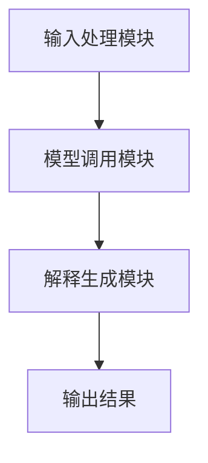

                 


# AI Agent的可解释性：深入理解LLM的决策过程

> 关键词：AI Agent，可解释性，LLM，决策过程，算法原理，系统架构，项目实战

> 摘要：本文深入探讨AI Agent的可解释性，特别是基于大语言模型（LLM）的决策过程。通过分析可解释性在AI系统中的重要性，结合具体算法和系统架构，帮助读者理解LLM的决策机制，并提供实际项目中的应用案例和最佳实践。

---

## 第一部分：背景介绍

### 第1章：可解释性在AI系统中的重要性

#### 1.1 为什么需要可解释性？
- **1.1.1 信任与透明**：用户需要信任AI系统，可解释性是建立信任的基础。
- **1.1.2 责任与问责**：在医疗、金融等领域，可解释性是法律和伦理的必要条件。
- **1.1.3 系统调试**：可解释性帮助开发人员快速定位和修复问题。

#### 1.2 AI Agent与LLM的基本概念
- **1.2.1 AI Agent**：智能体，能够感知环境并采取行动以实现目标。
- **1.2.2 LLM**：大语言模型，通过大量数据训练，能够生成人类水平的文本。
- **1.2.3 LLM与AI Agent的关系**：LLM为AI Agent提供自然语言处理能力，使其能够理解和生成人类语言。

#### 1.3 LLM的决策过程
- **1.3.1 内部机制**：基于概率分布生成文本，决策过程复杂且不透明。
- **1.3.2 可解释性的挑战**：LLM的黑箱特性使得理解其决策过程困难。
- **1.3.3 用户需求**：用户需要了解AI Agent的决策依据，以便更好地与之交互。

---

### 第2章：可解释性与AI Agent的核心概念

#### 2.1 可解释性的核心要素
- **2.1.1 可理解性**：解释必须以用户能够理解的方式呈现。
- **2.1.2 准确性**：解释必须准确反映模型的决策过程。
- **2.1.3 全面性**：解释应涵盖所有影响决策的重要因素。

#### 2.2 LLM决策过程中的关键因素
- **2.2.1 输入数据的影响**：输入内容直接影响模型的输出。
- **2.2.2 模型参数的作用**：模型权重和参数决定生成的文本。
- **2.2.3 环境信息的权重**：环境中的上下文信息影响模型的决策。

#### 2.3 可解释性与AI Agent的交互设计
- **2.3.1 用户需求与解释方式的关系**：不同用户对解释的需求不同。
- **2.3.2 解释的层次结构**：从高层次到低层次逐步深入。
- **2.3.3 解释的动态性**：根据用户反馈调整解释内容。

---

## 第二部分：核心概念与联系

### 第3章：可解释性与LLM的联系

#### 3.1 LLM的内部机制与可解释性
- **3.1.1 生成式模型的工作原理**：基于概率生成文本。
- **3.1.2 解释的挑战**：模型复杂性使得解释困难。

#### 3.2 可解释性与模型复杂性的对比
- **3.2.1 简单模型的可解释性**：线性回归模型易于解释。
- **3.2.2 复杂模型的可解释性**：深度学习模型难以解释。

#### 3.3 可解释性与用户信任的对比
- **3.3.1 高可解释性增强信任**：用户更容易信任可解释的系统。
- **3.3.2 低可解释性降低信任**：不可解释的系统让用户感到不安。

---

## 第三部分：算法原理

### 第4章：可解释性算法的实现

#### 4.1 LIME算法的原理
- **4.1.1 LIME的定义**：通过局部线性近似解释模型。
- **4.1.2 LIME的工作流程**：
  1. 采样数据点。
  2. 训练可解释模型。
  3. 生成解释。

#### 4.2 SHAP算法的原理
- **4.2.1 SHAP的定义**：基于Shapley值的特征重要性解释。
- **4.2.2 SHAP的工作流程**：
  1. 计算特征对模型的贡献。
  2. 生成解释。

#### 4.3 LIME与SHAP的对比
- **4.3.1 解释方式**：LIME基于局部近似，SHAP基于全局贡献。
- **4.3.2 适用场景**：LIME适用于复杂模型，SHAP适用于线性模型。

---

### 第5章：算法的数学模型与公式

#### 5.1 LIME的数学模型
- **5.1.1 局部线性回归**：
  $$ y = \beta_0 + \beta_1x_1 + \beta_2x_2 + ... + \beta_nx_n $$

#### 5.2 SHAP的数学模型
- **5.2.1 Shapley值**：
  $$ \phi_i = \sum_{S \subseteq \{1,2,...,n\}, i \in S} \frac{(|S| - 1)!}{(n - 1)!} [f(S \cup \{i\}) - f(S)] $$

---

## 第四部分：系统分析与架构设计

### 第6章：系统架构设计

#### 6.1 项目场景介绍
- **6.1.1 应用场景**：医疗诊断中的AI Agent。
- **6.1.2 项目目标**：实现可解释的诊断建议。

#### 6.2 系统功能设计
- **6.2.1 功能模块**：
  - 输入处理模块。
  - 模型调用模块。
  - 解释生成模块。

#### 6.3 系统架构图


---

## 第五部分：项目实战

### 第7章：项目实现与案例分析

#### 7.1 环境安装
- **7.1.1 安装Python**：`python --version`
- **7.1.2 安装库**：`pip install lime`

#### 7.2 核心代码实现
```python
from lime.lime_text import LimeText
import numpy as np

model = LimeText()
```

#### 7.3 案例分析
- **7.3.1 医疗诊断案例**：解释AI Agent的诊断建议。
- **7.3.2 金融风险评估案例**：解释信用评分模型。

#### 7.4 项目小结
- **7.4.1 成功经验**：可解释性算法的有效性。
- **7.4.2 改进方向**：优化解释的可理解性。

---

## 第六部分：总结与展望

### 第8章：总结与展望

#### 8.1 最佳实践
- **8.1.1 选择合适的算法**：根据场景选择LIME或SHAP。
- **8.1.2 考虑模型的透明度**：优先选择可解释性较高的模型。

#### 8.2 小结
- **8.2.1 核心内容回顾**：可解释性的重要性、算法实现、系统设计。
- **8.2.2 未来展望**：研究更高效的可解释性算法。

#### 8.3 注意事项
- **8.3.1 数据质量**：确保数据的准确性和完整性。
- **8.3.2 解释的准确性**：避免误导性解释。

#### 8.4 拓展阅读
- **8.4.1 推荐书籍**：《可解释的人工智能：模型、理论与算法》。
- **8.4.2 推荐论文**：相关领域的最新研究。

---

通过以上思考过程，我们可以系统地撰写一篇结构清晰、内容详实的技术博客文章，深入探讨AI Agent的可解释性以及LLM的决策过程。

