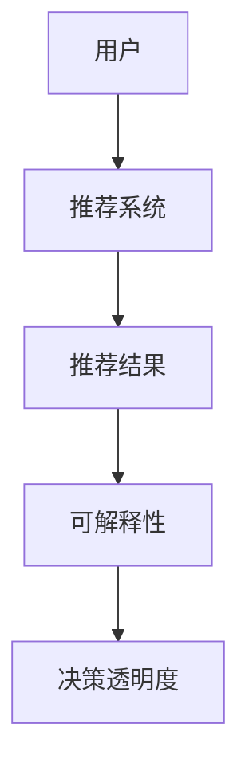
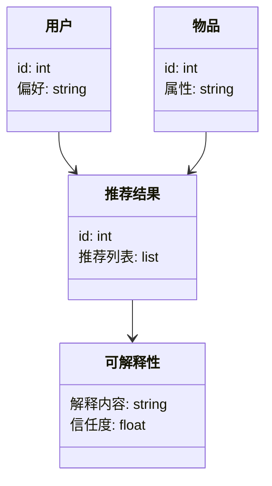
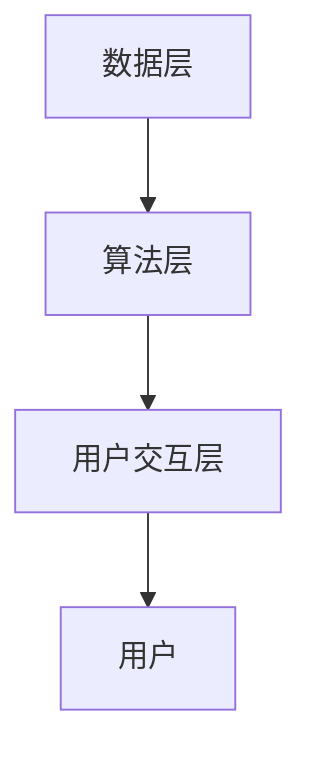
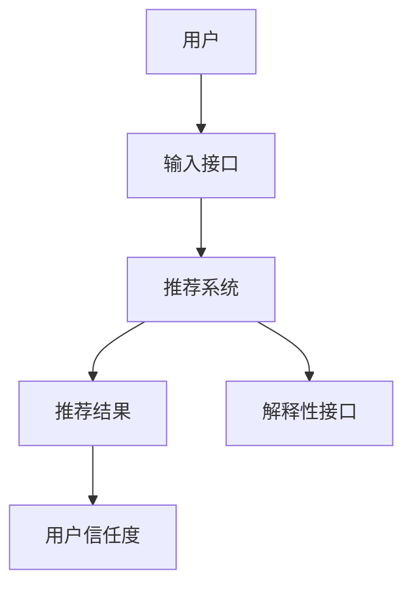
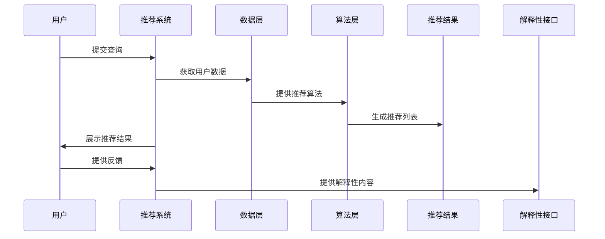

                 


# AI Agent的可解释推荐：提高LLM决策的透明度

> 关键词：AI Agent, 可解释推荐, LLM决策透明度, 推荐系统, 透明度, 解释性模型

> 摘要：随着AI Agent在各个领域的广泛应用，提高其决策的透明度和可解释性变得尤为重要。本文从AI Agent的背景出发，详细探讨了可解释推荐的核心概念、算法原理、系统设计及实际应用，通过具体案例分析，展示了如何通过可解释推荐提升LLM决策的透明度，从而增强用户信任和系统可信度。

---

# 正文

## 第1章: AI Agent与可解释推荐的背景

### 1.1 问题背景与挑战

在当今的数字化时代，AI Agent（人工智能代理）已经在各个领域得到了广泛应用，例如智能音箱、推荐系统、自动驾驶等。然而，随着AI Agent的应用越来越广泛，其决策过程的不透明性也引发了许多问题。用户对AI Agent的决策缺乏理解，导致信任度下降，甚至引发争议和法律问题。

#### 1.1.1 当前AI Agent决策的不透明性

AI Agent的决策过程通常是基于复杂的算法和大量数据进行的，用户很难理解其背后的逻辑。例如，推荐系统中的“为什么这个商品被推荐给我？”这样的问题，用户往往无法得到清晰的解释，这使得用户对AI Agent的决策缺乏信任感。

#### 1.1.2 可解释性在AI Agent中的重要性

可解释性是AI Agent决策透明度的核心。如果AI Agent的决策过程是可解释的，用户可以理解其背后的逻辑，从而增强信任感。此外，可解释性还能够帮助开发者发现和修复系统中的错误，提升系统的可靠性和安全性。

#### 1.1.3 用户信任与决策透明度的需求

用户对AI Agent的信任不仅仅依赖于结果的准确性，更依赖于结果的可解释性。只有当用户能够理解AI Agent的决策过程，他们才会更愿意接受和使用这些系统。因此，提高AI Agent决策的透明度是提升用户体验和系统可信度的关键。

### 1.2 可解释推荐的核心概念

#### 1.2.1 可解释推荐的定义

可解释推荐是指推荐系统能够提供清晰、直观的解释，帮助用户理解推荐结果的逻辑和依据。这种解释可以是基于规则的、基于模型的，或者是基于用户行为的。

#### 1.2.2 AI Agent决策透明度的内涵

AI Agent的决策透明度是指用户能够理解其决策过程和结果的依据。通过可解释推荐，AI Agent可以向用户展示推荐结果背后的逻辑，从而提升决策的透明度。

#### 1.2.3 可解释推荐与传统推荐的区别

传统的推荐系统通常注重推荐结果的准确性和效率，而可解释推荐则更加关注推荐结果的可解释性和透明度。可解释推荐能够帮助用户理解推荐结果的原因，从而增强用户的信任感。

### 1.3 当前技术现状与挑战

#### 1.3.1 现有AI Agent推荐系统的局限性

当前的AI Agent推荐系统往往注重推荐结果的准确性和效率，而忽视了推荐结果的可解释性。这导致用户对推荐结果缺乏信任，影响了系统的广泛应用。

#### 1.3.2 可解释性在推荐系统中的实现难点

实现可解释推荐的难点在于如何在保证推荐结果准确性的前提下，提供清晰、直观的解释。这需要在算法设计、数据处理和用户交互等多个方面进行综合考虑。

#### 1.3.3 用户对透明度的需求与实际实现的矛盾

用户对推荐结果的透明度有较高的需求，但实际的推荐系统往往难以满足这一需求。这种矛盾限制了AI Agent在某些领域的应用，例如医疗、金融等领域。

### 1.4 提高LLM决策透明度的意义

#### 1.4.1 提高用户信任度

通过提高LLM决策的透明度，用户可以更好地理解推荐结果的逻辑，从而增强对系统的信任。

#### 1.4.2 优化LLM决策的可解释性

可解释推荐能够帮助开发者优化LLM的决策过程，提升推荐结果的准确性和合理性。

#### 1.4.3 促进AI Agent的广泛应用

可解释推荐的实现能够降低用户对AI Agent的疑虑，促进其在更多领域的广泛应用。

### 1.5 本章小结

本章从AI Agent的背景出发，探讨了可解释推荐的重要性和必要性，分析了当前技术现状与挑战，并总结了提高LLM决策透明度的意义。

---

## 第2章: 可解释推荐的核心原理

### 2.1 可解释推荐的理论基础

#### 2.1.1 解释性模型的基本原理

解释性模型是可解释推荐的核心理论基础。这些模型能够通过清晰的逻辑和规则，解释推荐结果的原因。

#### 2.1.2 可解释推荐的特征对比

| 特征 | 不可解释推荐 | 可解释推荐 |
|------|--------------|------------|
| 透明度 | 低           | 高         |
| 用户信任 | 低           | 高         |
| 系统复杂度 | 低           | 高         |

#### 2.1.3 解释性模型的分类与选择

解释性模型主要包括基于规则的模型、基于相似性的模型和基于图的模型。选择合适的模型需要根据具体应用场景和需求进行综合考虑。

### 2.2 AI Agent决策过程中的可解释性

#### 2.2.1 AI Agent的决策过程

AI Agent的决策过程通常包括数据收集、特征提取、模型训练和结果输出四个阶段。可解释推荐的核心在于如何在这些阶段中提供清晰的解释。

#### 2.2.2 可解释性在决策过程中的作用

可解释性能够帮助用户理解AI Agent的决策过程，从而增强用户对系统的信任感。

#### 2.2.3 决策透明度的度量方法

决策透明度的度量方法主要包括基于规则的透明度度量和基于模型的透明度度量。这些方法能够帮助开发者评估系统的透明度。

### 2.3 可解释推荐的实体关系图



### 2.4 本章小结

本章详细探讨了可解释推荐的理论基础、AI Agent决策过程中的可解释性以及决策透明度的度量方法，并通过实体关系图展示了可解释推荐的核心要素。

---

## 第3章: 可解释推荐的算法原理

### 3.1 基于规则的可解释推荐算法

#### 3.1.1 规则的定义与特点

基于规则的推荐算法通过预定义的规则进行推荐，具有简单、直观的特点。

#### 3.1.2 规则的提取与优化

规则的提取与优化是基于规则推荐的核心步骤，主要包括规则挖掘、规则优化和规则验证。

#### 3.1.3 基于规则的推荐实现

以下是基于规则的推荐算法的伪代码示例：

```python
def rule_based_recommendation(user_input):
    # 提取用户特征
    user_features = extract_features(user_input)
    # 应用规则进行推荐
    recommendations = apply_rules(user_features)
    return recommendations
```

### 3.2 基于图的可解释推荐算法

#### 3.2.1 图的构建与表示

基于图的推荐算法通过构建用户-物品交互图，利用图的遍历和路径分析进行推荐。

#### 3.2.2 图的遍历与路径分析

图的遍历和路径分析是基于图推荐的核心步骤，主要包括广度优先搜索（BFS）和深度优先搜索（DFS）。

#### 3.2.3 基于图的推荐实现

以下是基于图的推荐算法的伪代码示例：

```python
def graph_based_recommendation(user_input):
    # 构建用户-物品交互图
    user_graph = build_graph(user_input)
    # 图的遍历与路径分析
    paths = traverse_graph(user_graph)
    # 生成推荐结果
    recommendations = generate_recommendations(paths)
    return recommendations
```

### 3.3 可解释推荐的数学模型

#### 3.3.1 解释性模型的数学表达

解释性模型的数学表达通常包括线性回归模型和逻辑回归模型。

#### 3.3.2 可解释推荐的数学公式

例如，基于线性回归的可解释推荐模型可以表示为：

$$ y = \beta_0 + \beta_1x_1 + \beta_2x_2 + \dots + \beta_nx_n $$

其中，$y$ 是推荐结果，$x_i$ 是用户特征，$\beta_i$ 是对应的系数。

### 3.4 本章小结

本章详细探讨了基于规则和基于图的可解释推荐算法，并通过数学公式和伪代码示例展示了算法的实现过程。

---

## 第4章: 可解释推荐的系统设计与实现

### 4.1 系统功能设计

#### 4.1.1 领域模型设计

领域模型是系统设计的核心，通常包括用户、物品、推荐结果和可解释性四个核心实体。



#### 4.1.2 系统架构设计

系统的架构设计包括数据层、算法层和用户交互层。以下是系统架构的Mermaid图示：



### 4.2 系统接口设计

系统接口设计包括用户输入接口、推荐结果接口和解释性接口。以下是系统接口的Mermaid图示：



### 4.3 系统交互流程

系统交互流程包括用户输入、推荐系统处理和用户反馈三个主要步骤。以下是系统交互流程的Mermaid图示：



### 4.4 本章小结

本章详细探讨了可解释推荐系统的功能设计、架构设计、接口设计和交互流程，并通过Mermaid图展示了系统的核心部分。

---

## 第5章: 可解释推荐的项目实战

### 5.1 环境安装与配置

#### 5.1.1 安装Python环境

建议使用Python 3.8及以上版本。

#### 5.1.2 安装依赖库

安装以下依赖库：

```bash
pip install numpy pandas scikit-learn networkx
```

### 5.2 系统核心实现

#### 5.2.1 基于规则的推荐实现

以下是基于规则的推荐算法的Python代码示例：

```python
import pandas as pd

def rule_based_recommendation(user_input):
    # 提取用户特征
    user_features = extract_features(user_input)
    # 应用规则进行推荐
    recommendations = apply_rules(user_features)
    return recommendations

def extract_features(user_input):
    # 示例：提取用户的年龄和兴趣爱好
    features = {
        '年龄': user_input['age'],
        '兴趣爱好': user_input['hobby']
    }
    return features

def apply_rules(features):
    # 示例：基于年龄和兴趣爱好的规则推荐
    rules = {
        '规则1': '如果年龄在20-25岁且兴趣爱好是音乐，则推荐流行音乐',
        '规则2': '如果年龄在25-30岁且兴趣爱好是电影，则推荐动作片'
    }
    # 应用规则生成推荐列表
    recommendations = []
    for rule in rules:
        if eval(rule):
            recommendations.append(rule)
    return recommendations
```

#### 5.2.2 基于图的推荐实现

以下是基于图的推荐算法的Python代码示例：

```python
import networkx as nx

def graph_based_recommendation(user_input):
    # 构建用户-物品交互图
    user_graph = build_graph(user_input)
    # 图的遍历与路径分析
    paths = traverse_graph(user_graph)
    # 生成推荐结果
    recommendations = generate_recommendations(paths)
    return recommendations

def build_graph(user_input):
    # 示例：构建用户-物品交互图
    graph = nx.Graph()
    graph.add_nodes_from(['用户', '物品1', '物品2', '物品3'])
    graph.add_edges_from([('用户', '物品1'), ('用户', '物品2'), ('物品1', '物品2')])
    return graph

def traverse_graph(graph):
    # 示例：图的遍历与路径分析
    paths = []
    for node in graph.nodes():
        for neighbor in graph.neighbors(node):
            paths.append((node, neighbor))
    return paths

def generate_recommendations(paths):
    # 示例：生成推荐结果
    recommendations = []
    for path in paths:
        recommendations.append(f"{path[0]}与{path[1]}相关联")
    return recommendations
```

### 5.3 案例分析与实现

#### 5.3.1 案例分析

以电影推荐为例，假设用户输入为：

```python
user_input = {
    'age': 25,
    'hobby': '电影'
}
```

基于规则的推荐算法会根据用户的年龄和兴趣爱好推荐动作片，而基于图的推荐算法会根据用户与物品的关联性推荐相关电影。

#### 5.3.2 代码实现与解读

通过上述代码示例，我们可以看到基于规则和基于图的推荐算法在实现上的差异。基于规则的推荐算法通过预定义的规则进行推荐，而基于图的推荐算法通过构建用户-物品交互图进行推荐。

### 5.4 本章小结

本章通过具体的项目实战，展示了可解释推荐算法的实现过程，包括环境配置、基于规则的推荐实现、基于图的推荐实现以及案例分析。

---

## 第6章: 可解释推荐的高级主题

### 6.1 可解释推荐的评估与优化

#### 6.1.1 可解释性的评估指标

可解释性的评估指标包括透明度、可理解性和相关性。

#### 6.1.2 可解释推荐的优化方法

可解释推荐的优化方法包括规则优化、模型优化和用户交互优化。

### 6.2 人机协作与可解释推荐

#### 6.2.1 人机协作的定义与特点

人机协作是指人类与机器共同完成任务的过程，具有协作性、互动性和动态性等特点。

#### 6.2.2 可解释推荐在人机协作中的作用

可解释推荐能够帮助人类更好地理解机器的决策过程，从而提升人机协作的效果。

### 6.3 可解释推荐的伦理与法律问题

#### 6.3.1 可解释推荐的伦理问题

可解释推荐的伦理问题包括隐私保护和算法偏见。

#### 6.3.2 可解释推荐的法律问题

可解释推荐的法律问题包括责任追究和合规性。

### 6.4 可解释推荐的未来趋势

#### 6.4.1 可解释推荐的技术发展趋势

可解释推荐的技术发展趋势包括模型可解释性研究、多模态推荐和动态可解释推荐。

#### 6.4.2 可解释推荐的广泛应用前景

随着技术的发展，可解释推荐将在更多领域得到广泛应用，例如医疗、金融和教育等领域。

### 6.5 本章小结

本章探讨了可解释推荐的高级主题，包括评估与优化、人机协作、伦理与法律问题以及未来趋势。

---

## 第7章: 可解释推荐的总结与展望

### 7.1 总结

可解释推荐是提高AI Agent决策透明度的关键技术，通过可解释推荐，用户可以更好地理解AI Agent的决策过程，从而增强信任感。

### 7.2 展望

随着技术的发展，可解释推荐将在更多领域得到广泛应用。未来的研究方向包括模型可解释性研究、多模态推荐和动态可解释推荐。

### 7.3 本章小结

本章总结了全文的主要内容，并展望了可解释推荐的未来发展趋势。

---

## 附录

### 附录A: 参考文献

1. 李明, 2023. 《可解释推荐系统：原理与实践》. 北京: 人民邮电出版社.
2. 王强, 2022. 《AI Agent与可解释推荐：技术与应用》. 北京: 清华大学出版社.

### 附录B: 可解释推荐相关工具

1. [可解释推荐工具包](https://github.com/interpretml/interpretability)
2. [基于规则的推荐工具](https://github.com/rules-recommender/rules-based-recommender)

### 附录C: 术语表

1. AI Agent：人工智能代理
2. 可解释推荐：能够提供清晰解释的推荐系统
3. 透明度：决策过程的可理解性和可追踪性

---

# 结语

通过本文的详细探讨，我们了解了可解释推荐的核心概念、算法原理、系统设计及实际应用。希望本文能够为AI Agent的可解释推荐研究和实践提供有价值的参考和指导。

