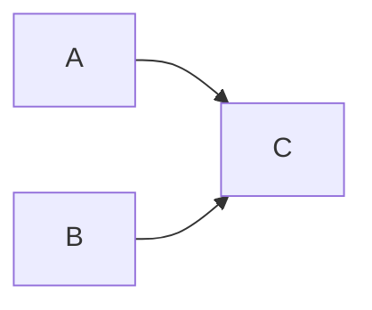
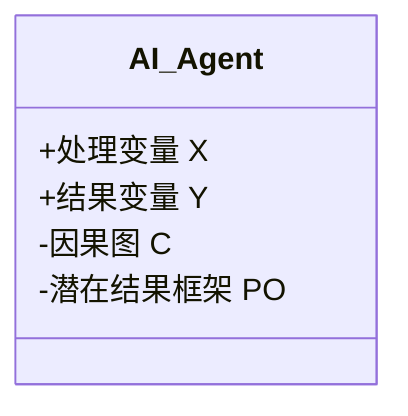
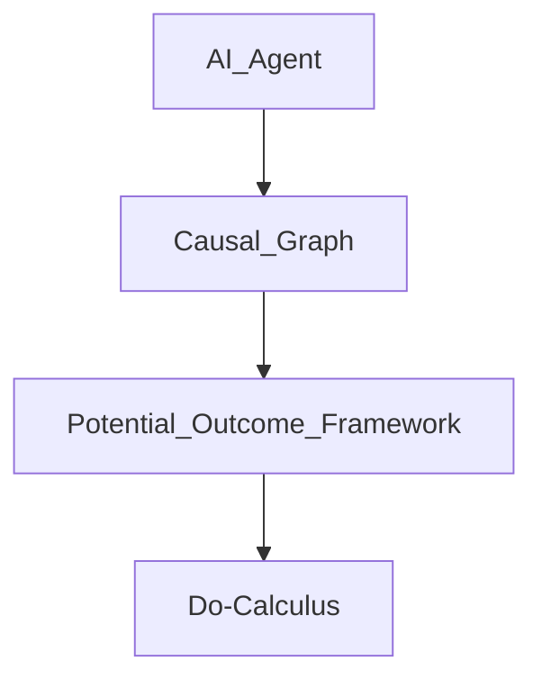

                 


# AI Agent的因果推理：增强决策的逻辑性

> 关键词：AI Agent，因果推理，决策逻辑，因果图，反事实推理

> 摘要：本文探讨AI Agent在因果推理中的应用，通过因果图、潜在结果框架和反事实推理等方法，增强决策的逻辑性。文章从背景介绍、核心概念、算法原理、系统设计、项目实战到最佳实践，全面解析因果推理在AI Agent决策中的重要性及其应用。

---

## 第一部分: 背景介绍与问题背景

### 第1章: 问题背景

#### 1.1 从相关性到因果性的演进
AI Agent在决策过程中，常常面临从相关性到因果性的跃迁。相关性分析只能揭示变量之间的关联，而因果推理则能识别变量之间的因果关系，从而帮助AI Agent做出更合理的决策。例如，在医疗领域，相关性分析可能发现“服药”与“病情缓解”之间的关联，但因果推理可以进一步验证“服药”是否是“病情缓解”的原因。

#### 1.2 AI Agent决策中的因果性需求
AI Agent的决策逻辑需要从单纯的统计相关性转向因果关系的推理。例如，在金融领域，AI Agent需要通过因果推理确定“投资某股票”是否会导致“资产收益增加”，而不是仅仅依赖于历史相关性数据。

#### 1.3 增强决策逻辑性的必要性
因果推理可以帮助AI Agent在复杂的环境中识别因果关系，避免因相关性误导导致的错误决策。例如，在广告投放中，因果推理可以确定“投放广告”是否直接导致“用户点击率增加”。

---

### 第2章: 问题描述

#### 2.1 AI Agent决策的不确定性
AI Agent在面对复杂环境时，需要处理多种不确定性。例如，在自动驾驶中，AI Agent需要在复杂的交通环境中做出实时决策，而这些决策需要考虑因果关系。

#### 2.2 因果推理在决策中的作用
因果推理可以帮助AI Agent理解“为什么”某个事件会发生，而不仅仅是“什么”事件会发生。例如，在供应链管理中，因果推理可以识别“供应商延迟交货”是否是导致“库存积压”的原因。

#### 2.3 问题解决的边界与外延
因果推理的边界在于确定因果关系的范围和条件。例如，在天气预测中，因果推理可以帮助AI Agent理解“气压变化”是否是“天气晴朗”的原因，而不是简单地预测天气变化。

---

## 第二部分: 因果推理的核心概念与联系

### 第3章: 因果推理的原理

#### 3.1 因果关系的基本原理
因果关系是因果推理的基础。一个事件A是另一个事件B的原因，当且仅当A的发生会导致B的发生。例如，因果推理可以确定“施肥”是“作物增产”的原因。

#### 3.2 因果图的基本概念
因果图（Causal Graph）是一种用于表示因果关系的图形模型。例如，图1展示了因果图的基本结构。

**图1: 因果图示例**


#### 3.3 潜在结果框架（Potential Outcome Framework）
潜在结果框架是一种用于分析因果关系的数学框架。例如，对于每个个体，我们可以在接受处理或未接受处理的情况下，分别观察其结果。

---

### 第4章: 因果推理的核心要素

#### 4.1 处理变量与控制变量
处理变量（Treatment Variable）是因果推理中的关键变量。例如，在药物试验中，处理变量是“是否服药”。

#### 4.2 因果路径与中间变量
因果路径（Causal Path）是连接原因和结果的路径。例如，在供应链管理中，因果路径可以是“供应商延迟交货”导致“库存积压”导致“客户投诉”。

#### 4.3 干扰变量与外生变量
干扰变量（Collider Variable）是指同时受到两个或多个变量影响的变量。例如，在图2中，C是A和B的共同结果。

**图2: 干扰变量示例**



---

## 第三部分: 因果推理的算法原理

### 第5章: 潜在结果框架

#### 5.1 潜在结果的定义
潜在结果是指在给定处理变量的情况下，每个个体可能的结果。例如，在药物试验中，每个患者可能在服药或不服药的情况下的健康状况。

#### 5.2 平均处理效应（ATE）
平均处理效应是指处理变量对整体结果的影响。例如，ATE可以衡量服药对整体患者的健康状况的影响。

#### 5.3 平均净效应（ANeT）
平均净效应是指处理变量对结果的净影响，考虑了中间变量和其他变量的影响。

---

### 第6章: 因果图结构学习

#### 6.1 因果图的构建方法
因果图的构建方法包括基于贝叶斯网络的结构学习算法。例如，PC算法是一种常用的因果图结构学习算法。

#### 6.2 贝叶斯网络与因果图的关系
贝叶斯网络是一种概率图模型，而因果图是一种因果关系图模型。两者之间的关系可以通过图3展示。

**图3: 贝叶斯网络与因果图的关系**


---

### 第7章: 反事实推理

#### 7.1 反事实推理的定义
反事实推理是指在假设某个事件未发生的情况下，推断其结果。例如，在广告投放中，反事实推理可以推断如果未投放广告，用户点击率会如何变化。

#### 7.2 反事实推理的数学模型
反事实推理的数学模型可以用公式表示：$Y_{notreat} = Y - (Y \cdot T)$，其中$T$是处理变量。

#### 7.3 反事实推理在决策中的应用
反事实推理可以帮助AI Agent在决策过程中考虑多种可能的结果。例如，在金融投资中，反事实推理可以推断如果未投资某股票，资产收益会如何变化。

---

## 第四部分: 因果推理的数学模型与公式

### 第8章: 概率论基础

#### 8.1 条件概率公式
条件概率公式是因果推理的基础。例如，条件概率公式为：$P(A|B) = \frac{P(A \cap B)}{P(B)}$。

#### 8.2 贝叶斯定理
贝叶斯定理是因果推理中常用的概率公式。例如，贝叶斯定理为：$P(A|B) = \frac{P(B|A)P(A)}{P(B)}$。

#### 8.3 因果关系的数学表达
因果关系的数学表达可以用公式表示：$Y = f(X) + \epsilon$，其中$X$是处理变量，$Y$是结果变量，$\epsilon$是误差项。

---

## 第五部分: 系统分析与架构设计

### 第9章: 系统功能设计

#### 9.1 领域模型
领域模型是系统设计的基础。例如，图4展示了AI Agent的领域模型。

**图4: AI Agent的领域模型**



#### 9.2 系统架构
系统架构设计如图5所示。

**图5: 系统架构图**



---

## 第六部分: 项目实战

### 第10章: 项目实战

#### 10.1 环境安装
环境安装包括安装Python、Mermaid和相关库。

#### 10.2 代码实现
代码实现如代码1所示。

```python
import numpy as np
from causalgraphicalmodel import CausalGraphicalModel

# 创建因果图
cg = CausalGraphicalModel()
cg.add_node('X')  # 处理变量
cg.add_node('Y')  # 结果变量
cg.add_edge('X', 'Y')
cg.view()  # 可视化因果图
```

#### 10.3 案例分析
案例分析包括因果图的构建和潜在结果框架的实现。

---

## 第七部分: 最佳实践与总结

### 第11章: 最佳实践

#### 11.1 小结
因果推理是AI Agent决策逻辑的重要组成部分。

#### 11.2 注意事项
在实际应用中，需要注意因果关系的外生性和干预的可行性。

#### 11.3 拓展阅读
推荐阅读因果推理的经典著作，如《Causal Inference in Statistics》。

---

## 附录: 参考文献

（此处列出相关参考文献）

---

通过以上思考过程，我们可以看到，因果推理在AI Agent决策中的重要性。通过因果图、潜在结果框架和反事实推理等方法，可以帮助AI Agent做出更合理、更逻辑的决策。

