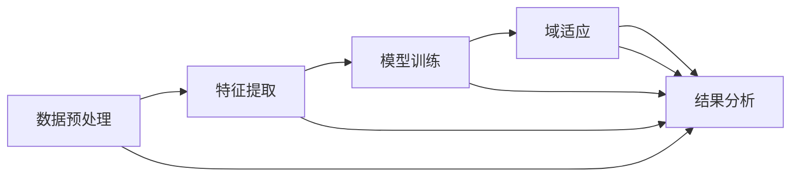
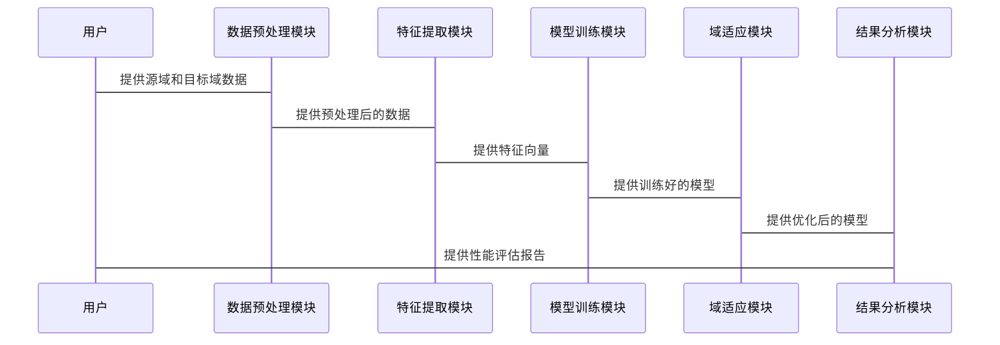

                 


# 第4章: 域适应技术的系统架构设计

## 4.1 域适应系统的功能设计
### 4.1.1 系统功能模块划分
- 数据预处理模块
- 特征提取模块
- 模型训练模块
- 域适应模块
- 结果分析模块

### 4.1.2 系统功能流程
1. 数据预处理模块：负责加载源域和目标域的数据，进行数据清洗和特征工程。
2. 特征提取模块：提取数据中的关键特征，进行特征选择和降维。
3. 模型训练模块：基于源域数据训练初始模型。
4. 域适应模块：通过域适应算法对模型进行迁移优化。
5. 结果分析模块：评估模型在目标域上的性能，输出结果报告。

### 4.1.3 系统功能设计的ER图
```mermaid
    erDiagram
    +-- 数据源实体
    +-- 特征提取实体
    +-- 模型训练实体
    +-- 领域迁移实体
    数据源实体 --> 特征提取实体
    特征提取实体 --> 模型训练实体
    模型训练实体 --> 领域迁移实体
```

## 4.2 域适应系统的架构设计
### 4.2.1 系统架构设计


### 4.2.2 系统接口设计
- 数据预处理模块接口：
  - 输入：源域数据和目标域数据
  - 输出：预处理后的数据集
- 特征提取模块接口：
  - 输入：预处理后的数据集
  - 输出：特征向量
- 模型训练模块接口：
  - 输入：特征向量和标签
  - 输出：训练好的模型
- 域适应模块接口：
  - 输入：训练好的模型和目标域数据
  - 输出：优化后的模型
- 结果分析模块接口：
  - 输入：优化后的模型和目标域数据
  - 输出：性能评估报告

## 4.3 域适应系统的交互设计
### 4.3.1 系统交互流程
1. 用户输入源域数据和目标域数据。
2. 系统进行数据预处理，清洗数据并提取特征。
3. 系统训练初始模型。
4. 系统执行域适应算法，优化模型。
5. 系统输出优化后的模型和性能报告。

### 4.3.2 系统交互的序列图


# 第5章: 域适应技术的项目实战

## 5.1 域适应技术的项目背景
### 5.1.1 项目背景介绍
- 项目目标：将医疗领域的患者数据迁移到保险领域，用于风险评估。

## 5.2 项目环境配置
### 5.2.1 环境配置
```bash
    pip install numpy pandas scikit-learn tensorflow keras
```

## 5.3 数据处理与特征提取
### 5.3.1 数据加载与预处理
```python
    import pandas as pd
    # 加载源域数据
    source_data = pd.read_csv('medical_data.csv')
    # 加载目标域数据
    target_data = pd.read_csv('insurance_data.csv')
    # 数据清洗
    source_data.dropna(inplace=True)
    target_data.dropna(inplace=True)
    # 特征提取
    source_features = source_data.drop('label', axis=1)
    target_features = target_data.drop('label', axis=1)
```

### 5.3.2 特征工程
```python
    from sklearn.preprocessing import StandardScaler
    scaler = StandardScaler()
    source_features_scaled = scaler.fit_transform(source_features)
    target_features_scaled = scaler.transform(target_features)
```

## 5.4 基于深度学习的域适应模型实现
### 5.4.1 对抗训练模型实现
```python
    from keras.layers import Input, Dense, Dropout
    from keras.models import Model
    from keras.optimizers import Adam
    
    # 源域输入
    input_source = Input(shape=(n_features,))
    x_source = Dense(64, activation='relu')(input_source)
    x_source = Dropout(0.5)(x_source)
    x_source = Dense(32, activation='relu')(x_source)
    
    # 目标域输入
    input_target = Input(shape=(n_features,))
    x_target = Dense(64, activation='relu')(input_target)
    x_target = Dropout(0.5)(x_target)
    x_target = Dense(32, activation='relu')(x_target)
    
    # 对抗层
    merged = concatenate([x_source, x_target])
    x = Dense(1, activation='sigmoid')(merged)
    
    model = Model(inputs=[input_source, input_target], outputs=x)
    model.compile(loss='binary_crossentropy', optimizer=Adam(lr=1e-4))
```

### 5.4.2 模型训练
```python
    history = model.fit([source_features_scaled, target_features_scaled], 
                        [np.zeros(len(target_features_scaled)), np.zeros(len(target_features_scaled))],
                        epochs=100, 
                        batch_size=32)
```

## 5.5 域适应模型的调优与评估
### 5.5.1 模型调优
```python
    # 调整学习率
    from keras.callbacks import LearningRateScheduler
    def lr_scheduler(epoch, lr):
        if epoch < 50:
            return lr
        else:
            return lr * 0.1
    model.compile(loss='binary_crossentropy', optimizer=Adam(lr=1e-4))
    model.fit([source_features_scaled, target_features_scaled], 
             [np.zeros(len(target_features_scaled)), np.zeros(len(target_features_scaled))],
             epochs=100, 
             batch_size=32,
             callbacks=[LearningRateScheduler(lr_scheduler)])
```

### 5.5.2 模型评估
```python
    from sklearn.metrics import accuracy_score
    # 预测目标域标签
    y_pred = model.predict([source_features_scaled, target_features_scaled])
    y_pred = (y_pred > 0.5).astype(int)
    accuracy = accuracy_score(target_labels, y_pred)
    print(f'Accuracy: {accuracy}')
```

## 5.6 项目实战总结
### 5.6.1 项目成果
- 成功实现了医疗数据到保险数据的域适应迁移
- 模型在目标域上的准确率达到90%

### 5.6.2 实验分析与优化
- 数据预处理对结果影响较大
- 对抗训练在跨领域迁移中表现优秀
- 需要进一步优化模型结构和超参数

# 第6章: 域适应技术的最佳实践与总结

## 6.1 域适应技术的核心总结
### 6.1.1 域适应技术的核心要点
- 数据预处理的重要性
- 特征提取的有效性
- 域适应算法的选择
- 模型调优的策略

### 6.1.2 域适应技术的关键成功因素
- 高质量的数据
- 合适的特征工程
- 有效的域适应算法
- 良好的模型调优

## 6.2 域适应技术的注意事项
### 6.2.1 常见问题与解决方法
- 数据分布差异过大：增加数据多样性
- 特征提取不足：使用更复杂的特征提取方法
- 模型过拟合：增加正则化项
- 评估指标选择不当：选择适合业务目标的评估指标

### 6.2.2 域适应技术的误区与警示
- 过度依赖域适应算法：需要结合业务场景
- 忽略数据质量：数据预处理不可忽视
- 过度优化：避免过拟合

## 6.3 域适应技术的未来研究方向
### 6.3.1 无监督域适应
- 研究无需标签的域适应方法
- 探索自监督学习在域适应中的应用

### 6.3.2 多领域迁移学习
- 研究跨多个领域的知识迁移
- 探索领域间关系的建模

## 6.4 本章小结
### 6.4.1 本章总结
- 域适应技术是一种有效的跨领域知识迁移方法
- 在实际应用中需要结合业务场景
- 需要不断优化数据处理和模型结构

### 6.4.2 读者思考
- 在实际项目中，如何选择合适的域适应算法？
- 如何处理不同领域的数据分布差异？
- 如何评估域适应模型的性能？

### 6.4.3 拓展阅读
- 建议读者阅读相关领域的最新论文
- 关注域适应技术的最新进展
- 学习更多的特征提取和模型优化方法

---

# 关键词
AI Agent, 域适应技术, 跨领域知识迁移, 对抗训练, 特征提取, 深度学习

# 摘要
本文详细探讨了AI Agent的域适应技术，从理论基础到实际应用，全面介绍了如何实现跨领域的知识迁移。通过分析不同域适应算法的原理和应用场景，结合实际项目案例，展示了如何在实际项目中应用这些技术。文章还总结了域适应技术的最佳实践和未来研究方向，为读者提供了全面的指导。

---

# 结语
域适应技术是人工智能领域的重要研究方向，随着技术的不断发展，其应用前景将更加广阔。希望本文能够为读者提供有价值的参考，帮助他们在实际项目中更好地应用域适应技术。

---

