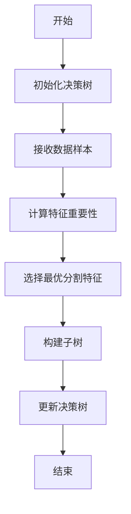
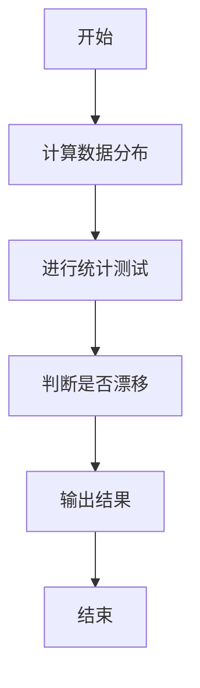
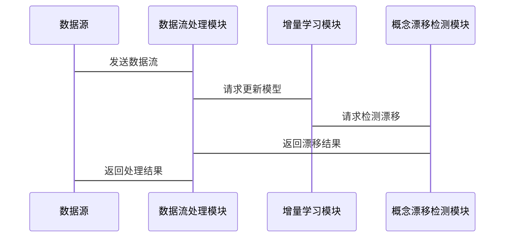

                 


# AI Agent的增量学习与概念漂移检测

## 关键词：增量学习，概念漂移，AI Agent，机器学习，数据流

## 摘要：  
本文深入探讨了AI Agent在增量学习和概念漂移检测中的应用，分析了数据流环境下的增量学习算法与概念漂移检测方法，结合实际场景详细讲解了系统设计与实现，为AI Agent的实时适应性优化提供了理论支持和实践指导。

---

# 第1章: AI Agent的增量学习与概念漂移背景

## 1.1 问题背景
### 1.1.1 增量学习的定义与特点
增量学习是一种机器学习方法，系统在接收新数据时逐步更新模型，而非一次性训练整个数据集。其特点包括：
- 数据流处理：数据按流形式输入，实时更新模型。
- 动态适应性：能够应对数据分布的变化。
- 计算效率：每次处理的数据量小，适合实时场景。

### 1.1.2 概念漂移的定义与类型
概念漂移指数据分布或目标关系随时间变化，影响模型性能。常见类型：
- **突然漂移**：数据分布突然变化。
- **渐进漂移**：数据分布逐渐变化。
- **逆转漂移**：数据分布先变化后恢复。

### 1.1.3 问题背景的现实意义
在实时监控、推荐系统等领域，数据动态变化，传统批量学习难以适应。增量学习和概念漂移检测是应对这些场景的关键技术。

## 1.2 问题描述
### 1.2.1 增量学习的核心挑战
- 模型更新效率：如何高效更新模型以适应新数据。
- 概念漂移检测：准确识别数据分布变化并及时更新模型。

### 1.2.2 概念漂移检测的复杂性
- 漂移类型多样：需区分渐进、突然或逆转漂移。
- 漂移频率不定：漂移可能频繁发生或长期未发生。

### 1.2.3 问题的边界与外延
- 仅考虑在线增量学习，不涉及模型压缩。
- 仅关注概念漂移检测，不处理模型融合问题。

## 1.3 问题解决
### 1.3.1 增量学习的解决方案
- 采用增量分类器和回归器，逐步更新模型。
- 结合概念漂移检测，动态调整模型更新策略。

### 1.3.2 概念漂移检测的方法
- 统计方法：基于频率统计判断数据分布变化。
- 分布变化检测：通过距离或相似度度量判断数据分布变化。
- 基于模型更新的方法：通过模型性能变化判断数据分布变化。

### 1.3.3 问题解决的可行性分析
- 技术可行性：增量学习和概念漂移检测已有成熟算法。
- 应用可行性：适用于实时数据处理场景。

## 1.4 核心概念结构与组成
### 1.4.1 增量学习的核心要素
- 数据流处理机制：按数据流顺序处理数据。
- 模型更新策略：根据新数据更新模型参数。
- 漂移检测机制：判断数据分布是否变化。

### 1.4.2 概念漂移的核心要素
- 数据分布变化：数据特征或类别分布的变化。
- 检测方法：统计、分布变化或模型性能变化。
- 响应策略：调整模型或参数。

### 1.4.3 两者的相互关系
增量学习依赖于概念漂移检测来决定是否更新模型，而概念漂移检测依赖于增量学习的数据流特性。

---

# 第2章: 核心概念与联系

## 2.1 增量学习的原理
### 2.1.1 在线增量学习的定义
系统在接收每条数据后立即更新模型，适用于实时场景。

### 2.1.2 离线增量学习的定义
系统按批次接收数据后更新模型，适用于数据积累场景。

### 2.1.3 增量学习的数学模型
增量学习的更新规则可以表示为：
$$
\theta_{t+1} = \theta_t + \eta (y_t - \hat{y}_t)
$$
其中，$\theta$ 是模型参数，$\eta$ 是学习率，$y_t$ 是真实标签，$\hat{y}_t$ 是预测值。

## 2.2 概念漂移检测的原理
### 2.2.1 基于统计的方法
使用统计测试（如卡方检验）判断数据分布变化。

### 2.2.2 基于分布变化的方法
通过计算数据分布的相似度（如KL散度）判断变化。

### 2.2.3 基于模型更新的方法
通过模型性能下降判断数据分布变化。

## 2.3 核心概念对比分析

| 比较维度       | 增量学习                  | 概念漂移检测                |
|----------------|--------------------------|---------------------------|
| 核心目标       | 更新模型适应新数据        | 发现数据分布变化            |
| 输入数据       | 数据流                   | 数据流或模型性能指标        |
| 输出结果       | 更新后的模型             | 漂移检测信号或警报          |
| 适用场景       | 实时数据处理             | 数据流监控和模型维护         |

## 2.4 ER实体关系图

```mermaid
er
classDiagram
    class 增量学习 {
        模型参数 θ
        学习率 η
        更新规则
    }
    class 概念漂移检测 {
        统计测试结果
        分布变化指标
        模型性能指标
    }
    class 数据流 {
        特征数据 X
        标签数据 Y
    }
    增量学习 <-- "更新模型" --> 数据流
    概念漂移检测 <-- "判断变化" --> 数据流
```

---

# 第3章: 算法原理与实现

## 3.1 增量学习算法
### 3.1.1 增量决策树算法
#### 算法流程


#### 代码实现
```python
class IncrementalDecisionTree:
    def __init__(self):
        self.tree = None

    def update_model(self, X, y):
        # 假设X是特征矩阵，y是标签向量
        # 实现决策树的增量更新
        pass
```

## 3.2 概念漂移检测算法
### 3.2.1 基于统计的检测方法
#### 算法流程


#### 代码实现
```python
def statistical_drift_detection(X_before, X_after):
    # 使用卡方检验判断数据分布变化
    from scipy.stats import chi2_contingency
    contingency_table = create_contingency_table(X_before, X_after)
    chi2, p, dof, ex = chi2_contingency(contingency_table)
    return p < 0.05  # 显著性水平 α=0.05
```

---

# 第4章: 数学模型与公式推导

## 4.1 增量学习的数学模型
增量学习的更新规则可以表示为：
$$
\theta_{t+1} = \theta_t + \eta (y_t - \hat{y}_t)
$$
其中，$\eta$ 是学习率，$(y_t - \hat{y}_t)$ 是损失梯度。

## 4.2 概念漂移检测的数学模型
基于KL散度的概念漂移检测可以表示为：
$$
D_{KL}(P \| Q) = \sum_{i} P(i) \log \frac{P(i)}{Q(i)}
$$
当$D_{KL}(P \| Q) > \epsilon$时，判断数据分布发生变化。

---

# 第5章: 系统分析与架构设计

## 5.1 系统功能设计
### 5.1.1 领域模型
```mermaid
classDiagram
    class AI-Agent {
        增量学习模块
        概念漂移检测模块
        数据流处理模块
    }
    class 数据源 {
        数据流 X
        标签流 Y
    }
    AI-Agent <-- "处理数据" --> 数据源
    AI-Agent <-- "更新模型" --> 增量学习模块
    AI-Agent <-- "检测漂移" --> 概念漂移检测模块
```

## 5.2 系统架构设计


## 5.3 系统交互设计


---

# 第6章: 项目实战与案例分析

## 6.1 项目介绍
### 6.1.1 项目背景
构建一个实时监控系统，检测网络流量中的异常行为。

### 6.1.2 核心需求
- 实时处理数据流。
- 检测概念漂移，及时更新模型。

## 6.2 核心代码实现
### 6.2.1 环境安装
```bash
pip install numpy pandas scikit-learn
```

### 6.2.2 核心代码
```python
class ConceptDriftDetector:
    def __init__(self):
        self.model = None

    def update_model(self, X, y):
        # 假设X是特征矩阵，y是标签向量
        self.model.fit(X, y)

    def detect_drift(self, X_new, y_new):
        # 检测数据分布变化
        pass
```

## 6.3 案例分析
### 6.3.1 数据预处理
- 数据清洗：处理缺失值和异常值。
- 特征提取：提取关键特征用于模型训练。

### 6.3.2 模型训练与评估
- 使用增量学习算法训练模型。
- 通过概念漂移检测评估模型性能。

## 6.4 项目总结
### 6.4.1 项目小结
项目成功实现了实时数据处理和概念漂移检测，提升了模型的适应性。

### 6.4.2 经验总结
- 数据预处理是关键，直接影响模型性能。
- 漂移检测算法的选择需根据具体场景。

---

# 第7章: 最佳实践与小结

## 7.1 小结
- 本文详细介绍了增量学习和概念漂移检测的原理与实现。
- 结合实际案例，展示了系统的实现与应用。

## 7.2 注意事项
- 模型更新频率需合理设置，避免过度更新或更新不足。
- 漂移检测需结合具体场景，避免误报或漏报。

## 7.3 拓展阅读
- 《Incremental Learning: Theory and Practice》
- 《Concept Drift Detection: A Comprehensive Survey》

---

# 结语
通过本文的学习，读者可以深入了解AI Agent的增量学习与概念漂移检测技术，为实际应用提供理论支持和实践指导。

